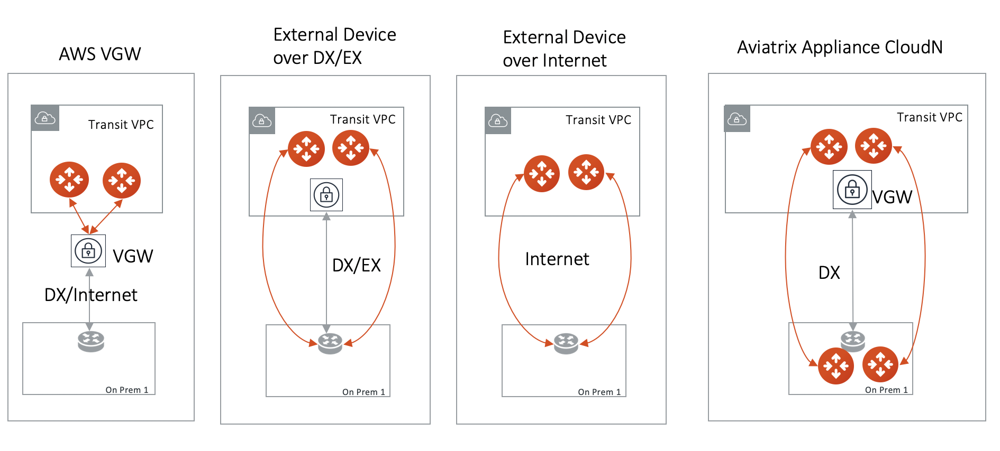

.. meta::
  :description: TGW Plan
  :keywords: AWS TGW, TGW orchestrator, Aviatrix Transit network

=========================================================
TGW Orchestrator Plan
=========================================================

TGW Orchestrator Plan is the first stage in deploying a Transit Network using TGW. After you go through the Plan 
stage configuration, you can proceed to the `Build stage <https://docs.aviatrix.com/HowTos/tgw_build.html>`_ 
to attach VPCs. 

For background information, refer to `TGW Orchestrator FAQ <https://docs.aviatrix.com/HowTos/tgw_faq.html>`_.

The plan stage consists of three sections:

 - **Create AWS TGW**. This is the only must do section in Plan before you start to Build (attach VPCs) and consists of `Step 1 <https://docs.aviatrix.com/HowTos/tgw_plan.html#create-aws-tgw>`_. In this section, an AWS TGW and three connected Security Domains are created.  

 - **Create Segmented Network**. This is an optional section. It consists of `Step 2 <https://docs.aviatrix.com/HowTos/tgw_plan.html#optional-create-a-new-security-domain>`_ and `Step 3 <https://docs.aviatrix.com/HowTos/tgw_plan.html#optional-build-your-domain-connection-policies>`_. This section creates your own additional Security Domains and define Connection policies. This section is entirely modular and you can modify at any time. 

 - **Create Hybrid Connection**. This is an optional section. It consists of `Step 4 <https://docs.aviatrix.com/HowTos/tgw_plan.html#optional-setup-aviatrix-transit-gw>`_, `Step 5 <https://docs.aviatrix.com/HowTos/tgw_plan.html#optional-enable-aviatrix-transit-gw-for-hybrid-connection>`_ and `Step 6 <https://docs.aviatrix.com/HowTos/tgw_plan.html#optional-attach-aviatrix-transit-gw-to-tgw>`_. This section launches an Aviatrix Transit Gateway at the edge VPC and build hybrid connection to on-prem. If you need hybrid connectivity, Step 4, 5 and 6 must all be executed and in sequence to complete this section. 

In the planning stage, think about what network segmentation you need to achieve. For example, do you need to segment Dev/QA VPCs 
from your Prod VPCs, i.e., no connectivity is allowed between these VPCs in each group? The plan stage creates TGW and TGW route tables in AWS. There is no charge either by AWS or Aviatrix.

If you have not decided on network segmentation, no worries, proceed to build a full mesh network by using the `Default_Domain <https://docs.aviatrix.com/HowTos/tgw_faq.html#what-is-the-default-domain>`_. 

.. tip::

 You can modify your plan at any time. Simply return to the Plan page and create security domains and changing connection policies.  

TGW Orchestrator Plan workflow provides a step by step instruction to define and setup your policies.

1. Create AWS TGW
-------------------------------------------

In order to use TGW service, you must first create a TGW. 

This step creates a TGW in a specified region with a specified AWS account, the Aviatrix Controller also automatically creates 
the `Default_Domain <https://docs.aviatrix.com/HowTos/tgw_faq.html#what-is-the-default-domain>`_, the `Shared_Service_Domain <https://docs.aviatrix.com/HowTos/tgw_faq.html#what-is-the-default-domain>`_ and the `Aviatrix_Edge_Domain <https://docs.aviatrix.com/HowTos/tgw_faq.html#what-is-the-aviatrix-edge-domain>`_ and the corresponding TGW route tables. 

|create_tgw|

Note the three domains are connected, implying if you attach VPC to the Default Domain or Shared Service Domain, the VPCs can communicate with each other and can access on-prem through the Aviatrix Edge Domain.  

==========================================      ==========
**Setting**                                     **Value**
==========================================      ==========
Account Name                                    An `Aviatrix account <http://docs.aviatrix.com/HowTos/aviatrix_account.html#account>`_ that corresponds to an IAM role or account in AWS. 
Region                                          One of the AWS regions
TGW Name                                        The name of the TGW
AWS Side AS Numbert                             Default AS number is 64512. This field currently is not used.
==========================================      ==========

After TGW is created, you can validate by going to `View page <https://docs.aviatrix.com/HowTos/tgw_faq.html#what-can-be-displayed-at-the-view-page>`_ and see what has been created. 

--------------------------------------------------------------------------------------------------------------------

2. (Optional) Create a New Security Domain
--------------------------------------------------

This section includes step 2 & 3 to plan a segmented network. 

If you plan to build a `default network (full mesh) <https://docs.aviatrix.com/HowTos/tgw_design_patterns.html#Full-mesh-network-design>`_, skip this section. 

You can make changes to your network segmentation at any time, simply come back to this page. 

If you plan to build a segmented network, use this section to create a new `Security Domain <https://docs.aviatrix.com/HowTos/tgw_faq.html#What-is-a-Security-Domain>`_ and setup `connection policies <https://docs.aviatrix.com/HowTos/tgw_faq.html#what-is-a-connection-policy>`_. 

In the example below, a new domain called prod_domain is created. 

|new_domain|

==========================================      ==========
**Setting**                                     **Value**
==========================================      ==========
TGW Name                                        The name of the TGW
Security Domain Name                            Specify a unique domain name. For example, Dev_Domain.
==========================================      ==========

3. (Optional) Build Your Domain Connection Policies
----------------------------------------------------

This step specifies the connection relationship of one domain to others. Two connected domains imply that VPCs in 
each domain can communicate with each other despite the fact that they are in different domains. Aviatrix Controller takes
care of both VPC route table and TGW route table programming and updates. 

Highlight a domain on the left panel and click Add, the domain will appears to the right. 

In the example shown below, the intention is to connect the newly created prod_domain in Step 2 to the Aviatrix_Edge_Domain so that VPCs in the prod_domain can communicate with on-prem servers and hosts. 

|connect_domain_1|

Continue from the above example, you can connect prod_domain to Shared_Service_Domain, as shown below. 

|connect_domain_2|

Click the View page under TGW Orchestrator and click each expandable circles to see what has been created, 
as shown below.  

|plan_view|

-----------------------------------------------------------------------------------------------------------------------

This section includes Step 4, 5 & 6. It sets up connection to on-prem datacenter over 
Direct Connect or Internet. 

4. (Optional) Setup Aviatrix Transit GW  
------------------------------------------------------------------

If your deployment does not require on-prem connection, skip this section. Later if you need to build hybrid 
connection, return to this section and start with Step 4 to setup. 

Step 4 is to take a detour to setup Aviatrix Transit GW if you have not done so. Follow the `the Transit Network workflow <https://docs.aviatrix.com/HowTos/transitvpc_workflow.html>`_ and complete Step 1, 2 and 3. When complete, 
return to this section and continue to the next step. 

The example below shows what is accomplished when you complete Step 4, where a pair of Aviatrix Transit Gateways have been launched and connected to VGW.  

|transit_gw|

.. important::

 For Aviatrix Transit GW to support Hybrid connection, the transit VPC needs to have a spare /26 CIDR space, i.e., not assigned to any subnets. Aviatrix Transit GW uses the spare space to create 4 subnets in the next step. If your transit VPC does not spare /26 CIDR range, you can either `create a new VPC <https://docs.aviatrix.com/HowTos/create_vpc.html>`_ or add more CIDRs by following `these rules <https://docs.aws.amazon.com/vpc/latest/userguide/VPC_Subnets.html#vpc-resize>`_. For configuration, please refer to `these instructions <https://docs.aws.amazon.com/vpc/latest/userguide/working-with-vpcs.html#add-ipv4-cidr>`_.

5. (Optional) Enable Aviatrix Transit GW for Hybrid Connection
---------------------------------------------------------------

The Aviatrix Transit GW created in Step 4 does not build an IPSEC tunnel to TGW. The networking between TGW and the Aviatrix Transit GW is via the AWS VPC infrastructure. 

This step designates an Aviatrix Transit GW to be used in conjunction with TGW. It creates a second Ethernet interface on the Aviatrix Transit GW for sending and receiving packets from TGW. It also creates two subnets and two respective route tables in the edge VPC to route packets to and from TGW. 

.. tip::

  Before you configure this step, make sure you have launched an Aviatrix Transit GW by following `the Transit Network workflow <https://docs.aviatrix.com/HowTos/transitvpc_workflow.html>`_, Step 1, 2 and 3. 

==========================================      ==========
**Setting**                                     **Value**
==========================================      ==========
Account Name                                    An `Aviatrix account <http://docs.aviatrix.com/HowTos/aviatrix_account.html#account>`_ that corresponds to an IAM role or account in AWS. This account is for launching Transit gateway. It does not need to be the same account as TGW creator. 
Gateway Namen                                   Select a Transit GW from the drop down menu. 
==========================================      ==========

6. (Optional) Attach Aviatrix Transit GW to TGW
------------------------------------------------------------------

This step attaches the Aviatrix Edge VPC to the TGW and the Aviatrix Edge Domain, thus allowing the Aviatrix Transit GW to send and receive packets from TGW. 

Note there is no IPSEC tunnel between TGW and the Aviatrix Transit GW, the Aviatrix GW behaves as an EC2 instance in a Spoke VPC (The Aviatrix edge VPC) attached to the TGW, as shown in the diagram below. 

|transit_complete|

After you finish Step 4, 5 and 6, your hybrid connection setup is complete. In the above example, 
if you have any Spoke VPCs attached to the prod_domain, EC2 instances should be able to communicate with 
on-prem. (Make sure instance security groups and any on-prem firewalls are configured properly.)

------------------------------------------------------------------------------------------------

This section consists of delete functions. 

7. (Optional) Detach Aviatrix Transit GW from TGW
----------------------------------------------------

This step is the opposite of Step 6.

8. (Optional) Disable Aviatrix Transit GW for Hybrid Connection
------------------------------------------------------------------

This step removes the designation of an Aviatrix Transit GW from TGW Orchestrator. 

9. Delete Security Domain
---------------------------

This step delete a security domain created in Step 2. 

10. Delete AWS TGW
------------------

This step delete the TGW created in Step 1. 

.. |create_tgw| image:: tgw_plan_media/create_tgw.png
   :scale: 30%

.. |connect_domain_1| image:: tgw_plan_media/connect_domain_1.png
   :scale: 30%

.. |connect_domain_2| image:: tgw_plan_media/connect_domain_2.png
   :scale: 30%

.. |new_domain| image:: tgw_plan_media/new_domain.png
   :scale: 30%

.. |plan_view| image:: tgw_plan_media/plan_view.png
   :scale: 30%

.. |transit_complete| image:: tgw_plan_media/transit_complete.png
   :scale: 30%

.. disqus::
