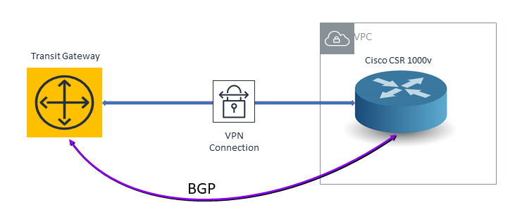

=========================================================
AWS Transit Gateway Route Limit Test Validation
=========================================================

Introduction
---------------

While an AWS Transit Gateway (TGW) carries thousands of routes in the TGW route table, a TGW VPN has the same 100 route limit as
the VGW VPN. 

Test Validation
----------------

In the following setup, we launch a Cisco CSR 1000v as the Customer Gateway and use it to attach a VPN connection
to the TGW. The TGW and the CSR also run BGP between themselves. The detailed steps are `here <https://docs.aws.amazon.com/vpc/latest/tgw/tgw-vpn-attachments.html>`_.

|tgw_route_limit|

After the VPN tunnel is created between TGW and CSR, run the following command at CSR to verify the BGP peer connection, where 169.254.11.233 is the TGW's BGP ID:

::

 ip-10-10-0-106#show ip bgp neighbors 169.254.11.233 | include BGP state
   BGP state = Established

Turn on BGP debug on CSR and then configure CSR to advertise 101 routes to TGW through BGP. CSR shows the following BGP
debug messages:

::

 *Dec 18 00:29:28.213: %BGP-3-NOTIFICATION: received from neighbor 169.254.11.233 6/1 (Maximum Number of Prefixes Reached) 7 bytes 00010100 000064
 *Dec 18 00:29:28.213: BGP: ses global 169.254.11.233 (0x7F36A1AF6C60:1) Receive NOTIFICATION 6/1 (Maximum Number of Prefixes Reached) 7 bytes 00010100 000064
 *Dec 18 00:29:28.213: %BGP-5-NBR_RESET: Neighbor 169.254.11.233 reset (BGP Notification received)
 *Dec 18 00:29:28.213: BGP: ses global 169.254.11.233 (0x7F36A1AF6C60:1) Reset (BGP Notification received).
 *Dec 18 00:29:28.213: BGP: 169.254.11.233 went from Established to Closing

The above messages show that when the TGW exceeds its route limit (100), it sends a BGP reset message to CSR.

The BGP connection becomes idle after these messages.

::

 ip-10-10-0-106#show ip bgp neighbors 169.254.11.233 | include BGP state
   BGP state = Idle

This test indicates that TGW has the same BGP total prefix limitation (100) as a VGW.

Summary
----------

TGW VPN has a total 100 BGP prefix. In addition, a TGW cannot summarize Spoke VPC routes. 

.. add in the disqus tag

.. disqus::

