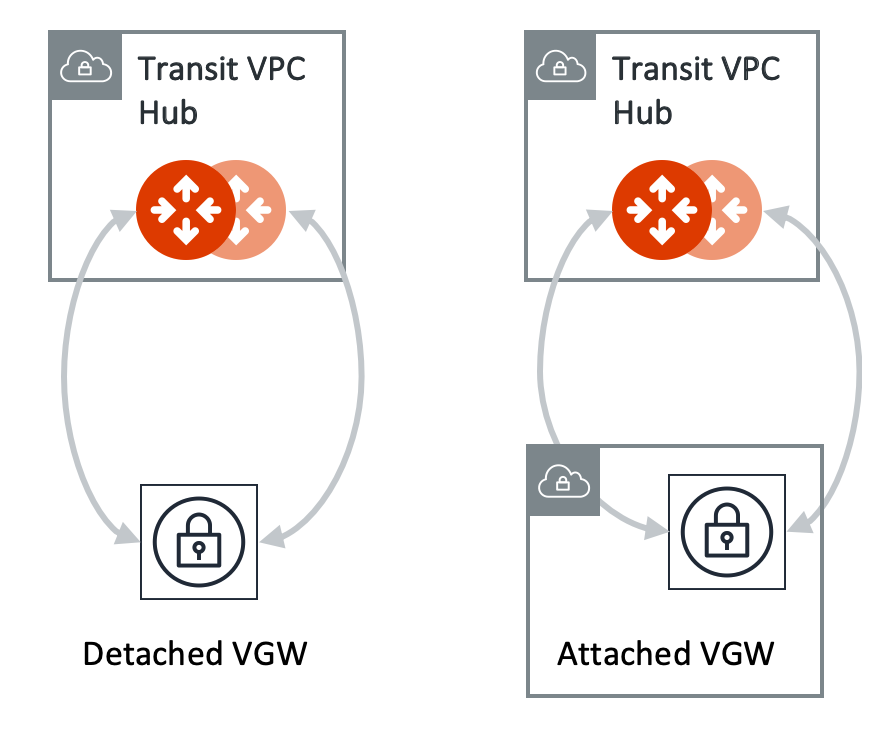

.. meta::
  :description: Multi-Cloud Transit Network Advanced
  :keywords: Transit VPC, Transit hub, AWS Global Transit Network, Encrypted Peering, Transitive Peering, AWS VPC Peering, VPN

================================================================
Transit Advanced Config
================================================================

.. Note::

 The advanced configuration applies to each Aviatrix Transit Gateway. Go to Multi-Cloud Transit -> Advanced Config -> Edit Transit. Select one gateway and apply the following changes. 

Local AS Number
--------------------

This option changes the Aviatrix Transit Gateway ASN number before you setup Aviatrix Transit Gateway connection configurations. 

BGP Manual Advertised Network List
-------------------------------------

This field is only applicable to Transit GW established by `Transit Network workflow <https://docs.aviatrix.com/HowTos/transitvpc_workflow.html>`_.

By default, Aviatrix Transit GW advertises individual Spoke VPC CIDRs to VGW. You can 
override that by manually entering the intended CIDR list to advertise to VGW. 

This feature is critical to limit the total number of routes carried by VGW (maximum is 100). 

To enable this option in software version prior to 4.1, click Site2Cloud on the left navigation bar, select the connection established by `Step 3 <https://docs.aviatrix.com/HowTos/transitvpc_workflow.html#connect-the-transit-gw-to-aws-vgw>`_, click to edit.
Scroll down to "Manual BGP Advertised Network List" to enable.

For software version 4.1 and later, you will click Transit Network on the left navigation bar, click the Advanced Config option and browse to the Edit Gateway tab. Select the Transit Gateway you want to enable this feature on and scroll down to the "Manual BGP Advertised Network List" and enter the summarized CIDRs that you want to advertise

To disable the option, leave the field blank and click "Change BGP Manual Spoke Advertisement".

Connection Manual BGP Advertised Network List
---------------------------------------------

Manual Advertise Routes per BGP Connection expands the existing gateway based manual advertising routes feature to apply it to each BGP connection. One use case is to have better route advertising control for each remote BGP peer.

To enable this option on software version 6.3, 

- click "MULTI-CLOUD TRANSIT" on the left navigation bar, and then click the "Advanced Config" option

- browse to the "Edit Transit" tab, and then select the Transit Gateway 

- find the panel "Connection Manual BGP Advertised Network List", and then select the connection name and fill the CIDRs to advertise under field "Advertised Network List"

To disable the option, leave the field blank and click the button "CHANGE".

Advertise Transit VPC Network CIDR(s)
--------------------------------------

This field is only applicable to Transit GW established by `Transit Network workflow <https://docs.aviatrix.com/HowTos/transitvpc_workflow.html>`_.

By default, Aviatrix Transit GW does not advertise Transit VPC `CIDR <https://www.aviatrix.com/learning/glossary/cidr.php>`_.

When this feature is enabled, Aviatrix Transit GW advertises the Transit VPC CIDR to VGW. The Controller programs the 3 RFC1918 routes in the AWS route table to point to the Transit GW. It also programs the learned routes from VGW into the AWS route table. 

If you deploy instances in the Transit VPC, enabling "Advertise Transit VPC CIDR(s) mode allows the instance to communicate both to Spoke VPCs and on-prem network, assuming the Spoke VPCs are in the RFC1918 range. 

To enable this option in software version prior to 4.1, click Site2Cloud on the left navigation bar, select the connection established by `Step 3 <https://docs.aviatrix.com/HowTos/transitvpc_workflow.html#connect-the-transit-gw-to-aws-vgw>`_, click to edit.
Scroll down to "Advertise Transit VPC Network CIDR(s)" to enable.

For software version 4.1 and later, you will click Transit Network on the left navigation bar, click the Advanced Config option and browse to the Edit Gateway tab. Select the Transit Gateway you want and scroll down to enable the "Advertise Transit VPC Network CIDR(s)" option. 

Connected Transit
--------------------

By default, Aviatrix Spoke VPCs do not have routing established to communicate 
with each other via Transit. They are completely segmented. 

If you would like to build a full mesh network where Spoke VPCs communicate with each other via Transit GW, you can achieve that by enabling "Connected Transit" mode. All connections are encrypted. 

.. Note::

  For a Spoke VPC/VNet in a multi-cloud transit to communicate with a Spoke VPC in TGW Orchestrator, Connected
 Transit must be enabled on the Aviatrix Transit Gateway that connects both sides.

For software version 4.1 and later, you will click Transit Network on the left navigation bar, click the Advanced Config option and browse to the Edit Gateway tab. Select the Transit Gateway you want to enable the Connected Transit.

Note all Spokes should be either in HA mode or non HA mode. A mixed deployment where some Spokes have 
HA enabled while others don't work in a normal environment, but does not work
when a failover happens on a HA enabled Spoke. 

BGP ECMP
-----------

This option is to enable Equal Cost Multi Path (ECMP) routing for the next hop. For Aviatrix Transit Gateway next hop routing decision
process, refer to `ActiveMesh 2.0 next hop. <https://docs.aviatrix.com/HowTos/activemesh_faq.html#what-is-activemesh-2-0>`_.

Click the Slide Bar to enable BGP ECMP. 

Active-Standby
--------------

This option is to provide the flexibility on Aviatrix Transit Gateways to connect to on-prem with only one active tunnel and the other one as backup. In addition, this Active-Standby Mode supports ActiveMesh 2.0 only.

The use case is a deployment scenario where on-prem device such as firewall does not support asymmetric routing on two tunnels. When Active-Standby mode is enabled, it applies to both BGP and Static Remote Route Based External Device Connections and for each connection, only one tunnel is active in forwarding traffic at any given time. 

This feature can only be applied to non HA remote device in `Multi-cloud transit Step 3 <https://docs.aviatrix.com/HowTos/transitvpc_workflow.html#external-device>`_.

Click the Slide Bar to enable Active-Standby mode. 

Multi-Tier Transit
-----------------------

Gateway AS Path Prepend
-------------------------------------------

You can insert BGP AS_PATH on the Aviatrix Transit Gateway to customize the BGP AP_PATH field when it advertises to VGW or peer devices. For example, 
enter 65458, 65478 in the input field, these ASN will appear to the remote end. 

This configuration applies to all BGP peers of the Aviatrix Transit Gateway. 

If you don't configure this field, Transit Gateway only advertises its own ASN.

Connection AS Path Prepend
----------------------------

Customize AS Path Prepend by specifying AS PATH for each BGP connection. 
This feature  applies to any dynamic connection and Transit Gateway peering connections on a selected Aviatrix Transit Gateway. 

BGP Polling Time 
---------------------

Aviatrix Transit Gateways report its BGP routes to the Controller periodically. By default, the periodic timer is 50 seconds. 
This polling time affects BGP route change convergence time. 

This option changes the default polling time. The range is 10 seconds to 50 seconds.

BGP Hold Time
----------------------

Refresh BGP Advertised Routes
---------------------------------------

This option reset BGP connection to the remote BGP peers. 

Use this option to enable new features such as "Segmentation based BGP CIDR Advertisements" where on-prem receives BGP advertisement
for networks on-prem has connection policy or in the same Security Domain. 

AWS TGW Edge Segmentation
----------------------------

Refer to `TGW Edge Segmentation <https://docs.aviatrix.com/HowTos/tgw_faq.html#what-is-edge-segmentation>`_ for details. 

TGW Edge Segmentation can be enabled at given time. Select a connection to enable or disable. 

BGP Overlapping Alert Email
----------------------------

When Aviatrix Controller detects overlapping network CIDRs in the network, it sends out alert emails to the admins. 

BGP Route Limit Alert Email
----------------------------------

AWS VGW BGP supports up to 100 routes. When this limit is reached, VGW BGP goes down and causes outage. This email alert 
notifies admin when routes approach 90. 

BGP Maximum AS Limits
----------------------------------

Coming soon...

.. |Test| image:: transitvpc_workflow_media/SRMC.png
   :width: 5.55625in
   :height: 3.26548in

.. |TVPC2| image:: transitvpc_workflow_media/TVPC2.png
   :scale: 60%

.. |HAVPC| image:: transitvpc_workflow_media/HAVPC.png
   :scale: 60%

.. |launchSpokeGW| image:: transitvpc_workflow_media/launchSpokeGW.png
   :scale: 50%

.. |AttachSpokeGW| image:: transitvpc_workflow_media/AttachSpokeGW.png
   :scale: 50%

.. |SpokeVPC| image:: transitvpc_workflow_media/SpokeVPC.png
   :scale: 50%

.. |azure_native_transit2| image:: transitvpc_workflow_media/azure_native_transit2.png
   :scale: 30%

.. |transit_approval| image:: transitvpc_workflow_media/transit_approval.png
   :scale: 30%

.. disqus::
