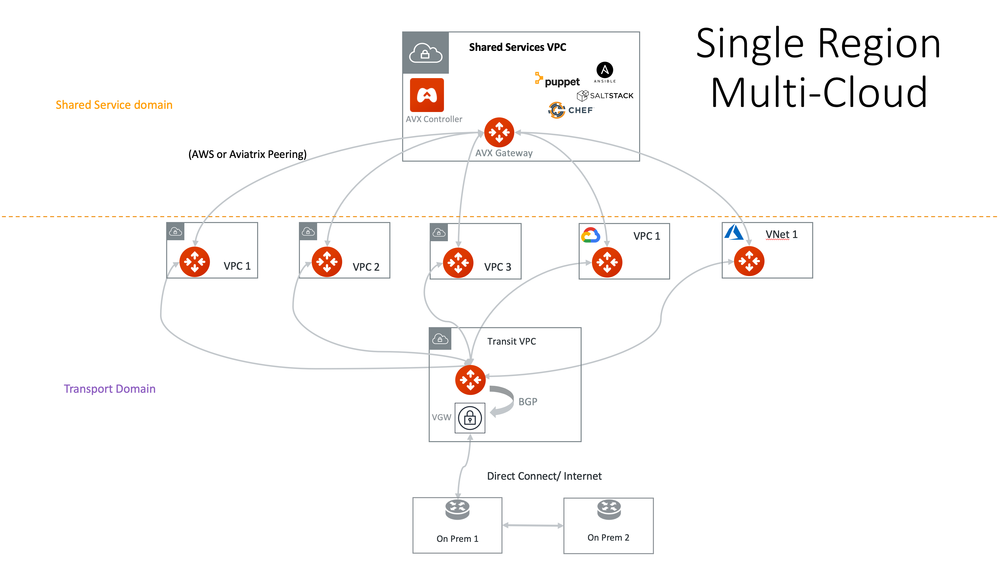
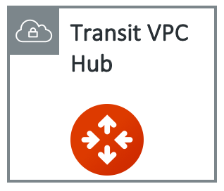
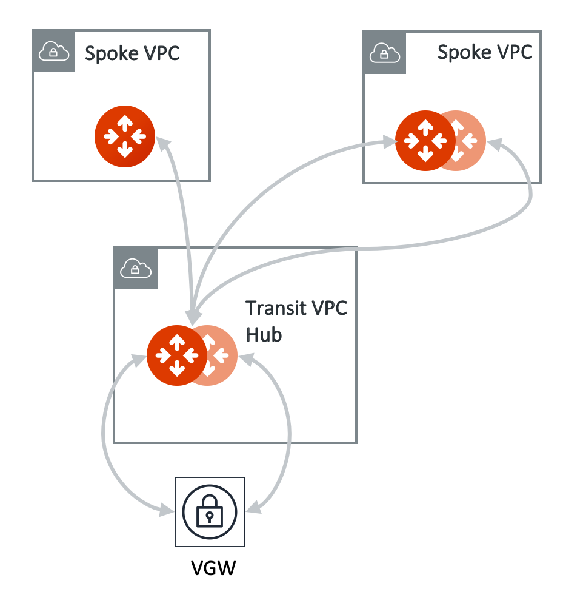

.. meta::
  :description: Global Transit Network
  :keywords: Transit VPC, Transit hub, AWS Global Transit Network, Encrypted Peering, Transitive Peering, AWS VPC Peering, VPN

================================================================
Encrypted Transit Approval
================================================================

Aviatrix Transit Gateway dynamically learns BGP routes from remote site, these learned routes are reported
to the Controller which in turn programs route entries of a Spoke VPC/VNet route table. 

There are scenarios where you require an approval process before these learned CIDRs propagation take place.
For example, a specific VPN may be
connected to a partner network and you need to make sure undesirable routes, such as the default route (0.0.0.0/0) are not
propagated into your own network and accidentally bring down the network.

|transit_approval|

Approval is enabled on an Aviatrix Transit Gateway. When Approval is enabled, dynamically learned routes
from all remote peers 
trigger an email to the Controller admin. Controller admin logins in to the Controller and go to
Transit Network > Approval, the admin should see not yet approved CIDRs and already approved CIDRs. 
Moving the routes from Pending Learned CIDRs panel to Approved Learned CIDRs panel allows those routes to be propagated.

To enable Approval, go to Multi-Cloud Transit > Approval. Select the gateway and click **Learned CIDRs Approval** to set it to Enabled.

When Approval is disabled, all dynamically learned routes are automatically propagated to the Spokes.

Mode Gateway
----------------------

By default, Learned CIDR Approval applies to all BGP connections configured on the Multi-Cloud Transit Gateway. 

Mode Connection
---------------------------

If Connection mode is selected, approval is applied to a selected BGP connection as shown in the 
dropdown menu. A BGP connection that is not configured for Approval learns all routes from its peer automatically.
  

.. |HAVPC| image:: transitvpc_workflow_media/HAVPC.png
   :scale: 60%

.. |VGW| image:: transitvpc_workflow_media/connectVGW.png
   :scale: 50%

.. |launchSpokeGW| image:: transitvpc_workflow_media/launchSpokeGW.png
   :scale: 50%

.. |AttachSpokeGW| image:: transitvpc_workflow_media/AttachSpokeGW.png
   :scale: 50%

.. |transit_to_onprem| image:: transitvpc_workflow_media/transit_to_onprem.png
   :scale: 40%

.. |azure_native_transit2| image:: transitvpc_workflow_media/azure_native_transit2.png
   :scale: 30%

.. |transit_approval| image:: transitvpc_workflow_media/transit_approval.png
   :scale: 30%

.. disqus::
