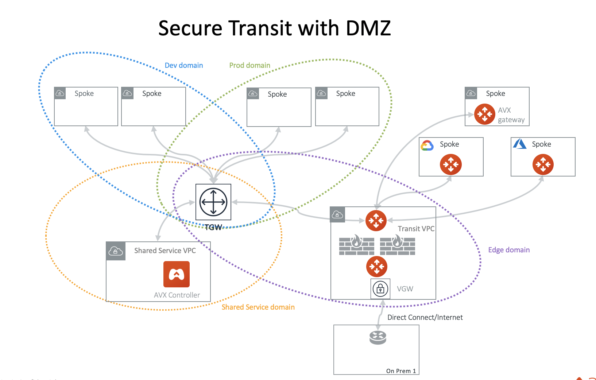

.. meta::
  :description: Transit DMZ FAQ	
  :keywords: AWS TGW, TGW orchestrator, Aviatrix Transit network, Firewall, DMZ, Cloud DMZ

=========================================================
Transit DMZ FAQ
=========================================================

What is Transit DMZ?
-----------------------

Transit DMZ is a security feature for the Next Gen Transit network. With Transit DMZ, you can centrally deploy instance based
firewall virtual appliances to protect traffic between on-prem and VPCs, and VPC Egress and Ingress. Transit DMZ is 
implemented at the edge VPC as shown below, where a pair of firewalls are deployed between two pairs of Aviatrix Transit GWs at the Transit VPC edge. 

|transit_dmz| 

How is Transit DMZ different from the traditional deployment of firewalls in the cloud?
----------------------------------------------------------------------------------------

Traditionally, centrally deployed instance based firewall appliances require IPSEC tunnels to send traffic from VPCs to these appliances. This increases the complexity of managing the firewalls and reduces performances for the security
features that you want them to perform. 

Transit DMZ decouples networking functions and security functions. There is no IPSEC tunnels between the Aviatrix 
Transit GW and the firewall appliances, thus simplifying firewall deployment and allowing them to scale independently.  

Can Transit DMZ work with Transit VPC?
---------------------------------------

Since Transit DMZ is independent from how a Spoke VPC is connected, it works with both the 
Transit VPC where a Spoke VPC deploys Aviatrix gateways and the Native TGW Spoke VPCs 
where no Aviatrix gateway is deployed in the Spoke VPC. 

Is Transit DMZ a bump in the wire for all traffic?
---------------------------------------------------

For the 4.1 release, Transit DMZ can only intercepts traffic between north and south (on-prem and VPCs) and Egress and Ingress traffic. Transit DMZ does not see east west traffic (between two VPCs).

.. disqus::
