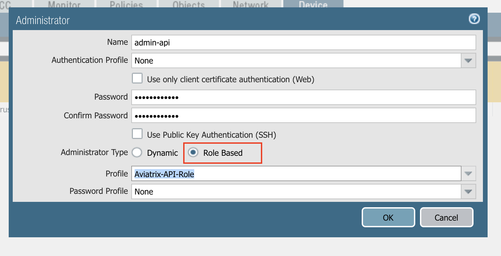
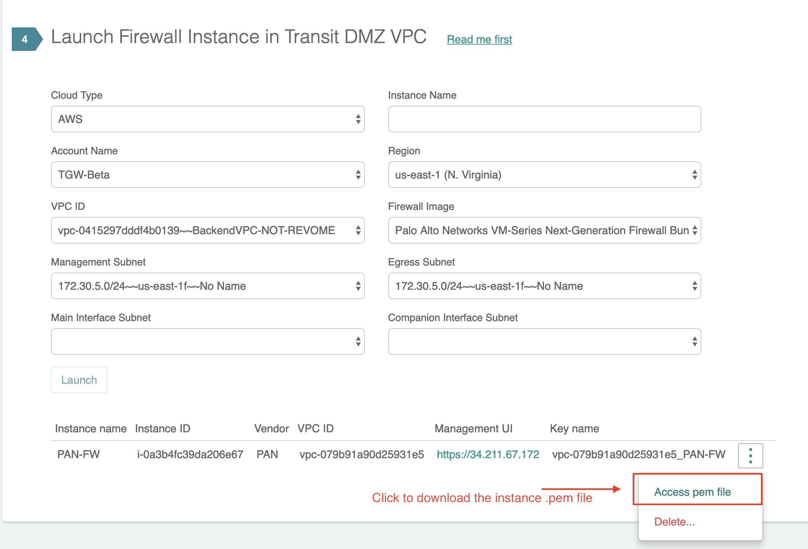
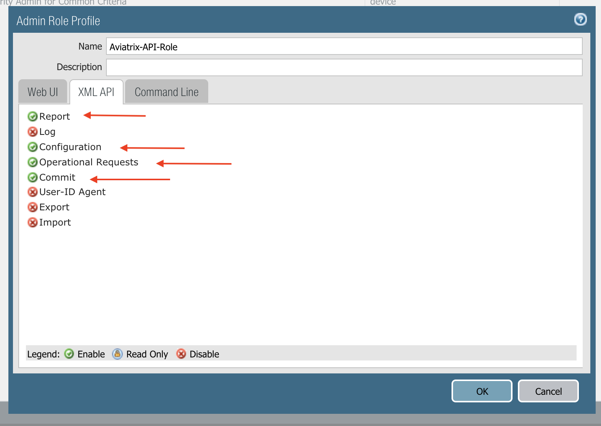
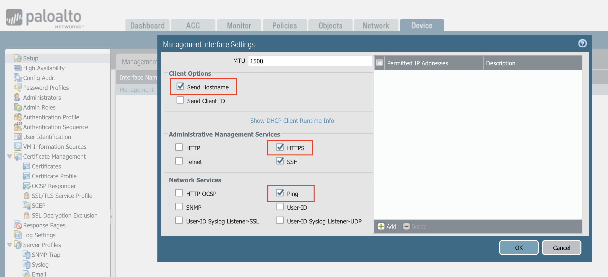

=========================================================
Vendor Integration
=========================================================

Aviatrix Transit DMZ works with any firewall instances. However, API level integration allows the DMZ solution to provide significantly improved automation. 

Launch Palo Alto Networks VM-Series Instance
----------------------------------------------

You can launch a Palo Alto Networks VM-Series from the Aviatrix Controller. Make sure you have subscribed to the 
the AMI. 

Enter the fields below and click Launch. 

==========================================      ==========
**Setting**                                     **Value**
==========================================      ==========
Cloud Type                                      Select AWS.
Instance Name                                   Give the VM-Series instance a name.
Account Name                                    The account name for the transit VPC.
Region                                          One of the AWS region.
VPC ID                                          The VPC to launch the firewall instance.
Firewall Image                                  Select one of the Palo Alto VM-Series AMI to launch.
Management Subnet                               VM-Series management interface, must be a public subnet with EIP. 
Egress Subnet                                   VM-Series instance for Internet, must be a public subnet with EIP. 
Main Interface Subnet                           VM-Series instance interface for Aviatrix Main gateway. 
Companion Interface Subnet                      VM-Series instance interface for Aviatrix Companion gateway. 
==========================================      ==========

.. Tip::

  After the instance is launched, it will be listed in the same page. Wait for 15 minutes after you launch the VM-Series instance before you login to instance to setup the password. To login to the instance, click the skewer button to download the pem file for the instance. Note eth1 is management interface, eth0 is egress interface, eth2 and eth3 are north and south interfaces. 

|download_pem_file|

Palo Alto Networks VM-Series Configuration
--------------------------------------------

In the release 4.1, the supported firewall vendor is Palo Alto Networks VM-Series Firewall in AWS. For how to configure
Palo Alto Networks, refer to `this guide. <https://docs.paloaltonetworks.com/vm-series/8-1/vm-series-deployment/set-up-the-vm-series-firewall-on-aws/deploy-the-vm-series-firewall-on-aws/launch-the-vm-series-firewall-on-aws.html#ide07b93a2-ccb3-4c69-95fe-96e3328b8514>`_

Follow the following steps to enable Palo Alto Networks API programming.

1. Enable Ping
~~~~~~~~~~~~~~~~~~

Make sure that the Palo Alto Networks management interface has ping enabled and the instance's security group has ICMP policy open to the Aviatrix Controller's public IP address.

|pan_ping|

2. Create API Administrator Role Profile
~~~~~~~~~~~~~~~~~~~~~~~~~~~~~~~~~~~~~~~~~

Create a new role profile and name it Aviatrix-API-Role. Edit the profile to enable Report, Configuration, Operation Requests and Commit for the tab XML API. This allows the Aviatrix Controller to update the relevant route entries
the Palo Alto Network interfaces.

Go to Device -> Setup -> Management Interface Settings, as shown below.

|pan_role_profile|

3. Add an Administrator for API
~~~~~~~~~~~~~~~~~~~~~~~~~~~~~~~~~~

At the Palo Alto Networks Console, go to Device -> Administrators -> +Add, to add an administrator for Role Based access as
shown below. Use the profile created in previous step.

|pan_admin|

5. Configure on the Aviatrix Controller
~~~~~~~~~~~~~~~~~~~~~~~~~~~~~~~~~~~~~~~~~

Login to the Aviatrix Controller, go to Transit DMZ -> Vendor Integration. Configure the following parameters.

==========================================      ==========
**Setting**                                     **Value**
==========================================      ==========
Transit VPC ID                                  The Transit VPC ID for the Transit DMZ deployment. .
Firewall instance ID                            The firewall EC2 instance ID. Aviatrix Controller monitors the health of this instance and determines fail over when it becomes unreachable.
Firewall Name (Optional)                        A name to remember.
Firewall Vendor Type                            Select PAN
Firewall Login User Name                        firewall login name for API calls from the Controller.
Firewall Login Password                         firewall login password for API calls.
Firewall Management IP Address                  The public IP address of the firewall management interface for API calls from the Aviatrix Controller
Firewall Virtual Router name (Optional)         Specify the firewall virtual Router name you wish the Controller to program. If left unspecified, the Controller programs the firewall's default router.
==========================================      ==========

4. API calls
~~~~~~~~~~~~~~~~

The integrated functions by the Controller are the following:

 - The Controller monitors the health of Palo Alto Network software by using the VM-series API and performs switch over based on the API return status.
 - The Controller dynamically programs Palo Alto Network route tables for any new propagated new routes discovered both from new Spoke VPCs and new on-premise routes.

Example of Palo Alto Networks API used:

1. get key:

::

    https://54.149.55.193/api/?password=password&type=keygen&user=apiadmin

2. get route tables:

::

    https://54.149.55.193/api/?type=config&xpath=/config/devices/entry[@name='localhost.localdomain']/network/virtual-router/entry[@name='default']&key=LUFRPT1YQk1SUlpYT2xIT3dqMUFmMlBEaVgxbUxwTmc9RFRlWncrbURXZVpXZUUyMFE3V3ZWVXlaSlFvdkluT2F4dzMzWUZpMGtZaz0=&action=get

3. show interfaces:

::

    https://54.149.55.193/api/?key=LUFRPT1BbkNIbXJZNlVBOVdRMXNMSUNVRis1VWRHaTA9RFRlWncrbURXZVpXZUUyMFE3V3ZWU2ZEZzdCNW8yUEpwU3Q1NXEzeDBnST0=&type=op&cmd=<show><interface>ethernet1/2</interface></show>

4. add route:

::

    https://13.58.10.51/api/?type=config&xpath=/config/devices/entry[@name='localhost.localdomain']/network/virtual-router/entry[@name='default']/routing-table/ip/static-route/entry[@name='test2']&key=LUFRPT1BbkNIbXJZNlVBOVdRMXNMSUNVRis1VWRHaTA9RFRlWncrbURXZVpXZUUyMFE3V3ZWU2ZEZzdCNW8yUEpwU3Q1NXEzeDBnST0=&action=set&element=<nexthop><ip-address>10.201.1.1</ip-address></nexthop><bfd><profile>None</profile></bfd><path-monitor><enable>no</enable><failure-condition>any</failure-condition><hold-time>2</hold-time></path-monitor><metric>10</metric><destination>10.40.0.0/24</destination><route-table><unicast/></route-table>

5. delete route:

::

    https://13.58.10.51/api/?type=config&xpath=/config/devices/entry[@name='localhost.localdomain']/network/virtual-router/entry[@name='default']/routing-table/ip/static-route/entry[@name='test2']&key=LUFRPT1BbkNIbXJZNlVBOVdRMXNMSUNVRis1VWRHaTA9RFRlWncrbURXZVpXZUUyMFE3V3ZWU2ZEZzdCNW8yUEpwU3Q1NXEzeDBnST0=&action=delete

6. commit

::

    https://13.58.10.51/api/?type=commit&key=LUFRPT1BbkNIbXJZNlVBOVdRMXNMSUNVRis1VWRHaTA9RFRlWncrbURXZVpXZUUyMFE3V3ZWU2ZEZzdCNW8yUEpwU3Q1NXEzeDBnST0=&cmd=<commit></commit>

.. |main_companion_gw| image:: transit_dmz_workflow_media/main_companion_gw.png
   :scale: 30%

.. disqus::
