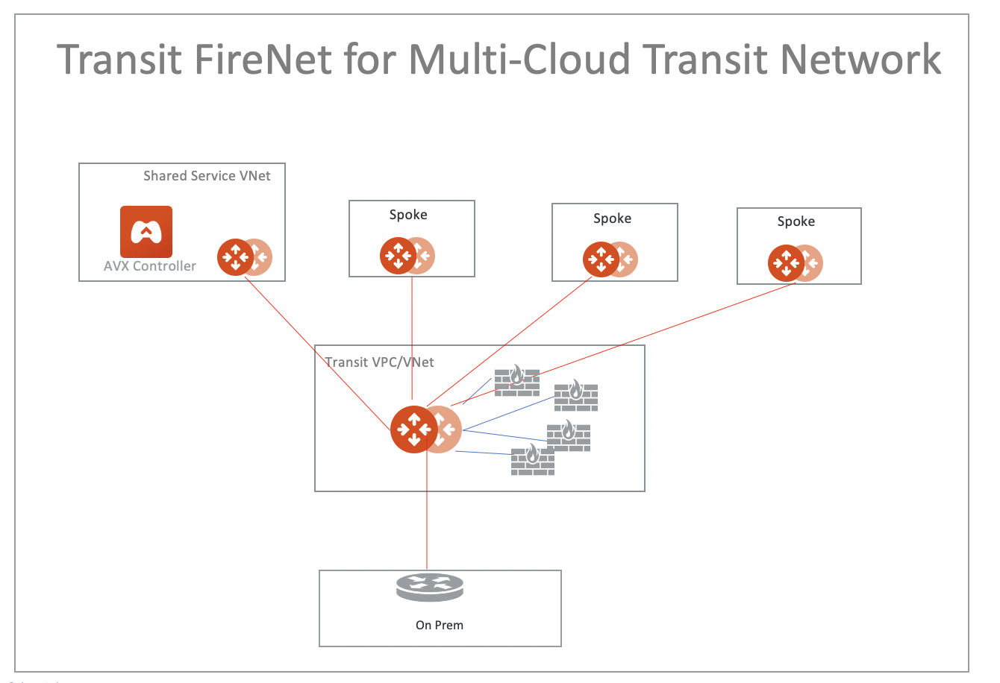
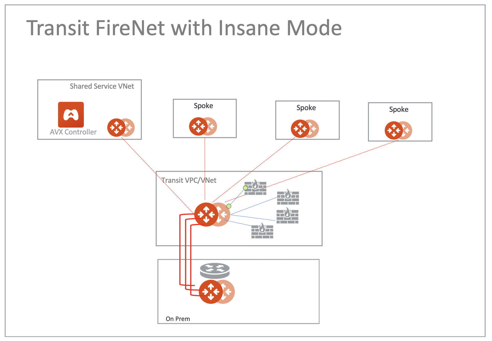
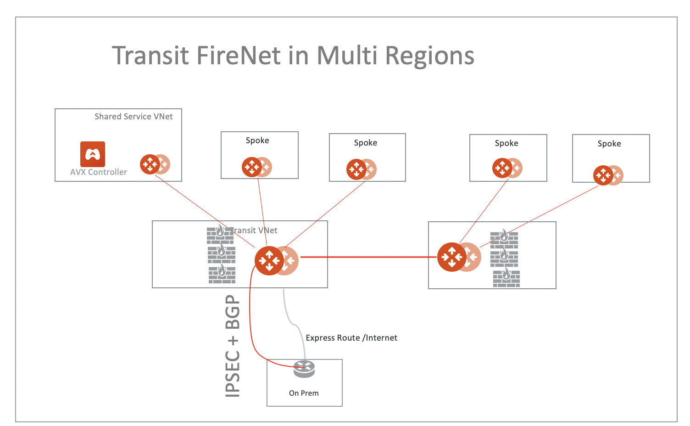
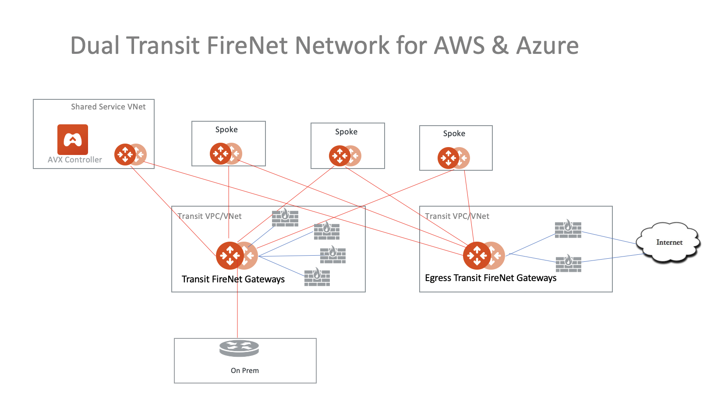
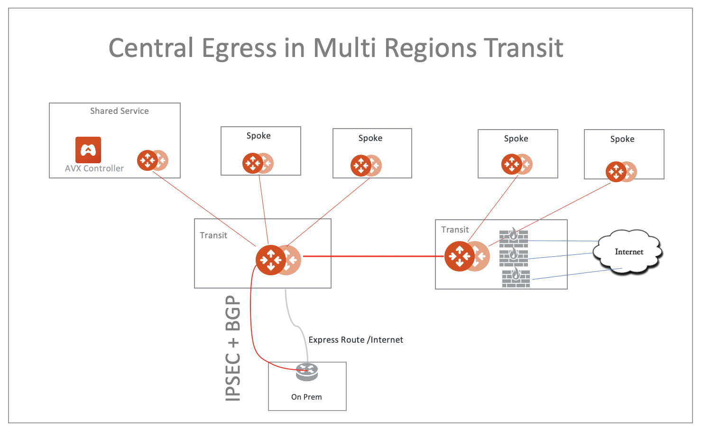
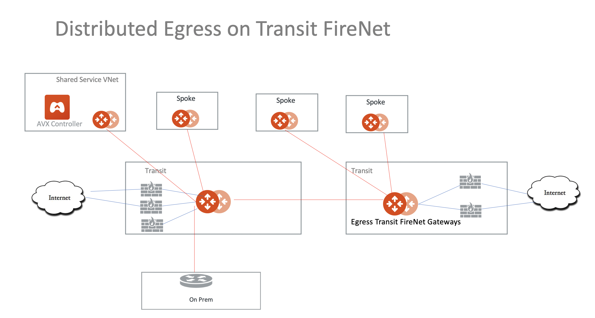

.. meta::
  :description: Firewall Network FAQ	
  :keywords: AWS Transit Gateway, AWS TGW, TGW orchestrator, Aviatrix Transit network, Firewall, DMZ, Cloud DMZ, Firewall Network, FireNet

============================================================
Transit FireNet Design Patterns
============================================================

This document describes common design patterns when Aviatrix Transit Firewall Network (Transit FireNet) is deployed. 

1. Hybrid to On-prem
---------------------------------------------------

|hybrid|

2. Hybrid with Insane Mode
--------------------------------------------------------

FireNet supports Insane Mode,  

|insane|

3. FireNet in Multi Regions 
---------------------------------------------------------------------------------

|multi-regions|

4. Two Firewall Networks 
--------------------------------------------------------

You can deploy two Firewall Networks, one dedicated for East-West traffic inspection and another for Egress
inspection.

Note you must follow the configuration sequence below:

 1. Disable the Traffic Inspection of the FireNet gateway intended for Egress control.
 #. Enable Egress Control for FireNet gateway intended for Egress control. 
 #. Build connection policies. 

|dual_firenet|

5. Aviatrix FQDN in FireNet for Egress Control
-------------------------------------------------

When Aviatrix FQDN gateway is deployed in a VPC/VNet, it uses a public IP address to perform both whitelisting and NAT function 
for Internet bound traffic. Sometimes these Internet bound traffic are partner API calls and these partners require to 
limit the number of IP addresses for each customer of theirs. In such situation, you can deploy FQDN in a centralized 
manner as shown in the diagram below. 

|fqdn_egress|

6. Central Egress in a Multi Region Deployment
--------------------------------------------------------

Since the default routes are propagated over the Aviatrix Transit Gateway peering, you can consolidate the Internet bound egress traffic to the 
firewalls in one region, as shown in the diagram below. 

|central_egress|

7. Distributed Egress in a Multi Region Deployment
------------------------------------------------------

If you need to have a distributed egress for each region, make sure you filter out the default route 0.0.0.0/0 when you build 
the Aviatrix Transit Gateway peering, as shown in the diagram below. 

|multi_egress|

8. Ingress Protection via Aviatrix Transit FireNet
------------------------------------------------------

This Ingress Protection design pattern is to have the traffic forward to firewall instances directly in Aviatrix Transit FireNet VPC as shown in the diagram below. In this design pattern, each firewall instance must configure (1) SNAT on its LAN interface that connects to the Aviatrix FireNet gateway and (2) DNAT to the IP of application server/load balancer. The draw back of this design is source IP address is not preserved when traffic reaches the application. 

For example configuration workflow, check out `Ingress Protection via Aviatrix Transit FireNet with Fortigate <https://docs.aviatrix.com/HowTos/Ingress_Protection_Transit_FireNet_Fortigate.html>`_. 

|transit_firenet_ingress|

.. |fqdn_egress| image:: transit_firenet_design_patterns_media/fqdn_egress.png
   :scale: 30%

.. |transit_firenet_ingress| image:: ingress_firewall_example_media/Ingress_Aviatrix_Transit_FireNet_topology.png
   :scale: 30%

.. disqus::
