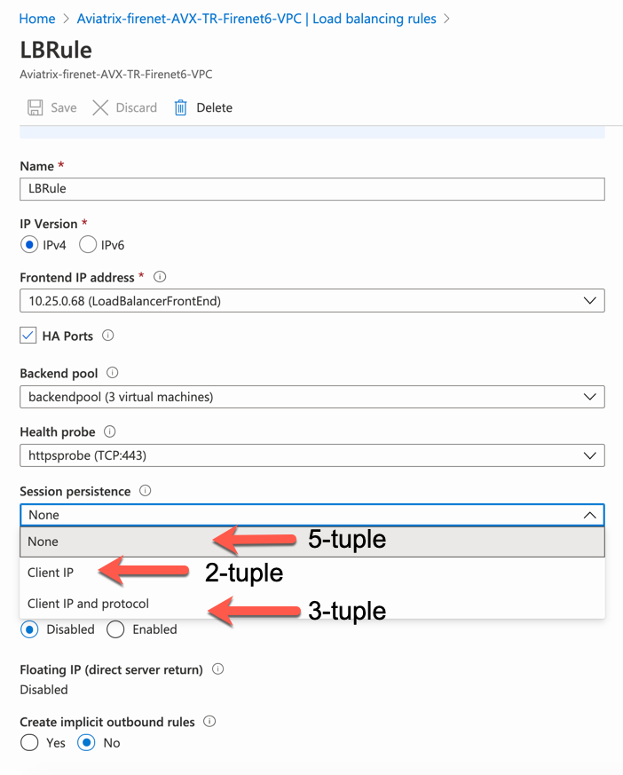

.. meta::
  :description: Firewall Network FAQ	
  :keywords: AWS Transit Gateway, AWS TGW, TGW orchestrator, Aviatrix Transit network, Firewall, DMZ, Cloud DMZ, Firewall Network, FireNet

=========================================================
Transit FireNet FAQ
=========================================================

What is the Aviatrix Transit FireNet for AWS & Azure?
----------------------------------------------------------

Aviatrix Transit FireNet allows you to deploy firewalls functions for the Aviatrix Encrypted 
Transit architecture. 
With Transit FireNet feature, the FireNet function is integrated into the Aviatrix Transit gateway. 

If you are looking for firewall functions deployment in AWS Transit Gateway environment, your starting point
is `here. <https://docs.aviatrix.com/HowTos/firewall_network_workflow.html>`_ 

The use case is to deploy firewalls in the `encrypted transit architecture <https://docs.aviatrix.com/HowTos/transitvpc_workflow.html>`_ 
for both AWS and Azure, as shown below. 

|transit_firenet|

When deployed in Azure, Transit FireNet also works when using Native Azure VNet Spokes, as shown below. 

|transit_firenet_vnet|

When deployed in Azure, only two firewall instances are supported.

Can multiple firewalls be supported in Transit FireNet?
--------------------------------------------------------------------------------------

Yes. Multiple firewall instances can be attached to Each Transit Gateway. The Transit Gateway load balances and forwards packets to the firewalls. 

How does Transit FireNet work?
--------------------------------

Transit FireNet works the same way as the Firewall Network where traffic in and out of the specified Spoke is forwarded to the firewall instances for
inspection or policy application. 

What is the minimum gateway instance size for Transit FireNet deployment?
----------------------------------------------------------------------------

The minimum gateway instance size is C5.xlarge. This is because the FireNet gateway requires 4 network 
interfaces: 

 - eth0 is a management interface
 - eth1 is not used
 - eth2 is the interface to the firewall instances 
 - eth3 is the interface to the HA FireNet gateway

What is the Transit FireNet performance?
-------------------------------------------

With a pair of c5n.18xlarge Aviatrix Transit Gateway, Transit FireNet achieves 70Gbps throughput with iperf3 benchmark, as shown in the diagram below. 

Note if a single c5n.18xlarge Aviatrix Transit Gateway is deployed, the throughput is about 40Gbps. This is because Aviatrix Encrypted Transit solution runs with ActiveMesh where both Transit Gateways do the packet forwarding. 

|transit_firenet_perf|

Which option should I choose for "Create a VPC" tool"?
----------------------------------------------------------

When using the Useful Tool to create the transit VPC for Transit FireNet deployment, select "Aviatrix FireNet VPC" option to create 4 public subnets. 

How do I configure FireNet?
---------------------------

Follow the `FireNet workflow <https://docs.aviatrix.com/HowTos/firewall_network_workflow.html>`_ to deploy firewall in the cloud. 

For a complete end to end example, refer to `The Example Step by Step Guide for Transit FireNet in AWS <https://docs.aviatrix.com/HowTos/transit_firenet_workflow_aws.html>`_. 

How do I enable Egress inspection on Transit FireNet?
--------------------------------------------------------

By default, FireNet inspects traffic between North South (on-prem and VPC) and East West (VPC to VPC). To enable
Egress traffic (Internet bound) inspection: 

Go to Firewall Network -> Advanced. Click the skewer. Scroll down to "Egress through Firewall" and click Enable.

.. Important::

  When Egress through Firewall is enabled, it applies to all Spoke VPCs. You do not need to configure individual VPC inspection policy.

Is Ingress Inspection supported on Transit FireNet?
----------------------------------------------------

Yes. You need to enable source NAT on the LAN Interface of the VM-Series.

How to exclude specific CIDRs from being inspected by the firewall?
--------------------------------------------------------------------

By default, FireNet inspects all East-West (VPC to VPC) traffic but you may have an instance in the VPC which you do not want to be inspected. For example, the Aviatrix Controller deployed in the Shared Service VPC to be excluded from inspection while Shared Service VPC traffic is inspected. This improves the Controller reachability by not subjecting the Controller access to unintentional firewall policy errors.

Go to **Firewall Network --> Advanced** and put the CIDRs in the field **"Network List Excluded From East-West Inspection"** to exclude from being inspected by the firewall.

.. Note::

    1. Maximum 20 CIDRs coma-separated are supported.
    2. CIDRs are excluded from East-West inspections only.
    3. In Transit FireNet, if Egress inspection is enabled, all the Egress traffic will get inspected by the firewall even for the CIDRs excluded for East-West inspection.

Can I deploy Aviatrix Egress Control FQDN gateway on Transit FireNet?
----------------------------------------------------------------------

Yes. Deploy Aviatrix FQDN gateway as shown in the diagram below. 

|transit_firenet_aviatrix_egress|

The instructions are described as the following. 

 1. `Enable Aviatrix Transit Gateway for Transit FireNet <https://docs.aviatrix.com/HowTos/transit_firenet_workflow.html#enable-transit-firenet-function>`_ 
 2. `Launch and associate Aviatrix FQDN gateway <https://docs.aviatrix.com/HowTos/firewall_network_workflow.html#c-launch-associate-aviatrix-fqdn-gateway>`_

What is the performance of Aviatrix Egress FQDN gateway on Transit FireNet?
----------------------------------------------------------------------------

Preliminary test results are as follows. 

==============================       =========================
# of FQDN gateways                   Throughput (Gbps)
==============================       =========================
4                                    27
6                                    30
==============================       =========================

Is there an example guide to setup Palo Alto VM-Series policies?
------------------------------------------------------------------

Yes. Follow `Example Config for Palo Alto VM-Series <https://docs.aviatrix.com/HowTos/config_paloaltoVM.html>`_ to 
setup an "ALLOW ALL" policy for test validation.

How do I test FireNet connectivity without deploying firewall instance?
-------------------------------------------------------------------------

You can test connectivity without deploying any firewall instances. When the FireNet gateway has no firewall instance 
attached to it for the data path, the FireNet gateway loops the received packet and forwards it to its destination.

Can VM-Series be launched with Bootstrap integration?
-------------------------------------------------------

Yes. When you launch a VM-Series from Aviatrix Controller console, you can select the option to launch the VM-Series instance with `bootstrap information. <https://docs.aviatrix.com/HowTos/firewall_network_workflow.html#example-configuration-for-bootstrap>`_

Can Firewall Network work with Panorama?
------------------------------------------

Yes. Follow the instructions for `Panorama integration. <https://docs.aviatrix.com/HowTos/paloalto_API_setup.html#managing-vm-series-by-panorama>`_

How does the Controller check Firewall instance health?
--------------------------------------------------------

When vendor integration is enabled, for Palo Alto Networks VM-Series, the Controller pings the individual firewall management interface every 10 seconds. If two
consecutive ping fails, the firewall is declared down and is moved to "down" state. The Controller continues to ping the management interface, if consecutive pings 
become successful, the firewall instance is attached back to the FireNet gateway pool.  

For Check Point CloudGuard and Fortinet Fortigate, the Controller uses AWS API to check instance health. 

Starting in Release 6.0 and later, Controller can also `check firewall instance health on its LAN interface <https://docs.aviatrix.com/HowTos/firewall_advanced.html#firewall-health-check-and-failover-detection-using-lan-interface>`_. 

What is the firewall instance state Inaccessible mean?
---------------------------------------------------------

The Controller periodically issues Palo Alto API calls to find out if API can be issued successfully. This is used for route updates purpose, as firewall route updates
requires API to work. If Palo Alto API fails for two consecutive times, the Controller declares the firewall is in Inaccessible state, but the firewall should still be attached 
and be forwarded traffic as long as its health check pass.

How does Transit Firenet load balance traffic between different firewalls?
----------------------------------------------------------------------------

AWS
====
In AWS, Transit FireNet Load Balance the traffic across different firewall using five-tuple hash.

The tuple is composed of the:

Source IP
Source port
Destination IP
Destination port
Protocol type

The algorithm provides stickiness only within a transport session. Packets that are in the same session are directed to the same firewall. When the client starts a new session from the same source IP, the source port changes and causes the traffic to go to a different firewall.

Azure
======
Aviatrix Transit FireNet supports different hashing algorithms available in Azure cloud to load balance the traffic across different firewalls which includes `Hash-based distribution mode (five-tuple hash) <https://docs.microsoft.com/en-us/azure/load-balancer/load-balancer-distribution-mode#hash-based-distribution-mode>`_ and `Source IP affinity mode (three-tuple or two-tuple hash) <https://docs.microsoft.com/en-us/azure/load-balancer/load-balancer-distribution-mode#source-ip-affinity-mode>`_.

By default, Transit Firenet use 5-tuple hashing algorithm but that can be changed using Azure's portal.

    1. Login to Microsoft Azure's Portal and Go to Load balancer under Azure services.
    #. Click the Transit Firenet where Load balancing algorithm needs to be changed.
    #. Go to Load Balancing rules under Settings and click on "LBRule".
    #. Select hashing algorithm under Session persistence.
        1. None -> Default five-tuple (source IP, source port, destination IP, destination port and protocol type) hashing algorithm.
        2. Client IP -> This mode uses a two-tuple (source IP and destination IP).
        3. Client IP and protocol -> three-tuple uses source IP, destination IP, and protocol type.

|lb-rule-azure|

How to migrate from Aviatrix Transit FireNet to Transit FireNet with AWS GWLB?
---------------------------------------------------------------------------------

Starting 6.3, Aviatrix added the support for AWS Gateway Load Balancer (GWLB) and allowing users to migrate from Transit FireNet to Transit FireNet with AWS GWLB or vice versa. Follow the below steps for migration:

    1. Save firewall configuration
    #. Disassociate firewall instance -> Go to Aviatrix Controller's console -> FIREWALL NETWORK -> Setup -> Step 10.
    #. Delete firewall instances -> Go to Aviatrix Controller's console -> FIREWALL NETWORK -> Setup -> Step 7a.
    #. Disable Transit FireNet function -> Go to Aviatrix Controller's console -> MULTI-CLOUD TRANSIT -> Transit Firenet -> Step 5a to disable Transit FireNet Function for Aviatrix Transit Gateway.
    #. Enable Transit FireNet function -> Go to Aviatrix Controller's console -> MULTI-CLOUD TRANSIT -> Transit Firenet -> Step 1a to enable Transit FireNet Function on Aviatrix Transit Gateway. Check "Use AWS GWLB" if migrating from Transit FireNet to Transit FireNet with AWS GWLB.
    #. Launch & associate Firewall -> Go to Aviatrix Controller's console -> FIREWALL NETWORK -> Step 7a.
    #. Restore firewall configuration.

.. |transit_firenet| image:: transit_firenet_media/transit_firenet.png
   :scale: 30%

.. |transit_firenet_perf| image:: transit_firenet_media/transit_firenet_perf.png
   :scale: 30%

.. |transit_firenet_vnet| image:: transit_firenet_media/transit_firenet_vnet.png
   :scale: 30%

.. |transit_firenet_aviatrix_egress| image:: transit_firenet_media/transit_firenet_aviatrix_egress.png
   :scale: 30%

.. disqus::
