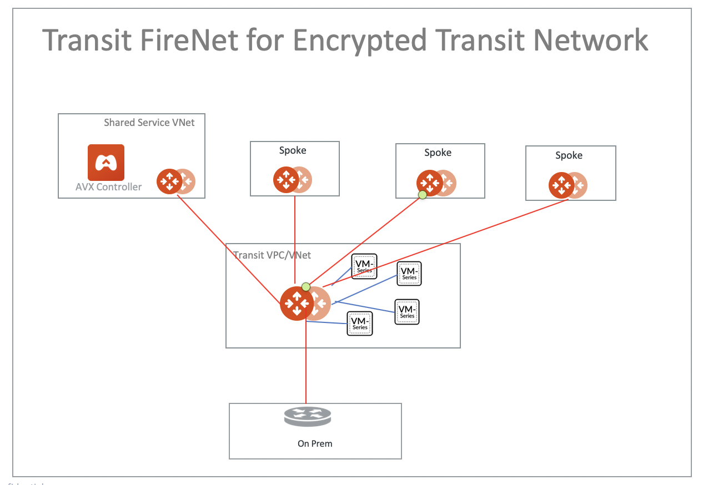
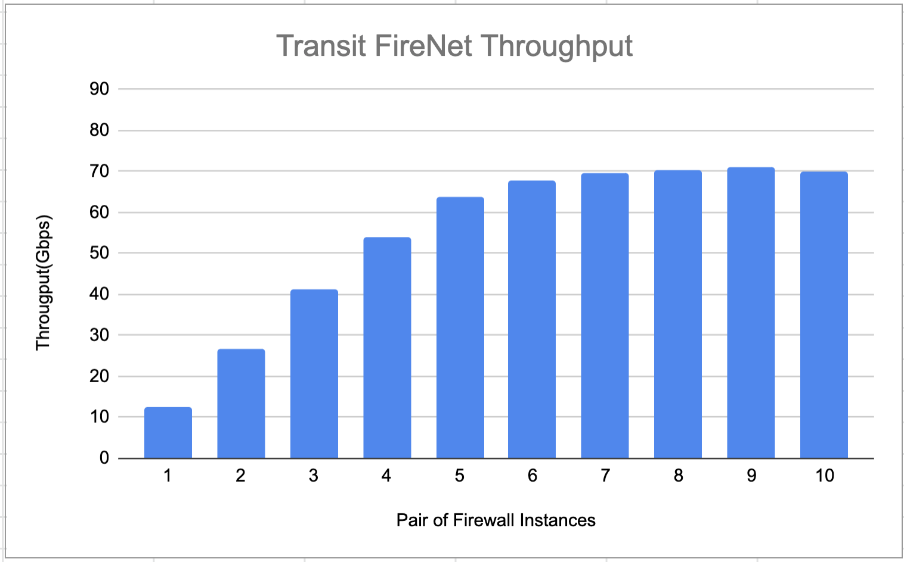
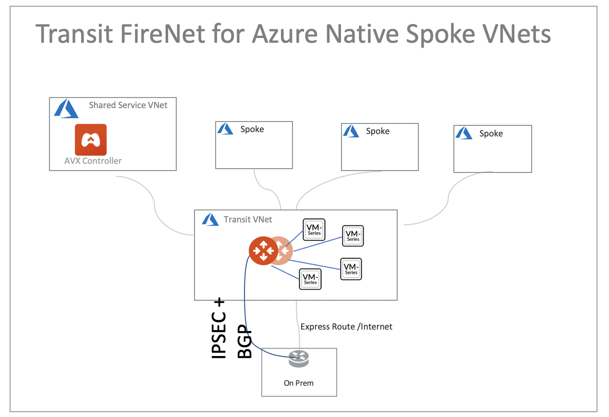
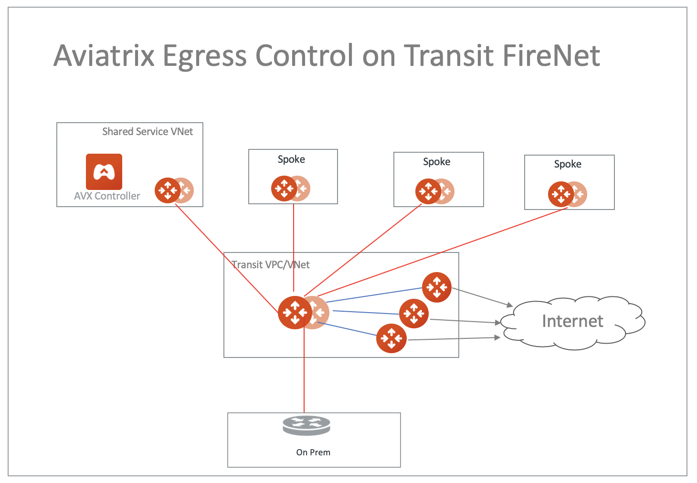

.. meta::
  :description: Firewall Network FAQ	
  :keywords: AWS Transit Gateway, AWS TGW, TGW orchestrator, Aviatrix Transit network, Firewall, DMZ, Cloud DMZ, Firewall Network, FireNet

=========================================================
Transit FireNet FAQ
=========================================================

What is the Aviatrix Transit FireNet for AWS & Azure?
----------------------------------------------------------

Aviatrix Transit FireNet allows you to deploy firewalls functions for the Aviatrix Encrypted 
Transit architecture. 
With Transit FireNet feature, the FireNet function is integrated into the Aviatrix Transit gateway. 

If you are looking for firewall functions deployment in AWS Transit Gateway environment, your starting point
is `here. <https://docs.aviatrix.com/HowTos/firewall_network_workflow.html>`_ 

The use case is to deploy firewalls in the `encrypted transit architecture <https://docs.aviatrix.com/HowTos/transitvpc_workflow.html>`_ 
for both AWS and Azure, as shown below. 

|transit_firenet|

When deployed in Azure, Transit FireNet also works when using Native Azure VNet Spokes, as shown below. 

|transit_firenet_vnet|

When deployed in Azure, only two firewall instances are supported.

Can multiple firewalls be supported in Transit FireNet?
--------------------------------------------------------------------------------------

Yes. Multiple firewall instances can be attached to Each Transit Gateway. The Transit Gateway load balances and forwards packets to the firewalls. 

How does Transit FireNet work?
--------------------------------

Transit FireNet works the same way as the Firewall Network where traffic in and out of the specified Spoke is forwarded to the firewall instances for
inspection or policy application. 

What is the minimum gateway instance size for Transit FireNet deployment?
----------------------------------------------------------------------------

The minimum gateway instance size is C5.xlarge. This is because the FireNet gateway requires 4 network 
interfaces: 

 - eth0 is a management interface
 - eth1 is not used
 - eth2 is the interface to the firewall instances 
 - eth3 is the interface to the HA FireNet gateway

What is the Transit FireNet performance?
-------------------------------------------

With a pair of c5n.18xlarge Aviatrix Transit Gateway, Transit FireNet achieves 70Gbps throughput with iperf3 benchmark, as shown in the diagram below. 

Note if a single c5n.18xlarge Aviatrix Transit Gateway is deployed, the throughput is about 40Gbps. This is because Aviatrix Encrypted Transit solution runs with ActiveMesh where both Transit Gateways do the packet forwarding. 

|transit_firenet_perf|

Which option should I choose for "Create a VPC" tool"?
----------------------------------------------------------

When using the Useful Tool to create the transit VPC for Transit FireNet deployment, select "Aviatrix FireNet VPC" option to create 4 public subnets. 

How do I configure FireNet?
---------------------------

Follow the `FireNet workflow <https://docs.aviatrix.com/HowTos/firewall_network_workflow.html>`_ to deploy firewall in the cloud. 

How do I enable Egress inspection on Transit FireNet?
--------------------------------------------------------

By default, FireNet inspects traffic between North South (on-prem and VPC) and East West (VPC to VPC). To enable
Egress traffic (Internet bound) inspection: 

Go to Firewall Network -> Advanced. Click the skewer. Scroll down to "Egress through Firewall" and click Enable.

.. Important::

  When Egress through Firewall is enabled, it applies to all Spoke VPCs. You do not need to configure individual VPC inspection policy.

Is Ingress Inspection supported on Transit FireNet?
----------------------------------------------------

Yes. You need to enable source NAT on the LAN Interface of the VM-Series.

How to exclude specific CIDRs from being inspected by the firewall?
--------------------------------------------------------------------

By default, FireNet inspects all East-West (VPC to VPC) traffic but you may have an instance in the VPC which you do not want to be inspected. For example, the Aviatrix Controller deployed in the Shared Service VPC to be excluded from inspection while Shared Service VPC traffic is inspected. This improves the Controller reachability by not subjecting the Controller access to unintentional firewall policy errors.

Go to **Firewall Network --> Advanced** and put the CIDRs in the field **"Network List Excluded From East-West Inspection"** to exclude from being inspected by the firewall.

.. Note::

    1. Maximum 20 CIDRs coma-separated are supported.
    2. CIDRs are excluded from East-West inspections only.
    3. In Transit FireNet, if Egress inspection is enabled, all the Egress traffic will get inspected by the firewall even for the CIDRs excluded for East-West inspection.

Can I deploy Aviatrix Egress Control FQDN gateway on Transit FireNet?
----------------------------------------------------------------------

Yes. Deploy Aviatrix FQDN gateway as shown in the diagram below. 

|transit_firenet_aviatrix_egress|

The instructions are described as the following. 

 1. `Enable Aviatrix Transit Gateway for Transit FireNet <https://docs.aviatrix.com/HowTos/transit_firenet_workflow.html#enable-transit-firenet-function>`_ 
 2. `Launch and associate Aviatrix FQDN gateway <https://docs.aviatrix.com/HowTos/firewall_network_workflow.html#c-launch-associate-aviatrix-fqdn-gateway>`_

Is there an example guide to setup Palo Alto VM-Series policies?
------------------------------------------------------------------

Yes. Follow `Example Config for Palo Alto VM-Series <https://docs.aviatrix.com/HowTos/config_paloaltoVM.html>`_ to 
setup an "ALLOW ALL" policy for test validation.

How do I test FireNet connectivity without deploying firewall instance?
-------------------------------------------------------------------------

You can test connectivity without deploying any firewall instances. When the FireNet gateway has no firewall instance 
attached to it for the data path, the FireNet gateway loops the received packet and forwards it to its destination.

Can VM-Series be launched with Bootstrap integration?
-------------------------------------------------------

Yes. When you launch a VM-Series from Aviatrix Controller console, you can select the option to launch the VM-Series instance with `bootstrap information. <https://docs.aviatrix.com/HowTos/firewall_network_workflow.html#example-configuration-for-bootstrap>`_

Can Firewall Network work with Panorama?
------------------------------------------

Yes. Follow the instructions for `Panorama integration. <https://docs.aviatrix.com/HowTos/paloalto_API_setup.html#managing-vm-series-by-panorama>`_

How does the Controller check Firewall instance health?
--------------------------------------------------------

For Palo Alto VM-Series, the Controller pings its management interface. 

For Check Point CloudGuard and Fortinet Fortigate, the Controller uses AWS API to check instance health. 

What is the failover time?
----------------------------

Aviatrix FireNet gateway failure detection time is 15 - 20 seconds. The switch over to alternative gateway (primary or backup) is about the same time. 

The Aviatrix Controller monitors the health of the firewall instances. For Pal Alto VM-Series, the Controller
uses Palo Alto API to periodically check the firewall instance health. The polling time is 10 seconds. However depending 
on how the instance fails, it can take over a minutes for the failure condition to be detected. For example, 
if you stop the instance from AWS console, it can take a minute before the API access fails. On the other hand, if the firewall instance interface is shutdown, the failure detection is 10 seconds.  

.. disqus::
