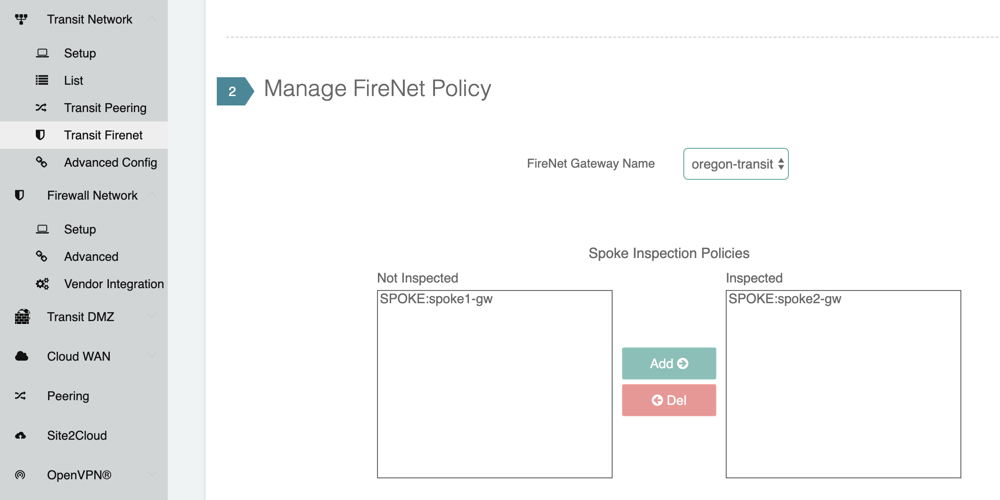
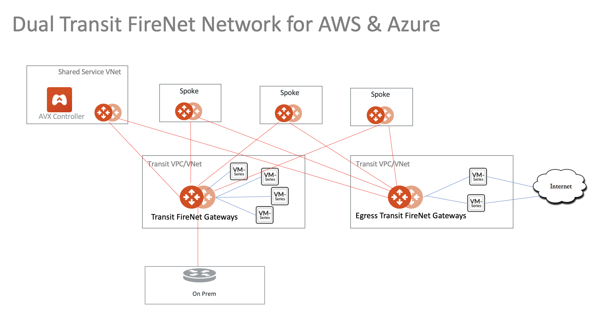
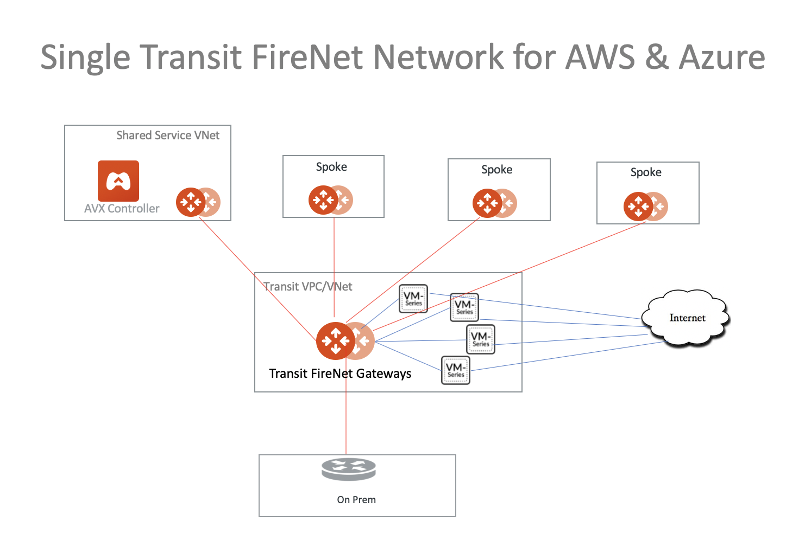

.. meta::
  :description: Firewall Network Workflow
  :keywords: AWS Transit Gateway, AWS TGW, TGW orchestrator, Aviatrix Transit network, Transit DMZ, Egress, Firewall, Firewall Network, FireNet

=========================================================
Transit FireNet  Workflow for AWS/Azure
=========================================================

To learn about Transit FireNet, check out `Transit FireNet FAQ. <https://docs.aviatrix.com/HowTos/transit_firenet_faq.html>`_ 

If you are looking deploying firewall networks in AWS TGW environment, your starting point is `here. <https://docs.aviatrix.com/HowTos/firewall_network_workflow.html>`_.

For a complete step by step guide, refer to `Transit FireNet on AWS Configuration Example Guide <https://docs.aviatrix.com/HowTos/transit_firenet_workflow_aws.html>`_. 

Prerequisite for AWS
---------------------

Transit FireNet builds on the Aviatrix Transit Network where Aviatrix gateways are deployed in both
the transit VPC and the spoke VPCs in AWS. Make sure the deployment meets the following specifications. 

  1. ActiveMesh must be enabled when launching the  Aviatrix Transit Gateway. 
  2. The minimum size of the Aviatrix Transit Gateway is c5.xlarge. 
  3. Aviatrix Transit Network must be in Connected mode. Go to Transit Network -> Advanced Config -> Connected Transit. Click Enable.

Follow the `Aviatrix Transit Network workflow <https://docs.aviatrix.com/HowTos/transitvpc_workflow.html>`_ to deploy Aviatrix Transit Gateways and at least one Spoke gateway. When complete, proceed to Step 1. 

Prerequisite for Azure
------------------------

Transit FireNet builds on the Aviatrix Transit Network solution where Aviatrix gateways are deployed
in Transit VNet and/or in Spoke VNet in Azure. Make sure the deployment meets the following 
specifications. 

  1. ActiveMesh must be enabled when launching the Aviatrix Transit Gateway.
  #. The minimum size of the Aviatrix Transit Gateway instance size is Standard_B2ms. 
  #. Select the option "Enable Transit FireNet" when launching the Aviatrix Transit Gateway. 
  #. Aviatrix Transit Network must be in Connected mode. Go to Transit Network -> Advanced Config -> Connected Transit. Click Enable.  

Follow the `Aviatrix Transit Network workflow <https://docs.aviatrix.com/HowTos/transitvpc_workflow.html>`_ to 
deploy Aviatrix Transit Gateways and attach at least one Spoke gateway or one Spoke VNet. When you are done, proceed to Step 1. 

1. Enable Transit FireNet Function
------------------------------------------------

A Transit FireNet Gateway is an Aviatrix Transit Gateway with FireNet service enabled. 

Starting from Release 6.0, A Aviatrix Spoke can be optionally attached to two Transit FireNet Gateways, one for east-west and north-south traffic inspection, and another for ingress/egress inspections. 

1a. Enable Transit FireNet on Aviatrix Transit Gateway
~~~~~~~~~~~~~~~~~~~~~~~~~~~~~~~~~~~~~~~~~~~~~~~~~~~~~~~~~

This step defines a set of Aviatrix Transit FireNet Gateways. 

In the drop down menu, select one Aviatrix Transit Gateway and click Enable. 

.. Note::

  For Azure deployment, Transit FireNet function is enabled when launching the gateway, skip this step. 

By default, east-west and north-south traffic inspections are enabled on Transit FireNet Gateways, you can also enable Ingress/Egress inspection on the Transit FireNet Gateways. To do so, go to Firewall Network -> Advanced -> click the 3 dots skewer of one FireNet gateway, 
enable Egress through firewall option. 

A deployment diagram in this option is shown as below:

|single_transit|

1b. Enable Transit FireNet on Aviatrix Egress Transit Gateway
~~~~~~~~~~~~~~~~~~~~~~~~~~~~~~~~~~~~~~~~~~~~~~~~~~~~~~~~~~~~~~

If you plan to use one set of Transit FireNet Gateways for all traffic types' inspection, skip this step. 

If a separate group of firewalls for Ingress/Egress traffic inspection is required, you need to deploy a second set of Aviatrix Transit Gateways 
called Aviatrix Egress Transit Gateway, shown as the diagram below.

|dual_transit|

This step defines a set of Aviatrix Egress Transit FireNet Gateways. The HA Aviatrix Egress Transit FireNet Gateway is automatically enabled in this step.

2. Manage Transit FireNet Policy
--------------------------------------

Select an Aviatrix Transit Gateway that you enabled for FireNet function in the previous step. 

On the left side of the panel, highlight one Spoke VPC/VNet for inspection and click Add. The selected Spoke VPC/VNet should appear on the right side panel. 

For example, if traffic going in and out of VPC Spoke2 where Spoke2-gw is deployed should be inspected, move the Spoke2-gw to the right, as shown below. 

|transit_firenet_policy|

For specify more VPC/VNets for inspection, repeat this step. 

3. Deploy Firewall Instances
-------------------------------

Go to Firewall Network -> Setup -> Deploy Firewall Network, follow the `deployment instructions <https://docs.aviatrix.com/HowTos/firewall_network_workflow.html#a-launch-and-associate-firewall-instance>`_ to launch one or more firewall instances. 

4. Enable Firewall Management Access
--------------------------------------

When this option is configured, Aviatrix Transit Gateway advertises the transit VPC CIDR to on-prem. 

The use case is if a firewall management console, such as Palo Alto Networks Panorama is deployed on-prem, the Panorama can access the firewalls of their private IP addresses with this option configured. 

5. Delete Function
------------------------------------------

In the drop menu, select one Aviatrix Transit Gateway with FireNet function to disable it.  

5a. Disable Transit FireNet on Aviatrix Transit Gateway
~~~~~~~~~~~~~~~~~~~~~~~~~~~~~~~~~~~~~~~~~~~~~~~~~~~~~~~~~~~~~~~~~~~

Select a Transit FireNet gateway to disable the function. 

5b. Disable Transit FireNet on Aviatrix Egress Transit Gateway
~~~~~~~~~~~~~~~~~~~~~~~~~~~~~~~~~~~~~~~~~~~~~~~~~~~~~~~~~~~~~~~~

If Aviatrix Egress Transit Gateway has been configured, select one to disable the function.   

.. disqus::
