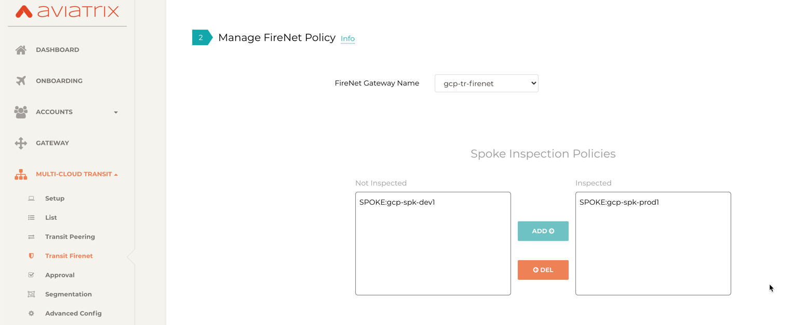
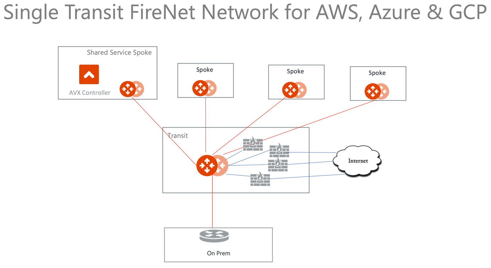
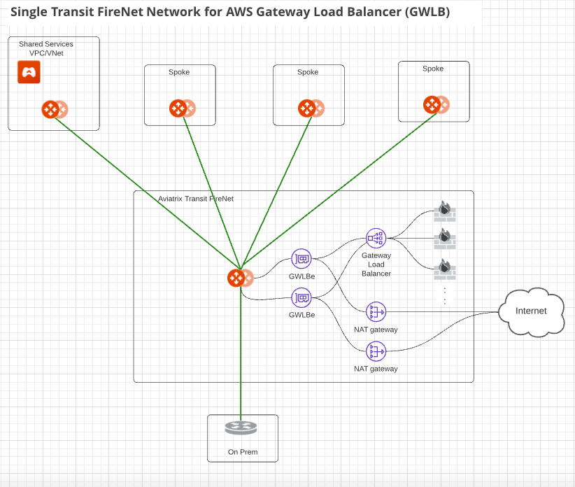

.. meta::
  :description: Firewall Network Workflow
  :keywords: AWS Transit Gateway, AWS TGW, TGW orchestrator, Aviatrix Transit network, Transit DMZ, Egress, Firewall, Firewall Network, FireNet, AWS GWLB, Azure Load Balancer, Azure LB, Gateway Load balancer, GCP, GCP FireNet, Azure FireNet, GCP ILB

=========================================================
Transit FireNet Workflow for AWS, Azure, GCP, and OCI
=========================================================

If you are looking deploying firewall networks in AWS TGW environment, your starting point is `here <https://docs.aviatrix.com/HowTos/firewall_network_workflow.html>`_.

To learn about Transit FireNet, check out `Transit FireNet FAQ. <https://docs.aviatrix.com/HowTos/transit_firenet_faq.html>`_ 

* For a complete step-by-step guide on AWS for Transit FireNet, refer to `Transit FireNet on AWS Configuration Example Guide <https://docs.aviatrix.com/HowTos/transit_firenet_workflow_aws.html>`_. 
* For a complete step-by-step guide on AWS for Transit FireNet with AWS Gateway Load Balancer (GWLB), refer to `Transit FireNet Workflow with AWS Gateway Load Balancer (GWLB) <https://docs.aviatrix.com/HowTos/transit_firenet_workflow_aws_gwlb.html>`_. 
* For a complete step-by-step guide on Azure for Transit FireNet, refer to `Transit FireNet on Azure Configuration Example Guide <https://docs.aviatrix.com/HowTos/transit_firenet_workflow_azure.html>`_.
* For a complete step-by-step guide on GCP for Transit FireNet, refer to `Transit FireNet on GCP Configuration Example Guide <https://docs.aviatrix.com/HowTos/transit_firenet_workflow_gcp.html>`_.
* For a complete step-by-step guide on OCI for Transit FireNet, refer to `Transit FireNet on OCI Configuration Example Guide <https://docs.aviatrix.com/HowTos/transit_firenet_workflow_oci.html>`_.

Prerequisite for AWS
----------------------------------

Transit FireNet builds on the Aviatrix Transit Network where Aviatrix Gateways are deployed in both
the transit VPC and the spoke VPCs in AWS. Make sure the deployment meets the following specifications. 

  1. ActiveMesh must be enabled when launching the Aviatrix Transit Gateway. 
  2. The minimum size of the Aviatrix Transit Gateway is c5.xlarge. 
  3. Aviatrix Transit Network must be in Connected mode. Go to Transit Network > Advanced Config > Connected Transit. Click **Enable**.

Follow the `Aviatrix Transit Network workflow <https://docs.aviatrix.com/HowTos/transitvpc_workflow.html>`_ to deploy Aviatrix Transit Gateways and at least one Spoke Gateway. When complete, proceed to Step 1. 

Prerequisite for Azure
-------------------------------------

Transit FireNet builds on the Aviatrix Transit Network solution where Aviatrix Gateways are deployed
in Transit VNet and/or in Spoke VNet in Azure. Make sure the deployment meets the following 
specifications. 

  1. ActiveMesh must be enabled when launching the Aviatrix Transit Gateway.
  #. The minimum size of the Aviatrix Transit Gateway instance size is Standard_B2ms. 
  #. Select the **Enable Transit FireNet** option when launching the Aviatrix Transit Gateway. 
  #. Aviatrix Transit Network must be in Connected mode. Go to Transit Network > Advanced Config > Connected Transit. Click **Enable**.  

Follow the `Aviatrix Transit Network workflow <https://docs.aviatrix.com/HowTos/transitvpc_workflow.html>`_ to 
deploy Aviatrix Transit Gateways and attach at least one Spoke Gateway or one Spoke VNet. When you are done, proceed to Step 1. 

Prerequisite for GCP
------------------------

Transit FireNet builds on the Aviatrix Transit Network solution where Aviatrix Gateways are deployed
in Transit VPC and/or in Spoke VPC in GCP. Make sure the deployment meets the following
specifications.

  1. ActiveMesh must be enabled when launching the Aviatrix Transit Gateway.
  #. Minimum four VPCs will be required for GCP FireNet solution with Palo Alto VM-series and all VPCs should be in same region.
  #. The minimum size of the Aviatrix Transit Gateway instance size is n1-standard_1.
  #. Select the **Enable Transit FireNet** option when launching the Aviatrix Transit Gateway.
  #. Aviatrix Transit Network must be in Connected mode. Go to Transit Network > Advanced Config > Connected Transit. Click **Enable**.

Follow the `Aviatrix Transit Network workflow <https://docs.aviatrix.com/HowTos/transitvpc_workflow.html>`_ to
deploy Aviatrix Transit Gateways and attach at least one Spoke Gateway or one Spoke VNet. When you are done, proceed to Step 1.

Prerequisite for OCI
-----------------------------

Transit FireNet builds on the Aviatrix Transit Network solution where Aviatrix Gateways are deployed in Transit VCN and/or in Spoke VCN in OCI.

Make sure the deployment meets the following specifications:

  1. ActiveMesh must be enabled when launching the Aviatrix Transit Gateway.
  #. Select the **Enable Transit FireNet** option when launching the Aviatrix Transit Gateway.
  #. Aviatrix Transit Gateway minimum instance size should be VM.Standard2.4 or more.

Follow the `Aviatrix Transit Network workflow <https://docs.aviatrix.com/HowTos/transitvpc_workflow.html>`_ to
deploy Aviatrix Transit Gateways and attach at least one Spoke Gateway. When you are done, proceed to Step 1.

.. Note::

  Transit FireNet Insane mode is not supported in Release 6.4.
  

Enabling Transit FireNet Function
------------------------------------------------

A Transit FireNet Gateway is an Aviatrix Transit Gateway with FireNet service enabled. 

Starting from Release 6.0, an Aviatrix Spoke can be optionally attached to two Transit FireNet Gateways, one for east-west and north-south traffic inspection, and another for ingress/egress inspections.

Enabling Transit FireNet on Aviatrix Transit Gateway
~~~~~~~~~~~~~~~~~~~~~~~~~~~~~~~~~~~~~~~~~~~~~~~~~~~~~~~~~

This step defines a set of Aviatrix Transit FireNet Gateways. 

In the dropdown menu, select one Aviatrix Transit Gateway and click **Enable**. 

.. Note::

  For Azure and GCP deployment, Transit FireNet function is enabled when launching the gateway, skip this step.

By default, east-west and north-south traffic inspections are enabled on Transit FireNet Gateways, you can also enable Ingress/Egress inspection on the Transit FireNet Gateways. To do so, go to Firewall Network > Advanced > click the 3 dots skewer of one FireNet Gateway, 
enable Egress through firewall option. 

A deployment diagram in this option is shown as below:

|single_transit_new|

Starting 6.3, Aviatrix Transit FireNet solution is also supporting AWS Gateway Load Balancer (AWS GWLB).

In order to use the Aviatrix Transit FireNet solution with AWS GWLB, select one Aviatrix Transit Gateway deployed in AWS from the  dropdown menu, check the box "Use AWS GWLB" and click "Enable".

.. note::

    IAM policies needs to be updated for ingress/egress traffic. Go to Aviatrix Controller > Accounts > Access Accounts  > Select AWS Account and click **Update Policy**.

.. important::

    Transit FireNet solution with GWLB also requires HTTPS port enable on firewall appliance to check the firewall health status at regular interval. Click `here <https://docs.aviatrix.com/HowTos/transit_firenet_workflow_azure.html#step-9-enable-health-check-policy-in-firewall>`_ for more information.

By default, east-west and north-south traffic inspections are enabled on Transit FireNet Gateways, you can also enable Ingress/Egress inspection on the Transit FireNet Gateways. To do so, go to Firewall Network > Advanced > click the 3 dots skewer of one FireNet Gateway,
enable Egress through firewall option.

A deployment diagram in this option is shown as below:

|gwlb_tr_firenet|

Enabling Transit FireNet on Aviatrix Egress Transit Gateway
~~~~~~~~~~~~~~~~~~~~~~~~~~~~~~~~~~~~~~~~~~~~~~~~~~~~~~~~~~~~~~

If you plan to use one set of Transit FireNet Gateways for all traffic types' inspection, skip this step. 

If a separate group of firewalls for Ingress/Egress traffic inspection is required, you need to deploy a second set of Aviatrix Transit Gateways 
called Aviatrix Egress Transit Gateway, shown as the diagram below.

|dual_transit|

This step defines a set of Aviatrix Egress Transit FireNet Gateways. The HA Aviatrix Egress Transit FireNet Gateway is automatically enabled in this step.

Managing Transit FireNet Policy
--------------------------------------

Select an Aviatrix Transit Gateway that you enabled for FireNet function in the previous step. 

On the left side of the panel, highlight one Spoke VPC/VNet for inspection and click **Add**. The selected Spoke VPC/VNet should appear on the right panel. 

For example, if traffic going in and out of VPC/VNet PROD1 where gcp-spk-prod1-gw is deployed should be inspected, move the gcp-spk-prod1-gw to the right, as shown below.

|transit_firenet_policy_new|

For specify more VPC/VNets for inspection, repeat this step. 

Deploying Firewall Instances
--------------------------------------

Go to Firewall Network > Setup > Deploy Firewall Network, follow the `deployment instructions <https://docs.aviatrix.com/HowTos/firewall_network_workflow.html#a-launch-and-associate-firewall-instance>`_ to launch one or more firewall instances. 

Enabling Firewall Management Access
-----------------------------------------------------

When this option is configured, Aviatrix Transit Gateway advertises the transit VPC/VNet CIDR to on-prem. 

The use case is if a firewall management console, such as Palo Alto Networks Panorama is deployed on-prem, the Panorama can access the firewalls of their private IP addresses with this option configured. 

Deleting Function
------------------------------------------

In the dropdown menu, select one Aviatrix Transit Gateway with FireNet function to disable it.  

Disabling Transit FireNet on an Aviatrix Transit Gateway
~~~~~~~~~~~~~~~~~~~~~~~~~~~~~~~~~~~~~~~~~~~~~~~~~~~~~~~~~~~~~~~~~~~

Select a Transit FireNet Gateway to disable the function. 

Disabling Transit FireNet on an Aviatrix Egress Transit Gateway
~~~~~~~~~~~~~~~~~~~~~~~~~~~~~~~~~~~~~~~~~~~~~~~~~~~~~~~~~~~~~~~~

If Aviatrix Egress Transit Gateway has been configured, select one to disable the function.   

.. |dual_transit| image:: transit_firenet_workflow_media/dual_transit.png
   :scale: 40%

.. disqus::
