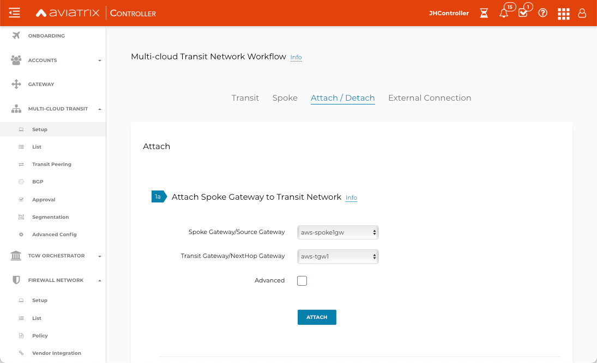

.. meta::
  :description: Firewall Network Workflow
  :keywords: AWS Transit Gateway, AWS TGW, TGW orchestrator, Aviatrix Transit network, Transit DMZ, Egress, Firewall, Firewall Network, FireNet

=========================================================
Transit FireNet Workflow for AWS
=========================================================

Aviatrix Transit FireNet allows you to deploy firewall functions for the Aviatrix Multi-Cloud transit architecture. The Transit FireNet feature is integrated into the Aviatrix Transit gateway.

To learn about Transit FireNet, look at the `Transit FireNet FAQ. <https://docs.aviatrix.com/HowTos/transit_firenet_faq.html>`_

If you want to deploy firewall networks in an AWS Transit Gateway (TGW) environment, your starting point is `here. <https://docs.aviatrix.com/HowTos/firewall_network_workflow.html>`_.

In this example, a transit VPC with Aviatrix Gateways will be deployed, and two Spoke Gateways (DEV and PROD) will be attached to it.

The transit VPC will have a firewall of supported vendors (Checkpoint, Palo Alto Networks and Fortinet etc.) deployed within it. Please see the diagram below for more details.

Once the infrastructure is in place you create a policy to inspect the east-west and north-south traffic.

|avx_tr_firenet_topology|

Create VPCs
*************

VPCs can be created manually on AWS or directly from the Aviatrix Controller.

In this example, VPCs are created following the Useful Tools `Create a VPC <https://docs.aviatrix.com/HowTos/create_vpc.html>`_ guidelines.

1.	Login to the Aviatrix Controller with a username and password.
#.	Navigate to Useful Tools -> Create A VPC.
#. Select AWS as the Cloud Type.
#.	Add one VPC for Transit FireNet Gateway and select the **Aviatrix FireNet VPC** option as shown below.
#.  Create two more VPCs with no option/checkbox selected for Spoke Gateways.

|create_vpc|

Deploy the Transit Aviatrix Gateway
************************************

Transit Aviatrix Gateway can be deployed using the `Transit Gateway Workflow <https://docs.aviatrix.com/HowTos/transitvpc_workflow.html#launch-a-transit-gateway>`_.

Prerequisite for AWS
~~~~~~~~~~~~~~~~~~~~~

Transit FireNet builds on the Aviatrix Transit Network where Aviatrix gateways are deployed in both the transit VPC and the spoke VPCs in AWS. ActiveMesh is enabled by default.

Make sure the deployment meets the following specifications:

1.	The minimum size of the Aviatrix Transit Gateway is c5.xlarge.
#.	The Aviatrix Transit Network must be in Connected mode. Go to Transit Network -> Advanced Config -> Connected Transit and click Enable.

Procedure
~~~~~~~~~~

1. Navigate to Multi-Cloud Transit -> Setup -> Transit -> #1 Launch an Aviatrix Transit Gateway.
#. Enter a Gateway Name.
#. Select the AWS Access Account Name.
#. Select a region.
#. Select the VPC ID of the AWS Transit VPC.
#. Choose the **c5x.large** gateway size.
#. Select the Public Subnet.
#. Enable Insane Mode Encryption for higher throughputs (optional).
#. Enable the Transit FireNet Function. 
#. Enable Transit VPC GW HA by navigating to Multi-Cloud Transit -> Setup -> Transit -> #2 (Optional) Enable HA to an Aviatrix Transit Gateway.

.. note::
    The c5.xlarge instance size will be required for Insane Mode Encryption (for higher throughput).

Please see an example below for Transit FireNet GW:

|tr_firenet_gw|

Deploy Spoke Gateways
**********************

Now that we have an Aviatrix Transit Gateway, we can deploy Aviatrix Spoke Gateways in the spoke VPCs using `Aviatrix Spoke Gateway Workflow <https://docs.aviatrix.com/HowTos/transitvpc_workflow.html#launch-a-spoke-gateway>`_.

1.	Navigate to Multi-Cloud Transit -> Setup -> Spoke -> #1 Launch an Aviatrix Spoke Gateway.
#.	Deploy a Spoke Gateway (GW) in each of the spoke VPCs using defaults, ensuring that you choose the correct Account and VPC information.
#.	Choose the Public Subnet.
#.	Enable Spoke Gateway HA by navigating to Multi-Cloud Transit -> Setup -> Spoke -> #5 (Optional) Enable/Disable HA to an Aviatrix Spoke Gateway.

.. note::
    The c5.xlarge instance size will be required for Insane Mode Encryption (for higher throughput).

|launch_spk_gw|

Attach Spoke Gateways to Transit Network
****************************************

Now that the Transit and spoke gateways are deployed, you must connect them.

1.	Navigate to Multi-Cloud Transit -> Setup -> Attach/Detach -> #1a Attach Spoke Gateway to Transit Network.
#.	Select one spoke at a time and attach to the Transit gateway.

|attach_spk_trgw|

.. note::
    The Transit gateway is attached to Spoke gateways, but by default, the Transit gateway will not route traffic between Spoke gateways.

Enable Connected Transit
************************

By default, spoke VPCs are in isolated mode where the Transit will not route traffic between them. To allow the Spoke VPCs to communicate with each other, you must enable Connected Transit by navigating to Multi-Cloud Transit -> Advanced Config. Select the Transit Gateway and toggle Connected Transit to **Enabled**.

|connected_transit|

Configure Transit Firewall Network
***********************************

Now that Transit and Spoke gateways have been deployed, you must deploy and enable the firewall for traffic inspection.

1.	Navigate to Firewall Network -> Setup -> #3a Enable Transit FireNet on Aviatrix Transit Gateway.
#.	Choose the Gateway Name and click **“Enable”**.

|en_tr_firenet|

3.	Navigate to Firewall Network -> Policy -> Manage FireNet Policy.
#.	Add spokes to the Inspected box for traffic inspection.

.. note::
    By default, FireNet inspects ingress (INET to VPC) and east-west traffic (VPC to VPC) only.

|tr_firenet_policy|

Subscribe to Firewall Vendor in AWS Marketplace
***********************************************

At this point, FireNet functionality on Transit Gateway is enabled and the FireNet policy is created for spokes. You can now subscribe to the firewall vendor and deploy the firewall.

As indicated in the Aviatrix Controller at Firewall Network -> Setup -> Firewall, you must subscribe to the supported firewall vendor in your AWS marketplace using an access account onboarded to the Controller.

.. note::
    Please subscribe to the firewall, but do not launch the firewall.

|subscribe_firewall|

Launch and Associate Firewall Instance
**************************************

This approach is recommended if this is the first firewall instance to be attached to the gateway.

This step launches a Firewall instance and associates it with one of the FireNet gateways.

.. important::

    The Firewall instance and the associated Aviatrix FireNet gateway above must be in the same AZ, and, we recommend that the Management Interface Subnet and Egress (untrust dataplane) Interface Subnet not be in the same subnet.

Launch and Attach
~~~~~~~~~~~~~~~~~~~

In the Aviatrix Controller navigate to Firewall Network -> Setup -> Firewall -> Step 2a. Provide all the required input as shown in the table and click **"Launch"**.

.. important::
    The vendor's firewall may take some time after launch to be available.

==========================================      ==========
**Setting**                                     **Value**
==========================================      ==========
VPC ID                                          The Security VPC created in Step 1.
Gateway Name                                    The primary FireNet gateway.
Firewall Instance Name                          The name that will be displayed on AWS Console.
Firewall Image                                  The AWS AMI that you have subscribed in Step 2.
Firewall Image Version                          Firewall instance current supported software versions.
Firewall Instance Size                          Firewall instance type.
Management Interface Subnet.                    Select the subnet whose name contains "gateway and firewall management"
Egress Interface Subnet                         Select the subnet whose name contains "FW-ingress-egress".
Username                                        Applicable to Azure deployment only. "admin" as a username is not accepted.
Password                                        Applicable to Azure deployment only.
Key Pair Name (Optional)                        The .pem file name for SSH access to the firewall instance.
Attach (Optional)                               By selecting this option, the firewall instance is inserted in the data path to receive packet. If this is the second firewall instance for the same gateway and you have an operational FireNet deployment, you should not select this option as the firewall is not configured yet. You can attach the firewall instance later at Firewall Network -> Advanced page.
Advanced (Optional)                             Click this selection to allow Palo Alto firewall bootstrap files to be specified.
IAM Role                                        In advanced mode, create an IAM Role on the AWS account that launched the FireNet gateway. Create a policy to attach to the role. The policy is to allow access to "Bootstrap Bucket".
Bootstrap Bucket Name                           In advanced mode, specify a bootstrap bucket name where the initial configuration and policy file is stored.
==========================================      ==========

1. Check Point Specification
~~~~~~~~~~~~~~~~~~~~~~~~~~~~~~~~~~~~~~~~~~~

The Check Point Firewall instance has two interfaces as described below.

========================================================         ===============================          ================================
**CheckPoint VM instance interfaces**                             **Description**                          **Inbound Security Group Rule**
========================================================         ===============================          ================================
eth0 (on subnet -Public-FW-ingress-egress-AZ-a)                  Egress or Untrusted interface            Allow ALL
eth1 (on subnet -dmz-firewall)                                   LAN or Trusted interface                 Allow ALL (Do not change)
========================================================         ===============================          ================================

Note that firewall instance eth1 is on the same subnet as FireNet gateway eth2 interface.

.. important::

     Starting in Release 5.4, launching Check Point firewall instances from the Aviatrix Controller automatically initiates its onboarding process. For initial login information, go to `Credentials for Checkpoint Initial Login <https://aviatrix.zendesk.com/hc/en-us/articles/4417552852109>`_. You must be registered to access the Aviatrix Customer Support website. If you are not already registered, you can sign-up at https://support.aviatrix.com.

.. note::
    Repeat Step 2a to launch the second firewall instance to associate with the HA FireNet gateway. Or repeat this step to launch more firewall instances to associate with the same FireNet gateway.

Follow `Check Point Example <https://docs.aviatrix.com/HowTos/config_CheckPointVM.html#example-config-for-check-point-vm-in-aws>`_ to launch Check Point security gateway in AWS and for more details.

2. Palo Alto VM-Series Specifications
~~~~~~~~~~~~~~~~~~~~~~~~~~~~~~~~~~~~~~~~~~~

Palo instance has three interfaces as described below.

========================================================         ===============================          ================================
**Palo Alto VM instance interfaces**                             **Description**                          **Inbound Security Group Rule**
========================================================         ===============================          ================================
eth0 (on subnet -Public-FW-ingress-egress-AZ-a)                  Egress or Untrusted interface            Allow ALL
eth1 (on subnet -Public-gateway-and-firewall-mgmt-AZ-a)          Management interface                     Allow SSH, HTTPS, ICMP, TCP 3978
eth2 (on subnet -dmz-firewall)                                   LAN or Trusted interface                 Allow ALL (Do not change)
========================================================         ===============================          ================================

Note that firewall instance eth2 is on the same subnet as FireNet gateway eth2 interface.

.. important::

    For Panorama managed firewalls, you need to prepare Panorama first and then launch a firewall. Look at `Setup Panorama <https://docs.aviatrix.com/HowTos/paloalto_API_setup.html#managing-vm-series-by-panorama>`_. When a VM-Series instance is launched and connected with Panorama, you need to apply a one time "commit and push" from the Panorama console to sync the firewall instance and Panorama.

.. Tip::

    If VM-Series are individually managed and integrated with the Aviatrix Controller, you can still use Bootstrap to save initial configuration time. Export the first firewall's configuration to bootstrap.xml, create an IAM role and Bootstrap bucket structure as indicated above, then launch additional firewalls with IAM role and the S3 bucket name to save the time of the firewall manual initial configuration.

Follow `Palo Alto Network (VM Series) Example <https://docs.aviatrix.com/HowTos/config_paloaltoVM.html#example-config-for-palo-alto-network-vm-series>`_ to launch VM Series firewall in AWS and for more details.

3. FortiGate Specifications
~~~~~~~~~~~~~~~~~~~~~~~~~~~~~~~~~~~~~~~~~~~

FortiGate Next Generation Firewall instance has two interfaces as described below.

========================================================         ===============================          ================================
**Fortigate VM instance interfaces**                             **Description**                          **Inbound Security Group Rule**
========================================================         ===============================          ================================
eth0 (on subnet -Public-FW-ingress-egress-AZ-a)                  Egress or Untrusted interface            Allow ALL
eth1 (on subnet -dmz-firewall)                                   LAN or Trusted interface                 Allow ALL (Do not change)
========================================================         ===============================          ================================

.. note::
    Firewall instance eth1 is on the same subnet as FireNet gateway eth2 interface.

.. tip::
    Starting from Release 5.4, Fortigate bootstrap configuration is supported.

Follow `Fortigate Example <https://docs.aviatrix.com/HowTos/config_FortiGateVM.html#example-config-for-fortigate-vm-in-aws>`_ to launch Fortigate in AWS and for more details.

Associate an Existing Firewall Instance
****************************************

This step is the alternative step to launching and associating a firewall instance as per above. If you already launched the firewall (Check Point, Palo Alto Network or Fortinet) instance from AWS Console, you can still associate it with the FireNet gateway.

In the Aviatrix Controller, navigate to Firewall Network -> Setup -> Firewall -> Step 2b and associate a firewall with the correct FireNet Gateway.

Example Setup for "Allow All" Policy
*************************************

After a firewall instance is launched, wait 5 to 15 minutes for it to come up. Time varies for each firewall vendor.
In addition, please follow example configuration guides as per below to build a simple policy on the firewall instance for a test validation that traffic is indeed being routed to the firewall instance.

Palo Alto Network (PAN)
~~~~~~~~~~~~~~~~~~~~~~~~~~~

For basic configuration, please refer to `example Palo Alto Network configuration guide <https://docs.aviatrix.com/HowTos/config_paloaltoVM.html>`_.

For implementation details on using Bootstrap to launch and initiate VM-Series, refer to `Bootstrap Configuration Example <https://docs.aviatrix.com/HowTos/bootstrap_example.html>`_.

FortiGate (Fortinet)
~~~~~~~~~~~~~~~~~~~~~~~~~~

For basic configuration, please refer to `example Fortinet configuration guide <https://docs.aviatrix.com/HowTos/config_FortiGateVM.html>`_.

Check Point
~~~~~~~~~~~~~~~~

For basic configuration, please refer to `example Check Point configuration guide <https://docs.aviatrix.com/HowTos/config_CheckPointVM.html>`_.

(Optional) Vendor Firewall Integration
*****************************************

Vendor integration dynamically updates firewall route tables. The use case is for networks with non-RFC 1918 routes that require specific route table programming on the firewall appliance.

1. In the Aviatrix Controller, navigate to Firewall Network -> Vendor Integration -> Firewall. Select the Firewall Vendor Type and fill in the details of your firewall instance.
2.	Click Save.
3. You can click Show or Sync to show the integration details or sync the configuration with the firewall.

Verification
**************

There are multiple ways to verify if Transit FireNet is configured properly:

    1.	Aviatrix Flightpath - Control-plane Test
    #.	Ping/Traceroute Test between Spoke VPCs (East-West) - Data-plane Test

Flight Path Test for FireNet Control-Plane Verification
~~~~~~~~~~~~~~~~~~~~~~~~~~~~~~~~~~~~~~~~~~~~~~~~~~~~~~~~~

Flight Path is a powerful troubleshooting Aviatrix tool which allows users to validate the control-plane and gives visibility of end to end packet flow.

    1.	In the Aviatrix Controller, navigate to Troubleshoot-> Flight Path.
    #.	Provide the Source and Destination Region and VPC information.
    #.	Select ICMP and Private subnet, and run the test.

.. note::
    An EC2 VM instance will be required in AWS, and ICMP should be allowed in the security group.

Ping/Traceroute Test for FireNet Data-Plane Verification
~~~~~~~~~~~~~~~~~~~~~~~~~~~~~~~~~~~~~~~~~~~~~~~~~~~~~~~~~~

Once control-plane is established and no problems are found in security and routing polices, data-plane validation needs to be verified to make sure traffic is flowing and not blocking anywhere.

There are multiple ways to check the data-plane:
    1. SSH to Spoke EC2 instance  (e.g. DEV1-VM) and ping other Spoke EC2 to instance (e.g PROD1-VM) to make sure no traffic loss in the path.
    2. Ping/traceroute capture can also be performed from Aviatrix Controller. Navigate to Troubleshoot -> Diagnostics and perform the test.

.. |subscribe_firewall| image:: transit_firenet_workflow_media/transit_firenet_AWS_workflow_media/subscribe_firewall.png
   :scale: 25%

.. |avx_tr_firenet_topology| image:: transit_firenet_workflow_media/transit_firenet_AWS_workflow_media/avx_tr_firenet_topology.png
   :scale: 25%

.. |create_vpc| image:: transit_firenet_workflow_media/transit_firenet_AWS_workflow_media/create_vpc.png
   :scale: 25%

.. |tr_firenet_gw| image:: transit_firenet_workflow_media/transit_firenet_AWS_workflow_media/tr_firenet_gw.png
   :scale: 25%

.. |launch_spk_gw| image:: transit_firenet_workflow_media/transit_firenet_AWS_workflow_media/launch_spk_gw.png
   :scale: 25%

.. |connected_transit| image:: transit_firenet_workflow_media/transit_firenet_AWS_workflow_media/connected_transit.png
   :scale: 25%

.. disqus::
