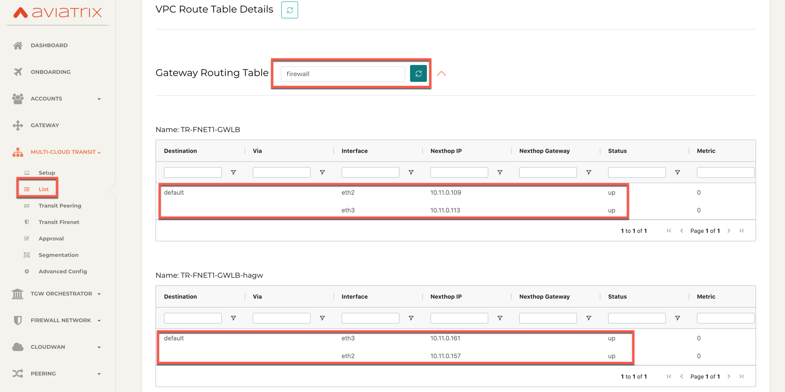
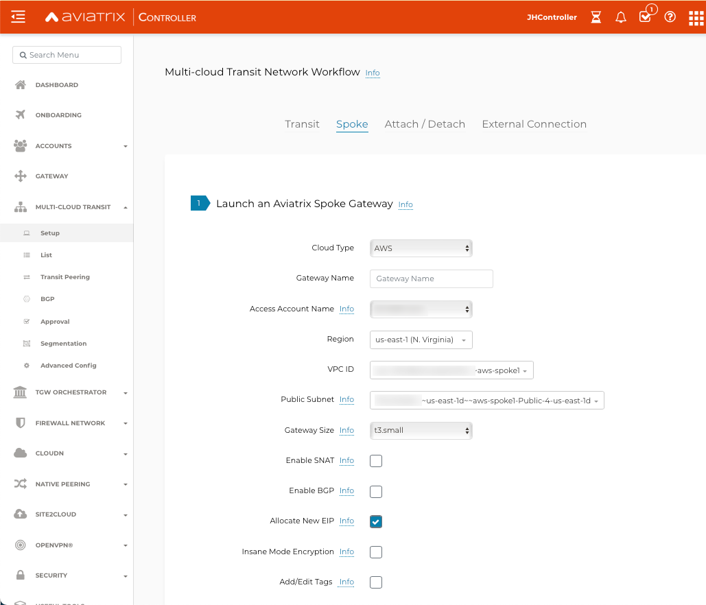
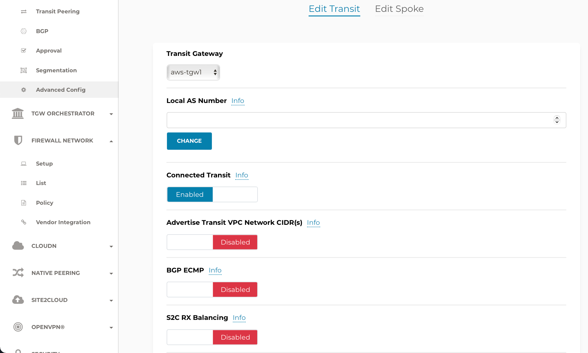

.. meta::
  :description: Firewall Network Workflow
  :keywords: AWS Transit Gateway, AWS TGW, TGW orchestrator, Aviatrix Transit network, GWLB, Egress, Firewall, Firewall Network, FireNet, AGW, GWLBe

==============================================================
Transit FireNet Workflow with AWS Gateway Load Balancer (GWLB)
==============================================================

Starting 6.3, Aviatrix Transit FireNet solution allows you to deploy firewalls functions with AWS Gateway Load Balancer.

To learn about Transit FireNet, check out `Transit FireNet FAQ. <https://docs.aviatrix.com/HowTos/transit_firenet_faq.html>`_

If you are looking deploying firewall networks in AWS Transit Gateway (TGW) environment, your starting point is `here. <https://docs.aviatrix.com/HowTos/firewall_network_workflow.html>`_.

In this example, Transit VPC with Aviatrix Gateways will be deployed, and two Spoke Gateways (DEV and PROD) will be attached to it as shown below:

|topology_trfnet_with_gwlb|

Step 1 : Create VPCs
***************************

VPCs can be created manually on AWS or directly from Aviatrix Controller.

Aviatrix controller has set of useful tools available for users and in this example, VPCs are created following the Useful Tools `Create a VPC <https://docs.aviatrix.com/HowTos/create_vpc.html>`_ guidelines.

1.	Login to the Aviatrix Controller with username and password
#.	Navigate to **Useful Tools -> Create A VPC**
#.	Add one VPC for Transit FireNet Gateway and select **Aviatrix FireNet VPC** option as shown below.
#.  Create two more VPCs with **no option/checkbox** selected for Spoke Gateways.

|create_vpc|

Step 2: Deploy the Transit Aviatrix Gateway
***************************************************

Transit Aviatrix Gateway can be deployed using the `Transit Gateway Workflow <https://docs.aviatrix.com/HowTos/transitvpc_workflow.html#launch-a-transit-gateway>`_

Prerequisite for AWS
~~~~~~~~~~~~~~~~~~~~~~~~~~~

Transit FireNet builds on the Aviatrix Transit Network where Aviatrix gateways are deployed in both the transit VPC and the spoke VPCs in AWS.

Make sure the deployment meets the following specifications:

1.	ActiveMesh must be enabled when launching the Aviatrix Transit Gateway.
#.	The minimum size of the Aviatrix Transit Gateway is c5.xlarge.
#.	Aviatrix Transit Network must be in Connected mode. Go to Transit Network -> Advanced Config -> Connected Transit. Click Enable.

Procedure
~~~~~~~~~~~~~~~~~~~~~

1.	Navigate to **MULTI-CLOUD TRANSIT -> Setup -> #1 Launch an Aviatrix Transit Gateway**
#.	Choose instance size **C5x.large**
#.	Enable **ActiveMesh Mode (Mandatory)**
#.	Enable InsaneMode for higher throughputs (optional)
#.	Enable Transit VPC GW HA by navigating to **MULTI-CLOUD TRANSIT -> Setup -> #2 (Optional) Enable HA to an Aviatrix Transit Gateway**

.. note::
    Instance size of c5.xlarge will be required for Insane Mode Encryption for higher throughput.

Please see an example below for Transit FireNet GW:

|tr_firenet_gw|

Step 3: Deploy Spoke Gateways
*************************************

Now that we have Aviatrix Transit Gateway, we can deploy Aviatrix Spoke Gateways in the spoke VPCs using `Aviatrix Spoke Gateway Workflow <https://docs.aviatrix.com/HowTos/transitvpc_workflow.html#launch-a-spoke-gateway>`_.

1.	Navigate to **MULTI-CLOUD TRANSIT -> Setup -> #4 Launch an Aviatrix Spoke Gateway**
#.	Deploy a Spoke Gateway (GW) in each of the spoke VPCs using defaults while choose correct Account and VPC info
#.	Choose the Public Subnet
#.	Enable Spoke Gateway HA by navigating to Transit network -> Setup -> #5 (Optional) Enable/Disable HA at Spoke GW

.. note::
    Instance size of c5.xlarge will be required for Insane Mode Encryption for higher throughput.

|launch_spk_gw|

Step 4: Attach Spoke Gateways to Transit Network
*******************************************************

Transit and spoke gateways are deployed, next step is to connect them.

1.	Navigate to **MULTI-CLOUD TRANSIT -> Setup -> #6a Attach Spoke Gateway to Transit Network**
#.	Select one spoke at a time and attach to the Transit Gateway.

|attach_spk_trgw|

.. note::
 Transit Gateway is attached to Spoke Gateways, but by default, Transit Gateway will not route traffic between Spoke Gateways.

Step 5: Enable Connected Transit
**************************************

By default, spoke VPCs are in isolated mode where the Transit will not route traffic between them. To allow the Spoke VPCs to communicate with each other, we need to enable Connected Transit

1.	Navigate to **MULTI-CLOUD TRANSIT -> Advanced Config**, select the right Transit Gateway and enable **“Connected Transit”**

|connected_transit|

Step 6: Configure Transit Firewall Network
**************************************************

Transit and Spoke Gateways have now been deployed, next step is to enable the fireNet function and create traffic inspection policy.

Let’s start with enabling the firewall function and configure the FireNet policy.

1.	Navigate to **MULTI-CLOUD TRANSIT -> Transit FireNet -> #1 Enable Transit FireNet on Aviatrix Transit Gateway**
#.	Choose the Aviatrix Transit Gateway, check Use AWS GWLB and Click **“Enable”**

|en_tr_firenet_gwlb|

3.	Navigate to **MULTI-CLOUD TRANSIT -> Transit FireNet -> #2 Manage FireNet Policy**
#.	Add spokes to the Inspected box for traffic inspection

.. note::
    By default, FireNet inspects ingress (INET to VPC) and east-west traffic (VPC to VPC) only.

|tr_firenet_policy_gwlb|

Step 7: Subscribe Firewall Vendor in AWS Marketplace
*************************************************************

At this point, FireNet functionality on Transit Gateway is enabled and FireNet policy is created for spokes. It is time to subscribe the firewall vendor and deploy the firewall.

1.	Navigate to **Firewall Network -> Setup -> #2 Subscribe to Firewall Vendor Product** in AWS Marketplace
#.	Follow the link to subscribe to Check Point, Palo Alto or Fortinet in AWS Marketplace.

.. note::
    Please subscribe the firewall but do not launch the firewall.

|subscribe_firewall|

Step 8a: Launch and Associate Firewall Instance
*****************************************************************

This approach is recommended if this is the first Firewall instance to be attached to the gateway.

This step launches a Firewall instance and associates it with one of the FireNet gateways.

.. important::

    The Firewall instance and the associated Aviatrix FireNet gateway above must be in the same AZ, and, we recommend that the Management interface subnet and Egress (untrust dataplane) interface subnet should not be in the same subnet.

Go to Aviatrix Controller's console and navigate to **Firewall Network -> Setup -> Step 7a** and provide all the required input as shown in a table and click **"Launch"** button.

.. note::
    Vendor's firewall may take some time after launch to be available.

==========================================      ==========
**Setting**                                     **Value**
==========================================      ==========
VPC ID                                          The Security VPC created in Step 1.
Gateway Name                                    The primary FireNet gateway.
Firewall Instance Name                          The name that will be displayed on AWS Console.
Firewall Image                                  The AWS AMI that you have subscribed in Step 2.
Firewall Image Version                          Firewall instance current supported software versions.
Firewall Instance Size                          Firewall instance type.
Management Interface Subnet.                    Select the subnet whose name contains "gateway and firewall management"
Egress Interface Subnet                         Select the subnet whose name contains "FW-ingress-egress".
Username                                        Applicable to Azure deployment only. "admin" as a username is not accepted.
Password                                        Applicable to Azure deployment only.
Key Pair Name (Optional)                        The .pem file name for SSH access to the firewall instance.
Attach (Optional)                               By selecting this option, the firewall instance is inserted in the data path to receive packet. If this is the second firewall instance for the same gateway and you have an operational FireNet deployment, you should not select this option as the firewall is not configured yet. You can attach the firewall instance later at Firewall Network -> Advanced page.
Advanced (Optional)                             Click this selection to allow Palo Alto firewall bootstrap files to be specified.
IAM Role                                        In advanced mode, create an IAM Role on the AWS account that launched the FireNet gateway. Create a policy to attach to the role. The policy is to allow access to "Bootstrap Bucket".
Bootstrap Bucket Name                           In advanced mode, specify a bootstrap bucket name where the initial configuration and policy file is stored.
==========================================      ==========

1. CheckPoint Specification
~~~~~~~~~~~~~~~~~~~~~~~~~~~~~~~~~~~~~~~~~~~

Check Point Security Gateway do not support AWS GWLB in latest release, and it is in Roadmap for future release.

2. Palo Alto VM-Series Specifications
~~~~~~~~~~~~~~~~~~~~~~~~~~~~~~~~~~~~~~~~~~~

Palo instance has 3 interfaces as described below.

========================================================         ===============================          ================================
**Palo Alto VM instance interfaces**                             **Description**                          **Inbound Security Group Rule**
========================================================         ===============================          ================================
eth0 (on subnet -Public-FW-ingress-egress-AZ-a)                  Egress or Untrusted interface            Allow ALL
eth1 (on subnet -Public-gateway-and-firewall-mgmt-AZ-a)          Management interface                     Allow SSH, HTTPS, ICMP, TCP 3978
eth2 (on subnet -gwlb-pool)                                      LAN or Trusted interface                 Allow ALL (Do not change)
========================================================         ===============================          ================================

Note that firewall instance eth2 is on the same subnet as AWS GWLB interface.

.. important::

    For Panorama managed firewalls, you need to prepare Panorama first and then launch a firewall. Check out `Setup Panorama <https://docs.aviatrix.com/HowTos/paloalto_API_setup.html#managing-vm-series-by-panorama>`_.  When a VM-Series instance is launched and connected with Panorama, you need to apply a one time "commit and push" from the Panorama console to sync the firewall instance and Panorama.

.. Tip::

    If VM-Series are individually managed and integrated with the Controller, you can still use Bootstrap to save initial configuration time. Export the first firewall's configuration to bootstrap.xml, create an IAM role and Bootstrap bucket structure as indicated above, then launch additional firewalls with IAM role and the S3 bucket name to save the time of the firewall manual initial configuration.

3. Fortigate Specifications
~~~~~~~~~~~~~~~~~~~~~~~~~~~~~~~~~~~~~~~~~~~

FortiGate firewall do not support AWS GWLB in latest release, and it is in Roadmap for future release.

Step 8b: Associate an Existing Firewall Instance
*******************************************************

This step is the alternative step to Step 8a. If you already launched the firewall (Check Point, Palo Alto Network or Fortinet) instance from AWS Console, you can still associate it with the FireNet gateway.

Go to Aviatrix Controller's console and navigate to **Firewall Network -> Setup -> Step 7b** and associate a firewall with right FireNet Gateway.

Step 9: Example Setup for "Allow All" Policy
***************************************************

After a firewall instance is launched, wait for 5 to 15 minutes for it to come up. Time varies for each firewall vendor.
In addition, please follow example configuration guides as below to build a simple policy on the firewall instance for a test validation that traffic is indeed being routed to firewall instance.

Palo Alto Network (PAN)
~~~~~~~~~~~~~~~~~~~~~~~~~~~~~~~~~~~~~~~~~~~

For basic policy configuration, refer to following steps:

1) `Download VM-Series Access Key <https://docs.aviatrix.com/HowTos/config_paloaltoVM.html#download-vm-series-access-key>`_
2) `Reset VM-Series Password <https://docs.aviatrix.com/HowTos/config_paloaltoVM.html#reset-vm-series-password>`_
3) `Login to VM-Series and activate VM-Series license <https://docs.aviatrix.com/HowTos/config_paloaltoVM.html#login-to-vm-series>`_
4) `Configure VM-Series ethernet1/1 with WAN zone <https://docs.aviatrix.com/HowTos/config_paloaltoVM.html#configure-vm-series-ethernet1-1-with-wan-zone>`_
5) `Configure VM-Series ethernet1/2 with LAN zone <https://docs.aviatrix.com/HowTos/config_paloaltoVM.html#configure-vm-series-ethernet1-2-with-lan-zone>`_
6) `Configure  Vendor Integration <https://docs.aviatrix.com/HowTos/config_PaloAltoAzure.html?highlight=PAN%20health%20check#vendor-firewall-integration>`_
7) `Enable HTTPS on VM-Series for Health Check <https://docs.aviatrix.com/HowTos/config_PaloAltoAzure.html?highlight=PAN%20health%20check#enable-vm-series-health-check-policy>`_
8) `Configure basic Allow-All policy <https://docs.aviatrix.com/HowTos/config_PaloAltoAzure.html?highlight=PAN%20health%20check#configure-basic-traffic-policy-to-allow-traffic-vnet-to-vnet>`_

For Egress Inspection

Go to `Firewall Network -> Advanced -> Click on 3 dots -> Enable Egress Through Firewall <https://docs.aviatrix.com/HowTos/firewall_advanced.html#egress-through-firewall>`_

|egress_gwlb|

FortiGate (Fortinet)
~~~~~~~~~~~~~~~~~~~~~~~~~~~~~~~~~~~~~~~~~~~

Fortinet firewall do not support AWS GWLB in latest release. AWS GWLB is in Roadmap for future release.

Check Point
~~~~~~~~~~~~~~~~~~~~~~~~~~~~~~~~~~~~~~~~~~~

Check Point Security Gateway do not support AWS GWLB in latest release. AWS GWLB is in Roadmap for future release.

Step 10: Verification
***************************

There are multiple ways to verify if Transit FireNet is configured properly:

    1.	Aviatrix Flightpath - Control-plane Test
    #.	Ping/Traceroute Test between Spoke VPCs (East-West) - Data-plane Test

Flight Path Test for FireNet Control-Plane Verification:
~~~~~~~~~~~~~~~~~~~~~~~~~~~~~~~~~~~~~~~~~~~~~~~~~~~~~~~~~~~~~

Flight Path is a very powerful troubleshooting Aviatrix tool which allows users to validate the control-plane and gives visibility of end to end packet flow.

    1.	Navigate to **Troubleshoot-> Flight Path**
    #.	Provide the Source and Destination Region and VPC information
    #.	Select ICMP and Private subnet, and Run the test

.. note::
    EC2 VM instance will be required in AWS, and ICMP should be allowed in security group.

Ping/Traceroute Test for FireNet Data-Plane Verification:
~~~~~~~~~~~~~~~~~~~~~~~~~~~~~~~~~~~~~~~~~~~~~~~~~~~~~~~~~~~~~~~~~~~

Once control-plane is established and no problem found in security and routing polices. Data-plane validation needs to be verified to make sure traffic is flowing and not blocking anywhere.

There are multiple ways to check data-plane:
    1. One way to SSH to Spoke EC2 instance  (e.g. DEV1-VM) and ping other Spoke EC2 to instance (e.g PROD1-VM) to make sure no traffic loss in the path.
    2. Ping/traceroute capture can also be performed from Aviatrix Controller. Go to **TROUBLESHOOT -> Diagnostics** and perform the test.

Transit FireNet with AWS GWLB Packet Walk
~~~~~~~~~~~~~~~~~~~~~~~~~~~~~~~~~~~~~~~~~~~~~~~~~~~~~~~~~~~~~~~~~~~

|gwlb_impementation|

**Step 1: Spoke Gateway Connections and Routing Table**

|spk_list_1|

|spk_list_2|

**Step 2: Transit Gateway Connections and Routing Table**
|transit_list_1|

|transit_list_2|

|transit_list_3|

**Step 3: Transit to Endpoint Routing (dmz_firewall Route Table)**
|aws_cons_1|

|aws_cons_2|

|aws_cons_3|

**Step 4: AWS Gateway Load Balancer Endpoint to Gateway Load Balancer**
|aws_cons_4|

|aws_cons_5|

|aws_cons_6|

|aws_cons_7|

**Step 5: Load Balancer to Firewall (Palo Alto Networks)**
|aws_cons_8|

|aws_cons_9|

|aws_cons_10|

|aws_cons_11|

|aws_cons_12|

**Step 6: Load Balancer and Firewall (Palo Alto Networks) Routing**
|aws_cons_13|

|aws_cons_14|

**Step 7: Egress Traffic Endpoint Point to NAT GW to Internet**

|nat_gw_1|

|nat_gw_2|

.. |aws_cons_4| image:: transit_firenet_workflow_media/transit_firenet_AWS_workflow_media/aws_cons_4.png
   :scale: 35%

.. |aws_cons_7| image:: transit_firenet_workflow_media/transit_firenet_AWS_workflow_media/aws_cons_7.png
   :scale: 35%

.. |transit_list_1| image:: transit_firenet_workflow_media/transit_firenet_AWS_workflow_media/transit_list_1.png
   :scale: 35%

.. |subscribe_firewall| image:: transit_firenet_workflow_media/transit_firenet_AWS_workflow_media/subscribe_firewall.png
   :scale: 35%

.. |attach_spk_trgw| image:: transit_firenet_workflow_media/transit_firenet_AWS_workflow_media/attach_spk_trgw.png
   :scale: 35%

.. disqus::
