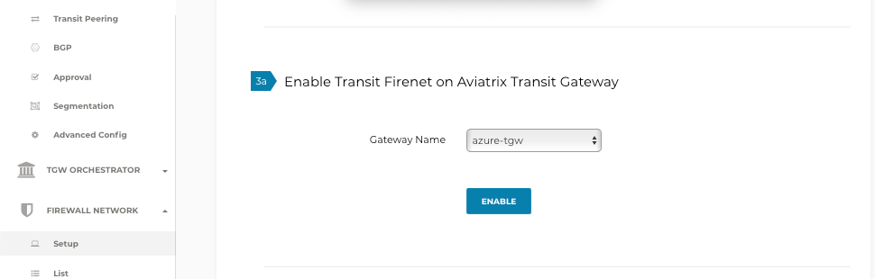

.. meta::
  :description: Firewall Network Workflow
  :keywords: Azure Transit Gateway, Azure, TGW orchestrator, Aviatrix Transit network, Transit DMZ, Egress, Firewall, Firewall Network, FireNet

=========================================================
Transit FireNet Workflow for Azure
=========================================================

Aviatrix Transit FireNet allows you to deploy firewalls functions for the Aviatrix Multi-Cloud Transit architecture. With Transit FireNet feature, the Firewall Network (FireNet) function is integrated into the Aviatrix Transit gateway.

Aviatrix Transit FireNet supports different hashing algorithms available in Azure cloud to load balance the traffic across different firewalls which includes `Hash-based distribution mode (five-tuple hash) <https://docs.microsoft.com/en-us/azure/load-balancer/load-balancer-distribution-mode#hash-based-distribution-mode>`_ and `Source IP affinity mode (three-tuple or two-tuple hash) <https://docs.microsoft.com/en-us/azure/load-balancer/load-balancer-distribution-mode#source-ip-affinity-mode>`_.

To learn more about Hashing Algorithm and Transit FireNet, check out `Transit FireNet FAQ. <https://docs.aviatrix.com/HowTos/transit_firenet_faq.html>`_

In this example, Transit VNet with Aviatrix Gateways will be deployed, and two Spoke Gateways (DEV and PROD) will be attached to it.

The transit VNET will have a firewall of supported vendors (Check Point, Palo Alto Networks and Fortinet etc.) deployed in it. Please see the diagram below for more details.

Once the infra is in-place then the policy will be created to inspect the east-west and north-south traffic.

|avx_tr_firenet_topology_az|

Step 1 : Create Transit VNet
*******************************

VNets can be created manually on Azure or directly from Aviatrix Controller.

Aviatrix controller has set of useful tools available for users and in this example, VNets are created following the Useful Tools `Create a VPC <https://docs.aviatrix.com/HowTos/create_vpc.html>`_ guidelines.

1.	Login to the Aviatrix Controller with username and password
#.	Navigate to **Useful Tools -> Create A VPC**
#.	Add one VNet for Transit FireNet Gateway and select **Aviatrix FireNet VPC** option as shown below.
#.  Create two more VNets with **no option/checkbox** selected for Spoke Gateways.

|create_vpc|

Step 2: Deploy the Transit Aviatrix Gateway
***************************************************

Transit Aviatrix Gateway can be deployed using the `Transit Gateway Workflow <https://docs.aviatrix.com/HowTos/transitvpc_workflow.html#launch-a-transit-gateway>`_

Prerequisite for Azure
~~~~~~~~~~~~~~~~~~~~~~~~~~~

Transit FireNet builds on the Aviatrix Transit Network solution where Aviatrix gateways are deployed in Transit VNet and/or in Spoke VNet in Azure.

Make sure the deployment meets the following specifications:

1.	ActiveMesh must be enabled when launching the Aviatrix Transit Gateway.
2.	Select the option “Enable Transit FireNet” when launching the Aviatrix Transit Gateway.
3.	Aviatrix Transit Network must be in Connected mode. Go to Transit Network -> Advanced Config -> Connected Transit. Click Enable.

.. important::
    Controller version 6.0 and prior, the minimum size of the Aviatrix Transit Gateway virtual machine is Standard_B2ms. Starting 6.1, minimum Transit Gateway instance size requirement is removed.

Procedure
~~~~~~~~~~~~~~~~~~~~~

1.	Navigate to **MULTI-CLOUD TRANSIT -> Setup -> #1 Launch an Aviatrix Transit Gateway**
#.	Choose virtual machine size **Standard_B2ms**
#.	Enable **ActiveMesh Mode (Mandatory)**
#.	Enable InsaneMode for higher throughputs (optional)
#.	Enable Transit Gateway HA by navigating to **MULTI-CLOUD TRANSIT -> Setup -> #2 (Optional) Enable HA to an Aviatrix Transit Gateway**

Please see an example below for Transit FireNet GW:

|tr_firenet_gw|

.. note::
    Insane Mode Encryption for higher throughput requires a virtual machine size as shown below.

|insane_mode_tp|

Step 3: Deploy Spoke Gateways
*************************************

Now that we have Aviatrix Transit Gateway, we can deploy Aviatrix Spoke Gateways in the spoke VNET using `Aviatrix Spoke Gateway Workflow <https://docs.aviatrix.com/HowTos/transitvpc_workflow.html#launch-a-spoke-gateway>`_.

1.	Navigate to **MULTI-CLOUD TRANSIT -> Setup -> #4 Launch an Aviatrix Spoke Gateway**
#.	Deploy a Spoke Gateway (GW) in each of the spoke VNETs using defaults while choose correct Account and VNET info
#.	Choose the Public Subnet
#.	Enable Spoke Gateway HA by navigating to Transit network -> Setup -> #5 (Optional) Enable/Disable HA at Spoke GW

|launch_spk_gw|

Step 4: Attach Spoke Gateways to Transit Network
*******************************************************

Transit and spoke gateways are deployed, next step is to connect them.

1.	Navigate to **MULTI-CLOUD TRANSIT -> Setup -> #6a Attach Spoke Gateway to Transit Network**
#.	Select one spoke at a time and attach to the Transit Gateway.

|attach_spk_trgw|

.. note::
 Transit Gateway is attached to Spoke Gateways, but by default, Transit Gateway will not route traffic between Spoke Gateways.

Step 5: Enable Connected Transit
**************************************

By default, spoke VNETs are in isolated mode where the Transit will not route traffic between them. To allow the Spoke VNETs to communicate with each other, we need to enable Connected Transit

1.	Navigate to **MULTI-CLOUD TRANSIT -> Advanced Config**, select the right Transit Gateway and enable **“Connected Transit”**

|connected_transit|

Step 6: Configure Transit Firewall Network
**************************************************

Transit and Spoke Gateways have now been deployed, next step is to deploy and enable the Firewall for traffic inspection.

Let’s start with enabling the firewall function and configure the FireNet policy.

1.	Navigate to **MULTI-CLOUD TRANSIT -> Transit FireNet -> #1 Enable Transit FireNet on Aviatrix Transit Gateway**
#.	Choose the Aviatrix Transit Gateway and Click **“Enable”**

|en_tr_firenet|

3.	Navigate to **MULTI-CLOUD TRANSIT -> Transit FireNet -> #2 Manage FireNet Policy**
#.	Add spokes to the Inspected box for traffic inspection

.. note::
    By default, FireNet inspects ingress (INET to VNET) and east-west traffic (VNET to VNET) only.

|tr_firenet_policy|

Step 7a: Launch and Associate Firewall Instance
*****************************************************************

This approach is recommended if this is the first Firewall instance to be attached to the gateway.

This step launches a Firewall instance and associates it with one of the FireNet gateways.

.. important::

    The Firewall instance and the associated Aviatrix FireNet gateway above must be in the same AZ, and, we recommend that the Management Interface Subnet and Egress (untrust dataplane) Interface Subnet should not be in the same subnet.

.. note::
    By default, Aviatrix Transit Firenet uses 5 tuple hashing algorithm but that can be changed to 2 or 3 tuple as per requirement. Please check transit `firenet FAQs <https://docs.aviatrix.com/HowTos/transit_firenet_faq.html#azure>`_ for more details.

7a.1 Launch and Attach
~~~~~~~~~~~~~~~~~~~~~~~~~~~

Go to Aviatrix Controller's console and navigate to **Firewall Network -> Setup -> Step 7a** and provide all the required input as shown in a table and click **"Launch"** button.

.. important::
    Vendor's firewall may take some time after launch to be available.

==========================================      ==========
**Setting**                                     **Value**
==========================================      ==========
VPC ID                                          The Security VNET created in Step 1.
Gateway Name                                    The primary FireNet gateway.
Firewall Instance Name                          The name that will be displayed on Azure Console.
Firewall Image                                  The Azure AMI that you have subscribed.
Firewall Image Version                          Firewall supported software versions.
Firewall Instance Size                          Firewall virtual machine size.
Management Interface Subnet.                    Select the subnet whose name contains "gateway and firewall management"
Egress Interface Subnet                         Select the subnet whose name contains "FW-ingress-egress".
Username                                        Applicable to Azure deployment only. "admin" as a username is not accepted.
Authentication Method                           Password or SSH Public Key
Password                                        Applicable to Azure deployment only.
Key Pair Name (Optional)                        The .pem file name for SSH access to the firewall instance.
Attach (Optional)                               By selecting this option, the firewall instance is inserted in the data path to receive packet. If this is the second firewall instance for the same gateway and you have an operational FireNet deployment, you should not select this option as the firewall is not configured yet. You can attach the firewall instance later at Firewall Network -> Advanced page.
Advanced (Optional)                             Click this selection to allow Palo Alto firewall bootstrap files to be specified.
==========================================      ==========

1. Check Point Specification
~~~~~~~~~~~~~~~~~~~~~~~~~~~~~~~~~~~~~~~~~~~

Check Point Security Gateway has 2 interfaces as described below.

========================================================         ===============================          ================================
**Check Point VM interfaces**                                    **Description**                          **Inbound Security Group Rule**
========================================================         ===============================          ================================
eth0 (on subnet -Public-FW-ingress-egress-AZ-a)                  Egress or Untrusted interface            Allow ALL
eth1 (on subnet -dmz-firewall)                                   LAN or Trusted interface                 Allow ALL (Do not change)
========================================================         ===============================          ================================

Note that security gateway eth1 is on the same subnet as Firenet gateway eth2 interface.

Check Point Security Gateway launch from the Aviatrix Controller automatically initiates the on-boarding process, configure security gateway interfaces and program RFC 1918 routes. After completing this step, user should be able to login to the Check Point Gaia console with username **admin** and provided password during launch.

.. note::
    Repeat Step 7a to launch the second security gateway to associate with the HA FireNet gateway. Or repeat this step to launch more security gateways to associate with the same Firenet gateway.

Follow `Check Point Example <https://docs.aviatrix.com/HowTos/config_CheckPointAzure.html#launch-check-point-firewall-from-aviatrix-controller>`_ to see how to launch Check Point Security Gateway in Azure, and for more details.

2. Palo Alto VM-Series Specifications
~~~~~~~~~~~~~~~~~~~~~~~~~~~~~~~~~~~~~~~~~~~

Palo instance has 3 interfaces as described below.

========================================================         ===============================          ================================
**Palo Alto VM interfaces**                                      **Description**                          **Inbound Security Group Rule**
========================================================         ===============================          ================================
eth0 (on subnet -Public-FW-ingress-egress-AZ-a)                  Egress or Untrusted interface            Allow ALL
eth1 (on subnet -Public-gateway-and-firewall-mgmt-AZ-a)          Management interface                     Allow SSH, HTTPS, ICMP, TCP 3978
eth2 (on subnet -dmz-firewall)                                   LAN or Trusted interface                 Allow ALL (Do not change)
========================================================         ===============================          ================================

Note that firewall instance eth2 is on the same subnet as FireNet gateway eth2 interface.

Launch VM Series from Aviatrix Controller automatically set it up the Palo Alto Network VM-Series firewall. User should be able to login to the VM-Series console with given username and password during launch.

.. important::

    For Panorama managed firewalls, you need to prepare Panorama first and then launch a firewall. Check out `Setup Panorama <https://docs.aviatrix.com/HowTos/paloalto_API_setup.html#managing-vm-series-by-panorama>`_.  When a VM-Series instance is launched and connected with Panorama, you need to apply a one time "commit and push" from the Panorama console to sync the firewall instance and Panorama.

.. Tip::

    If VM-Series are individually managed and integrated with the Controller, you can still use Bootstrap to save initial configuration time. Export the first firewall's configuration to bootstrap.xml, create an IAM role and Bootstrap bucket structure as indicated above, then launch additional firewalls with IAM role and the S3 bucket name to save the time of the firewall manual initial configuration.

3. Fortinet Specifications
~~~~~~~~~~~~~~~~~~~~~~~~~~~~~~~~~~~~~~~~~~~

FortiGate Next Generation Firewall instance has 2 interfaces as described below.

========================================================         ===============================          ================================
**FortiGate VM interfaces**                                      **Description**                          **Inbound Security Group Rule**
========================================================         ===============================          ================================
eth0 (on subnet -Public-FW-ingress-egress-AZ-a)                  Egress or Untrusted interface            Allow ALL
eth1 (on subnet -dmz-firewall)                                   LAN or Trusted interface                 Allow ALL (Do not change)
========================================================         ===============================          ================================

.. note::
    Firewall instance eth1 is on the same subnet as FireNet gateway eth2 interface.

.. tip::
    Starting from Release 5.4, FortiGate bootstrap configuration is supported.

Please refer to `FortiGate Azure Configuration Example <https://docs.aviatrix.com/HowTos/config_FortiGateAzure.html#example-config-for-fortigate-vm-in-azure>`_ for more details.

Step 7b: Associate an Existing Firewall Instance
*******************************************************

This step is the alternative step to Step 7a. If you already launched the firewall (Check Point, Palo Alto Network or Fortinet) instance from Azure Console, you can still associate it with the FireNet gateway.

Go to Aviatrix Controller's console and navigate to **Firewall Network -> Setup -> Step 7b** and associate a firewall with right FireNet Gateway.

Step 8: Vendor Firewall Integration
*****************************************************

Vendor integration dynamically updates firewall route tables. The use case is for networks with RFC 1918 and non-RFC 1918 routes that require specific route table programming on the firewall appliance

1.	Go to Firewall Network -> Vendor Integration -> Select Firewall, fill in the details of your Firewall instance.
2.	Click Save, Show and Sync.

.. important::
    Aviatrix Controller automatically programs RFC 1918 in Check Point Security Gateway at a time of launch. This step can be skipped for Check Point if non-RFC 1918 routes programming is not required in Security Gateway.

.. note::
    Vendor integration is not supported for FortiGate. User needs to configure RFC 1918 static routes manually in FortiGate firewall.

Step 9: Enable Health Check Policy in Firewall
***************************************************
Aviatrix Controller uses HTTPS (TCP 443) to check the health of firewall every 5 seconds. User needs to enable this port in firewall as per given instruction.

Check Point
~~~~~~~~~~~~~~
By default, HTTPS or TCP 443 is allowed in Security Gateway. No action is required.

Palo Alto Network (PAN)
~~~~~~~~~~~~~~~~~~~~~~~~~
By default, VM-Series do not allow HTTPS or TCP 443 port. Pleas follow the given steps to enable it:

    1. Login to VM-Series with username and password.
    #. Go to Network -> Interface Mgmt under Network Profiles and click "Add".
    #. Give any name in "Interface Management Profile", check HTTPS checkbox under Administrative Management Service and click "OK".

|PAN-health-check|

Firewall health check probes can be verified in Monitor -> Traffic.

|pan-health-probe|

Fortinet
~~~~~~~~~~~~~~~
User needs to allow HTTPS or TCP 443 port in FortiGate firewall to monitor the health of firewall. Please follow the steps to allow HTTPS in FortiGate:

    1. Login to FortiGate's console using username and password
    #. Go to Network -> Interfaces, select **port 2** and click "Edit".
    #. Check HTTPS checkbox under Administrative access -> IPv4 and click "OK".

|health-check|

The health check probes can be verified in FortiGate by navigating to Log & Report -> Local Traffic.

|health-probe-logs|

Step 10: Example Setup for "Allow All" Policy
***************************************************

After a firewall instance is launched, wait for 5 to 15 minutes for it to come up. Time varies for each firewall vendor.
In addition, please follow example configuration guides as below to build a simple policy on the firewall instance for a test validation that traffic is indeed being routed to firewall instance.

Palo Alto Network (PAN)
~~~~~~~~~~~~~~~~~~~~~~~~~~~~~~~~~~~~~~~~~~~

For basic configuration, please refer to `example Palo Alto Network configuration guide <https://docs.aviatrix.com/HowTos/config_paloaltoVM.html>`_.

For implementation details on using Bootstrap to launch and initiate VM-Series, refer to `Bootstrap Configuration Example <https://docs.aviatrix.com/HowTos/bootstrap_example.html>`_.

FortiGate (Fortinet)
~~~~~~~~~~~~~~~~~~~~~~~~~~~~~~~~~~~~~~~~~~~

For basic policy configuration, please refer to `example Fortinet configuration guide <https://docs.aviatrix.com/HowTos/config_FortiGateAzure.html#configure-basic-traffic-policy-to-allow-traffic-vpc-to-vpc>`_.

Check Point
~~~~~~~~~~~~~~~~~~~~~~~~~~~~~~~~~~~~~~~~~~~

For basic policy configuration, please refer to `example Check Point configuration guide <https://docs.aviatrix.com/HowTos/config_CheckPointAzure.html#configure-basic-traffic-policy-to-allow-traffic-vnet-to-vnet>`_.

Step 11: Verification
***************************

There are multiple ways to verify if Transit FireNet is configured properly:

    1.	Aviatrix Flightpath - Control-plane Test
    #.	Ping/Traceroute Test between Spoke VNETs (East-West) - Data-plane Test

Flight Path Test for FireNet Control-Plane Verification:
~~~~~~~~~~~~~~~~~~~~~~~~~~~~~~~~~~~~~~~~~~~~~~~~~~~~~~~~~~~~~

Flight Path is a very powerful troubleshooting Aviatrix tool which allows users to validate the control-plane and gives visibility of end to end packet flow.

    1.	Navigate to **Troubleshoot-> Flight Path**
    #.	Provide the Source and Destination Region and VNET information
    #.	Select ICMP and Private subnet, and Run the test

.. note::
    VM instance will be required in Azure, and ICMP should be allowed in security group.

Ping/Traceroute Test for FireNet Data-Plane Verification:
~~~~~~~~~~~~~~~~~~~~~~~~~~~~~~~~~~~~~~~~~~~~~~~~~~~~~~~~~~~~~~~~~~~

Once control-plane is established and no problem found in security and routing polices. Data-plane validation needs to be verified to make sure traffic is flowing and not blocking anywhere.

There are multiple ways to check data-plane:
    1. One way to SSH to Spoke EC2 instance  (e.g. DEV1-VM) and ping other Spoke EC2 to instance (e.g PROD1-VM) to make sure no traffic loss in the path.
    2. Ping/traceroute capture can also be performed from Aviatrix Controller. Go to **TROUBLESHOOT -> Diagnostics** and perform the test.

.. |avx_tr_firenet_topology_az| image:: transit_firenet_workflow_media/transit_firenet_Azure_workflow_media/avx_tr_firenet_topology_az.png
   :scale: 20%

.. |insane_mode_tp| image:: transit_firenet_workflow_media/transit_firenet_Azure_workflow_media/insane_mode_tp.png
   :scale: 30%

.. |create_vpc| image:: transit_firenet_workflow_media/transit_firenet_Azure_workflow_media/create_vpc.png
   :scale: 40%

.. |tr_firenet_gw| image:: transit_firenet_workflow_media/transit_firenet_Azure_workflow_media/tr_firenet_gw.png
   :scale: 35%

.. |launch_spk_gw| image:: transit_firenet_workflow_media/transit_firenet_Azure_workflow_media/launch_spk_gw.png
   :scale: 35%

.. |tr_firenet_policy| image:: transit_firenet_workflow_media/transit_firenet_Azure_workflow_media/tr_firenet_policy.png
   :scale: 35%

.. |avx_tr_firenet_topology| image:: transit_firenet_workflow_media/transit_firenet_Azure_workflow_media/avx_tr_firenet_topology.png
   :scale: 35%

.. |connected_transit| image:: transit_firenet_workflow_media/transit_firenet_Azure_workflow_media/connected_transit.png
   :scale: 40%

.. |health-check| image:: transit_firenet_workflow_media/transit_firenet_Azure_workflow_media/health-check.png
   :scale: 35%

.. |PAN-health-check| image:: transit_firenet_workflow_media/transit_firenet_Azure_workflow_media/PAN-health-check.png
   :scale: 35%

.. |health-probe-logs| image:: transit_firenet_workflow_media/transit_firenet_Azure_workflow_media/health-probe-logs.png
   :scale: 40%

.. |pan-health-probe| image:: transit_firenet_workflow_media/transit_firenet_Azure_workflow_media/pan-health-probe.png
   :scale: 40%

.. disqus::
