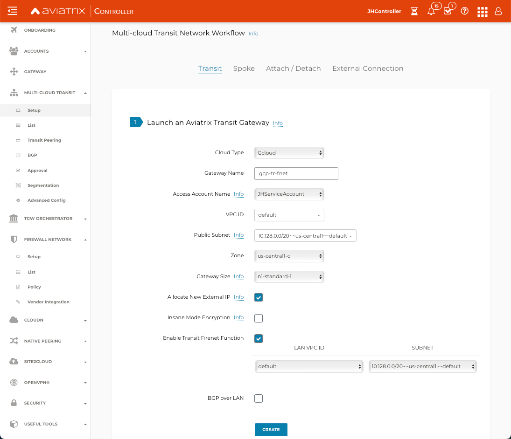
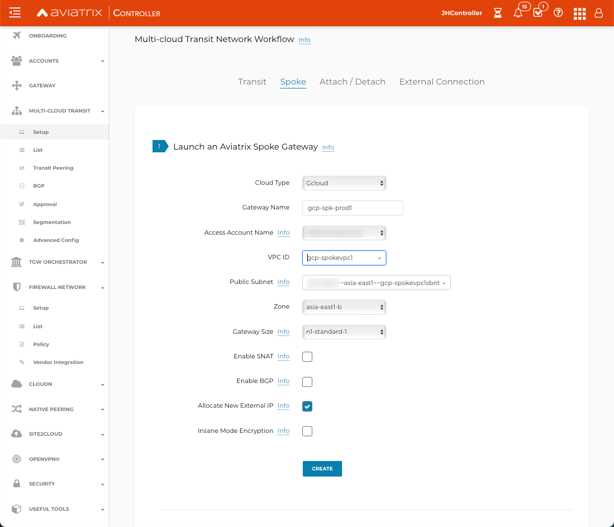

=========================================================
Transit FireNet Workflow for GCP
=========================================================

You use Aviatrix Transit FireNet to deploy firewall functions for the Aviatrix Multi-Cloud transit architecture. With the Transit FireNet feature, the Firewall Network (FireNet) function is integrated into the Aviatrix Transit gateway.

To learn about Transit FireNet, see `Transit FireNet FAQ. <https://docs.aviatrix.com/HowTos/transit_firenet_faq.html>`_

To deploy firewall networks in other CSPs:

- `AWS Transit Gateway (TGW) <https://docs.aviatrix.com/HowTos/firewall_network_workflow.html>`_
- `AWS Transit FireNet multi-cloud transit <https://docs.aviatrix.com/HowTos/transit_firenet_workflow_aws.html>`_
- `Azure Transit FireNet workflow <https://docs.aviatrix.com/HowTos/transit_firenet_workflow_azure.html>`_

In this example, a Transit VPC with Aviatrix Gateways is deployed, and two Spoke Gateways (DEV and PROD) are attached.

A firewall of supported vendors (Check Point, Palo Alto Networks, Fortinet FortiGate, etc.) will be deployed within the Transit VPC. See the diagram below for more details.

Once the infrastructure is in place you create a policy to inspect the east-west and north-south traffic.

|avx_tr_firenet_topology|

Create VPCs
**************

VPCs can be created manually on GCP or directly from the Aviatrix Controller.

See `Create a VPC <https://docs.aviatrix.com/HowTos/create_vpc.html>`_ for guidelines on how to use the Aviatrix Controller to create VPCs.

1.	Log in to the Aviatrix Controller with a username and password.
#.	Navigate to Useful Tools > Create A VPC.
#. Select GCloud as the Cloud Type.
#.	Add one VPC for Transit FireNet Gateway and enable the Transit FireNet Function as shown below.
#.  Add three more VPCs as shown in the topology (i.e., Egress VPC, LAN VPC and Management VPC).
#.  Create two more VPCs for Spoke Gateways.

|create_vpc|

Deploy the Transit Aviatrix Gateway
************************************

Transit Aviatrix Gateway can be deployed using the `Transit Gateway Workflow <https://docs.aviatrix.com/HowTos/transitvpc_workflow.html#launch-a-transit-gateway>`_.

Procedure
~~~~~~~~~~~

1. Navigate to Multi-Cloud Transit > Setup > Transit > #1 Launch an Aviatrix Transit Gateway.
#. Select the Cloud Type **Gcloud**.
#. Enter a Gateway Name.
#. Select the GCP Access Account Name.
#. Select the VPC ID of the Transit FireNet VPC.
#. Select the Public Subnet.
#. Select the zone.
#. Select the gateway size **n1-standard-1**.
#. (optional) Enable Insane Mode Encryption for higher throughputs.
#. Check the **Enable Transit FireNet Function** checkbox.
#. Enable Transit Gateway HA by navigating to Multi-Cloud > Setup > #2 (Optional) Enable HA to an Aviatrix Transit Gateway.

The example below shows the configuration of the Transit FireNet Gateway:

|tr_firenet_gw|

Deploy Spoke Gateways
**********************

Now that we have set up an Aviatrix Transit Gateway, we can deploy Aviatrix Spoke Gateways in the spoke VPCs using the `Aviatrix Spoke Gateway Workflow <https://docs.aviatrix.com/HowTos/transitvpc_workflow.html#launch-a-spoke-gateway>`_.

1.	Navigate to Multi-Cloud Transit > Setup > Spoke > #1 Launch an Aviatrix Spoke Gateway.
#.	Deploy a Spoke Gateway (GW) in each of the Spoke VPCs using the defaults, selecting the appropriate account and VPC information.
#.	Choose the Public Subnet.
#.	Enable Spoke Gateway HA by navigating to Multi-Cloud Transit > Setup > #5 (Optional) Enable/Disable HA at Spoke GW.

|launch_spk_gw|

Attach Spoke Gateways to Transit Network
*****************************************

The Transit and Spoke gateways are now deployed. To connect them:

1.	Navigate to Multi-Cloud Transit > Setup > Attach/Detach > #1 Attach Spoke Gateway to Transit Network.
#.	Select one Spoke at a time and attach it to the Transit Gateway.

|attach_spk_trgw|

.. note::
 Although the Transit Gateway is now attached to the Spoke Gateways, it will not route traffic between Spoke Gateways.

Enable Connected Transit
*************************

By default, spoke VPCs are in isolated mode where the Transit will not route traffic between them. To allow the Spoke VPCs to communicate with each other, you must enable Connected Transit by navigating to Multi-Cloud Transit > Advanced Config. Select the Transit Gateway and toggle Connected Transit to **Enabled**.

|connected_transit|

Load balancers are created in GCP after this step is performed.

Configure Transit Firewall Network
************************************

Transit and Spoke Gateways have now been deployed. You must now deploy and enable the Firewall for traffic inspection. 

To enable the firewall function and configure the FireNet policy:

1.	Navigate to Firewall Network > Setup > #3a Enable Transit FireNet on Aviatrix Transit Gateway.
#.	Choose the Aviatrix Transit Gateway and click **Enable**.

.. Note::

  In a GCP deployment, the Transit FireNet function is enabled when launching the gateway. You can skip this step.

3.	Navigate to Firewall Network > Policy > Manage FireNet Policy.
#.	Add Spokes to the Inspected box for traffic inspection.

.. note::
    By default, FireNet inspects ingress (Internet to VPC) and east-west traffic (VPC to VPC) only.

|tr_firenet_policy|

Launch and Associate Firewall Instance
**************************************

This approach is recommended if this is the first Firewall instance being attached to the gateway.

This step launches a Firewall instance and associates it with one of the FireNet gateways.

.. important::

    The Firewall instance and the associated Aviatrix FireNet gateway above must be in the same AZ (Availability Zone). Also, the Management Interface Subnet and Egress (untrust dataplane) Interface Subnet should not be in the same subnet.

Launch and Attach
~~~~~~~~~~~~~~~~~~

In the Aviatrix Controller, navigate to Firewall Network > Setup > Firewall > Step 2a. Provide all the required input as shown in a table. Click **Launch**.

.. important::
    The vendor firewall may take 5-10 minutes to become available.

==========================================      ==========
**Setting**                                     **Value**
==========================================      ==========
VPC ID                                          The Security VPC created in Step 1.
Gateway Name                                    The primary FireNet gateway.
Firewall Instance Name                          The name that will be displayed on GCP Console.
Firewall Image                                  The AWS AMI that you subscribed to in Step 2.
Firewall Image Version                          Firewall instance current supported software versions.
Firewall Instance Size                          Firewall instance type.
Management Interface VPC ID                     Select the Firewall Management VPC
Management Interface Subnet                     Select the subnet for Firewall Management
Egress Interface VPC ID                         Select the Firewall Egress VPC.
Egress Interface Subnet                         Select the subnet for Firewall Egress.
Attach (Optional)                               By selecting this option, the firewall instance is inserted in the data path to receive the packet. If this is the second firewall instance for the same gateway and you have an operational FireNet deployment, you should not select this option as the firewall is not configured yet. You can attach the firewall instance later at the Firewall Network > Advanced page.
Advanced (Optional)                             Click this selection to allow Palo Alto firewall bootstrap files to be specified.
Bootstrap Bucket Name                           In advanced mode, specify a bootstrap bucket name where the initial configuration and policy file is stored.
==========================================      ==========

Check Point Specifications
~~~~~~~~~~~~~~~~~~~~~~~~~~~
Check Point support for Google Cloud will be available in a future release.

Palo Alto VM-Series Specifications
~~~~~~~~~~~~~~~~~~~~~~~~~~~~~~~~~~~~

Palo instance has three interfaces as described below.

========================================================         ===============================          ================================
**Palo Alto VM instance interfaces**                             **Description**                          **Inbound Security Group Rule**
========================================================         ===============================          ================================
nic0                                                             Egress or Untrusted interface            Allow ALL
nic1                                                             Management interface                     Allow SSH, HTTPS, ICMP, TCP 3978
nic2                                                             LAN or Trusted interface                 Allow ALL (Do not change)
========================================================         ===============================          ================================

Note that firewall instance nic2 is on the same subnet as the FireNet gateway nic1 interface.

.. important::

    For Panorama managed firewalls, you need to prepare Panorama first and then launch a firewall. See `Setup Panorama <https://docs.aviatrix.com/HowTos/paloalto_API_setup.html#managing-vm-series-by-panorama>`_.  When a VM-Series instance is launched and connected with Panorama, you need to apply a one time "commit and push" from the Panorama console to sync Panorama and the firewall instance.

.. Tip::

    If VM-Series are individually managed and integrated with the Controller, you can still use Bootstrap to save initial configuration time. Export the first firewall's configuration to bootstrap.xml, create an IAM role and Bootstrap bucket structure as indicated above, then launch additional firewalls with IAM role and the S3 bucket name.

Follow `Palo Alto Network (VM Series) GCP Example <https://docs.aviatrix.com/HowTos/config_paloaltoGCP.html>`_ to launch VM Series firewall in GCP and for more details.

Fortinet Fortigate Specifications
~~~~~~~~~~~~~~~~~~~~~~~~~~~~~~~~~

For details on how to configure Transit FireNet for GCP click `here <https://docs.aviatrix.com/HowTos/config_FortigateGCP.html>`_.

Associate an Existing Firewall Instance
******************************************

This is the alternative step to Step 2a. If you already launched the firewall (Check Point, Palo Alto Network or Fortinet) instance from AWS Console, you can still associate it with the FireNet gateway.

In the Aviatrix Controller navigate to Firewall Network > Setup > Firewall > Step 2b and associate a firewall with a FireNet Gateway.

Vendor Firewall Integration
*****************************

Vendor integration programs RFC 1918 and non-RFC 1918 routes in the firewall.

1.  In the Aviatrix Controller, navigate to Firewall Network > Vendor Integration > Firewall. Select the firewall Vendor Type and fill in the details of your Firewall instance.
#. Click **Save**.
#. You can click **Show** or **Sync** to show the integration details or sync the configuration with the firewall.

Example Setup for "Allow All" Policy
*************************************

After a firewall instance is launched, wait 5-15 minutes for it to become available. Time varies for each firewall vendor.
In addition, please follow the example configuration guides as indicated below to build a simple policy on the firewall instance, to validate that traffic is indeed being routed to firewall instance.

Palo Alto Network (PAN)
~~~~~~~~~~~~~~~~~~~~~~~~~~

For basic configuration, please see `example Palo Alto Network configuration guide <https://docs.aviatrix.com/HowTos/config_paloaltoVM.html>`_.

For implementation details on using Bootstrap to launch and initiate VM-Series, see `Bootstrap Configuration Example <https://docs.aviatrix.com/HowTos/bootstrap_example.html>`_.

Verification
*************

There are multiple ways to verify if Transit FireNet is configured properly:

    1.	Aviatrix Flightpath - Control-plane Test
    #.	SSH, SCP or Telnet Test between Spoke VPCs (East-West) - Data-plane Test

.. note::
    ICMP is blocked on Google Cloud Load balancer.

FlightPath Test for FireNet Control-Plane Verification
~~~~~~~~~~~~~~~~~~~~~~~~~~~~~~~~~~~~~~~~~~~~~~~~~~~~~~

FlightPath is a powerful troubleshooting Aviatrix tool which allows users to validate the control plane and gives end to end visibility of packet flow.

    1.	In the Aviatrix Controller, navigate to Troubleshoot > FlightPath.
    #.	Provide the Source and Destination Region and VPC information.
    #.	Select SSH and Private subnet, and run the test.

.. note::
    A VM instance will be required in GCP, and SSH/Telnet port should be allowed in firewall the rules for Spoke VPCs.

SSH/Telnet Test for FireNet Data Plane Verification
~~~~~~~~~~~~~~~~~~~~~~~~~~~~~~~~~~~~~~~~~~~~~~~~~~~~

Once the control plane is established and no problem is found in the security and routing polices, data plane validation needs to be verified to make sure traffic is flowing and not blocked.

There are multiple ways to check the data plane. One way is to SSH to Spoke instance (e.g. DEV1-VM) and telnet the other Spoke instance (e.g PROD1-VM) to make sure there is no traffic loss in the path.

.. |subscribe_firewall| image:: transit_firenet_workflow_media/transit_firenet_AWS_workflow_media/subscribe_firewall.png
   :scale: 35%

.. |en_tr_firenet| image:: transit_firenet_workflow_media/transit_firenet_GCP_workflow_media/en_tr_firenet.png
   :scale: 35%

.. disqus::
