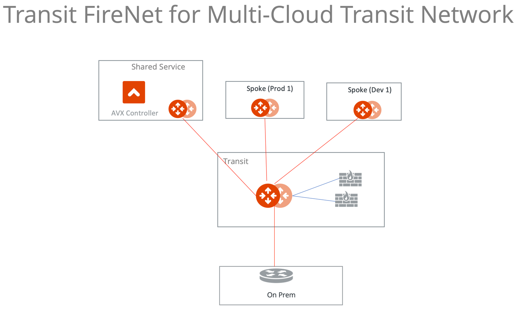
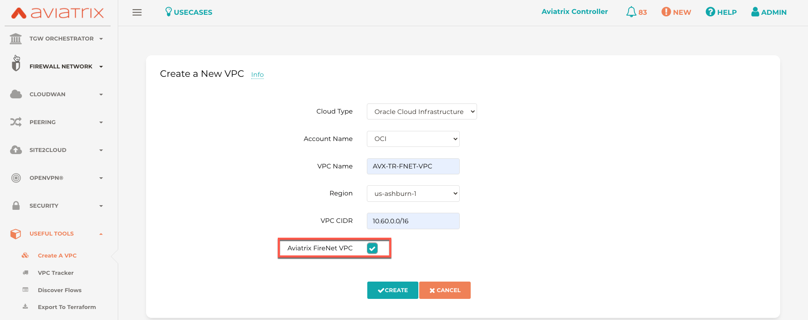
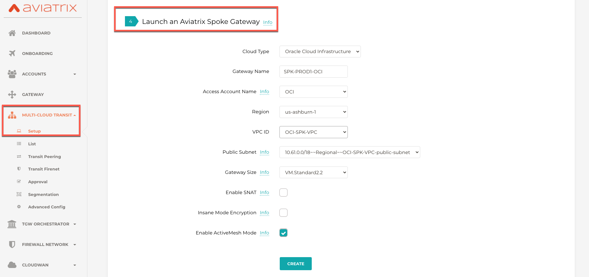
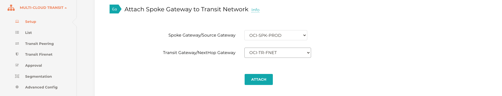
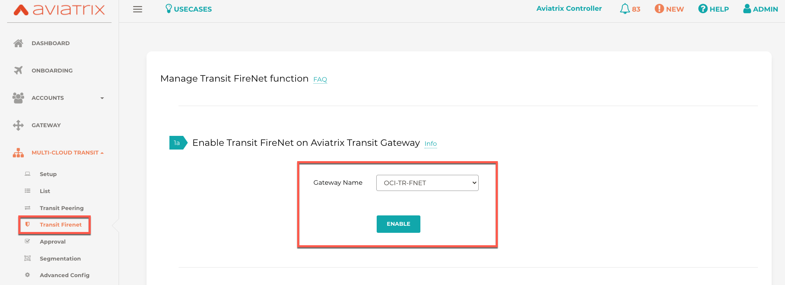
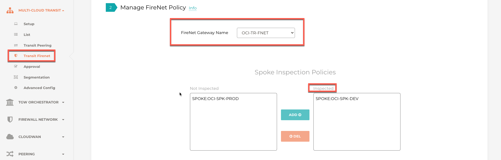
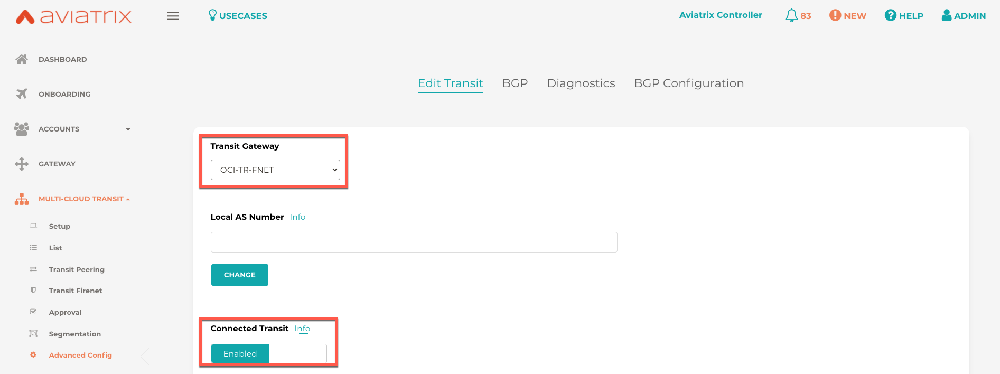

.. meta::
  :description: Firewall Network Workflow
  :keywords: OCI Transit Gateway, OCI, Aviatrix Transit network, Transit DMZ, Egress, Firewall, Firewall Network, FireNet OCI

=========================================================
Transit FireNet Workflow for OCI
=========================================================

Aviatrix Transit FireNet allows you to deploy firewalls functions for the Aviatrix Multi-Cloud Transit architecture. With Transit FireNet feature, the Firewall Network (FireNet) function is integrated into the Aviatrix Transit gateway.

To learn more about Transit FireNet, check out `Transit FireNet FAQ. <https://docs.aviatrix.com/HowTos/transit_firenet_faq.html>`_

In this example, three VCNs with Aviatrix gateways will be deployed, one Aviatrix transit gateway and two Spoke Gateways (DEV and PROD) will be attached to it.

The transit VCN will have a firewall of supported vendors (Check Point, Palo Alto Networks and Fortinet etc.) deployed in it. Please see the diagram below for more details.

Once the infra is in-place then the policy will be created to inspect the east-west and north-south traffic.

|avx_tr_firenet_topology_az|

Step 1 : Create Transit VCN
*******************************

VCNs can be created manually on OCI or directly from Aviatrix Controller.

Aviatrix controller has set of useful tools available for users and in this example, VCNs are created following the Useful Tools `Create a VPC <https://docs.aviatrix.com/HowTos/create_vpc.html>`_ guidelines.

1.	Login to the Aviatrix Controller with username and password
#.	Navigate to **Useful Tools -> Create A VPC**
#.	Add one VCN for Transit FireNet Gateway and select **Aviatrix FireNet VPC** option as shown below.
#.  Create two more VCNs with **no option/checkbox** selected for Spoke Gateways.

|create_vpc|

Step 2: Deploy the Transit Aviatrix Gateway
***************************************************

Transit Aviatrix Gateway can be deployed using the `Transit Gateway Workflow <https://docs.aviatrix.com/HowTos/transitvpc_workflow.html#launch-a-transit-gateway>`_

Prerequisite for OCI
~~~~~~~~~~~~~~~~~~~~~~~~~~~

Transit FireNet builds on the Aviatrix Transit Network solution where Aviatrix gateways are deployed in Transit VCN and/or in Spoke VCN in OCI.

Make sure the deployment meets the following specifications:

1.	ActiveMesh must be enabled when launching the Aviatrix Transit Gateway.
2.	Select the option “Enable Transit FireNet” when launching the Aviatrix Transit Gateway.
3.	Aviatrix Transit Gateway minimum instance size should be VM.Standard2.4 or more

Procedure
~~~~~~~~~~~~~~~~~~~~~

1.	Navigate to **MULTI-CLOUD TRANSIT -> Setup -> #1 Launch an Aviatrix Transit Gateway**
#.	Choose virtual machine size **VM.Standard2.4**
#.	Enable **ActiveMesh Mode (Mandatory)**
#.	Enable InsaneMode for higher throughput (optional)
#.	Enable Transit Gateway HA by navigating to **MULTI-CLOUD TRANSIT -> Setup -> #2 (Optional) Enable HA to an Aviatrix Transit Gateway**

Please see an example below for Transit FireNet GW:

|tr_firenet_gw|

Step 3: Deploy Spoke Gateways
*************************************

Now that we have Aviatrix Transit Gateway, we can deploy Aviatrix Spoke Gateways in the spoke VCN using `Aviatrix Spoke Gateway Workflow <https://docs.aviatrix.com/HowTos/transitvpc_workflow.html#launch-a-spoke-gateway>`_.

1.	Navigate to **MULTI-CLOUD TRANSIT -> Setup -> #4 Launch an Aviatrix Spoke Gateway**
#.	Deploy a Spoke Gateway (GW) in each of the spoke VCNs using defaults while choose correct Account and VCN info
#.	Choose the Public Subnet
#.	Enable Spoke Gateway HA by navigating to Transit network -> Setup -> #5 (Optional) Enable/Disable HA at Spoke GW

|launch_spk_gw|

Step 4: Attach Spoke Gateways to Transit Network
*******************************************************

Transit and spoke gateways are deployed, next step is to connect them.

1.	Navigate to **MULTI-CLOUD TRANSIT -> Setup -> #6a Attach Spoke Gateway to Transit Network**
#.	Select one spoke at a time and attach to the Transit Gateway.

|attach_spk_trgw|

.. note::
  By default, Transit Gateway will not route traffic between Spoke Gateways.

Step 5: Enable Connected Transit
**************************************

By default, spoke VCNs are in isolated mode where the Transit will not route traffic between them. To allow the Spoke VCNs to communicate with each other, we need to enable Connected Transit

1.	Navigate to **MULTI-CLOUD TRANSIT -> Advanced Config**, select the right Transit Gateway and enable **“Connected Transit”**

|connected_transit|

Step 6: Configure Transit Firewall Network
**************************************************

Transit and Spoke Gateways have now been deployed, next step is to deploy and enable the Firewall for traffic inspection.

Let’s start with enabling the firewall function and configure the FireNet policy.

1.	Navigate to **MULTI-CLOUD TRANSIT -> Transit FireNet -> #1 Enable Transit FireNet on Aviatrix Transit Gateway**
#.	Choose the Aviatrix Transit Gateway and Click **“Enable”**

|en_tr_firenet|

3.	Navigate to **MULTI-CLOUD TRANSIT -> Transit FireNet -> #2 Manage FireNet Policy**
#.	Add spokes to the Inspected box for traffic inspection

.. note::
    By default, FireNet inspects ingress (INET to VCN) and east-west traffic (VCN to VCN) only.

|tr_firenet_policy|

Step 7a: Launch and Associate Firewall Instance
*****************************************************************

This approach is recommended if this is the first Firewall instance to be attached to the gateway.

This step launches a Firewall instance and associates it with one of the FireNet gateways.

.. important::

    The Firewall instance and the associated Aviatrix FireNet gateway above must be in the same AZ, and, we recommend that the Management Interface Subnet and Egress (untrust dataplane) Interface Subnet should not be in the same subnet.

.. note::
    By default, Aviatrix Transit Firenet uses 5 tuple hashing algorithm but that can be changed to 2 tuple as per requirement. Please check transit `firenet FAQs <https://docs.aviatrix.com/HowTos/transit_firenet_faq.html#azure>`_ for more details.

7a.1 Launch and Attach
~~~~~~~~~~~~~~~~~~~~~~~~~~~

Go to Aviatrix Controller's console and navigate to **Firewall Network -> Setup -> Step 7a** and provide all the required input as shown in a table and click **"Launch"** button.

.. important::
    Vendor's firewall may take some time after launch to be available.

==========================================      ==========
**Setting**                                     **Value**
==========================================      ==========
VPC ID                                          The Security VNET created in Step 1.
Gateway Name                                    The primary FireNet gateway.
Firewall Instance Name                          The name that will be displayed on Azure Console.
Firewall Image                                  The OCI Image that you have subscribed.
Firewall Image Version                          Firewall supported software versions.
Firewall Instance Size                          Firewall virtual machine size.
Management Interface Subnet.                    Select the subnet whose name contains "gateway and firewall management"
Egress Interface Subnet                         Select the subnet whose name contains "FW-ingress-egress".
Username                                        Applicable to Azure deployment only. "admin" as a username is not accepted.
Authentication Method                           SSH Public Key
Key Pair Name (Optional)                        The .pem file name for SSH access to the firewall instance.
Attach (Optional)                               By selecting this option, the firewall instance is inserted in the data path to receive packet. If this is the second firewall instance for the same gateway and you have an operational FireNet deployment, you should not select this option as the firewall is not configured yet. You can attach the firewall instance later at Firewall Network -> Advanced page.
Advanced (Optional)                             Click this selection to allow Palo Alto firewall bootstrap files to be specified.
==========================================      ==========

1. Check Point Specification
~~~~~~~~~~~~~~~~~~~~~~~~~~~~~~~~~~~~~~~~~~~
Check Point support for OCI is coming in future release

2. Palo Alto VM-Series Specifications
~~~~~~~~~~~~~~~~~~~~~~~~~~~~~~~~~~~~~~~~~~~

Palo instance has 3 interfaces as described below.

========================================================         ===============================          ================================
**Palo Alto VM interfaces**                                      **Description**                          **Inbound Security Group Rule**
========================================================         ===============================          ================================
eth0 (on subnet -Public-gateway-and-firewall-mgmt)               Management interface                     Allow SSH, HTTPS, ICMP, TCP 3978
eth1 (on subnet -Public-FW-ingress-egress)                       Egress or Untrusted interface            Allow ALL
eth2 (on subnet -dmz-firewall)                                   LAN or Trusted interface                 Allow ALL (Do not change)
========================================================         ===============================          ================================

Note that firewall instance eth2 is on the same subnet as FireNet gateway eth2 interface.

Launch VM Series from Aviatrix Controller automatically set it up the Palo Alto Network VM-Series firewall. User should be able to login to the VM-Series console with given username and password during launch.

.. important::

    For Panorama managed firewalls, you need to prepare Panorama first and then launch a firewall. Check out `Setup Panorama <https://docs.aviatrix.com/HowTos/paloalto_API_setup.html#managing-vm-series-by-panorama>`_.  When a VM-Series instance is launched and connected with Panorama, you need to apply a one time "commit and push" from the Panorama console to sync the firewall instance and Panorama.

.. Tip::

    If VM-Series are individually managed and integrated with the Controller, you can still use Bootstrap to save initial configuration time. Export the first firewall's configuration to bootstrap.xml, create an IAM role and Bootstrap bucket structure as indicated above, then launch additional firewalls with IAM role and the S3 bucket name to save the time of the firewall manual initial configuration.

3. Fortinet Specifications
~~~~~~~~~~~~~~~~~~~~~~~~~~~~~~~~~~~~~~~~~~~

Fortinet support for OCI is coming in future release

Step 7b: Associate an Existing Firewall Instance
*******************************************************

This step is the alternative step to Step 7a. If you already launched the firewall (Check Point, Palo Alto Network or Fortinet) instance from Azure Console, you can still associate it with the FireNet gateway.

Go to Aviatrix Controller's console and navigate to **Firewall Network -> Setup -> Step 7b** and associate a firewall with right FireNet Gateway.

Step 8: Configure Firewall Interfaces
*****************************************************

1. Check Point
~~~~~~~~~~~~~~~~~~~~~~~~~~~~~~~~~~~~~~~~~~~
Check Point support for OCI is coming in future release

2. Palo Alto VM-Series
~~~~~~~~~~~~~~~~~~~~~~~~~~~~~~~~~~~~~~~~~~~
Follow `Configure PaloAlto VM-Series Example in OCI <https://docs.aviatrix.com/HowTos/config_paloaltoVM.html>`_ to properly configure PAN VM-Series.

Step 9: Vendor Firewall Integration
*****************************************************

Vendor integration dynamically updates firewall route tables. The use case is for networks with RFC 1918 and non-RFC 1918 routes that require specific route table programming on the firewall appliance

1.	Go to Firewall Network -> Vendor Integration -> Select Firewall, fill in the details of your Firewall instance.
2.	Click Save, Show and Sync.

Step 10: Enable Health Check Policy in Firewall
***************************************************
Aviatrix Controller uses ICMP or ping to check the health of firewall every 5 seconds. User needs to enable this port in firewall as per given instruction.

Check Point
~~~~~~~~~~~~~~
Check Point support for OCI is coming in future release

Palo Alto Network (PAN)
~~~~~~~~~~~~~~~~~~~~~~~~~
By default, VM-Series do not allow ICMP or ping. Pleas follow the given steps to enable it:

    1. Login to VM-Series with username and password.
    #. Go to Network -> Interface Mgmt under Network Profiles and click "Add".
    #. Give any name in "Interface Management Profile", check ping checkbox under Administrative Management Service and click "OK".
    #. Attach Profile with LAN interface. Network -> Interfaces -> Select LAN Ethernet Interface -> Advanced -> Management Profile -> Select appropriate profile.

Fortinet
~~~~~~~~~~~~~~~
Fortigate support for OCI is coming in future release

Step 11: Example Setup for "Allow All" Policy
***************************************************

After a firewall instance is launched, wait for 5 to 15 minutes for it to come up. Time varies for each firewall vendor.
In addition, please follow example configuration guides as below to build a simple policy on the firewall instance for a test validation that traffic is indeed being routed to firewall instance.

Palo Alto Network (PAN)
~~~~~~~~~~~~~~~~~~~~~~~~~~~~~~~~~~~~~~~~~~~

For basic configuration,`Follow PaloAlto VM-Series Example Step 8 <https://docs.aviatrix.com/HowTos/config_paloaltoVMOCI.html>`_ to add Allow-all policy.

FortiGate (Fortinet)
~~~~~~~~~~~~~~~~~~~~~~~~~~~~~~~~~~~~~~~~~~~

Fortigate support for OCI is coming in future release

Check Point
~~~~~~~~~~~~~~~~~~~~~~~~~~~~~~~~~~~~~~~~~~~

Check Point support for OCI is coming in future release

Step 12: Verification
***************************

There are multiple ways to verify if Transit FireNet is configured properly:

    1.	Aviatrix Flightpath - Control-plane Test
    #.	Ping/Traceroute Test between Spoke VCNs (East-West) - Data-plane Test

Flight Path Test for FireNet Control-Plane Verification:
~~~~~~~~~~~~~~~~~~~~~~~~~~~~~~~~~~~~~~~~~~~~~~~~~~~~~~~~~~~~~

Flight Path is a very powerful troubleshooting Aviatrix tool which allows users to validate the control-plane and gives visibility of end to end packet flow.

    1.	Navigate to **Troubleshoot-> Flight Path**
    #.	Provide the Source and Destination Region and VCN information
    #.	Select ICMP and Private subnet, and Run the test

.. note::
    VM instance will be required in OCI, and ICMP should be allowed in security group.

Ping/Traceroute Test for FireNet Data-Plane Verification:
~~~~~~~~~~~~~~~~~~~~~~~~~~~~~~~~~~~~~~~~~~~~~~~~~~~~~~~~~~~~~~~~~~~

Once control-plane is established and no problem found in security and routing polices. Data-plane validation needs to be verified to make sure traffic is flowing and not blocking anywhere.

There are multiple ways to check data-plane:
    1. One way is to SSH to Spoke instance  (e.g. DEV1-VM) and ping other Spoke instance (e.g PROD1-VM) to make sure no traffic loss in the path.
    2. Ping/traceroute capture can also be performed from Aviatrix Controller. Go to **TROUBLESHOOT -> Diagnostics** and perform the test.

.. |insane_mode_tp| image:: transit_firenet_workflow_media/transit_firenet_oci_workflow_media/insane_mode_tp.png
   :scale: 30%

.. |tr_firenet_gw| image:: transit_firenet_workflow_media/transit_firenet_oci_workflow_media/tr_firenet_gw.png
   :scale: 35%

.. |avx_tr_firenet_topology| image:: transit_firenet_workflow_media/transit_firenet_oci_workflow_media/avx_tr_firenet_topology.png
   :scale: 35%

.. disqus::
