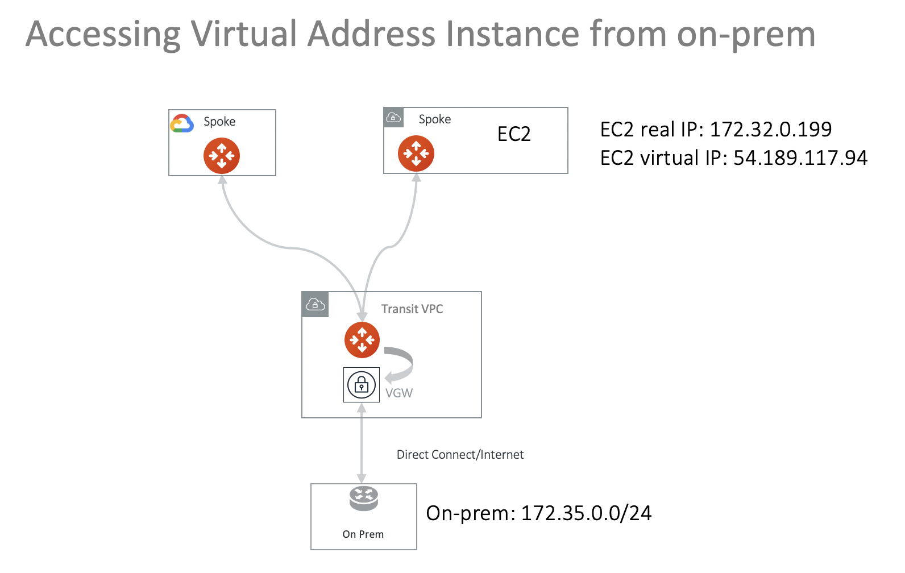
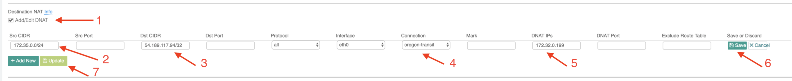

===========================================================================================
Accessing a Virtual IP address instance via Aviatrix Transit Network 
===========================================================================================

This document addresses the scenario where a customer on-prem firewall device needs to route encrypted 
traffic to a partner network in the cloud (AWS/Azure/GCP). 
However due to concerns for overlapping CIDR blocks to the customer network, the customer side enforces a policy that the destination IP address must be a public or a virtual IP address regardless if the partner network is in the RFC 1918 range. 

For example, the VPC instance IP address that the on-prem machine 
should send data to is 172.32.0.199, but the on-prem machine must instead send data to a virtual IP address 54.189.117.94 (or even 100.100.100.100).  

Normally this problem can be solved by combining `Site2Cloud <https://docs.aviatrix.com/HowTos/site2cloud.html>`_ feature and `DNAT <https://docs.aviatrix.com/HowTos/gateway.html#destination-nat>`_ feature. 

There are situations where there are multiple applications in different VPCs, it is desirable to access different virtual addresses
without building multiple IPSEC tunnels to the cloud networks.  This can be accomplished by building an 
Aviatrix Transit Network where Spoke VPCs host these different applications, as shown in the diagram below. 

|transit_publicIP|

Below are the configuration steps. 

Step 1: Determine the virtual IP address
-------------------------------------------

As this virtual IP address is what the on-prem host sees, it should not change. There are a couple of ways to determine it.

You can allocate an EIP in the VPC for this virtual IP address. Make sure you don't associate this EIP to any instance.

Alternatively, if the EC2 instance that on-prem hosts need to send data to has an EIP, 
you can use that EIP. 

You can also try a reserved public IP address range, for example, 100.100.x.x range, if the customer does not object. 

Step 2: Follow the Transit Network workflow to launch a Spoke gateway 
-----------------------------------------------------------------------

Login to the Controller console, go to Site2Cloud. Follow step 1 to launch a gateway in the VPC 172.32.0.0/16. In this example the gateway name is Spoke1. 

(You can follow the `gateway launch instructions in this <http://docs.aviatrix.com/HowTos/gateway.html>`_. Leave optional parameters unchecked.) 

Step 3: Customize Spoke gateway advertised routes
-----------------------------------------------------------------------

Go to Gateway page, highlight the Spoke gateway created in the previous step, click Edit. 

Scroll down to "Customize Spoke Advertised VPC CIDRs", enter, in this example, 54.189.117.94/32

With this customization, the Spoke gateway advertises 54.189.117.94/32 to Transit Gateway and subsequently to on-prem.

Step 4: Attach the Spoke gatewway
---------------------------------------------

Follow the Transit Network -> Setup -> Step 6a, Attach Spoke GW to Transit VPC. 

Step 5: Configure DNAT on Spoke gateway
------------------------------------------

This step is to configure the Spoke gateway to translate the destination virtual IP address 54.189.117.94 to the real 
private IP address 172.32.0.199.

At the main navigation bar, click Gateway. Highlight the Spoke gateway, and click Edit. 

Scroll down to Destination NAT. Follow the instructions `here <https://docs.aviatrix.com/HowTos/gateway.html#destination-nat>`_ to configure, as shown below. Note to use "Connection" field to specify the site2cloud connection name configured in Step 3. 

|dnat_config|

Step 6. Test! 
---------------------------------------------------------

Test connectivity from on-prem host to the EC2 instance. For example, ping the virtual IP address 54.189.117.94 from an on-prem host machine. The ping should reach 172.32.0.199.  

   

.. disqus::    
