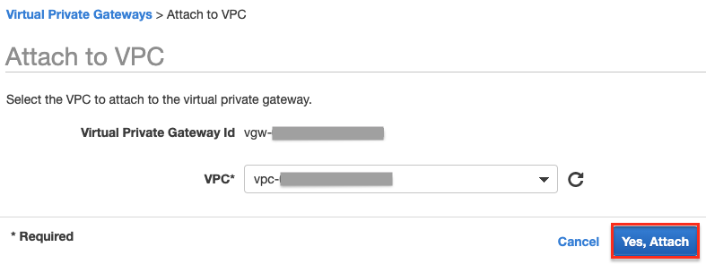
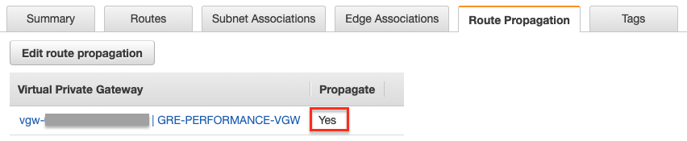
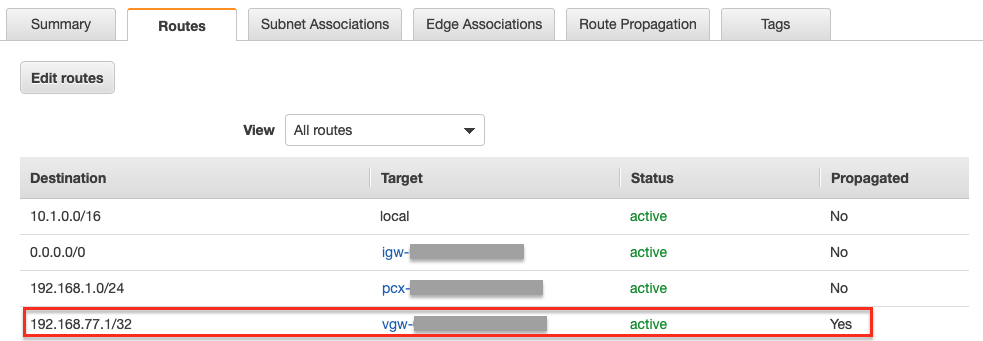
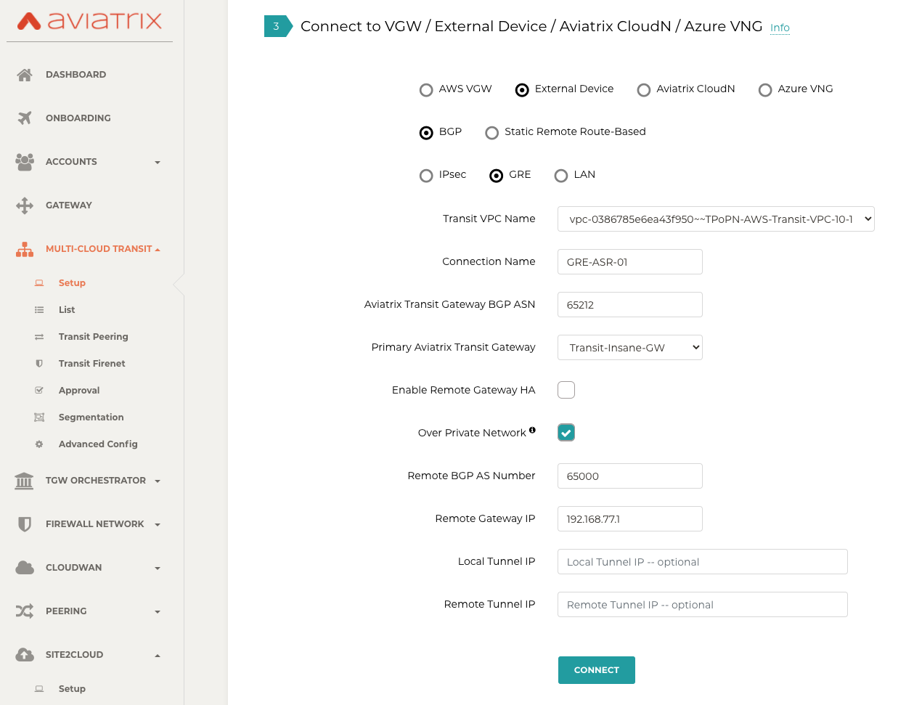
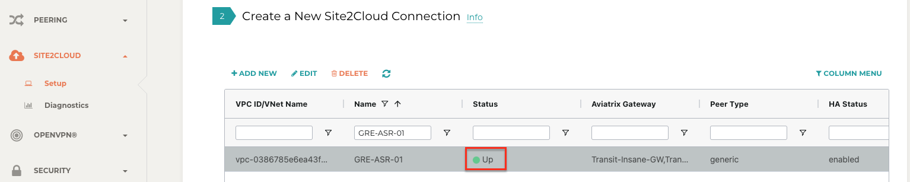
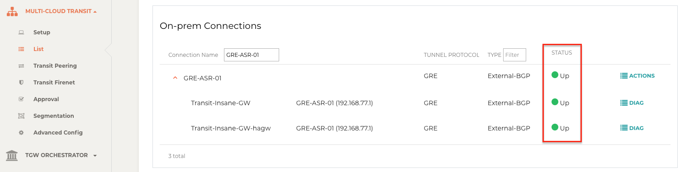
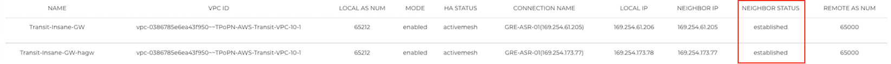
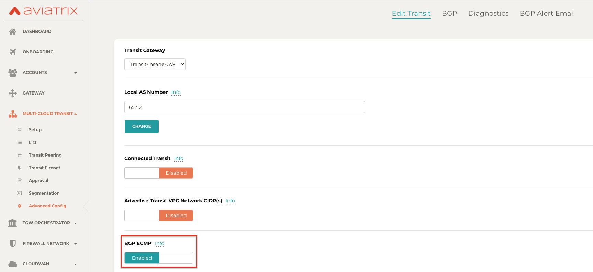
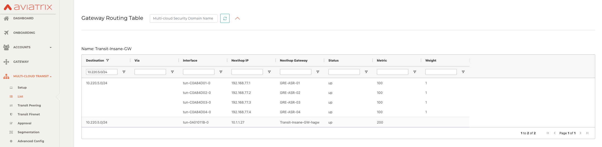
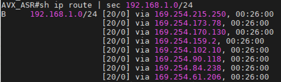

.. meta::
  :description: Multi-cloud Transit Gateway to External Device with BGP over GRE high performance workflow
  :keywords: Aviatrix Transit network, Private Network, AWS Direct Connect, BGP over GRE, External Device, High Performance

==========================================================================================
GRE Tunneling for Multi-cloud Transit Gateway to On-Prem Workflow
==========================================================================================

Introduction
============

Connecting to on-prem network over GRE tunneling protocol in AWS is an alternative to IPsec. 
When GRE tunneling is used, Aviatrix Multi-cloud Transit Gateways interoperate directly with on-prem network devices over AWS Direct Connect.  

When on-prem to cloud encryption is not required, using GRE allows you to achieve high performance throughput (10Gbps) without the need to 
deploy Aviatrix CloudN appliance. 

The solution is shown in the diagram below, 

|transit_gateway_external_device_bgp_over_gre_diagram|

where Aviatrix Multi-Cloud Transit Gateways connect to an on-prem Edge Router over Direct Connect. 

This document gives step-by-step instructions on how to build Aviatrix Transit Gateway to External Device using GRE over AWS Direct Connect. 
In this Tech Note, you learn the following:

#. Workflow on `building underlay connectivity with AWS Direct Connect 10 Gbps capacity <https://docs.aviatrix.com/HowTos/transit_gateway_external_device_bgp_over_gre_high_performance_workflow.html#build-underlay-connectivity-with-aws-direct-connect>`_

#. Workflow on `deploying Aviatrix Transit Solution <https://docs.aviatrix.com/HowTos/transit_gateway_external_device_bgp_over_gre_high_performance_workflow.html#deploy-aviatrix-multi-cloud-transit-solution>`_

#. Workflow on `establishing connectivity between Edge Router and Aviatrix Transit Gateway to form GRE tunnel <https://docs.aviatrix.com/HowTos/transit_gateway_external_device_bgp_over_gre_high_performance_workflow.html#build-connectivity-between-edge-router-and-aviatrix-transit-gateway>`_

#. Workflow on `building GRE tunnel and BGP over GRE <https://docs.aviatrix.com/HowTos/transit_gateway_external_device_bgp_over_gre_high_performance_workflow.html#build-gre-tunnel-and-bgp-over-gre>`_

#. Workflow on `enabling ECMP Load Balancing to achieve high performance <https://docs.aviatrix.com/HowTos/transit_gateway_external_device_bgp_over_gre_high_performance_workflow.html#configure-ecmp-load-balancing-for-high-performance>`_

For more information about Multi-Cloud Transit Network and External Device, please see these documents:

- `Multi Cloud Global Transit FAQ <https://docs.aviatrix.com/HowTos/transitvpc_faq.html#multi-cloud-global-transit-faq>`_
- `Global Transit Network Workflow Instructions (AWS/Azure/GCP/OCI) <https://docs.aviatrix.com/HowTos/transitvpc_workflow.html>`_
- `Aviatrix Transit Gateway to External Devices <https://docs.aviatrix.com/HowTos/transitgw_external.html>`_
- `Transit Network Design Patterns <https://docs.aviatrix.com/HowTos/transitvpc_designs.html>`_

.. important::
	
  - This solution supports only `ActiveMesh 2.0 <https://docs.aviatrix.com/HowTos/activemesh_faq.html#what-is-activemesh-2-0>`_, please check this doc `How to migrate to ActiveMesh 2.0 <https://docs.aviatrix.com/HowTos/activemesh_faq.html#how-to-migrate-to-activemesh-2-0>`_ for migration detail.
  - This solution is not available to Azure and GCP as they do not support GRE.
  - Reachability between Transit VPC CIDR and Edge Router is customers' responsibility which is typically done by Colocation data center providers.
  - Workflow on building underlay connectivity for private network with AWS Direct Connect here is just an example. Please adjust the topology depending on your requirements.
	

The key ideas for this solution are:
----------------------------------------
  
- The Edge (WAN) Router runs a BGP session to AWS VGW via AWS Direct Connect where the Edge Router advertises its GRE IPs. AWS VGW advertises the AWS Transit VPC CIDR.
- Leverage Edge Router BGP ECMP feature.
- Configure multiple GRE tunnels for greater aggregate throughput. 
  
.. important::

  - Reachability between Transit VPC CIDR and Edge Router is the responsibility of customer.

Prerequisite
====================

- This feature is available for 6.3 and later. `Upgrade <https://docs.aviatrix.com/HowTos/inline_upgrade.html>`_ Aviatrix Controller to at least version 6.3
  
- In this example, we are going to deploy the below VPCs in AWS:

  - AWS Aviatrix Transit VPC (i.e. 10.1.0.0/16) by utilizing Aviatrix feature `Create a VPC <https://docs.aviatrix.com/HowTos/create_vpc.html>`_ with Aviatrix FireNet VPC option enabled

  - AWS Aviatrix Spoke VPC (i.e. 192.168.1.0/24) by utilizing Aviatrix feature `Create a VPC <https://docs.aviatrix.com/HowTos/create_vpc.html>`_ as the previous step or manually deploying it in each cloud portal. Moreover, feel free to use your existing cloud network.

- Edge Router has high throughput supported on hardware interface(s) and GRE tunnel(s)
  
Building Underlay Connectivity with AWS Direct Connect
===================================================================================

Building AWS Direct Connect is customer's responsibility. For more information about AWS Direct Connect, please see `Connect Your Data Center to AWS <https://aws.amazon.com/getting-started/projects/connect-data-center-to-aws/>`_.
  
Please adjust the topology depending on your requirements. 

Building AWS Direct Connect
-----------------------------------

See `Equinix ECX Fabric AWS Direct Connect <https://docs.equinix.com/en-us/Content/Interconnection/ECXF/connections/ECXF-aws-direct-connect.htm>`_ if users select Equinix solution. This is just an example here. Make sure to select 10 Gbps capacity.

Associating AWS VGW to AWS Transit VPC
-----------------------------------------------

1. Log in to the AWS VPC Portal and select **Virtual Private Gateways** under the Virtual Private Network (VPN) sidebar. 
3. Select the Virtual Private Gateway that you have the private virtual interface to AWS Direct Connect
4. Click **Actions**.
5. Select **Attach to VPC**.
6. Select the AWS Transit VPC and click **Yes, Attach**.

  |aws_vgw_attach|
	
Deploying the Aviatrix Multi-Cloud Transit Solution
=================================================

Refer to `Global Transit Network Workflow Instructions <https://docs.aviatrix.com/HowTos/transitvpc_workflow.html>`_ for the steps below. Please adjust the topology depending on your requirements.

Step 2.1. Deploy Aviatrix Multi-Cloud Transit Gateway and HA in AWS
-------------------------------------------------------------------

- Follow this step `Deploy the Transit Aviatrix Gateway <https://docs.aviatrix.com/HowTos/transit_firenet_workflow_aws.html#step-2-deploy-the-transit-aviatrix-gateway>`_ to launch Aviatrix Transit gateway and enable HA with insane mode enabled in AWS Transit VPC

- In this example, sizes c5n.2xlarge and c5n.4xlarge are selected to benchmark `performance <https://docs.aviatrix.com/HowTos/transit_gateway_external_device_bgp_over_gre_high_performance_workflow.html#performance-benchmark>`_.

Enabling Route Propagation on the Subnet Route Table where Aviatrix Transit Gateway Locates on AWS Portal
---------------------------------------------------------------------------------------------------------------------------------------

1. Log in to the AWS VPC portal and locate the subnet route table where Aviatrix Transit Gateway is located.
2. Select **Route Propagation** tab.
3. Click **Edit route propagation**.
4. Locate the AWS VGW that is associated with this Transit VPC and mark the **Propagate** checkbox.
5. Click **Save**.
6. Check whether the Propagate status is Yes.

  |aws_route_propagation_status_yes|
	
Deploying Spoke Gateway and HA
--------------------------------------

Follow this step `Deploy Spoke Gateways <https://docs.aviatrix.com/HowTos/transit_firenet_workflow_aws.html#step-3-deploy-spoke-gateways>`_ to launch Aviatrix Spoke gateway and enable HA with insane mode enabled in AWS Spoke VPC.

In this example, sizes c5n.2xlarge and c5n.4xlarge are selected to benchmark `performance <https://docs.aviatrix.com/HowTos/transit_gateway_external_device_bgp_over_gre_high_performance_workflow.html#performance-benchmark>`_.

Attaching Spoke Gateways to Transit Network
-----------------------------------------------------------

Follow this step `Attach Spoke Gateways to Transit Network <https://docs.aviatrix.com/HowTos/transit_firenet_workflow_aws.html#step-4-attach-spoke-gateways-to-transit-network>`_ to attach Aviatrix Spoke Gateways to Aviatrix Transit Gateways in AWS.

Building Connectivity between Edge Router and Aviatrix Transit Gateway 
==========================================================================================================

Cisco ASR is used as an Edge Router in this example.  

Checking Whether the Edge Router has Learned AWS Transit VPC CIDR via the BGP Session Between Edge Router and AWS Direct Connect
--------------------------------------------------------------------------------------------------------------------------------------------------------------------------

#. Log in to the Edge Router (i.e. Cisco ASR) 
#. Check whether Edge Router has learned AWS Transit VPC CIDR via the BGP session between Edge Router and AWS Direct Connect by issuing the related "show ip bgp" command 
  
  Simple Cisco IOS example::

    #show ip bgp

Preparing IP for GRE source IP on Edge Router
-----------------------------------------------------

In this example, we use ASR loopback interface with an unique IP address as a GRE source IP.

Create a loopback interface and assign an IP to itself as a GRE source IP.

  Simple Cisco IOS example::

    #configure t

      (config)#interface Loopback77

      (config-if)#ip address 192.168.77.1 255.255.255.255

Advertising that GRE source IP on Edge Router to the BGP Session Between Edge Router and AWS Direct Connect
---------------------------------------------------------------------------------------------------------------------------------------------

The purpose of this step is to let AWS VGW learn the GRE source IP on Edge Router via BGP session between Edge Router and AWS Direct Connect, so that Aviatrix Transit Gateway can reach the GRE source IP on Edge Router to form GRE tunnel over AWS Direct Connect.

To demonstrate this concept in a simple fashion, we utilize IOS "ip prefix-list" function and apply it on BGP neighbor with direction out function to distribute GRE source IP.

Create a prefix list that defines GRE source IP on Edge Router for BGP advertisement.

  Simple Cisco IOS example::

    #configure t

    (config)#ip prefix-list Router-to-VGW description Advertised GRE source CIDRs 192.168.77.X/32 to build GRE tunnels

    (config)#ip prefix-list Router-to-VGW seq 10 permit 192.168.77.1/32
  
Apply this prefix list to outgoing BGP advertisements

  Simple Cisco IOS example::

    #configure t

    (config)#router bgp 65000

    (config-router)#address-family ipv4

    (config-router-af)#neighbor 169.254.253.17 prefix-list Router-to-VGW out

  Notes::

    The IP 169.254.253.17 in this example here is the AWS Direct Connect BGP Peer IP.

Checking Route Propagation Info on AWS Portal
-----------------------------------------------------------
	
#. Log in to the AWS VPC portal and locate the subnet route table where Aviatrix Transit Gateway is located.
#. Select the **Routes** tab.
#. Check whether there is a route entry "GRE source IP on Edge Router pointing to AWS VGW."

  |aws_route_propagation_routing_entry|
    
Confirming that Edge Router and Aviatrix Transit Gateway can Reach to each other IP for GRE Tunnel
-------------------------------------------------------------------------------------------------------------------------------

Build GRE tunnel and BGP over GRE
================================================

Configuring GRE tunnel and BGP on Aviatrix Transit Gateway
--------------------------------------------------------------------

1. Log in to your Aviatrix Controller and navigate to Multi-Cloud Transit > Setup > External Device tab.
2. Select option External Device > BGP > GRE.
3. Use the fields below to set up GRE tunnel to Edge Router.
  
  +----------------------------------+-------------------------------------------------------------------------------------------------+
  | Transit VPC Name                 | Select the Transit VPC ID where Transit GW was launched.                                        |
  +----------------------------------+-------------------------------------------------------------------------------------------------+
  | Connection Name                  | Provide a unique name to identify the connection to external device.                            |
  +----------------------------------+-------------------------------------------------------------------------------------------------+
  | Aviatrix Transit Gateway BGP ASN | Configure a BGP AS number that the Transit GW will use to exchange routes with external device. |
  +----------------------------------+-------------------------------------------------------------------------------------------------+
  | Primary Aviatrix Transit Gateway | Select the Transit GW.                                                                          |
  +----------------------------------+-------------------------------------------------------------------------------------------------+
  | Enable Remote Gateway HA         | Don't check this option in this example.                                                        |
  +----------------------------------+-------------------------------------------------------------------------------------------------+
  | Over Private Network             | Check this option since AWS Direct Connect is underlay network                                  |
  +----------------------------------+-------------------------------------------------------------------------------------------------+
  | Remote BGP AS Number             | Configure a BGP AS number that Edge Router will use to exchange routes with Transit GW          |
  +----------------------------------+-------------------------------------------------------------------------------------------------+
  | Local Tunnel IP                  | Leave it blank in this example.                                                                 |
  +----------------------------------+-------------------------------------------------------------------------------------------------+
  | Remote Tunnel IP                 | Leave it blank in this example.                                                                 |
  +----------------------------------+-------------------------------------------------------------------------------------------------+

4. Click **Connect** to generate GRE tunnel and BGP session over it.

  |aviatrix_transit_externel_device_gre|
  
Downloading the GRE Configuration Sample from Aviatrix Controller
---------------------------------------------------------------------------------------

1. Navigate to Site2Cloud > Setup.
2. Select the connection that you created with “Connection Name” in the previous step
3. Click **Edit**.
4. Select Cisco as Vendor type, ISR, ASR or CSR as Platform, and IOS(XE) as Software for this example.
5. Click **Download Configuration**.

Configuring GRE tunnel on Edge Router
-----------------------------------------------------

1. Open the downloaded GRE configuration file.
2. Populate these values as follows based on your setup throughout the Tunnel Interface Configuration.

  - <tunnel_number1>: the primary GRE tunnel interface number connecting Aviatrix Transit Primary Gateway (i.e. 11)
  - <tunnel_number2>: the secondary GRE tunnel interface number connecting Aviatrix Transit HA Gateway (i.e. 12)
  - <ios_wan_interface1>: the IP which is assigned on the Loopback interface as an GRE source IP (i.e. 192.168.77.1)
  - <ios_wan_interface2>: the IP which is assigned on the Loopback interface as an GRE source IP (i.e. 192.168.77.1)

3. Copy and paste the updated Tunnel Interface Configuration into Edge Router 

  Simple Cisco IOS example::

    interface Tunnel 11
    ip address 169.254.61.205 255.255.255.252
    ip mtu 1436
    ip tcp adjust-mss 1387
    tunnel source 192.168.77.1
    tunnel destination 10.1.0.185
    ip virtual-reassembly
    no keepalive
    exit

    interface Tunnel 12
    ip address 169.254.173.77 255.255.255.252
    ip mtu 1436
    ip tcp adjust-mss 1387
    tunnel source 192.168.77.1
    tunnel destination 10.1.1.27
    ip virtual-reassembly
    no keepalive
    exit
   
Configuring BGP over GRE tunnel on Edge Router
---------------------------------------------------------------------
      
1. Open the downloaded GRE configuration file and copy and paste the BGP Routing Configuration into Edge Router.

  Simple Cisco IOS example::

    router bgp 65000
    bgp log-neighbor-changes
    neighbor 169.254.61.206 remote-as 65212
    neighbor 169.254.61.206 timers 10 30 30
    neighbor 169.254.173.78 remote-as 65212
    neighbor 169.254.173.78 timers 10 30 30
    !
    address-family ipv4
    redistribute connected
    neighbor 169.254.61.206 activate
    neighbor 169.254.61.206 soft-reconfiguration inbound
    neighbor 169.254.173.78 activate
    neighbor 169.254.173.78 soft-reconfiguration inbound
    maximum-paths 4
    exit-address-family
  
2. Create a prefix list that defines CIDR where server locates in on-prem/co-location for BGP advertisement.

  Simple Cisco IOS example::

    #configure t

    (config)#ip prefix-list Router-To-Transit-GRE description Advertised on-prem CIDRs 10.220.5.0/24

    (config)#ip prefix-list Router-To-Transit-GRE seq 10 permit 10.220.5.0/24

3. Apply the prefix list to outgoing BGP advertisements.

  Simple Cisco IOS example::

    #configure t

    (config)#router bgp 65000

    (config-router)#address-family ipv4

    (config-router-af)#neighbor 169.254.61.206 prefix-list Router-To-Transit-GRE out

    (config-router-af)#neighbor 169.254.173.78 prefix-list Router-To-Transit-GRE out

Verifying GRE Tunnel Status on Aviatrix Controller
----------------------------------------------------------

1. Navigate back to Aviatrix Controller and open Site2Cloud > Setup.
2. Find the connection that you created with Connection Name in the previous step.
3. Check the Tunnel Status.

  |aviatrix_gre_status_1|

4. Go to Multi-Cloud Transit > List.
5. Select the Transit Primary Gateway that was created in the previous step.
6. Click **Details/Diag**.
7. Scroll down to Connections > On-prem Connections.
8. Find the connection that you created with Connection Name in the previous step and check the Tunnel Status.

  |aviatrix_gre_status_2|

Verifying BGP session status on Aviatrix Controller
----------------------------------------------------------

1. Go to Multi-Cloud Transit > BGP.
2. Find the connection that you created with Connection Name in the previous step and check the BGP Status.

  |aviatrix_gre_bgp_status|

Configuring ECMP Load Balancing for High Performance
=====================================================================

Building Multiple GRE tunnels between Edge Router and Aviatrix Transit Gateway
-------------------------------------------------------------------------------------------------------

1. Building multiple GRE tunnels by repeating `"Build connectivity between Edge Router and Aviatrix Transit Gateway" <https://docs.aviatrix.com/HowTos/transit_gateway_external_device_bgp_over_gre_high_performance_workflow.html#build-connectivity-between-edge-router-and-aviatrix-transit-gateway>`_.
2. Build multiple BGP over GRE tunnels by repeating `"Build GRE tunnel and BGP over GRE" <https://docs.aviatrix.com/HowTos/transit_gateway_external_device_bgp_over_gre_high_performance_workflow.html#build-gre-tunnel-and-bgp-over-gre>`_.

In this example, we build up to 4 pairs of GRE connections (total up to 8 tunnels) to benchmark `performance <https://docs.aviatrix.com/HowTos/transit_gateway_external_device_bgp_over_gre_high_performance_workflow.html#performance-benchmark>`_. 

  |aviatrix_multiple_gre|

Enabling BGP ECMP feature on Aviatrix Transit Gateway
-------------------------------------------------------------

1. Navigate back to Aviatrix Controller
2. Go to Multi-Cloud Transit > Advanced Config > Edit Transit Tab. 
3. Select the Transit Gateway that was created in the previous step.
4. Scroll down to `BGP ECMP <https://docs.aviatrix.com/HowTos/transit_advanced.html#bgp-ecmp>`_ and enable it.

  |aviatrix_gre_bgp_ecmp_function|
  
Verifying BGP ECMP feature on Aviatrix Controller
----------------------------------------------------------------

1. Go to Multi-Cloud Transit > List.
2. Select the Transit Primary Gateway that was created in the previous step.
3. Click **DETAILS/DIAG**.
4. Scroll down to Gateway Routing Table.
5. Click **Refresh**.
6. Search for the on-prem CIDR in the Destination column.
7. Check whether there are multiple GRE tunnels with same Metric and Weight under the same route entry.

  |aviatrix_gre_bgp_verify_ecmp_function|

Enabling the BGP ECMP feature on Edge Router
-----------------------------------------------------------------

Configure "maximum-paths" with higher number of equal-cost routes in BGP settings so that BGP will install in the routing table. In this example, we configure "maximum-paths 8" to achieve high performance over multiple GRE tunnels. 

  Simple Cisco IOS example::

    #configure t

    (config)#router bgp 65000

    (config-router)#address-family ipv4

    (config-router-af)#maximum-paths 8

- Modify ECMP Load Balancing algorithm depending on traffic type.

  Simple Cisco IOS example::

    #configure t

    (config)#ip cef load-sharing algorithm include-ports source destination
    
Verifying the BGP ECMP feature on Edge Router
-------------------------------------------------------------

Check whether BGP install equal-cost routes in the routing table by issuing the related command "show ip bgp."

  |asr_gre_bgp_verify_ecmp_function|

Ready to Go
=================

At this point, run connectivity and performance test to ensure everything is working correctly. 

Performance Benchmarks
===========================

End-to-End traffic via Aviatrix <-> Cisco ASR
---------------------------------------------

Multiple flows result by using iperf3 tool with TCP 128 connections
^^^^^^^^^^^^^^^^^^^^^^^^^^^^^^^^^^^^^^^^^^^^^^^^^^^^^^^^^^^^^^^^^^^

+-----------------------+---------------------------------------------+---------------------------------------------+
| Aviatrix Gateway size | 3 pairs of GRE connections (total 6 tunnels)| 4 pairs of GRE connections (total 8 tunnels)|
+-----------------------+---------------------------------------------+---------------------------------------------+
| C5n.2xlarge           | 8.0 - 8.3 (Gbps)                            | 8.3 - 9.1 (Gbps)                            |
+-----------------------+---------------------------------------------+---------------------------------------------+
| C5n.4xlarge           | 9.0 - 9.3 (Gbps)                            | 9.2 - 9.3 (Gbps)                            |
+-----------------------+---------------------------------------------+---------------------------------------------+

Single flow result by using iperf3 tool with TCP 1 connection: 
^^^^^^^^^^^^^^^^^^^^^^^^^^^^^^^^^^^^^^^^^^^^^^^^^^^^^^^^^^^^^^

1.6 - 2.4 (Gbps) for both sizes C5n.2xlarge and C5n.4xlarge

.. |transit_gateway_external_device_bgp_over_gre_diagram| image:: transit_gateway_external_device_bgp_over_gre_high_performance_workflow_media/transit_gateway_external_device_bgp_over_gre_diagram.png
   :scale: 50%
	 

	 

	 

   

   

   

.. |aviatrix_multiple_gre| image:: transit_gateway_external_device_bgp_over_gre_high_performance_workflow_media/aviatrix_multiple_gre.png
   :scale: 30%    

.. disqus::

