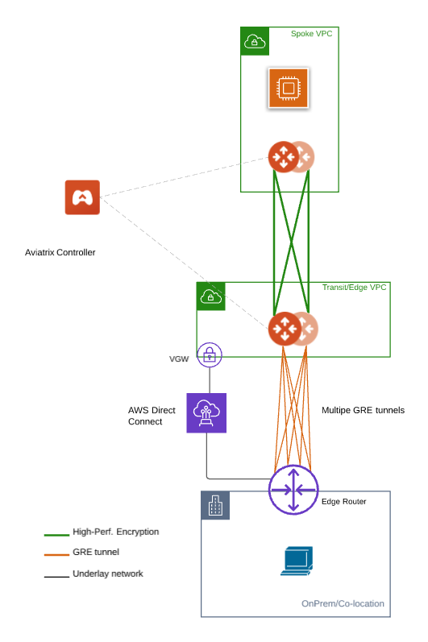

.. meta::
  :description: Multi-cloud Transit Gateway to External Device with BGP over GRE high performance workflow
  :keywords: Aviatrix Transit network, Private Network, AWS Direct Connect, BGP over GRE, External Device, High Performance

==========================================================================================
GRE Tunneling for Multi-cloud Transit Gateway to On-prem Workflow
==========================================================================================

Introduction
============

Connecting to on-prem network over GRE tunneling protocol in AWS is an alternative to IPSec. 
When GRE tunneling is used, Aviatrix Multi-cloud Transit Gateways interoperate directly with on-prem network devices over AWS Direct Connect.  

When on-prem to cloud encryption is not required, using GRE allows you to achieve high performance throughput (10Gbps) without the need to 
deploy Aviatrix CloudN appliance. 

The solution is shown in the diagram below, 

|transit_gateway_external_device_bgp_over_gre_diagram|

where Aviatrix Multi-cloud Transit Gateways connect to an on-prem edge router over Direct Connect. 

This document describes a step-by-step instruction on how to build Aviatrix Transit Gateway to External Device using GRE over AWS Direct Connect. 
In this Tech Note, you learn the following:

#. Workflow on building underlay connectivity with AWS Direct Connect 10 Gbps capacity

#. Workflow on deploying Aviatrix Transit Solution

#. Workflow on establishing connectivity between Edge router and Aviatrix Transit Gateway to form GRE tunnel

#. Workflow on building GRE tunnel and BGP over GRE

#. Workflow on enabling ECMP Load Balancing to achieve high performance

For more information about Multi-Cloud Transit Network and External Device, please check out the below documents:

  - `Multi Cloud Global Transit FAQ <https://docs.aviatrix.com/HowTos/transitvpc_faq.html#multi-cloud-global-transit-faq>`_
  - `Global Transit Network Workflow Instructions (AWS/Azure/GCP/OCI) <https://docs.aviatrix.com/HowTos/transitvpc_workflow.html>`_
  - `Aviatrix Transit Gateway to External Devices <https://docs.aviatrix.com/HowTos/transitgw_external.html>`_
  - `Transit Network Design Patterns <https://docs.aviatrix.com/HowTos/transitvpc_designs.html>`_

.. important::
	
	- This solution supports only `ActiveMesh 2.0 <https://docs.aviatrix.com/HowTos/activemesh_faq.html#what-is-activemesh-2-0>`_, please check this doc `How to migrate to ActiveMesh 2.0 <https://docs.aviatrix.com/HowTos/activemesh_faq.html#how-to-migrate-to-activemesh-2-0>`_ for migration detail.
        - This solution is not available to  Azure and GCP as they do not support GRE.
	- Reachability between Transit CIDR and Edge Router is customers' responsibility which is typically done by Colocation data center providers.
	- Workflow on building underlay connectivity for private network with AWS Direct Connect here is just an example. Please adjust the topology depending on your requirements.
	

The key ideas for this solution are:
----------------------------------------
  
  - The edge (WAN) router runs a BGP session to AWS VGW via AWS Direct Connect where the edge router advertises its GRE IPs. AWS VGW advertises the AWS Transit VPC CIDR.
  - Leverage Edge router BGP ECMP feature.
  - Configure multiple GRE tunnels for greater aggregate throughput. 
  
.. important::

  - Reachability between Transit CIDR and Edge Router is the responsibility of customer.

Prerequisite
====================

- This feature is available for 6.3 and later. `Upgrade <https://docs.aviatrix.com/HowTos/inline_upgrade.html>`_ Aviatrix Controller to at least version 6.3
  
- In this example, we are going to deploy the below VPCs in AWS:

	- AWS Aviatrix Transit VPC (i.e. 10.1.0.0/16) by utilizing Aviatrix feature `Create a VPC <https://docs.aviatrix.com/HowTos/create_vpc.html>`_ with Aviatrix FireNet VPC option enabled

	- AWS Aviatrix Spoke VPC (i.e. 192.168.1.0/24) by utilizing Aviatrix feature `Create a VPC <https://docs.aviatrix.com/HowTos/create_vpc.html>`_ as the previous step or manually deploying it in each cloud portal. Moreover, feel free to use your existing cloud network.

- Edge Router has high throughput supported on hardware interface(s) and GRE tunnel(s)
  
1. Building underlay connectivity with AWS Direct Connect
===================================================================================

Building AWS Direct Connect is customer's responsibility. For more information about AWS Direct Connect, please check out the below documents:

  - Refer to `Connect Your Data Center to AWS <https://aws.amazon.com/getting-started/projects/connect-data-center-to-aws/>`_
  
Please adjust the topology depending on your requirements. 

Step 1.1. Build AWS Direct Connect
-----------------------------------

  - Refer to `Equinix ECX Fabric AWS Direct Connect <https://docs.equinix.com/en-us/Content/Interconnection/ECXF/connections/ECXF-aws-direct-connect.htm>`_ if users select Equinix solution. This is just an example here.

  - Make sure select 10 Gbps capacity

Step 1.2. Associate AWS VGW to AWS Transit VPC
-----------------------------------------------

	- Login AWS VPC Portal
	
	- Click the hyperlink "Virtual Private Gateways" under sidebar "VIRTUAL PRIVATE NETWORK (VPN)"
	
	- Select the Virtual Private Gateway that you have the private virtual interface to AWS Direct Connect
	
	- Click the button "Actions"
	
	- Click the hyperlink "Attach to VPC"
	
	- Select the AWS Transit VPC and click the button "Yes, Attach"
	
2.  Deploy Aviatrix Multi-Cloud Transit Solution
=================================================

Refer to `Global Transit Network Workflow Instructions <https://docs.aviatrix.com/HowTos/transitvpc_workflow.html>`_ for the below steps. Please adjust the topology depending on your requirements.

Step 2.1. Deploy Aviatrix Multi-Cloud Transit Gateway and HA in AWS
-------------------------------------------------------------------

	- Follow this step `Deploy the Transit Aviatrix Gateway <https://docs.aviatrix.com/HowTos/transit_firenet_workflow_aws.html#step-2-deploy-the-transit-aviatrix-gateway>`_ to launch Aviatrix Transit gateway and enable HA with insane mode enabled in AWS Transit VPC
	
	- Instance size of at least c5.xlarge will be required for `Insane Mode Encryptions <https://docs.aviatrix.com/HowTos/gateway.html#insane-mode-encryption>`_ for higher throughput. 
  
  - Recommended minimum size for Transit in AWS is c5n.4xlarge. Please refer to this `doc <https://docs.aviatrix.com/HowTos/insane_mode_perf.html>`_ for performance detail.

Step 2.2. Enable Route Propagation on the subnet route table where Aviatrix Transit Gateway locates on AWS portal
------------------------------------------------------------------------------------------------------------------

	- Login AWS VPC portal
	
	- Locate the subnet route table where Aviatrix Transit Gateway locates
	
	- Select the tab "Route Propagation"
	
	- Click the button "Edit route propagation"

	- Locate the AWS VGW that is associated with this Transit VPC and check the checkbox "Propagate"
	
	- Click the button "Save"
	
	- Check whether the Propagate status is Yes
	
		|aws_route_propagation_status_yes|
	
Step 2.3. Deploy Spoke Gateway and HA
--------------------------------------

	- Follow this step `Deploy Spoke Gateways <https://docs.aviatrix.com/HowTos/transit_firenet_workflow_aws.html#step-3-deploy-spoke-gateways>`_ to launch Aviatrix Spoke gateway and enable HA with insane mode enabled in AWS Spoke VPC
	
	- Instance size of at least c5.xlarge will be required for `Insane Mode Encryptions <https://docs.aviatrix.com/HowTos/gateway.html#insane-mode-encryption>`_ for higher throughput. Please refer to this `doc <https://docs.aviatrix.com/HowTos/insane_mode_perf.html>`_ for performance detail.
	
Step 2.4. Attach Spoke Gateways to Transit Network
--------------------------------------------------

	- Follow this step `Attach Spoke Gateways to Transit Network <https://docs.aviatrix.com/HowTos/transit_firenet_workflow_aws.html#step-4-attach-spoke-gateways-to-transit-network>`_ to attach Aviatrix Spoke Gateways to Aviatrix Transit Gateways in AWS

3. Build connectivity between Edge router and Aviatrix Transit Gateway 
==========================================================================================================

Cisco ASR is used as an Edge router in this example.  

Step 3.1. Check whether Edge Router has learned AWS Transit VPC CIDR via the BGP session between Edge router and AWS Direct Connect
-----------------------------------------------------------------------------------------------------------------------------------

  - Login Edge Router (i.e. Cisco ASR) 
  
  - Check whether Edge Router has learned AWS Transit VPC CIDR via the BGP session between Edge router and AWS Direct Connect by issuing the related "show ip bgp" command 
  
    Simple Cisco IOS example::

      #show ip bgp

Step 3.2. Prepare IP for GRE source IP on Edge Router
-----------------------------------------------------

In this example, we use ASR loopback interface with an unique IP address as a GRE source IP.

  - Create a loopback interface and assign an IP to itself as a GRE source IP.
 
    Simple Cisco IOS example::

      #configure t

      (config)#interface Loopback77

      (config-if)#ip address 192.168.77.1 255.255.255.255

Step 3.3. Advertise that GRE source IP on Edge Router to the BGP session between Edge router and AWS Direct Connect
-------------------------------------------------------------------------------------------------------------------

The purpose of this step is to let AWS VGW learn the GRE source IP on Edge Router via BGP session between Edge router and AWS Direct Connect, so that Aviatrix Transit Gateway can reach the GRE source IP on Edge router to form GRE tunnel over AWS Direct Connect.
To demonstrate this concept in a simple fashion, we utilize IOS "ip prefix-list" function and apply it on BGP neighbor with direction out function to distribute GRE source IP.

  - Create a prefix list that defines GRE source IP on Edge router for BGP advertisement
  
    Simple Cisco IOS example::

      #configure t

      (config)#ip prefix-list CN-11-to-VGW description Advertised CIDRs 192.168.77.0/24 to build GRE tunnels

      (config)#ip prefix-list CN-11-to-VGW seq 10 permit 192.168.77.1/32
  
  - Apply this prefix list to outgoing BGP advertisements
    
    Simple Cisco IOS example::
          
      #configure t

      (config)#router bgp 65000
      
      (config-router)#address-family ipv4
      
      (config-router-af)#neighbor 169.254.253.17 prefix-list CN-11-to-VGW out

  Notes::
  
    The IP 169.254.253.17 in this example here is the AWS Direct Connect BGP IP.

Step 3.4. Check route propagation info on AWS portal
----------------------------------------------------
	
	- Login AWS VPC portal
	
	- Locate the subnet route table where Aviatrix Transit Gateway locates
	
	- Select the tab "Routes"
	
	- Check whether there is a route entry "GRE source IP on Edge Router pointing to AWS VGW"
	
		|aws_route_propagation_routing_entry|
    
Step 3.4. Confirm that Edge router and Aviatrix Transit Gateway can reach to each other IP for GRE tunnel
----------------------------------------------------------------------------------------------------------

4. Build GRE tunnel and BGP over GRE
================================================

Step 4.1. Configure GRE tunnel and BGP on Aviatrix Transit Gateway
--------------------------------------------------------------------

  - Login Aviatrix Controller

  - Go to MULTI-CLOUD TRANSIT -> Setup -> 3) Connect to VGW / External Device / Aviatrix CloudN / Azure VNG
  
  - Select option "External Device" -> "BGP" -> "GRE"
  
  - Fill the parameters to set up GRE tunnel to Edge router
  
    +----------------------------------+-------------------------------------------------------------------------------------------------+
    | Transit VPC Name                 | Select the Transit VPC ID where Transit GW was launched.                                        |
    +----------------------------------+-------------------------------------------------------------------------------------------------+
    | Connection Name                  | Provide a unique name to identify the connection to external device.                            |
    +----------------------------------+-------------------------------------------------------------------------------------------------+
    | Aviatrix Transit Gateway BGP ASN | Configure a BGP AS number that the Transit GW will use to exchange routes with external device. |
    +----------------------------------+-------------------------------------------------------------------------------------------------+
    | Primary Aviatrix Transit Gateway | Select the Transit GW.                                                                          |
    +----------------------------------+-------------------------------------------------------------------------------------------------+
    | Enable Remote Gateway HA         | Don't check this option in this example.                                                        |
    +----------------------------------+-------------------------------------------------------------------------------------------------+
    | Over Private Network             | Check this option since AWS Direct Connect is underlay network                                  |
    +----------------------------------+-------------------------------------------------------------------------------------------------+
    | Remote BGP AS Number             | Configure a BGP AS number that Edge router will use to exchange routes with Transit GW          |
    +----------------------------------+-------------------------------------------------------------------------------------------------+
    | Local Tunnel IP                  | Leave it blank in this example.                                                                 |
    +----------------------------------+-------------------------------------------------------------------------------------------------+
    | Remote Tunnel IP                 | Leave it blank in this example.                                                                 |
    +----------------------------------+-------------------------------------------------------------------------------------------------+

  - Click the button "CONNECT" to generate GRE tunnel and BGP session over it
  
Step 4.2. Download the GRE configuration sample from Aviatrix Controller
---------------------------------------------------------------------------

  - Navigate to Site2Cloud
  
  - Click on the connection you created with “Connection Name”
  
  - Select Cisco as Vendor type, ISR, ASR or CSR as Platform, and IOS(XE) as Software for this example.
  
  - Click the button "Download Configuration".

Step 4.3. Configure GRE tunnel on Edge Router
---------------------------------------------

  - Open the downloaded GRE configuration file

  - Populate these values as follows based on your setup throughout the Tunnel Interface Configuration
  
    - <tunnel_number1>: the primary GRE tunnel interface number connecting Aviatrix Transit Primary Gateway (i.e. 11)
    
    - <tunnel_number2>: the secondary GRE tunnel interface number connecting Aviatrix Transit HA Gateway (i.e. 12)
    
    - <ios_wan_interface1>: the IP which is assigned on the Loopback interface as an GRE source IP (i.e. 192.168.77.1)

    - <ios_wan_interface2>: the IP which is assigned on the Loopback interface as an GRE source IP (i.e. 192.168.77.1)
  
  - Copy and paste the updated Tunnel Interface Configuration into Edge router 
  
    Simple Cisco IOS example::
    
      interface Tunnel 11
        ip address 169.254.61.205 255.255.255.252
        ip mtu 1436
        ip tcp adjust-mss 1387
        tunnel source 192.168.77.1
        tunnel destination 10.1.0.185
        ip virtual-reassembly
        no keepalive
        exit
      
      interface Tunnel 12
        ip address 169.254.173.77 255.255.255.252
        ip mtu 1436
        ip tcp adjust-mss 1387
        tunnel source 192.168.77.1
        tunnel destination 10.1.1.27
        ip virtual-reassembly
        no keepalive
        exit
   
Step 4.4. Configure BGP over GRE tunnel on Edge Router
---------------------------------------------------------
      
  - Open the downloaded GRE configuration file
  
  - Copy and paste the BGP Routing Configuration into Edge router 
  
    Simple Cisco IOS example::
    
      router bgp 65000
        bgp log-neighbor-changes
        neighbor 169.254.61.206 remote-as 65212
        neighbor 169.254.61.206 timers 10 30 30
        neighbor 169.254.173.78 remote-as 65212
        neighbor 169.254.173.78 timers 10 30 30
       !
       address-family ipv4
        redistribute connected
        neighbor 169.254.61.206 activate
        neighbor 169.254.61.206 soft-reconfiguration inbound
        neighbor 169.254.173.78 activate
        neighbor 169.254.173.78 soft-reconfiguration inbound
       exit-address-family
  
  - Create a prefix list that defines CIDR where server locates in onprem/colocation for BGP advertisement
  
    Simple Cisco IOS example::

      #configure t

      (config)#ip prefix-list To-Transit-GRE description Advertised CIDRs 10.220.5.0/24

      (config)#ip prefix-list To-Transit-GRE seq 10 permit 10.220.5.0/24
  
  - Apply the prefix list to outgoing BGP advertisements
    
    Simple Cisco IOS example::
          
      #configure t

      (config)#router bgp 65000
      
      (config-router)#address-family ipv4
      
      (config-router-af)#neighbor 169.254.61.206 prefix-list To-Transit-GRE out
      
      (config-router-af)#neighbor 169.254.173.78 prefix-list To-Transit-GRE out

Step 4.5. Verify GRE tunnel status  
-------------------------------------

Step 4.6. Verify BGP session status  
-------------------------------------

5. Configure ECMP Load Balancing for high performance
=====================================================================

Step 5.1. Build multiple GRE tunnels between Edge router and Aviatrix Transit Gateway
----------------------------------------------------------------------------------------

- Build multiple GRE tunnels by repeating "Build connectivity between Edge router and Aviatrix Transit Gateway"

- Build multiple BGP over GRE tunnels by repeating "Build GRE tunnel and BGP over GRE"

Step 5.2. Enable ECMP feature on Aviatrix Transit Gateway
---------------------------------------------------------

https://docs.aviatrix.com/HowTos/transit_advanced.html#bgp-ecmp

- Navigate back to Aviatrix Controller

- Go to MULTI-CLOUD TRANSIT -> Advanced Config

- Select the Transit Gateway that was created in the previous step

- Scroll down to find the function "BGP ECMP" and enable it

Step 5.3. Enable ECMP feature on Edge router
--------------------------------------------

- Make sure "maximum-paths" is configured on BGP settings

- Tune ECMP Load Balancing settings if needed

5. Ready to go!
=================

At this point, run connectivity and performance test to ensure everything is working correctly. 

6. Performance Benchmark
===========================

Single stream result by using iperf3 tool with TCP 1 stream
------------------------------------------------------------

+---------------------------------------+---------------------------------------------+---------------------------------------------+
| Aviatrix Transit/Spoke Gateway's size | 3 pair of GRE connections (total 6 tunnels) | 4 pair of GRE connections (total 8 tunnels) |
+---------------------------------------+---------------------------------------------+---------------------------------------------+
| C5n.2xlarge                           | 1.6 - 2.4 (Gbps)                            |  1.6 - 2.5 (Gbps)                           |
+---------------------------------------+---------------------------------------------+---------------------------------------------+
| C5n.4xlarge                           | 1.6 - 2.5 (Gbps)                            |  1.6 - 2.5 (Gbps)                           |
+---------------------------------------+---------------------------------------------+---------------------------------------------+

Multiple streams result by using iperf3 tool with TCP 128 streams
-----------------------------------------------------------------

+---------------------------------------+---------------------------------------------+---------------------------------------------+
| Aviatrix Transit/Spoke Gateway's size | 3 pair of GRE connections (total 6 tunnels) | 4 pair of GRE connections (total 8 tunnels) |
+---------------------------------------+---------------------------------------------+---------------------------------------------+
| C5n.2xlarge                           | 8.0 - 8.3 (Gbps)                            | 8.3 - 9.1 (Gbps)                            |
+---------------------------------------+---------------------------------------------+---------------------------------------------+
| C5n.4xlarge                           | 9.0 -  9.3 (Gbps)                           | 9.2 - 9.3 (Gbps)                            |
+---------------------------------------+---------------------------------------------+---------------------------------------------+

	 
.. || image:: transit_gateway_external_device_bgp_over_gre_high_performance_workflow_media/.png
   :scale: 50%

.. || image:: transit_gateway_external_device_bgp_over_gre_high_performance_workflow_media/.png
   :scale: 50%
	 
.. || image:: transit_gateway_external_device_bgp_over_gre_high_performance_workflow_media/.png
   :scale: 50%
	 
.. || image:: transit_gateway_external_device_bgp_over_gre_high_performance_workflow_media/.png
   :scale: 50% 

.. || image:: transit_gateway_external_device_bgp_over_gre_high_performance_workflow_media/.png
   :scale: 50% 

.. disqus::

