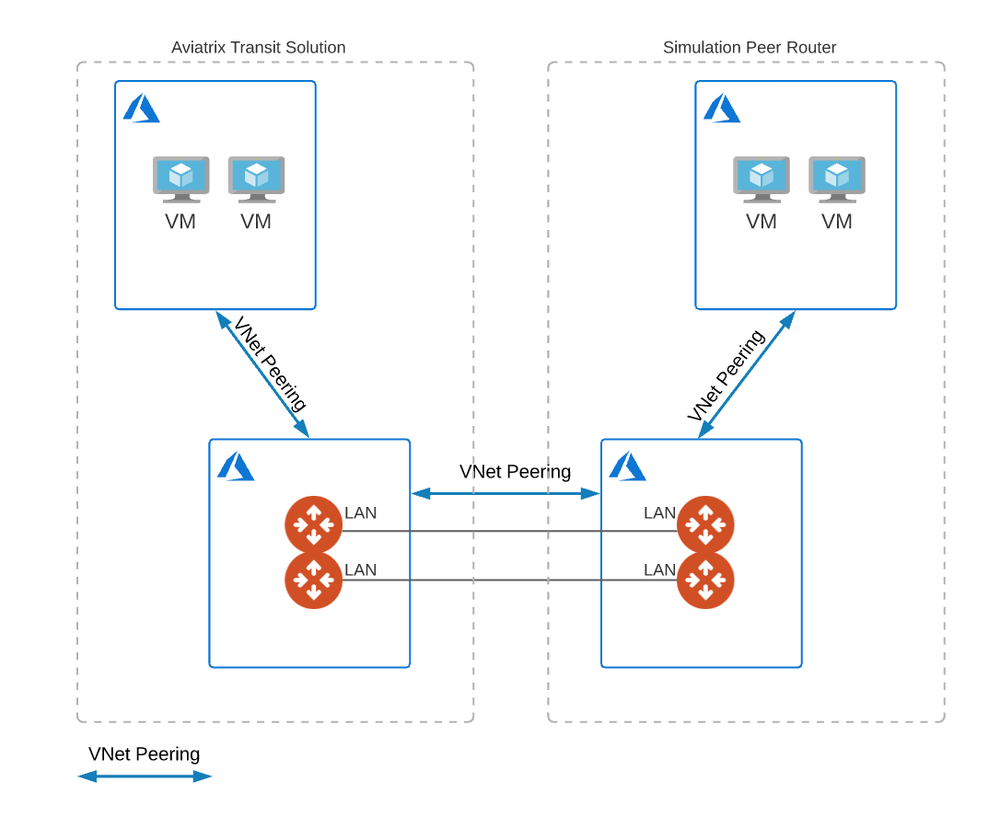
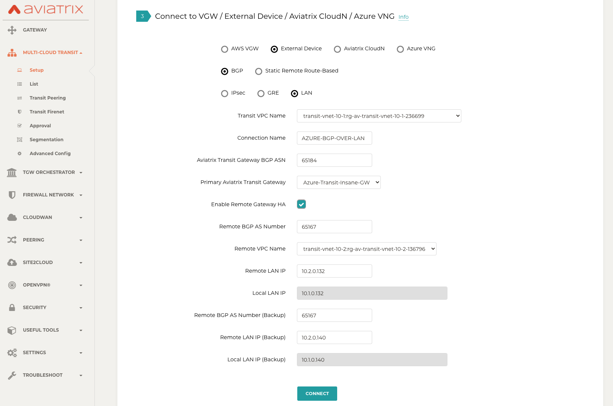
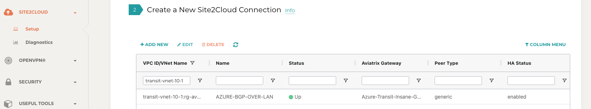
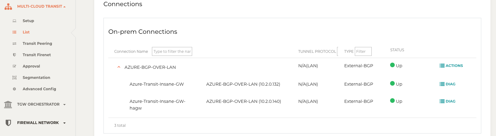
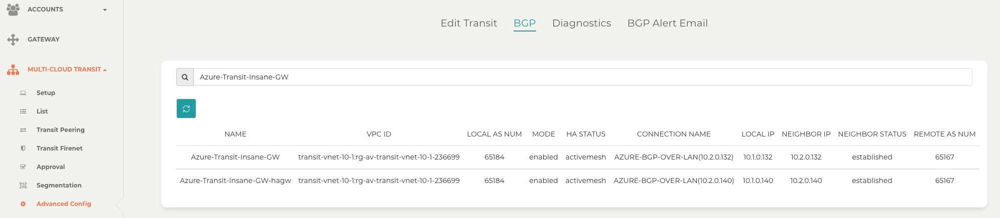
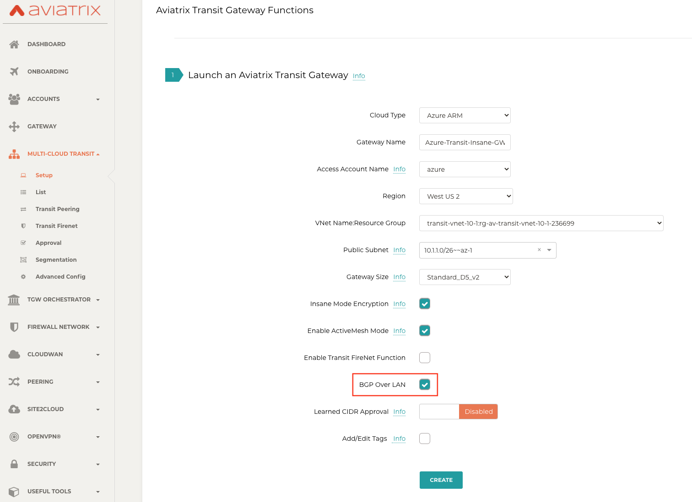
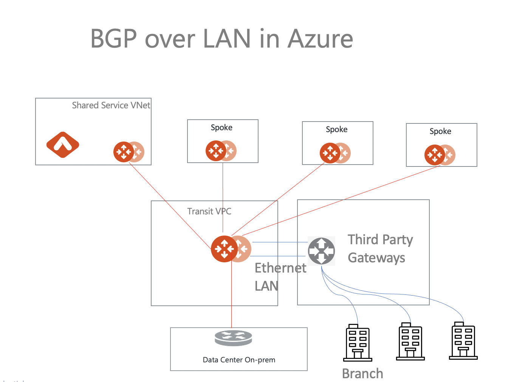

.. meta::
  :description: Multi-cloud Transit Gateway to External Device with BGP over LAN simulation workflow
  :keywords: Aviatrix Transit network, Private Network, BGP over LAN, External Device, High Performance, SD-WAN

==========================================================================================
Azure Multi-cloud Transit BGP over LAN Workflow
==========================================================================================

Introduction
============

Transit BGP to LAN allows Aviatrix Transit Gateways to communicate with a pair of instances in different VNets in Azure without running 
any tunneling protocol such as IPSec or GRE. One use case is to interoperate with third-party virtual appliances such as 
SD-WAN cloud instances that do not have the capability to support BGP over any tunneling protocols.

For example, integrating with SD-WAN gateways can be deployed as below, 

|sd_wan_inte_azure|

where an Aviatrix Multi-cloud Transit Gateway connects to a third-party cloud instance in different VNets in Azure.

This document describes a step-by-step instruction on how to build Aviatrix Transit Gateway to External Device using BGP over LAN in Azure.  
In this Tech Note, you learn the following:

#. Workflow on `deploying Aviatrix Transit Solution <https://docs.aviatrix.com/HowTos/transit_gateway_external_device_bgp_over_lan_azure_workflow.html#deploy-aviatrix-multi-cloud-transit-solution>`_

#. Workflow on `launching third-party cloud instances <https://docs.aviatrix.com/HowTos/transit_gateway_external_device_bgp_over_lan_azure_workflow.html#launch-third-party-cloud-instances>`_

#. Workflow on `building BGP over LAN <https://docs.aviatrix.com/HowTos/transit_gateway_external_device_bgp_over_lan_azure_workflow.html#build-bgp-over-lan>`_

For other BGP over LAN workflows, please check out the below documents:

- `AWS Multi-cloud Transit BGP over LAN Workflow <https://docs.aviatrix.com/HowTos/transit_gateway_external_device_bgp_over_lan_workflow.html>`_
- `Aviatrix BGP over LAN with Cisco Meraki in AWS <https://docs.aviatrix.com/HowTos/transit_gateway_external_device_bgp_over_lan_with_aws_meraki_workflow.html>`_

For more information about Multi-Cloud Transit Network and External Device, please check out the below documents:

- `Multi Cloud Global Transit FAQ <https://docs.aviatrix.com/HowTos/transitvpc_faq.html#multi-cloud-global-transit-faq>`_
- `Global Transit Network Workflow Instructions (AWS/Azure/GCP/OCI) <https://docs.aviatrix.com/HowTos/transitvpc_workflow.html>`_
- `Aviatrix Transit Gateway to External Devices <https://docs.aviatrix.com/HowTos/transitgw_external.html>`_
- `Transit Network Design Patterns <https://docs.aviatrix.com/HowTos/transitvpc_designs.html>`_

.. important::
	
  - This solution supports only `ActiveMesh 2.0 <https://docs.aviatrix.com/HowTos/activemesh_faq.html#what-is-activemesh-2-0>`_, please check this doc `How to migrate to ActiveMesh 2.0 <https://docs.aviatrix.com/HowTos/activemesh_faq.html#how-to-migrate-to-activemesh-2-0>`_ for migration detail.
  
  - This solution is available to AWS and Azure. Workflow with Azure here is just an example. Please adjust the topology depending on your requirements.

  - LAN interfaces for Aviatrix Transit Primary and third-party cloud instance must be in the different VNets.
  
  - One BGP over LAN connection per gateway is supported.
 
The key ideas for this solution are:
----------------------------------------
  
- A BGP session establishes between a third-party cloud instance and Aviatrix Transit Gateway via each LAN interface in different VNets.

- Data plane traffic also runs between a third-party cloud instance and Aviatrix Transit Gateway via each LAN interface without a tunnel protocol such as IPSec and GRE. 

Prerequisite
====================

- This feature is available for 6.3 and later. `Upgrade <https://docs.aviatrix.com/HowTos/inline_upgrade.html>`_ Aviatrix Controller to at least version 6.3
  
- In this example, we are going to deploy the below VNets in Azure:

  - Transit VNets (i.e. 10.1.0.0/16 and 10.2.0.0/16) by utilizing Aviatrix feature `Create a VNet <https://docs.aviatrix.com/HowTos/create_vpc.html>`_ with Aviatrix FireNet VNet option enabled

  - Spoke VNets (i.e. 192.168.11.0/24 and 192.168.21.0/24) by utilizing Aviatrix feature `Create a VNet <https://docs.aviatrix.com/HowTos/create_vpc.html>`_ as the previous step or manually deploying it in each cloud portal. Moreover, feel free to use your existing cloud network.
  
- Third-party cloud instance has high throughput supported
	
1. Deploy Aviatrix Multi-Cloud Transit Solution
=================================================

Refer to `Global Transit Network Workflow Instructions <https://docs.aviatrix.com/HowTos/transitvpc_workflow.html>`_ for the below steps. Please adjust the topology depending on your requirements.

Step 1.1. Deploy Aviatrix Multi-Cloud Transit Gateway and HA
------------------------------------------------------------

- Follow this step `Deploy the Transit Aviatrix Gateway <https://docs.aviatrix.com/HowTos/transit_firenet_workflow_aws.html#step-2-deploy-the-transit-aviatrix-gateway>`_ to launch Aviatrix Transit gateway and enable HA with insane mode enabled in Transit VNet

- (Important) Enable the function "BGP Over LAN"

- In this example, size Standard_D5_v2 are selected to benchmark `performance <https://docs.aviatrix.com/HowTos/transit_gateway_external_device_bgp_over_lan_azure_workflow.html#performance-benchmark>`_.

|aviatrix_azure_gateway_creation|

Step 1.2. Deploy Spoke Gateway and HA
--------------------------------------

- Follow this step `Deploy Spoke Gateways <https://docs.aviatrix.com/HowTos/transit_firenet_workflow_aws.html#step-3-deploy-spoke-gateways>`_ to launch Aviatrix Spoke gateway and enable HA with insane mode enabled in Spoke VNet

Step 1.3. Attach Spoke Gateways to Transit Network
--------------------------------------------------

- Follow this step `Attach Spoke Gateways to Transit Network <https://docs.aviatrix.com/HowTos/transit_firenet_workflow_aws.html#step-4-attach-spoke-gateways-to-transit-network>`_ to attach Aviatrix Spoke Gateways to Aviatrix Transit Gateways

(Optional) Step 1.4 Attach Azure ARM Spoke VNet via native peering
------------------------------------------------------------------

- Follow this step `Attach Azure ARM Spoke VNet via native peering <https://docs.aviatrix.com/HowTos/transitvpc_workflow.html#b-attach-azure-arm-spoke-vnet-via-native-peering>`_ if users prefer not to encrypt the traffic between the Transit VNet and the Spoke VNet.

- In this example, this approach is selected to benchmark `performance <https://docs.aviatrix.com/HowTos/transit_gateway_external_device_bgp_over_lan_azure_workflow.html#performance-benchmark>`_.

2. Launch third-party cloud instances
================================================================================

Step 2.1. Deploy third-party cloud instances in a seperate Transit VNet 
-----------------------------------------------------------------------

- Create a third-party cloud instance and put MGMT interface in public gateway subnet

- Create a new public WAN subnet and a dedicated routing table for WAN interface if needed

- Create a new private LAN subnet and a dedicated routing table (optional) for LAN interface

- Make sure the function "IP forwarding" on third-party cloud instance's interfaces is enabled

.. important::

  Aviatrix Transit Gateway and third-party cloud instance CANNOT be deployed in the same Transit VNet.

3. Build BGP over LAN
================================================

Step 3.1. Create Azure VNet peering between Aviatrix Transit VNet and third-party cloud instance Transit VNet
-------------------------------------------------------------------------------------------------------------

Refer to `Azure VNET Peering doc <https://docs.aviatrix.com/HowTos/peering.html#azure-vnet-peering>`_ for more info.

- Login Aviatrix Controller

- Go to PEERING -> Azure

- Click the button "+ NEW PEERING"

- Select VNet where Aviatrix Transit gateway locates as Peer1

- Select VNet where third-party cloud instance locates as Peer2

- Click the button "OK"

Step 3.2. Configure BGP over LAN on Aviatrix Transit Gateway
-------------------------------------------------------------

- Login Aviatrix Controller

- Go to MULTI-CLOUD TRANSIT -> Setup -> 3) Connect to VGW / External Device / Aviatrix CloudN / Azure VNG

- Select option "External Device" -> "BGP" -> "LAN"

- Fill the parameters to set up BGP over LAN to a third-party cloud instance

+----------------------------------+-----------------------------------------------------------------------------------------------------------------------------+
| Transit VPC Name                 | Select the Transit VPC ID where Transit GW was launched                                                                     |
+----------------------------------+-----------------------------------------------------------------------------------------------------------------------------+
| Connection Name                  | Provide a unique name to identify the connection to external device                                                         |
+----------------------------------+-----------------------------------------------------------------------------------------------------------------------------+
| Aviatrix Transit Gateway BGP ASN | Configure a BGP AS number that the Transit GW will use to exchange routes with external device                              |
+----------------------------------+-----------------------------------------------------------------------------------------------------------------------------+
| Primary Aviatrix Transit Gateway | Select the Transit GW                                                                                                       |
+----------------------------------+-----------------------------------------------------------------------------------------------------------------------------+
| Enable Remote Gateway HA         | Check this option in this example to connect two external devices                                                           |
+----------------------------------+-----------------------------------------------------------------------------------------------------------------------------+
| Remote BGP AS Number             | Configure a BGP AS number that third-party cloud primary instance will use to exchange routes with Aviatrix Transit Primary |
+----------------------------------+-----------------------------------------------------------------------------------------------------------------------------+
| Remote VNet Name                 | Select the Transit VNet where third-party cloud instance locates                                                            |
+----------------------------------+-----------------------------------------------------------------------------------------------------------------------------+
| Remote LAN IP                    | Use the private IP of the LAN interface of the third-party cloud primary instance                                           |
+----------------------------------+-----------------------------------------------------------------------------------------------------------------------------+
| Local LAN IP                     | Aviatrix detects the Local LAN IP automatically                                                                             |
+----------------------------------+-----------------------------------------------------------------------------------------------------------------------------+
| Remote BGP AS Number (Backup)    | Configure a BGP AS number that third-party cloud HA instance will use to exchange routes with Aviatrix Transit HA           |
+----------------------------------+-----------------------------------------------------------------------------------------------------------------------------+
| Remote LAN IP (Backup)           | Use the private IP of the LAN interface of the third-party cloud HA instance                                                |
+----------------------------------+-----------------------------------------------------------------------------------------------------------------------------+
| Local LAN IP (Backup)            | Aviatrix detects the Local LAN IP automatically                                                                             |
+----------------------------------+-----------------------------------------------------------------------------------------------------------------------------+

- Click the button "CONNECT" to generate BGP session over LAN

  |aviatrix_azure_transit_externel_device_lan|

Step 3.3. (Optional) Download the BGP over LAN configuration sample from Aviatrix Controller
--------------------------------------------------------------------------------------------

- Navigate to SITE2CLOUD -> Setup

- Select the connection that you created with “Connection Name” in the previous step

- Click the button "EDIT"

- Select Vendor type, Platform, and Software.

- Click the button "Download Configuration".

Step 3.4. Configure BGP over LAN on third-party cloud instance
---------------------------------------------------------------

- Login Azure portal

- Create a user-defined routing table with default route (0.0.0.0/0) pointing nexthop to Aviatrix Primary Transit's LAN IP for the subnet where third-party cloud primary instance's LAN interface locates

- Create a user-defined routing table with default route (0.0.0.0/0) pointing nexthop to Aviatrix HA Transit's LAN IP for the subnet where third-party cloud HA instance's LAN interface locates for HA deployment

- (Optional) Open the downloaded BGP over LAN configuration file

- Login third-party cloud instance

- Program route to send traffic to Aviatrix Transit's LAN IP through third-party cloud instance's LAN interface

- Configure those related BGP and LAN info on third-party cloud instance

- Check whether the function 'eBGP multi-hop' is enabled if BGP session is not established

- Repeat those steps for HA deployment

.. important::

  Customer must create a default route 0.0.0.0/0 in the third-party cloud instance's LAN route table to point to Aviatrix Transit's LAN IP over VNET peering in Azure.

Step 3.5. Verify LAN status on Aviatrix Controller
----------------------------------------------------------

- Navigate back to Aviatrix Controller

- Go to SITE2CLOUD -> Setup

- Find the connection that you created with “Connection Name” in the previous step

- Check the Tunnel Status

  |aviatrix_azure_bgp_lan_status_1|

- Go to MULTI-CLOUD TRANSIT -> List

- Select the Transit Primary Gateway that was created in the previous step

- Click the button "DETAILS/DIAG"

- Scroll down to the panel "Connections" -> "On-prem Connections"

- Find the connection that you created with “Connection Name” in the previous step

- Check the Tunnel Status

  |aviatrix_azure_bgp_lan_status_2|

Step 3.6. Verify BGP session status on Aviatrix Controller
----------------------------------------------------------

- Go to MULTI-CLOUD TRANSIT -> Advanced Config -> BGP Tab

- Find the connection that you created with “Connection Name” in the previous step

- Check the BGP Status

  |aviatrix_azure_bgp_status|

4. Ready to go!
=================

At this point, run connectivity and performance test to ensure everything is working correctly. 

5. Performance Benchmark
===========================

End-to-End traffic via Native Spoke VNet <-> Aviatrix <-> Aviatrix <-> Native Spoke VNet
----------------------------------------------------------------------------------------

The performance test is done with a pair of Aviatrix Transit Gateways as the third-party cloud instances, as shown below. 

|transit_azure_gateway_external_device_bgp_over_lan_diagram|

Multiple flows result by using iperf3 tool with TCP 128 connections
^^^^^^^^^^^^^^^^^^^^^^^^^^^^^^^^^^^^^^^^^^^^^^^^^^^^^^^^^^^^^^^^^^^

+-----------------------+------------------+
| Aviatrix Gateway size | Throughput (Gbps)|
+-----------------------+------------------+
| Standard_D5_v2        | 22 - 23          |
+-----------------------+------------------+

6. Additional Read
===========================

Additional read can be found in this short blog, `Need of conventional BGP support in the cloud <https://community.aviatrix.com/t/h7htvvc/need-of-conventional-bgp-support-in-the-cloud>`_

	 

   

 

.. |sd_wan_integ| image:: transitvpc_designs_media/sd_wan_integ.png
   :scale: 30%

   
.. disqus::

