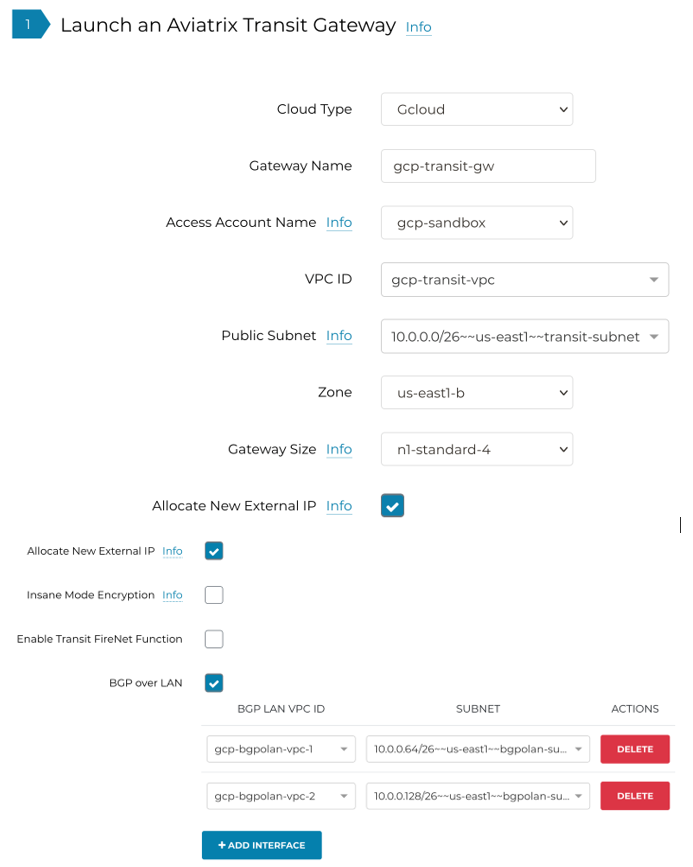
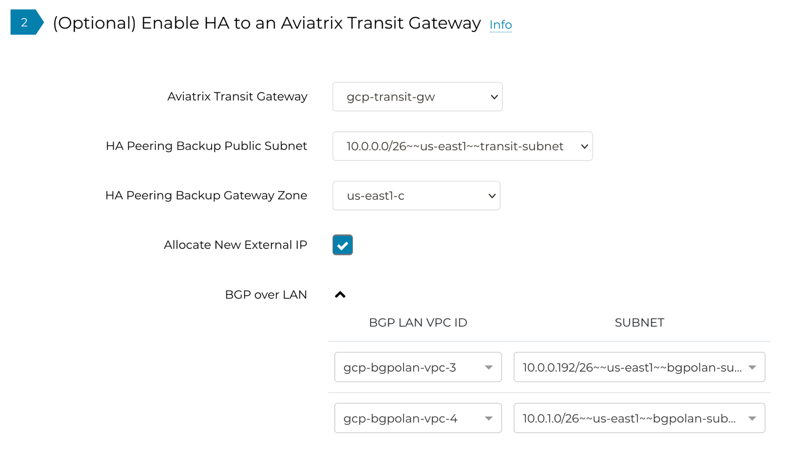
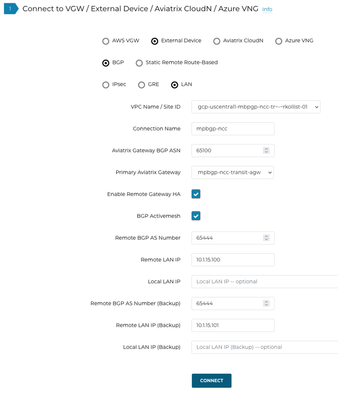
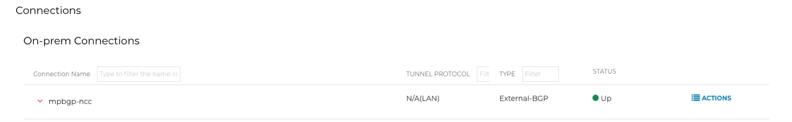
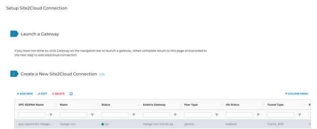
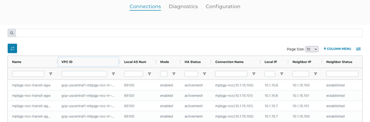
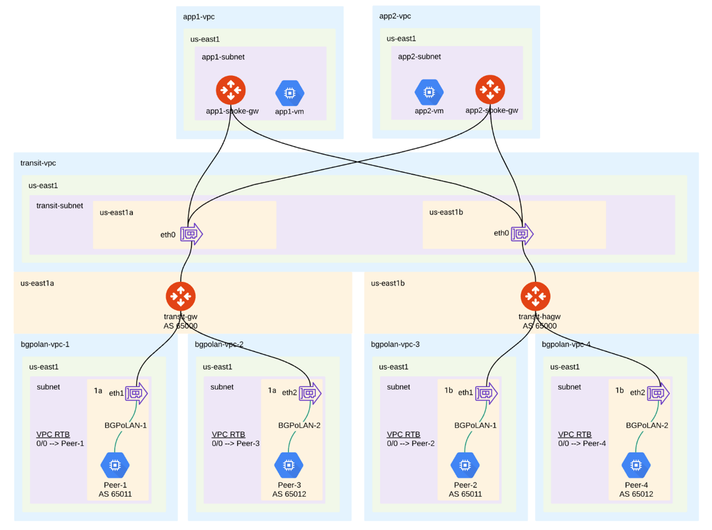

==========================================================================================
GCP Multi-Peer BGP over LAN Workflow
==========================================================================================

Introduction
============

Transit BGP to LAN allows Aviatrix Transit Gateways to communicate with multiple instances in the same VPC in GCP without running any tunneling protocol such as IPsec or GRE. One use case is to interoperate with third-party virtual appliances such as SD-WAN cloud instances that do not have the capability to support BGP over any tunneling protocols.

For example, integrating with SD-WAN gateways can be deployed as below, where Aviatrix Multi-cloud Transit Gateways connect to third-party cloud instances in the same VPC in GCP:

|sd_wan_integ_gcp|

This document describes a step-by-step instruction on how to build Aviatrix Transit Gateway to External Device using BGP over LAN.  
In this Tech Note, you will learn the following:

#. Workflow on `deploying Aviatrix Transit Solution <https://docs.aviatrix.com/HowTos/transit_gateway_external_device_bgp_over_lan_workflow.html#deploy-aviatrix-multi-cloud-transit-solution>`_

#. Workflow on `launching third-party cloud instances <https://docs.aviatrix.com/HowTos/transit_gateway_external_device_bgp_over_lan_workflow.html#launch-third-party-cloud-instances>`_

#. Workflow on `building BGP over LAN <https://docs.aviatrix.com/HowTos/transit_gateway_external_device_bgp_over_lan_workflow.html#build-bgp-over-lan>`_

For other BGP over LAN workflows, see the documents below:

- `AWS Multi-cloud Transit BGP over LAN Workflow <https://docs.aviatrix.com/HowTos/transit_gateway_external_device_bgp_over_lan_workflow.html>`_
- `Azure Multi-cloud Transit BGP over LAN Workflow <https://docs.aviatrix.com/HowTos/transit_gateway_external_device_bgp_over_lan_azure_workflow.html>`_
- `Aviatrix BGP over LAN with Cisco Meraki in AWS <https://docs.aviatrix.com/HowTos/transit_gateway_external_device_bgp_over_lan_with_aws_meraki_workflow.html>`_

For more information about Multi-Cloud Transit Network and External Device, see the documents below:

- `Multi Cloud Global Transit FAQ <https://docs.aviatrix.com/HowTos/transitvpc_faq.html#multi-cloud-global-transit-faq>`_
- `Global Transit Network Workflow Instructions (AWS/Azure/GCP/OCI) <https://docs.aviatrix.com/HowTos/transitvpc_workflow.html>`_
- `Aviatrix Transit Gateway to External Devices <https://docs.aviatrix.com/HowTos/transitgw_external.html>`_
- `Transit Network Design Patterns <https://docs.aviatrix.com/HowTos/transitvpc_designs.html>`_

.. important::
	
  - This solution supports only `ActiveMesh 2.0 <https://docs.aviatrix.com/HowTos/activemesh_faq.html#what-is-activemesh-2-0>`_, please check this doc `How to migrate to ActiveMesh 2.0 <https://docs.aviatrix.com/HowTos/activemesh_faq.html#how-to-migrate-to-activemesh-2-0>`_ for migration detail.
  
  - This solution is available in Azure when connecting to a single BGP peer.  Multi-peer BGP is supported in GCP and AWS. The workflow with GCP here is just an example. Please adjust the topology depending on your requirements.

  - GCP does not allow interfaces to be added to an instance after deployment.  Verify the design before creating the instances to make sure they have all the interfaces required.
	
 
The key ideas for this solution are:
----------------------------------------
  
- A BGP session establishes between third-party cloud instances and Aviatrix Transit Gateways via each LAN interface in the same VPC.

- Dataplane traffic also runs between third-party cloud instances and Aviatrix Transit Gateways via each LAN interface without a tunnel protocol such as IPsec or GRE. 

Prerequisite
====================

- This feature is available starting in Aviatrix software version 6.6. `Upgrade <https://docs.aviatrix.com/HowTos/inline_upgrade.html>`_ Aviatrix Controller to at least version 6.6.
  
- Third-party cloud instance has high throughput supported.
	
Deploying Aviatrix Multi-Cloud Transit Solution
=================================================

Refer to `Global Transit Network Workflow Instructions <https://docs.aviatrix.com/HowTos/transitvpc_workflow.html>`_ for the below steps. Please adjust the topology depending on your requirements.

1. Deploy `Aviatrix Multi-Cloud Transit Gateway and HA <https://docs.aviatrix.com/HowTos/transit_firenet_workflow_aws.html#step-2-deploy-the-transit-aviatrix-gateway>`_ with insane mode encryption enabled in Transit VPC.
2. Deploy `Spoke Gateway and HA <https://docs.aviatrix.com/HowTos/transit_firenet_workflow_aws.html#step-3-deploy-spoke-gateways>`_ with insane mode encryption enabled in Spoke VPC(s).
3. Attach Spoke Gateways to Transit Network <https://docs.aviatrix.com/HowTos/transit_firenet_workflow_aws.html#step-4-attach-spoke-gateways-to-transit-network>`_.

Launching Third-Party Cloud Instances
================================================================================

Deploy third-party cloud instances with an interface in the same VPC as the Aviatrix Transit Gateway.

#. Create a third-party cloud instance and put MGMT interface in public gateway subnet. 
#. Create a new WAN subnet and dedicated routing table for WAN interface if needed.
#. Create a new LAN subnet and a dedicated routing table for the LAN interface.
#. Make sure the IP forwarding function is enabled on the third-party cloud instances.

.. important::

  GCP allows a maximum of 8 interfaces per instance, and the max limit depends on the number of vCPUs.  Due to this limitation, the solution supports 7 BGP peers without FireNet enabled and 6 BGP peers with FireNet enabled. 

Building BGP over LAN
================================================

Deploy the Aviatrix Transit Gateway with all the required BGP interfaces.

#. Log in to the Aviatrix Controller.
#. Navigate to Multi-cloud Transit > Setup > Transit tab.
#. Set the parameters to deploy the Aviatrix Transit Gateway.
  
+----------------------------------+--------------------------------------------------------------------------------------------------+
| Cloud Type                       | GCloud                                                                                           |
+----------------------------------+--------------------------------------------------------------------------------------------------+
| Gateway Name                     | Provide a unique name to identify the Transit Gateway                                            |
+----------------------------------+--------------------------------------------------------------------------------------------------+
| Access Account Name              | Select the appropriate GCP account                                                               |
+----------------------------------+--------------------------------------------------------------------------------------------------+
| VPC ID                           | Select the VPC where the Transit Gateway will be deployed                                        |
+----------------------------------+--------------------------------------------------------------------------------------------------+
| Public Subnet                    | Select the subnet the Transit Gateway interface will use                                         |
+----------------------------------+--------------------------------------------------------------------------------------------------+
| Zone                             | Select the Availability Zone where the Transit Gateway will be deployed                          |
+----------------------------------+--------------------------------------------------------------------------------------------------+
| Gateway Size                     | Select an instance size that allows interfaces to be created for all BGP peers                   |
+----------------------------------+--------------------------------------------------------------------------------------------------+
| Insane Mode Encryption           | Check this box to enable high throughput                                                         |
+----------------------------------+--------------------------------------------------------------------------------------------------+
| BGP over LAN                     | Check this box and then **Add Interface** for all BGP peers                                      |
+----------------------------------+--------------------------------------------------------------------------------------------------+

  |transit_bgp_over_lan_gcloud|

Enable HA on the Aviatrix Transit Gateway, deploying the HA Gateway in a different Availability Zone.

  |transit_bgp_over_lan_gcloud_ha|

Configuring BGP over LAN on Aviatrix Transit Gateway
------------------------------------------------------------

1. Log in to the Aviatrix Controller.
2. Navigate to Multi-Cloud Transit > Setup > External Connection tab > Connect to VGW / External Device / Azure VNG section.
3. Select the options External Device > BGP > LAN.
4. Enter the following information in the fields below.

+----------------------------------+-------------------------------------------------------------------------------------------------------------------------------------------------------------------------------------------------------------------------------+
| VPC Name / Site ID               | Select the Transit VPC ID where the Transit Gateway was deployed.                                                                                                                                                             |
+----------------------------------+-------------------------------------------------------------------------------------------------------------------------------------------------------------------------------------------------------------------------------+
| Connection Name                  | Provide a unique name to identify the connection to external device.                                                                                                                                                          |
+----------------------------------+-------------------------------------------------------------------------------------------------------------------------------------------------------------------------------------------------------------------------------+
| Aviatrix Gateway BGP ASN         | Configure a BGP AS number that the Transit Gateway will use to exchange routes with the external device.                                                                                                                      |
+----------------------------------+-------------------------------------------------------------------------------------------------------------------------------------------------------------------------------------------------------------------------------+
| Primary Aviatrix Gateway         | Select the Transit Gateway.                                                                                                                                                                                                   |
+----------------------------------+-------------------------------------------------------------------------------------------------------------------------------------------------------------------------------------------------------------------------------+
| Enable Remote Gateway HA         | Check this box to connect two external devices.                                                                                                                                                                               |
+----------------------------------+-------------------------------------------------------------------------------------------------------------------------------------------------------------------------------------------------------------------------------+
| BGP Activemesh                   | Check this box to enable full mesh BGP connections to the external devices.                                                                                                                                                   |
+----------------------------------+-------------------------------------------------------------------------------------------------------------------------------------------------------------------------------------------------------------------------------+
| Remote BGP AS Number             | Configure the BGP AS number that the third-party cloud instance will use to exchange routes with the Aviatrix Transit Gateway.                                                                                                |
+----------------------------------+-------------------------------------------------------------------------------------------------------------------------------------------------------------------------------------------------------------------------------+
| Remote LAN IP                    | Use the private IP of the LAN interface of the third-party cloud primary instance.                                                                                                                                            |
+----------------------------------+-------------------------------------------------------------------------------------------------------------------------------------------------------------------------------------------------------------------------------+
| Local LAN IP                     | If blank, the controller will assign an IP in the same subnet as the Remote LAN IP.  Optionally, configure a specific IP within the same subnet as the Remote LAN IP.                                                         |
+----------------------------------+-------------------------------------------------------------------------------------------------------------------------------------------------------------------------------------------------------------------------------+
| Remote BGP AS Number (Backup)    | Configure the BGP AS number that the third-party HA cloud instance will use to exchange routes with the Aviatrix HA Transit Gateway.                                                                                          |
+----------------------------------+-------------------------------------------------------------------------------------------------------------------------------------------------------------------------------------------------------------------------------+
| Remote LAN IP (Backup)           | Use the private IP of the LAN interface of the third-party HA cloud instance.                                                                                                                                                 |
+----------------------------------+-------------------------------------------------------------------------------------------------------------------------------------------------------------------------------------------------------------------------------+
| Local LAN IP (Backup)            | If blank, the controller will assign an IP in the same subnet as the Remote LAN IP (Backup). Optionally, configure a specific IP within the same subnet as the Remote LAN IP (Backup).                                        |
+----------------------------------+-------------------------------------------------------------------------------------------------------------------------------------------------------------------------------------------------------------------------------+

5. Click **Connect** to generate the BGP sessions. 

  |transit_s2c_conn_bgp_peer_gcloud|

6. Create a Site2Cloud connection for each BGP peer.

(Optional) Downloading the BGP over LAN configuration sample from Aviatrix Controller
--------------------------------------------------------------------------------------------

#. Navigate to Site2Cloud > Setup.
#. Select the previously created connection(s).
#. Click **Edit.**
#. Select the Vendor, Platform and Software that correspond to the third-party device.
#. Click **Download Configuration.**

Configuring BGP over LAN on the Third-Party Cloud Instance(s)
-----------------------------------------------------------------------------------

#. (Optional) Open the downloaded BGP over LAN configuration file.
#. Configure the relevant BGP over LAN information on the third-party cloud instance(s).

Verifying the Connection Status on Aviatrix Controller
----------------------------------------------------------------------

1. Navigate to Site2Cloud > Setup.
2. Find the previously created connection(s).
3. Check the tunnel status.

  |transit_check_tunnel_gcloud|

4. Navigate to Multi-Cloud Transit -> List.
5. Select the previously created Aviatrix Transit Gateway.
6. Click **Details/Diag**.
7. Scroll down to the Connections > On-prem Connections section.
8. Under On-prem Connections, find the previously created connection(s).
9. Check the tunnel status in the Status column.

  |transit_verify_bgp_status_onprem_gcloud|

Verifying the BGP session status on Aviatrix Controller
--------------------------------------------------------------

#. Navigate to Multi-Cloud Transit > BGP.
#. Find the previously created connection(s).
#. Check the Neighbor status.

  |transit_verify_bgp_status_gcloud|

Ready to Go
=================

At this point, run connectivity and performance test to ensure everything is working correctly. 

	 

   

 

.. disqus::

