.. meta::
  :description: AWS Multi-cloud Transit BGP over LAN with Cisco Meraki Workflow
  :keywords: Aviatrix Transit network, Private Network, BGP over LAN, External Device, SD-WAN, Meraki

==========================================================================================
Aviatrix Transit BGP over LAN with Cisco Meraki Workflow in AWS
==========================================================================================

Introduction
============

This Tech Note is a step-by-step guide for using `BGP over LAN <https://docs.aviatrix.com/HowTos/transit_gateway_external_device_bgp_over_lan_workflow.html>`_ to interoperate with Cisco Meraki as the third party appliance in AWS. BGP over LAN also works in Azure, make adjustments accordingly when applying to deployment in Azure. 

Two supported design patterns are described as below:

Design Pattern #1 with Aviatrix Multi-cloud Transit 
----------------------------------------------------

|cisco_meraki_aviatrix_transit_solution_diag|

In this design pattern, Aviatrix Multi-cloud transit is deployed to connect Spoke VPCs to the Transit VPC and Aviatrix Transit Gateway is used to connect to Meraki vMX in the same Transit VPC. 

Design Pattern #2 with AWS TGW Orchestrator
-------------------------------------------

|cisco_meraki_aws_tgw_orchestrator_diag|

In the second design pattern, AWS TGW is deployed for connecting to Spoke VPC and Aviatrix Multi-cloud transit is used to connect to Meraki vMX in the same Transit VPC. 
  
This Tech Note consists of:

#. Workflow on `launching Cisco Meraki vMX in AWS <https://docs.aviatrix.com/HowTos/transit_gateway_external_device_bgp_over_lan_with_aws_meraki_workflow.html#launch-cisco-meraki-vmx-in-aws>`_

#. Workflow on `deploying branch Cisco Meraki device <https://docs.aviatrix.com/HowTos/transit_gateway_external_device_bgp_over_lan_with_aws_meraki_workflow.html#deploy-branch-meraki-device>`_

#. Workflow on `deploying Aviatrix Multi-Cloud Transit Solution <https://docs.aviatrix.com/HowTos/transit_gateway_external_device_bgp_over_lan_with_aws_meraki_workflow.html#deploy-aviatrix-multi-cloud-transit-solution>`_

#. Workflow on `building BGP over LAN <https://docs.aviatrix.com/HowTos/transit_gateway_external_device_bgp_over_lan_with_aws_meraki_workflow.html#build-bgp-over-lan>`_

For more information about how to configure BGP over LAN, please refer to the doc links as follows:

- `AWS Multi-cloud Transit BGP over LAN Workflow <https://docs.aviatrix.com/HowTos/transit_gateway_external_device_bgp_over_lan_workflow.html>`_
- `Azure Multi-cloud Transit BGP over LAN Workflow <https://docs.aviatrix.com/HowTos/transit_gateway_external_device_bgp_over_lan_azure_workflow.html>`_

For more information about Multi-Cloud Transit Network, External Device, and AWS TGW Orchestrator, please check out the below documents:

- `Multi Cloud Global Transit FAQ <https://docs.aviatrix.com/HowTos/transitvpc_faq.html#multi-cloud-global-transit-faq>`_
- `Global Transit Network Workflow Instructions (AWS/Azure/GCP/OCI) <https://docs.aviatrix.com/HowTos/transitvpc_workflow.html>`_
- `Aviatrix Transit Gateway to External Devices <https://docs.aviatrix.com/HowTos/transitgw_external.html>`_
- `Transit Network Design Patterns <https://docs.aviatrix.com/HowTos/transitvpc_designs.html>`_
- `AWS TGW Orchestrator FAQ <https://docs.aviatrix.com/HowTos/tgw_faq.html>`_
- `TGW Design Patterns <https://docs.aviatrix.com/HowTos/tgw_design_patterns.html>`_

.. important::
	
  - The minimum instance sizes of Aviatrix Transit Gateway for `BGP over LAN` are c4.4xlarge, c5.4xlarge, c5n.4xlarge
	
  - LAN interfaces for Aviatrix Transit Primary and Meraki vMX  must be in the same Availability Zone.
 
Prerequisite
====================

- This feature is available for 6.3 and later. `Upgrade <https://docs.aviatrix.com/HowTos/inline_upgrade.html>`_ Aviatrix Controller to at least version 6.3.
  
- In this Tech Note, the following VPC CIDRs are used: 

  - Transit VPC (10.1.0.0/16). You can create this VPC by using `Create a VPC <https://docs.aviatrix.com/HowTos/create_vpc.html>`_ with Aviatrix FireNet VPC option enabled.

  - Spoke VPCs (192.168.1.0/24, 192.168.2.0/24, 192.168.3.0/24). You can create the Spoke VPCs by using `Create a VPC <https://docs.aviatrix.com/HowTos/create_vpc.html>`_  or manually deploying them in AWS console.  Use existing Spoke VPCs also works. 

Illustration for Design Pattern #1 with Aviatrix Transit Solution
------------------------------------------------------------------

  |cisco_meraki_aviatrix_transit_solution_illustration_diag|

Illustration for Design Pattern #2 with AWS TGW Orchestrator
------------------------------------------------------------

  |cisco_meraki_aws_tgw_orchestrator_illustration_diag|  

1. Launch Cisco Meraki vMX in AWS
=================================================

Step 1.1. Deploy Cisco Meraki vMX in Transit VPC
-------------------------------------------------

- Follow the steps in `vMX Setup Guide for Amazon Web Services (AWS) <https://documentation.meraki.com/MX/MX_Installation_Guides/vMX_Setup_Guide_for_Amazon_Web_Services_(AWS)>`_ to launch Cisco Meraki vMX in Transit VPC

  - Meraki Dashboard Configuration
  
  - AWS Setup, Accessing the AMI, and Configuring the EC2 Image
  
- Step "Additional VPC Configuration" in `vMX Setup Guide for Amazon Web Services (AWS) <https://documentation.meraki.com/MX/MX_Installation_Guides/vMX_Setup_Guide_for_Amazon_Web_Services_(AWS)>`_ here is an optional as we will provide a guideline how to advertise spoke VPC CIDRs to branch Cisco Meraki through BGP protocol in the following steps.

.. important::

  - Make sure the function "Source/Dest check" on third-party cloud instance's interfaces is disabled
  
  - Since One-Armed Concentrator mode is adopted in this document, the vMX is configured with a single Network Interface which means all traffic will be sent and received on this interface.

Step 1.2. Check Cisco Meraki vMX status on Meraki Dashboard
-----------------------------------------------------------

- Login Meraki Dashboard

- Select the "NETWORK" where this Cisco Meraki vMX in Transit VPC locates

- Go to Security & SD-WAN -> MONITOR -> Appliance status

- Check whether Cisco Meraki vMX displays "Active" status

  |cisco_meraki_aws_vMX_appliance_status|

Step 1.3. Enable Hub (Mesh) type
-----------------------------------------------------------

- Go to Security & SD-WAN -> CONFIGURE -> Site-to-site VPN

- Find the panel "Type" on the top

- Select the radio button "Hub (Mesh)" to establish VPN tunnels with all hubs and dependent spokes for this Cisco Meraki vMX

- Click the button "Save"

  |cisco_meraki_aws_vMX_s2s_hub_type|

Step 1.4. Enable BGP settings
-----------------------------------------------------------

- Go to Security & SD-WAN -> CONFIGURE -> Site-to-site VPN

- Find the panel "BGP settings"

- Select the option "Enabled" for the field "BGP"

- Adjust the values for the fields "BGP VPN AS" and "IBGP VPN Holdtimer" if needed and write down the BGP ASN
 
- Click the button "Save"

  |cisco_meraki_aws_vMX_s2s_bgp_enable|

.. important::

  Will configure BGP neighbors for eBGP in the later workflow.

2. Deploy branch Meraki device
==================================================================

In this workflow example, we deploy another Meraki vMX in a Spoke VPC as a branch device and configure Hub-and-spoke Auto VPN Connection to verify this solution.
Please adjust the topology depending on your requirements.

For more Meraki VPN info, please check out the below documents:

- `Configuring Hub-and-spoke VPN Connections on the MX Security Appliance <https://documentation.meraki.com/MX/Site-to-site_VPN/Configuring_Hub-and-spoke_VPN_Connections_on_the_MX_Security_Appliance>`_
- `Meraki Auto VPN <https://documentation.meraki.com/MX/Site-to-site_VPN/Meraki_Auto_VPN>`_

Step 2.1. Deploy branch Meraki vMX in Spoke VPC
---------------------------------------------------------

-  Follow step 1.1. but deploy Meraki vMX in Spoke VPC

Step 2.2. Check branch  Meraki vMX status on Meraki Dashboard
---------------------------------------------------------------------

- Login Meraki Dashboard

- Select the "NETWORK" where this Cisco Meraki vMX in Spoke VPC locates

- Go to Security & SD-WAN -> MONITOR -> Appliance status

- Check whether branch Cisco Meraki device displays "Active" status 

  |cisco_meraki_aws_branch_vMX_appliance_status|

Step 2.3. Enable Spoke type
-----------------------------------------------------------

- Select the "NETWORK" where this Cisco Meraki vMX in Spoke VPC locates

- Go to Security & SD-WAN -> CONFIGURE -> Site-to-site VPN

- Find the panel "Type" on the top

- Select the radio button "Spoke" to establish VPN tunnels with selected hubs

- Select the "NETWORK" where the Cisco Meraki vMX in Transit VPC locates for Hubs

- Click the button "Save"

  |cisco_meraki_aws_branch_vMX_s2s_spoke_type|

Step 2.4. Advertise Spoke VPC CIDR
-----------------------------------------------------------

- Select the "NETWORK" where this Cisco Meraki vMX in Spoke VPC locates

- Go to Security & SD-WAN -> CONFIGURE -> Site-to-site VPN

- Locate "Local networks" in the panel "VPN settings"

- Click the button "Add a local network"

- Fill the parameters to advertise Spoke VPC CIDR

+-------------------+---------------------------------------------------------+
| Name              | Provide a unique name for the Local networks            |
+-------------------+---------------------------------------------------------+
| Subnet            | Configure Spoke VPC CIDR as an example (192.168.2.0/24) |
+-------------------+---------------------------------------------------------+
| VPN participation | VPN on                                                  |
+-------------------+---------------------------------------------------------+

- Click the button "Save"

  |cisco_meraki_aws_branch_vMX_s2s_vpn_settings|

Step 2.5. Check VPN status
-----------------------------------------------------------

- Select the "NETWORK" where this Cisco Meraki vMX in Spoke VPC locates

- Go to Security & SD-WAN -> MONITOR -> VPN status

- Check whether VPN status is Green

  |cisco_meraki_aws_branch_vMX_s2s_vpn_status|

3. Deploy Aviatrix Multi-Cloud Transit Solution
=================================================

Refer to `Global Transit Network Workflow Instructions <https://docs.aviatrix.com/HowTos/transitvpc_workflow.html>`_ for the below steps. Please adjust the topology depending on your requirements.

Step 3.1. Deploy Aviatrix Multi-Cloud Transit Gateway
------------------------------------------------------------

- Follow this step `Deploy the Transit Aviatrix Gateway <https://docs.aviatrix.com/HowTos/transit_firenet_workflow_aws.html#step-2-deploy-the-transit-aviatrix-gateway>`_ to launch Aviatrix Transit gateway in Transit VPC.
  
- In this example, size c5n.4xlarge is selected.

.. important::

  The Aviatrix Transit Gateway must be deployed in the same available zone where Cisco Meraki vMX locates.

Design Pattern #1: Aviatrix Spoke Gateway for encryption traffic
^^^^^^^^^^^^^^^^^^^^^^^^^^^^^^^^^^^^^^^^^^^^^^^^^^^^^^^^^^^^^^^^^

Step 3.2. Deploy Aviatrix Spoke Gateway for encryption traffic
---------------------------------------------------------------

- Follow this step `Deploy Spoke Gateways <https://docs.aviatrix.com/HowTos/transit_firenet_workflow_aws.html#step-3-deploy-spoke-gateways>`_ to launch Aviatrix Spoke gateway in Spoke VPC

Step 3.3. Attach Spoke Gateways to Transit Network
--------------------------------------------------

- Follow this step `Attach Spoke Gateways to Transit Network <https://docs.aviatrix.com/HowTos/transit_firenet_workflow_aws.html#step-4-attach-spoke-gateways-to-transit-network>`_ to attach Aviatrix Spoke Gateways to Aviatrix Transit Gateways

Design Pattern #2: Spoke VPC through AWS TGW Orchestrator 
^^^^^^^^^^^^^^^^^^^^^^^^^^^^^^^^^^^^^^^^^^^^^^^^^^^^^^^^^^

Step 3.4. Deploy Spoke VPC through AWS TGW Orchestrator
--------------------------------------------------------

- Follow Aviatrix TGW Orchestrator workflow `TGW Plan <https://docs.aviatrix.com/HowTos/tgw_plan.html>`_ to:
	
  - Create AWS TGW
  
  - Create a New Security Domain and Build Your Domain Connection Policies
  
  - Prepare Aviatrix Transit GW for TGW Attachment
  
  - Attach Aviatrix Transit GW to TGW
  
- Follow Aviatrix TGW Orchestrator workflow `TGW Build <https://docs.aviatrix.com/HowTos/tgw_build.html>`_ to:
 	
  - Attach VPC to TGW

4. Build BGP over LAN
================================================

Step 4.1. Configure BGP over LAN on Aviatrix Transit Gateway
-------------------------------------------------------------

- Login Aviatrix Controller

- Go to MULTI-CLOUD TRANSIT -> Setup -> 3) Connect to VGW / External Device / Aviatrix CloudN / Azure VNG

- Select option "External Device" -> "BGP" -> "LAN"

- Fill the parameters to set up BGP over LAN to a third-party cloud instance
  
+----------------------------------+-------------------------------------------------------------------------------------------------------------------------------------------------------------------------------------------------------------+
| Transit VPC Name                 | Select the Transit VPC ID where Transit GW was launched                                                                                                                                                     |
+----------------------------------+-------------------------------------------------------------------------------------------------------------------------------------------------------------------------------------------------------------+
| Connection Name                  | Provide a unique name to identify the connection to external device                                                                                                                                         |
+----------------------------------+-------------------------------------------------------------------------------------------------------------------------------------------------------------------------------------------------------------+
| Aviatrix Transit Gateway BGP ASN | Configure a BGP AS number that the Transit GW will use to exchange routes with external device                                                                                                              |
+----------------------------------+-------------------------------------------------------------------------------------------------------------------------------------------------------------------------------------------------------------+
| Primary Aviatrix Transit Gateway | Select the Transit GW                                                                                                                                                                                       |
+----------------------------------+-------------------------------------------------------------------------------------------------------------------------------------------------------------------------------------------------------------+
| Enable Remote Gateway HA         | Uncheck this option in this example                                                                                                                                                                         |
+----------------------------------+-------------------------------------------------------------------------------------------------------------------------------------------------------------------------------------------------------------+
| Remote BGP AS Number             | Configure a BGP AS number that Cisco Meraki vMX will use to exchange routes with Aviatrix Transit Primary                                                                                                   |
+----------------------------------+-------------------------------------------------------------------------------------------------------------------------------------------------------------------------------------------------------------+
| Remote VNet Name                 | Select the Transit VNet where third-party cloud instance locates                                                                                                                                            |
+----------------------------------+-------------------------------------------------------------------------------------------------------------------------------------------------------------------------------------------------------------+
| Remote LAN IP                    | Find the private IP of the Network Interface on Cisco Meraki vMX                                                                                                                                            |
+----------------------------------+-------------------------------------------------------------------------------------------------------------------------------------------------------------------------------------------------------------+
| Local LAN IP                     | Leave it blank and the controller will assign an IP in the same subnet where the Remote LAN IP locates. Optionally configure an IP of your choosing within the same subnet where the Remote LAN IP locates. |
+----------------------------------+-------------------------------------------------------------------------------------------------------------------------------------------------------------------------------------------------------------+

- Click the button "CONNECT" to generate BGP session over LAN

  |aviatrix_transit_externel_device_lan|
  
Step 4.2. (Optional) Download the BGP over LAN configuration sample from Aviatrix Controller
--------------------------------------------------------------------------------------------

- Navigate to SITE2CLOUD -> Setup

- Select the connection that you created with “Connection Name” in the previous step

- Click the button "EDIT"

- Select Vendor type, Platform, and Software

- Click the button "Download Configuration"

Step 4.3. Enable and configure BGP over LAN on Cisco Meraki vMX
---------------------------------------------------------------

For more Cisco Meraki BGP information, please check this `doc <https://documentation.meraki.com/MX/Networks_and_Routing/BGP>`_

- (Optional) Open the downloaded BGP over LAN configuration file

- Login Meraki Dashboard

- Select the "NETWORK" where this Cisco Meraki vMX in Transit VPC locates

- Go to Security & SD-WAN -> CONFIGURE -> Site-to-site VPN

- Find the section "BGP neighbors" in the panel "BGP settings"

- Click the link "Add a BGP neighbor"

+----------------+-------------------------------------------------------------------------------------------------------------------+
| Neighbor IP    | Use Aviatrix Transit gateway's eth4 private IP. This IP belongs to the same subnet where Meraki vMX eth0 locates. |
+----------------+-------------------------------------------------------------------------------------------------------------------+
| Remote AS      | Configure Aviatrix Transit Gateway BGP ASN                                                                        |
+----------------+-------------------------------------------------------------------------------------------------------------------+
| Receive limit  | Leave it blank or optional in this example                                                                        |
+----------------+-------------------------------------------------------------------------------------------------------------------+
| Allow transit  | Uncheck this option in this example                                                                               |
+----------------+-------------------------------------------------------------------------------------------------------------------+
| EBGP Holdtimer | 30 for this example                                                                                               |
+----------------+-------------------------------------------------------------------------------------------------------------------+
| EBGP Multihop  | 1 for this example                                                                                                |
+----------------+-------------------------------------------------------------------------------------------------------------------+

- Click the button "Save"

  |cisco_meraki_aws_vMX_bgp_over_lan|

Step 4.4. Verify LAN status on Aviatrix Controller
----------------------------------------------------------

- Navigate back to Aviatrix Controller

- Go to SITE2CLOUD -> Setup

- Find the connection that you created with “Connection Name” in the previous step

- Check the Tunnel Status

  |aviatrix_bgp_lan_status_1|

- Go to MULTI-CLOUD TRANSIT -> List

- Select the Transit Primary Gateway that was created in the previous step

- Click the button "DETAILS/DIAG"

- Scroll down to the panel "Connections" -> "On-prem Connections"

- Find the connection that you created with “Connection Name” in the previous step

- Check the Tunnel Status

  |aviatrix_bgp_lan_status_2|

Step 4.5. Verify BGP session status on Aviatrix Controller
----------------------------------------------------------

- Go to MULTI-CLOUD TRANSIT -> Advanced Config -> BGP Tab

- Find the connection that you created with “Connection Name” in the previous step

- Check the BGP Status

  |aviatrix_bgp_status|

Step 4.6. Verify BGP session status on Cisco Meraki vMX
----------------------------------------------------------

- Login Meraki Dashboard

- Select the "NETWORK" where this Cisco Meraki vMX in Transit VPC locates

- Go to Security & SD-WAN -> MONITOR -> Event log

  |cisco_meraki_aws_vMX_bgp_event_log|

Step 4.7. Verify routing info on Cisco Meraki vMX
----------------------------------------------------------

- Login Meraki Dashboard

- Select the "NETWORK" where this Cisco Meraki vMX in Transit VPC locates

- Go to Security & SD-WAN -> MONITOR -> Route table

- Check whether Cisco Meraki vMX has the routes to branch Cisco Meraki device via VPN

- Check whether Cisco Meraki vMX has the routes to Aviatrix Spoke VPC via BGP on LAN

  |cisco_meraki_aws_vMX_routing_info|

Step 4.8. Verify routing info on branch Cisco Meraki device
-----------------------------------------------------------

- Login Meraki Dashboard

- Select the "NETWORK" where this branch Cisco Meraki locates

- Go to Security & SD-WAN -> MONITOR -> Route table

- Check whether Cisco Meraki vMX has the routes to Aviatrix Spoke VPC via Cisco Meraki vMX in Transit VPC

  |cisco_meraki_aws_branch_vMX_routing_info|

5. Ready to go!
=================

At this point, run connectivity and performance test to ensure everything is working correctly. 

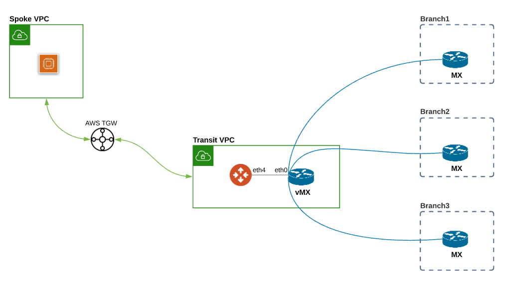
	 
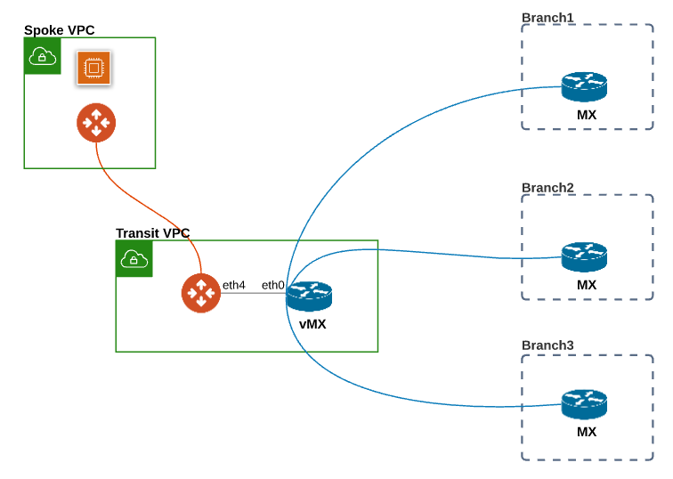

.. |cisco_meraki_aws_vMX_appliance_status| image:: transit_gateway_external_device_bgp_over_lan_with_aws_meraki_workflow_media/cisco_meraki_aws_vMX_appliance_status.png
   :scale: 50%
	 
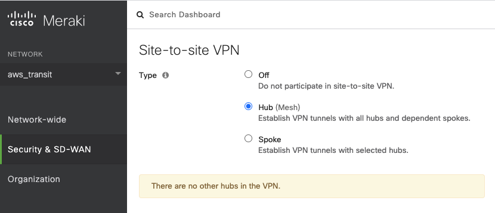
	 
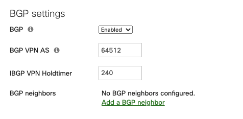

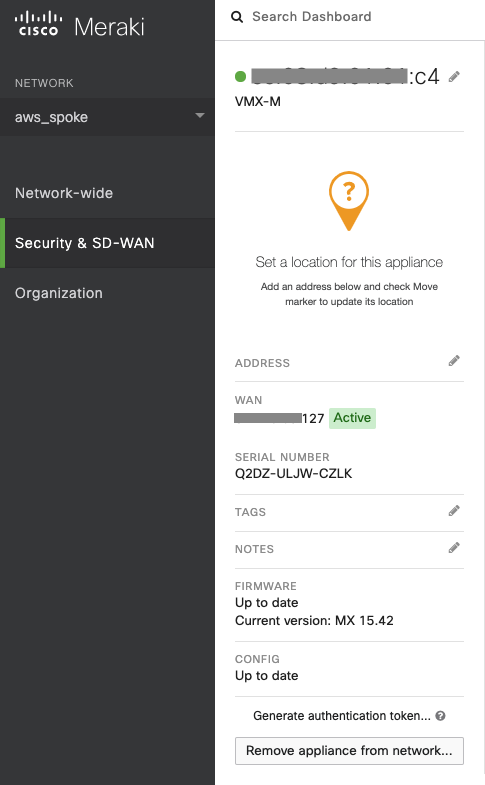
   
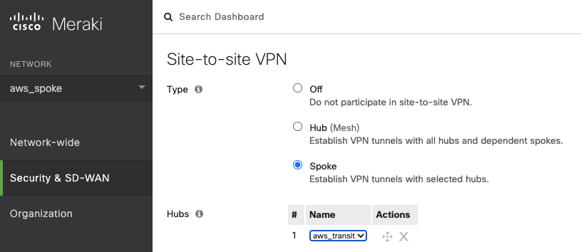
 
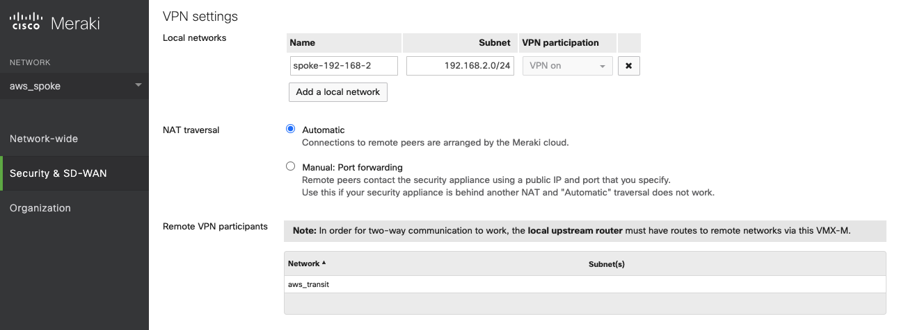

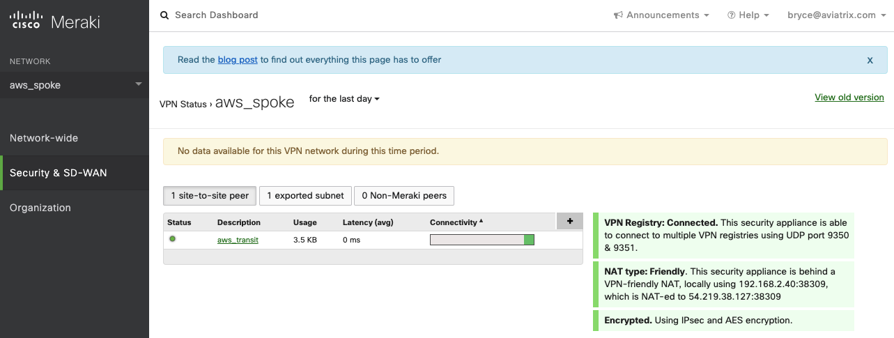
   
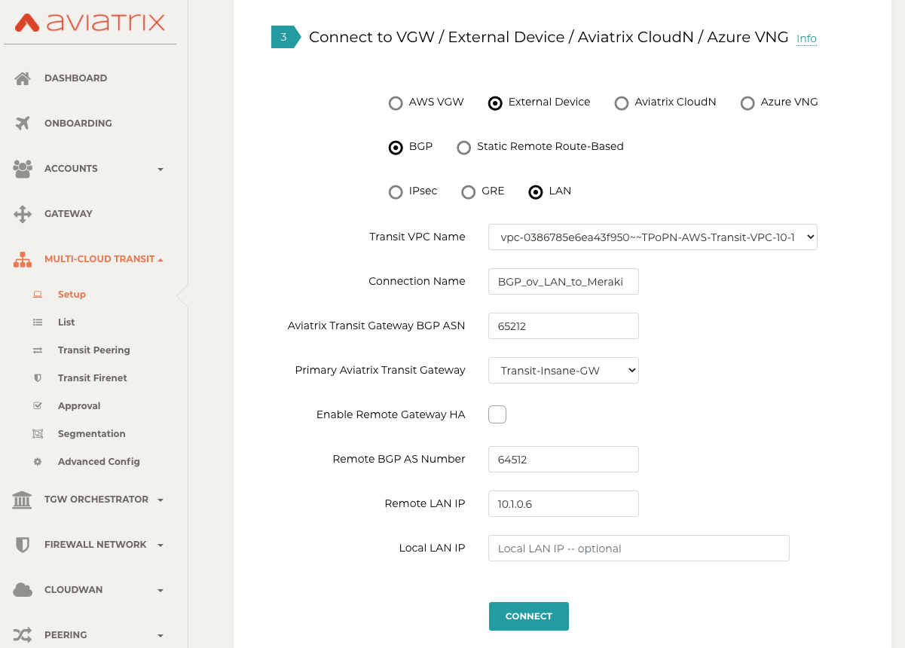
   
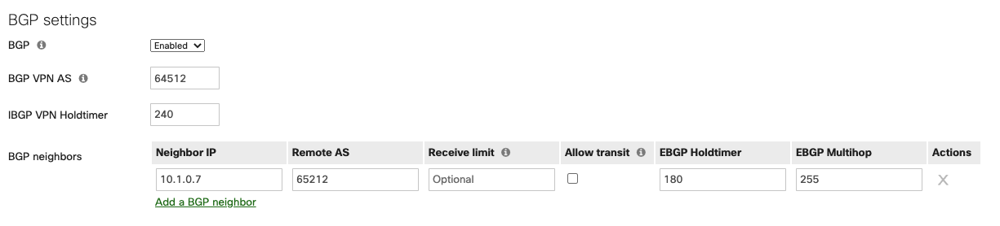
   
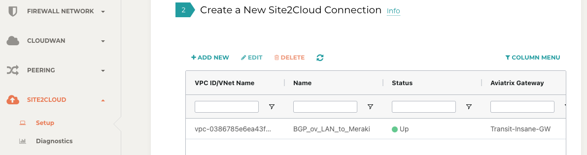
   
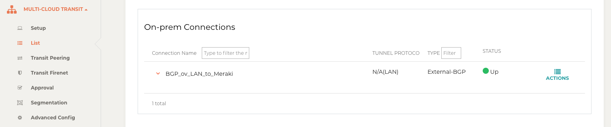
   
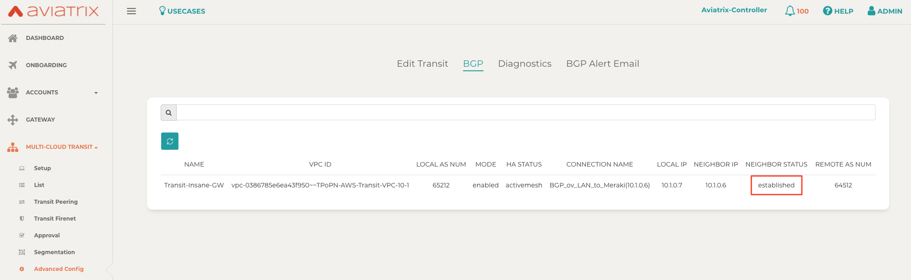

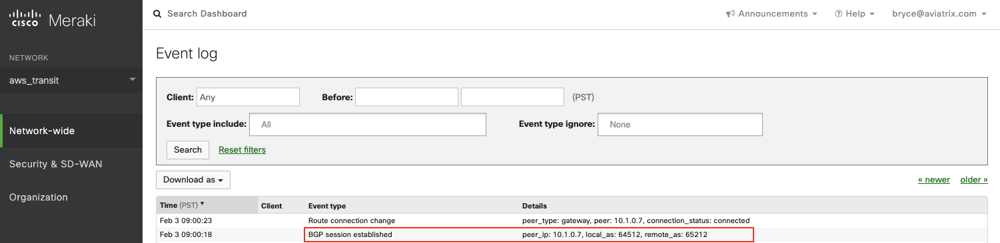
   
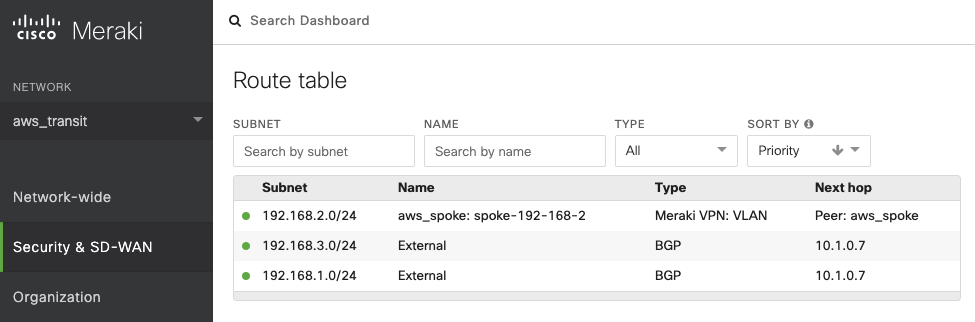

.. |cisco_meraki_aws_branch_vMX_routing_info| image:: transit_gateway_external_device_bgp_over_lan_with_aws_meraki_workflow_media/cisco_meraki_aws_branch_vMX_routing_info.png
   :scale: 30%   

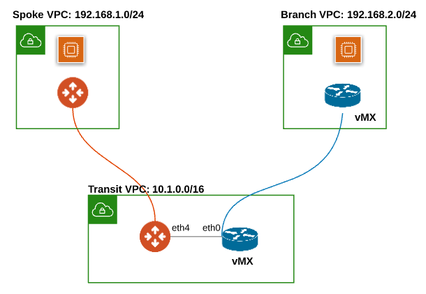

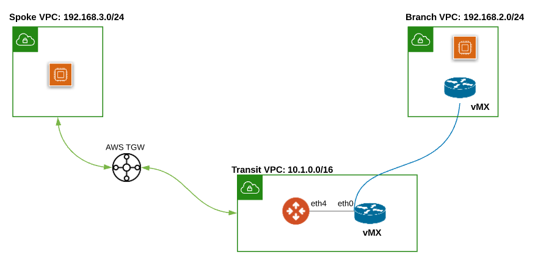

.. disqus::

