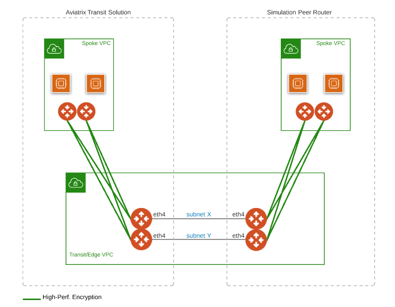
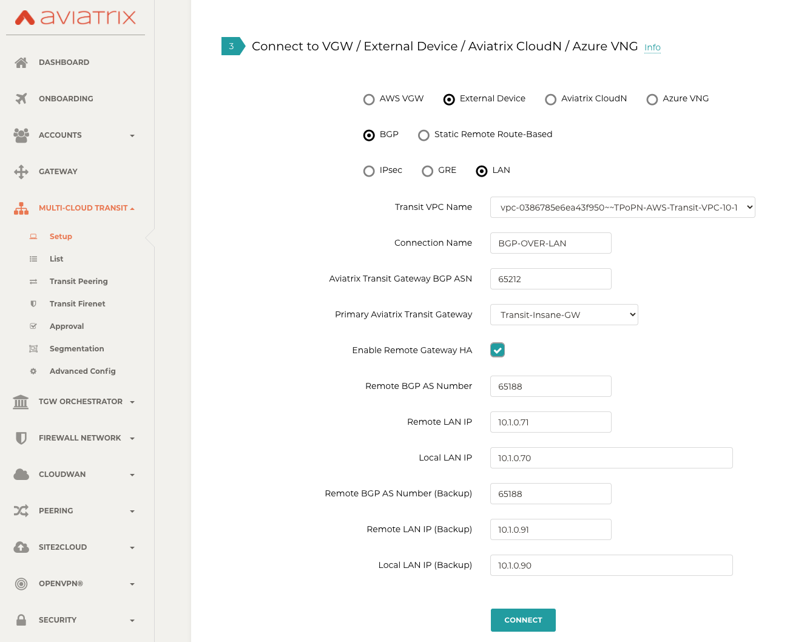
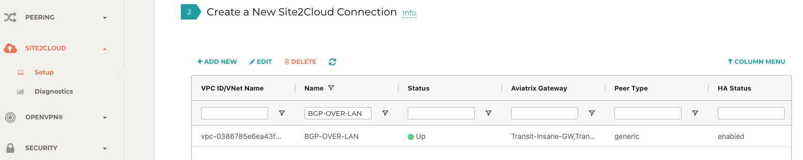
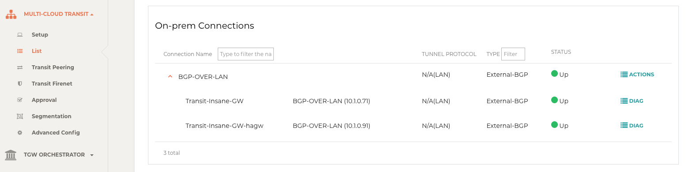
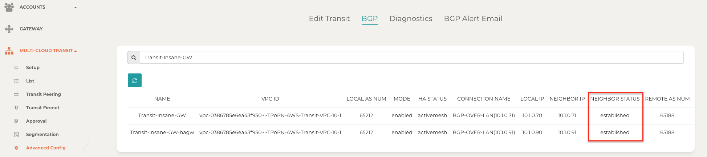
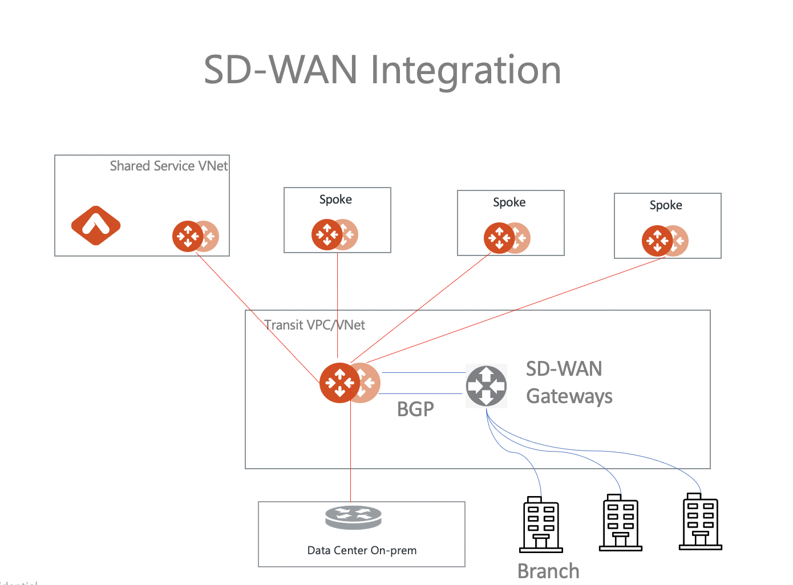

.. meta::
  :description: Multi-cloud Transit Gateway to External Device with BGP over LAN simulation workflow
  :keywords: Aviatrix Transit network, Private Network, BGP over LAN, External Device, High Performance, SD-WAN

==========================================================================================
Multi-cloud Transit BGP over LAN Workflow
==========================================================================================

Introduction
============

Transit BGP to LAN allows Aviatrix Transit Gateways to communicate with a pair of instances in the same VPC or VNet without running 
any tunneling protocol such as IPSec or GRE. One use case is to interoperate with third-party virtual appliances such as 
SD-WAN cloud instances that do not have the capability to support BGP over any tunneling protocols.

For example, integrating with SD-WAN gateways can be deployed as below, 

|sd_wan_integ|

where an Aviatrix Multi-cloud Transit Gateway connects to a third-party cloud instance in the same VPC/VNet.

This document describes a step-by-step instruction on how to build Aviatrix Transit Gateway to External Device using BGP over LAN. 
In this Tech Note, you learn the following:

#. Workflow on `deploying Aviatrix Transit Solution <>`_

#. Workflow on `launching third-party cloud instances <>`_

#. Workflow on `building BGP over LAN <>`_

For more information about Multi-Cloud Transit Network and External Device, please check out the below documents:

- `Multi Cloud Global Transit FAQ <https://docs.aviatrix.com/HowTos/transitvpc_faq.html#multi-cloud-global-transit-faq>`_
- `Global Transit Network Workflow Instructions (AWS/Azure/GCP/OCI) <https://docs.aviatrix.com/HowTos/transitvpc_workflow.html>`_
- `Aviatrix Transit Gateway to External Devices <https://docs.aviatrix.com/HowTos/transitgw_external.html>`_
- `Transit Network Design Patterns <https://docs.aviatrix.com/HowTos/transitvpc_designs.html>`_

.. important::
	
  - This solution supports only `ActiveMesh 2.0 <https://docs.aviatrix.com/HowTos/activemesh_faq.html#what-is-activemesh-2-0>`_, please check this doc `How to migrate to ActiveMesh 2.0 <https://docs.aviatrix.com/HowTos/activemesh_faq.html#how-to-migrate-to-activemesh-2-0>`_ for migration detail.
  
  - This solution is available to AWS and Azure. Workflow with AWS here is just an example. Please adjust the topology depending on your requirements.

  - Require instance size to support at least 5 interfaces such as c4.4xlarge
	
	- LAN interfaces for Aviatrix Transit Primary and third-party cloud instance must be in the same Availability Zone.

The key ideas for this solution are:
----------------------------------------
  
- A BGP session establishes between a third-party cloud instance and Aviatrix Transit Gateway via each LAN interface in the same VPC or VNet

- Data plane traffic also runs between a third-party cloud instance and Aviatrix Transit Gateway via each LAN interface without a tunnel protocol such as IPSec and GRE. 

Prerequisite
====================

- This feature is available for 6.3 and later. `Upgrade <https://docs.aviatrix.com/HowTos/inline_upgrade.html>`_ Aviatrix Controller to at least version 6.3
  
- In this example, we are going to deploy the below VPCs in AWS:

  - Transit VPC (i.e. 10.1.0.0/16) by utilizing Aviatrix feature `Create a VPC <https://docs.aviatrix.com/HowTos/create_vpc.html>`_ with Aviatrix FireNet VPC option enabled

  - Spoke VPCs (i.e. 192.168.1.0/24 and 192.168.2.0/24) by utilizing Aviatrix feature `Create a VPC <https://docs.aviatrix.com/HowTos/create_vpc.html>`_ as the previous step or manually deploying it in each cloud portal. Moreover, feel free to use your existing cloud network.
  
- Third-party cloud instance has high throughput supported
	
1. Deploy Aviatrix Multi-Cloud Transit Solution
=================================================

Refer to `Global Transit Network Workflow Instructions <https://docs.aviatrix.com/HowTos/transitvpc_workflow.html>`_ for the below steps. Please adjust the topology depending on your requirements.

Step 1.1. Deploy Aviatrix Multi-Cloud Transit Gateway and HA
------------------------------------------------------------

- Follow this step `Deploy the Transit Aviatrix Gateway <https://docs.aviatrix.com/HowTos/transit_firenet_workflow_aws.html#step-2-deploy-the-transit-aviatrix-gateway>`_ to launch Aviatrix Transit gateway and enable HA with insane mode enabled in Transit VPC

- In this example, size c5n.4xlarge are selected to benchmark `performance <https://docs.aviatrix.com/HowTos/transit_gateway_external_device_bgp_over_gre_high_performance_workflow.html#performance-benchmark>`_.

Step 1.2. Deploy Spoke Gateway and HA
--------------------------------------

- Follow this step `Deploy Spoke Gateways <https://docs.aviatrix.com/HowTos/transit_firenet_workflow_aws.html#step-3-deploy-spoke-gateways>`_ to launch Aviatrix Spoke gateway and enable HA with insane mode enabled in Spoke VPC

- In this example, size c5n.4xlarge are selected to benchmark `performance <https://docs.aviatrix.com/HowTos/transit_gateway_external_device_bgp_over_gre_high_performance_workflow.html#performance-benchmark>`_.

Step 1.3. Attach Spoke Gateways to Transit Network
--------------------------------------------------

- Follow this step `Attach Spoke Gateways to Transit Network <https://docs.aviatrix.com/HowTos/transit_firenet_workflow_aws.html#step-4-attach-spoke-gateways-to-transit-network>`_ to attach Aviatrix Spoke Gateways to Aviatrix Transit Gateways

2. Launch third-party cloud instances
================================================================================

Deploy third-party cloud instances in the same VPC or VNet. 

.. important::

  The primary Aviatrix Transit Gateway must be deployed in the same subnet as the first third-party cloud instance. The HA Transit Gateway if deployed must reside in the same subnet as the second cloud instance. 

3. Build BGP over LAN
================================================

Step 3.1. Configure BGP over LAN on Aviatrix Transit Gateway
-------------------------------------------------------------

- Login Aviatrix Controller

- Go to MULTI-CLOUD TRANSIT -> Setup -> 3) Connect to VGW / External Device / Aviatrix CloudN / Azure VNG

- Select option "External Device" -> "BGP" -> "LAN"

- Fill the parameters to set up BGP over LAN to a third-party cloud instance
  
+----------------------------------+------------------------------------------------------------------------------------------------------------------------------------------------------------+
| Transit VPC Name                 | Select the Transit VPC ID where Transit GW was launched.                                                                                                   |
+----------------------------------+------------------------------------------------------------------------------------------------------------------------------------------------------------+
| Connection Name                  | Provide a unique name to identify the connection to external device.                                                                                       |
+----------------------------------+------------------------------------------------------------------------------------------------------------------------------------------------------------+
| Aviatrix Transit Gateway BGP ASN | Configure a BGP AS number that the Transit GW will use to exchange routes with external device.                                                            |
+----------------------------------+------------------------------------------------------------------------------------------------------------------------------------------------------------+
| Primary Aviatrix Transit Gateway | Select the Transit GW.                                                                                                                                     |
+----------------------------------+------------------------------------------------------------------------------------------------------------------------------------------------------------+
| Enable Remote Gateway HA         | Check this option in this example.                                                                                                                         |
+----------------------------------+------------------------------------------------------------------------------------------------------------------------------------------------------------+
| Remote BGP AS Number             | Configure a BGP AS number that third-party cloud instance will use to exchange routes with Aviatrix Transit Primary                                        |
+----------------------------------+------------------------------------------------------------------------------------------------------------------------------------------------------------+
| Remote LAN IP                    | Configure a valid IP within the subnet where Aviatrix Transit Primary and third-party cloud instance Primary locate for third-party cloud instance Primary |
+----------------------------------+------------------------------------------------------------------------------------------------------------------------------------------------------------+
| Local LAN IP                     | Configure a valid IP within the subnet where Aviatrix Transit Primary and third-party cloud instance Primary locate for Aviatrix Transit Primary           |
+----------------------------------+------------------------------------------------------------------------------------------------------------------------------------------------------------+
| Remote BGP AS Number (Backup)    | Configure a BGP AS number that third-party cloud instance HA will use to exchange routes with Aviatrix Transit HA                                          |
+----------------------------------+------------------------------------------------------------------------------------------------------------------------------------------------------------+
| Remote LAN IP                    | Configure a valid IP within the subnet where Aviatrix Transit HA and third-party cloud instance HA locate for third-party cloud instance HA                |
+----------------------------------+------------------------------------------------------------------------------------------------------------------------------------------------------------+
| Local LAN IP                     | Configure a valid IP within the subnet where Aviatrix Transit HA and third-party cloud instance HA locate for Aviatrix Transit HA                          |
+----------------------------------+------------------------------------------------------------------------------------------------------------------------------------------------------------+

- Click the button "CONNECT" to generate BGP session over LAN

  |aviatrix_transit_externel_device_lan|
  
Step 3.2. (Optional) Download the BGP over LAN configuration sample from Aviatrix Controller
--------------------------------------------------------------------------------------------

- Navigate to SITE2CLOUD -> Setup

- Select the connection that you created with “Connection Name” in the previous step

- Click the button "EDIT"

- Select Vendor type, Platform, and Software.

- Click the button "Download Configuration".

Step 3.3. Configure BGP over LAN on third-party cloud instance
---------------------------------------------------------------

- (Optional) Open the downloaded BGP over LAN configuration file

- Configure those related BGP and LAN info on third-party cloud instance

Step 3.4. Verify LAN status on Aviatrix Controller
----------------------------------------------------------

- Navigate back to Aviatrix Controller

- Go to SITE2CLOUD -> Setup

- Find the connection that you created with “Connection Name” in the previous step

- Check the Tunnel Status

  |aviatrix_bgp_lan_status_1|

- Go to MULTI-CLOUD TRANSIT -> List

- Select the Transit Primary Gateway that was created in the previous step

- Click the button "DETAILS/DIAG"

- Scroll down to the panel "Connections" -> "On-prem Connections"

- Find the connection that you created with “Connection Name” in the previous step

- Check the Tunnel Status

  |aviatrix_bgp_lan_status_2|

Step 3.5. Verify BGP session status on Aviatrix Controller
----------------------------------------------------------

- Go to MULTI-CLOUD TRANSIT -> Advanced Config -> BGP Tab

- Find the connection that you created with “Connection Name” in the previous step

- Check the BGP Status

  |aviatrix_bgp_status|

4. Ready to go!
=================

At this point, run connectivity and performance test to ensure everything is working correctly. 

5. Performance Benchmark
===========================

End-to-End traffic via Aviatrix <-> Aviatrix
---------------------------------------------

The performance test is done with a pair of Aviatrix Transit Gateways as the third-party cloud instances, as shown below. 

|transit_gateway_external_device_bgp_over_lan_diagram|

Multiple flows result by using iperf3 tool with TCP 128 connections
^^^^^^^^^^^^^^^^^^^^^^^^^^^^^^^^^^^^^^^^^^^^^^^^^^^^^^^^^^^^^^^^^^^

+-----------------------+------------------+
| Aviatrix Gateway size | Throughput (Gbps)|
+-----------------------+------------------+
| C5n.4xlarge           | 23 - 24          |
+-----------------------+------------------+

Single flow result by using iperf3 tool with TCP 1 connection
^^^^^^^^^^^^^^^^^^^^^^^^^^^^^^^^^^^^^^^^^^^^^^^^^^^^^^^^^^^^^

2.1 - 2.3 (Gbps) for size C5n.4xlarge 

6. Additional Read
===========================

Additional read can be found in this short blog, `Need of conventional BGP support in the cloud <https://community.aviatrix.com/t/h7htvvc/need-of-conventional-bgp-support-in-the-cloud>`_

	 
.. |aws_vgw_attach| image:: transit_gateway_external_device_bgp_over_lan_simulation_workflow_media/aws_vgw_attach.png
   :scale: 50%

.. |aws_route_propagation_status_yes| image:: transit_gateway_external_device_bgp_over_lan_simulation_workflow_media/aws_route_propagation_status_yes.png
   :scale: 50%
	 
.. |aws_route_propagation_routing_entry| image:: transit_gateway_external_device_bgp_over_lan_simulation_workflow_media/aws_route_propagation_routing_entry.png
   :scale: 50%
	 

   

 

   
.. disqus::

