.. meta::
  :description: Transit Gateway integration with ExpressRoute Workflow
  :keywords: Azure ExpressRoute, Aviatrix Transit Gateway integration with ExpressRoute

============================================================================
Configuration Example for Multi-Cloud Transit Integration Azure VNG VPN 
============================================================================

This document describes the configuration workflow for the following network diagram.

|vpn_topology|

where there are two Spoke VNets, one with Aviatrix Spoke gateway (172.60.0.0/16) and one native Spoke VNet (172.50.0.0/16)

Prerequisite
====================

`Upgrade <https://docs.aviatrix.com/HowTos/inline_upgrade.html>`_ Aviatrix Controller to at least version 6.3.

.. tip::

  We highly recommend you to ceate Azure Transit VNET by utilizing Aviatrix feature `Create a VNet  <https://docs.aviatrix.com/HowTos/create_vpc.html>`_ with Aviatrix FireNet VNet option enabled. Create a VNG in this Transit VNet.

Connect VNG on On-Prem
=======================================================================================================

If you have already created VNG in Transit VNet, skip this section.

This section covers an example of building a VPN tunnel with Cisco IOS. For more information about Azure VPN, please check out the below documents:

  - Refer to `Azure VPN Documentation <https://docs.microsoft.com/en-us/azure/vpn-gateway/vpn-gateway-multi-site>`_

  - Refer to `Azure VPN Gateway BGP Example <https://docs.microsoft.com/en-us/azure/vpn-gateway/bgp-howto>`_

  - Refer to `Azure S2S Example <https://docs.microsoft.com/en-us/azure/vpn-gateway/tutorial-site-to-site-portal>`_

Adjust the topology depending on your requirements.

Step 1.1 Create Virtual Network Gateway
----------------------------------------

1. Login to Azure Portal and search "Virtual Network Gateway".
2. Click "Add" to create a new Virtual Network Gateway (VNG)

|create_VNG|

   +------------------------------+-------------------------------------------+
   | Field                        | Description                               |
   +------------------------------+-------------------------------------------+
   | Subscription                 | Select a **Azure Subscription**           |
   +------------------------------+-------------------------------------------+
   | Name                         | Any Name                                  |
   +------------------------------+-------------------------------------------+
   | Region                       | Select Region e.g. West US2               |
   +------------------------------+-------------------------------------------+
   | Gateway type                 | Select **VPN**                            |
   +------------------------------+-------------------------------------------+
   | VPN type                     | Select **Route-based**                    |
   +------------------------------+-------------------------------------------+
   | SKU                          | Any (e.g. VpnGw1)                         |
   +------------------------------+-------------------------------------------+
   | Generation                   | Any                                       |
   +------------------------------+-------------------------------------------+
   | Virtual Network              | Select **Transit FireNet Gateway VNet**   |
   +------------------------------+-------------------------------------------+
   | Public IP address            | Any                                       |
   +------------------------------+-------------------------------------------+
   | Public IP address name       | Any                                       |
   +------------------------------+-------------------------------------------+
   | Enable active-active mode    | Any (By default Disabled)                 |
   +------------------------------+-------------------------------------------+
   | Configure BGP                | Select **Enabled** and give any ASN       |
   +------------------------------+-------------------------------------------+

.. note::
    This step may take up to 45 minutes to complete.

3. Once VNG is created. Go to Azure Portal -> Virtual Network Gateway  -> Configuration and note down **Public IP Address** and **Default Azure BGP peer IP address**

Step 1.2 Create Azure Local Network Gateways (LGW)
-------------------------------------------------------------------

1. Login to Azure Portal and search "Local network gateways".
2. Click "Add" to create a new Local Network Gateway

|LGW_example|

   +------------------------------+-------------------------------------------+
   | Field                        | Description                               |
   +------------------------------+-------------------------------------------+
   | Name                         | Any                                       |
   +------------------------------+-------------------------------------------+
   | IP Address                   | Any e.g. Cisco IOS Public IP 44.241.247.99|
   +------------------------------+-------------------------------------------+
   | Configure BGP settings       | Check BGP checkbox                        |
   +------------------------------+-------------------------------------------+
   | BGP ASN                      | Any (e.g. 65002)                          |
   +------------------------------+-------------------------------------------+
   | BGP peer IP address          | Any (e.g. 192.168.1.1)                    |
   +------------------------------+-------------------------------------------+
   | Subscription                 | Select valid subscription                 |
   +------------------------------+-------------------------------------------+
   | Resource group               | Any or Create new                         |
   +------------------------------+-------------------------------------------+
   | Location                     | Any (e.g. West US2)                       |
   +------------------------------+-------------------------------------------+

Step 1.3 Create a VPN Connection
----------------------------------------------------------------------

1) Login to Azure Portal and search "Virtual network gateways"
2) Click on VNG created earlier
3) Select Connections
4) Click "Add"

|Connection_Example|

   +------------------------------+-------------------------------------------+
   | Field                        | Description                               |
   +------------------------------+-------------------------------------------+
   | Name                         | Any                                       |
   +------------------------------+-------------------------------------------+
   | Connection type              | Select Site-to-Site (IPSec)               |
   +------------------------------+-------------------------------------------+
   | Virtual network gateway      | Select VNG just created                   |
   +------------------------------+-------------------------------------------+
   | Local network gateway        | Select LNG just created                   |
   +------------------------------+-------------------------------------------+
   | Shared key (PSK)             | Enter the value that matches the value    |
   |                              | `Internet Key Exchange Configuration`     |
   |                              | > **Pre-Shared Key**                      |
   +------------------------------+-------------------------------------------+
   | Use Azure Private IP address | Uncheck                                   |
   +------------------------------+-------------------------------------------+
   | Enable BGP                   | Check                                     |
   +------------------------------+-------------------------------------------+
   | IKE Protocol                 | Select IKEv2                              |
   +------------------------------+-------------------------------------------+

5) Select the VPN you just created and click the Download Configuration button along the top. At the dialog, select Cisco for the Vendor, IOS for the Device family and firmware version 15.x (IKEv2)

Click Download Configuration. You will use this file to create the other side of the tunnel.

.. note::
    Cisco IOS configuration is not accurate. Please modify it before use it.

Cisco IOS sample configuration used in this example:

::

    Current configuration : 5983 bytes
    !
    hostname Cisco-IOS
    !
    username ec2-user privilege 15
    !
    crypto ikev2 proposal CSR-VPN-proposal
     encryption aes-cbc-256
     integrity sha1
     group 2
    !
    crypto ikev2 policy CSR-VPN-policy
     match address local 10.100.0.20
     proposal CSR-VPN-proposal
    !
    crypto ikev2 keyring CSR-VPN-keyring
     peer 52.151.46.220
      address 52.151.46.220
      pre-shared-key <key>
     !
    !
    crypto ikev2 profile CSR-VPN-profile
     match address local 10.100.0.20
     match identity remote address 52.151.46.220 255.255.255.255
     authentication remote pre-share
     authentication local pre-share
     keyring local CSR-VPN-keyring
     lifetime 3600
     dpd 10 5 on-demand
    !
    !
    !
    crypto ipsec transform-set CSR-VPN-TransformSet esp-gcm 256
     mode tunnel
    !
    crypto ipsec profile CSR-VPN-IPsecProfile
     set transform-set CSR-VPN-TransformSet
     set ikev2-profile CSR-VPN-profile
    !
    !
    !
    interface Loopback11
     ip address 1.1.1.1 255.255.255.255
    !
    interface Tunnel11
     ip address 192.168.1.1 255.255.255.255
     ip tcp adjust-mss 1350
     tunnel source 10.100.0.20
     tunnel mode ipsec ipv4
     tunnel destination 52.151.46.220
     tunnel protection ipsec profile CSR-VPN-IPsecProfile
    !
    interface VirtualPortGroup0
     vrf forwarding GS
     ip address 192.168.35.101 255.255.255.0
     ip nat inside
     no mop enabled
     no mop sysid
    !
    interface GigabitEthernet1
     ip address dhcp
     ip nat outside
     negotiation auto
     no mop enabled
     no mop sysid
    !
    router bgp 65002
     bgp log-neighbor-changes
     neighbor 172.40.1.254 remote-as 65515
     neighbor 172.40.1.254 ebgp-multihop 255
     neighbor 172.40.1.254 update-source Tunnel11
     !
     address-family ipv4
      network 1.1.1.1 mask 255.255.255.255
      network 10.100.0.20
      network 192.168.1.1
      neighbor 172.40.1.254 activate
     exit-address-family
    !
    iox
    ip forward-protocol nd
    ip tcp window-size 8192
    ip http server
    ip http authentication local
    ip http secure-server
    !
    ip nat inside source list GS_NAT_ACL interface GigabitEthernet1 vrf GS overload
    ip route 0.0.0.0 0.0.0.0 GigabitEthernet1 10.100.0.1
    ip route 172.40.0.0 255.255.0.0 Tunnel11
    ip route 172.40.1.254 255.255.255.255 Tunnel11
    ip route vrf GS 0.0.0.0 0.0.0.0 GigabitEthernet1 10.100.0.1 global
    !
    end

Connect Aviatrix Transit Gateway with VNG
============================================================================

Refer to `Global Transit Network Workflow Instructions <https://docs.aviatrix.com/HowTos/transitvpc_workflow.html>`_ for the below steps. Please adjust the topology depending on your requirements.

Step 2.1 Deploy Aviatrix Multi-Cloud Transit Gateway and HA in Azure
-----------------------------------------------------------------------

    - Follow this step `Deploy the Transit Aviatrix Gateway <https://docs.aviatrix.com/HowTos/transit_firenet_workflow_aws.html#step-2-deploy-the-transit-aviatrix-gateway>`_ to launch Aviatrix Transit gateway and enable HA with insane mode enabled in Azure Transit VNET. Insane mode is not required but an optional feature to increase throughput.

    - Instance size of at least Standard_D5_v2 will be required for `Insane Mode Encryptions <https://docs.aviatrix.com/HowTos/gateway.html#insane-mode-encryption>`_ for higher throughput. Please refer to this `doc <https://docs.aviatrix.com/HowTos/insane_mode_perf.html>`_ for performance detail.

    - Enable `Transit FireNet Function <https://docs.aviatrix.com/HowTos/transit_firenet_workflow.html#enable-transit-firenet-function>`_

Step 2.2 Connect Transit FireNet Gateway with VNG
------------------------------------------------------------------------------

This step assumes VNG is already deployed in the Transit VNet.

    - Go to Multi-Cloud Transit -> Step 3 Connect to VGW / External Device / Aviatrix CloudN / Azure VNG

    - Select **Azure VNG** radio button

    - Select **Primary Aviatrix Transit Gateway** in the drop down menu. Note if VNG has not been deployed in the Transit VNet, this step cannot complete.

    - VNG Name will populate automatically

    - Click **Connect**

|vng_step|

Step 2.3 Check Effective routes info on Azure portal
-------------------------------------------------------

	- Login Azure Portal

	- Search for "Network interfaces" on the search bar

	- Select Aviatrix Transit Gateway's interface

	- Navigate to the page "Effective routes" by clicking the link "Effective routes" under the section "Support + troubleshooting"

	- Check route entry for On-prem pointing Next Hop Type **Virtual network gateway**

		|azure_effective_routes_routing_entry|

Attach Spoke VNet to Aviatrix Transit Gateway
============================================================================

Step 3.1 Deploy Aviatrix Spoke Gateway in Spoke VNet
--------------------------------------------------------

	- Create Azure VNET for Aviatrix Spoke Gateway by utilizing Aviatrix feature `Create a VPC <https://docs.aviatrix.com/HowTos/create_vpc.html>`_ or manually deploy it in cloud portal or feel free to use existing virtual network.

Step 3.2 Launch Spoke Gateway and HA
--------------------------------------

	- Follow this step `Deploy Spoke Gateways <https://docs.aviatrix.com/HowTos/transit_firenet_workflow_azure.html#step-3-deploy-spoke-gateways>`_ to launch Aviatrix Spoke gateway and enable HA with insane mode enabled in Azure Spoke VNET. Insane mode is optional.

	- Instance size of at least Standard_D5_v2 will be required for `Insane Mode Encryptions <https://docs.aviatrix.com/HowTos/gateway.html#insane-mode-encryption>`_ for higher throughput. Please refer to this `doc <https://docs.aviatrix.com/HowTos/insane_mode_perf.html>`_ for performance detail.

Step 3.3 (Optional) Create Spoke VNet
---------------------------------------------------

	- If you do not have any Spoke VNet, create one by using Aviatrix feature `Create a VPC <https://docs.aviatrix.com/HowTos/create_vpc.html>`_ or manually do so in Azure portal.

Step 3.3 Attach Spoke Gateways to Transit Network
--------------------------------------------------

	- Follow this step `Attach Spoke Gateways to Transit Network <https://docs.aviatrix.com/HowTos/transit_firenet_workflow_azure.html#step-4-attach-spoke-gateways-to-transit-network>`_ to attach Aviatrix Spoke Gateways to Aviatrix Transit Gateways in Azure

    - Follow step `Attach Native Azure VNET to Transit Network <https://docs.aviatrix.com/HowTos/transit_firenet_azure_native_spokes_workflow.html?highlight=Transit%20Firenet%20Native%20Azure%20Spoke%20workflow#step-3-attach-native-spoke-vnets-to-transit-network>`_ to attach Azure Native VNET Spoke to Aviatrix Transit Gateway.

Ready to go!
============

Now you should be able to send traffic from cloud to on-prem as well as on-prem to cloud over Azure Express Route.

For FireNet deployment, follow the `Transit FireNet workflow <https://docs.aviatrix.com/HowTos/transit_firenet_workflow.html>`_.

Troubleshooting
=================

This section covers the end-to-end packet for troubleshooting purposes. This section covers the following:

    - Packet Flow when Inspection is disabled and traffic initiated from on-prem

    - Packet Flow when Inspection is disabled and traffic initiated from cloud

    - Packet Flow when Inspection is enabled and traffic initiated from cloud

    - Packet Flow when Inspection is enabled and traffic initiated from on-prem

Before we start the packet walk hop by hop first make sure IPSec tunnel is connected and BGP session is up

Azure Portal
-------------

|VNG_VPN_IPSec|

Cisco IOS
----------

Interface output to make sure all interfaces and tunnels are up.

|ip_int_br|

"Show ip bgp summary" shows BGP session status and if IOS learning any routes via BGP

|bgp_su_output|

Check IPSec IKEv2 tunnel status
|crypto_IOS_output|

Traffic Initiated from On-Prem and Inspection is disabled
-----------------------------------------------------------

In this example, following VNETs in Azure will be used:

    - Azure Aviatrix Transit VNET (i.e. 172.40.0.0/16)

    - Azure Aviatrix Spoke VNETs (i.e. 172.50.0.0/16)

|traffic_onprem_to_cloud_disable_inspection|

Traffic flow from on-prem Cisco IOS Router with 10.100.0.0/16 subnet and Loopback 1.1.1.1/32 to Cloud Azure Native Spoke VNET (10.50.0.0/16)

Lets start at Cisco IOS and verify if Spoke CIDR is learned and what is the Next Hop to reach to Spoke VNET.

|sh_ip_bgp|

Next Hop of Spoke VNET should be VPN termination point so it should be the IP address of VNG.

    -   Login to Azure Portal and search "Virtual network gateways"

    -   Go to Virtual network gateways, select Virtual Network Gateway created earlier

    -   Click Configuration inside VNG and verify the IP address of Next Hop

|verify_vng_ip|

Traffic reached at VNG which is terminated at the Cloud. Now login to Azure Portal -> All resources -> VNG Route table to check what is the Next hop to reach Spoke VNET.

|vng_rt|

VNG route table showing next hop 172.40.0.134 which is a IP of Loadbalancer

|LB_IP|

Next we need to check the LB rules and see what is the LB backend pool name

|lb_rules|

Once we know pool name then we go to Backend Pool and check the next hop IP address

|be_pool|

LB should be pointing to Transit Gateway. Go Aviatrix Controller console and verify the private IP address of Aviatrix Transit FireNet Gateway.

|transit_ip|

Next go to transit and check if Transit has route to reach to Spoke VNET

|tr_rt|

Transit is showing it is going via IP 172.40.0.65. How do we verify that IP??

|subnet_sn|

|subnet_sn_1|

Traffic Initiated from Cloud and Inspection is disabled
-----------------------------------------------------------

In this example, following VNETs in Azure will be used:

    - Azure Aviatrix Transit VNET (i.e. 172.40.0.0/16)

    - Azure Aviatrix Spoke VNETs (i.e. 172.50.0.0/16)

|traffic_cloud_to_onprem_disable_inspection|

Traffic flow from Cloud Azure Native Spoke VNET (10.50.0.0/16) to on-prem Cisco IOS Router with 10.100.0.0/16 subnet and Loopback 1.1.1.1/32

Lets start from Spoke and verify if IOS routes are learned and what is the Next Hop to reach to on-prem.

|spk_rt|

Spoke showing next-hop as transit 172.40.0.68 (Transit FireNet Gateway)

|tr_rt_ns|

Transit FireNet Gateway showing the destination 1.1.1.1/32 via eth2 (172.40.0.161). In order to verify the next hop, we need to Transit FireNet Gateway interface eth2 and capture the subnet name to verify the pool address.

|subnet_name|

|subnet_ns|

Once traffic reach to VNG, we can verify that now VNG routing table is showing the destination IP via VPN tunnel.

|azure_effective_routes_routing_entry|

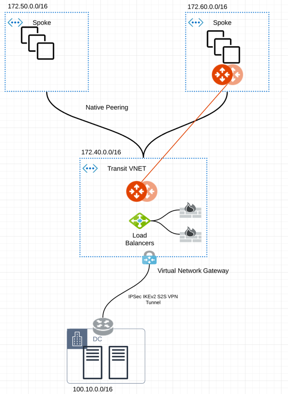

.. |traffic_onprem_to_cloud_disable_inspection| image:: transit_gateway_integration_with_expressroute_media/traffic_onprem_to_cloud_disable_inspection.png
   :scale: 60%

.. |azure_effective_routes_routing_entry| image:: transit_gateway_integration_with_expressroute_media/azure_effective_routes_routing_entry.png
   :scale: 40%

.. |vng_step| image:: transit_gateway_integration_with_expressroute_media/vng_step.png
   :scale: 40%

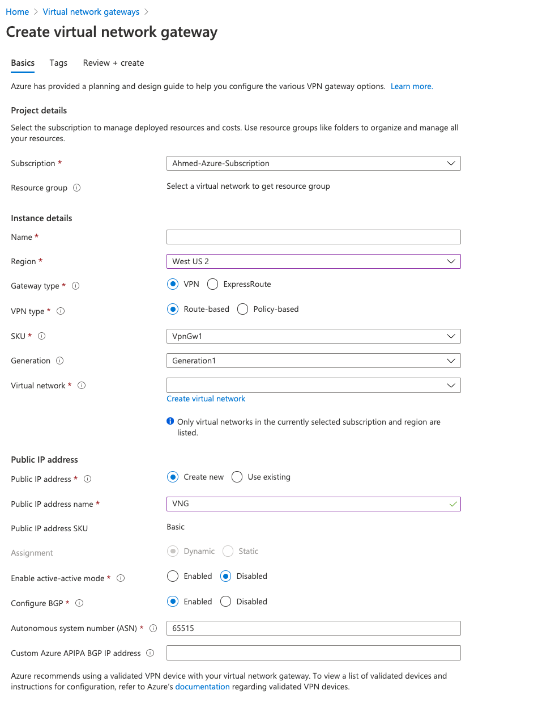

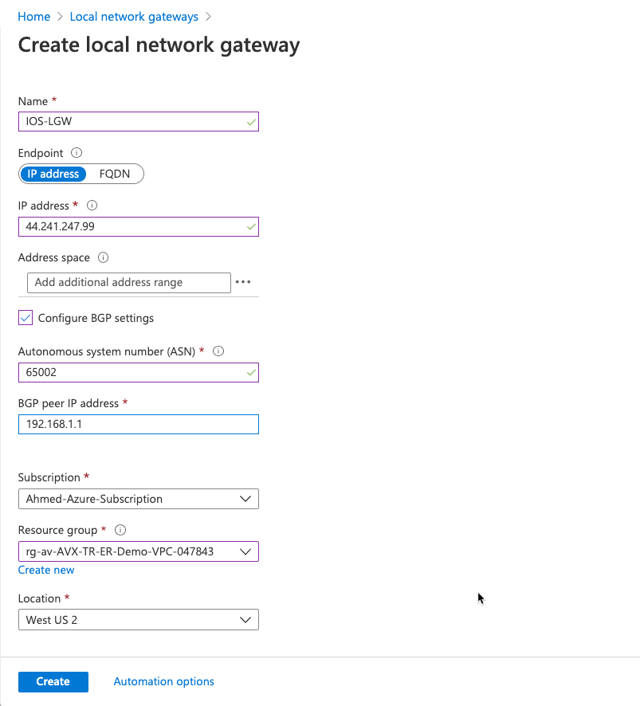

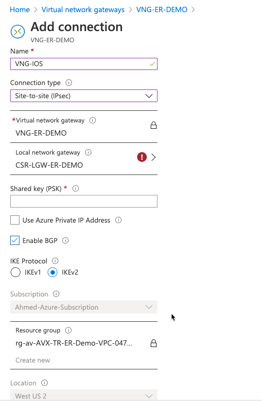

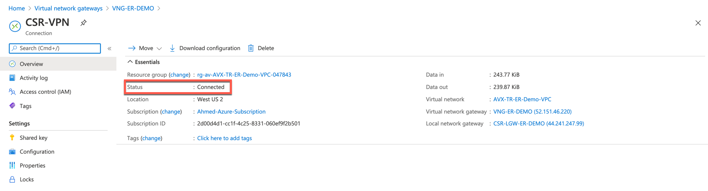

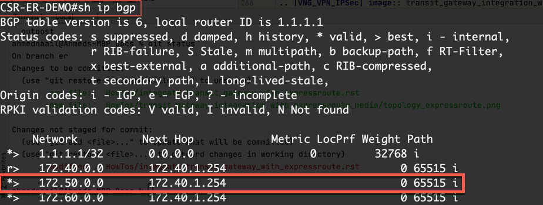

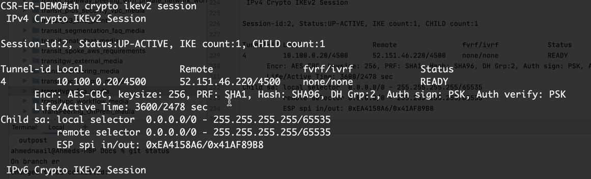

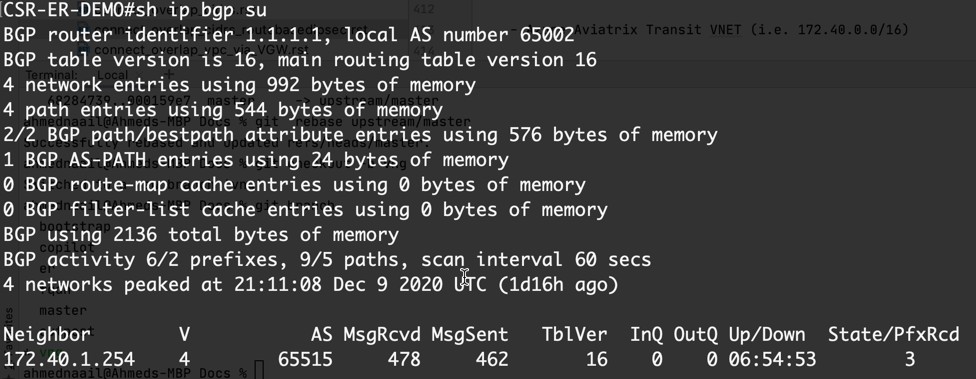

.. |ip_int_br| image:: transit_gateway_integration_with_expressroute_media/ip_int_br.png
   :scale: 40%

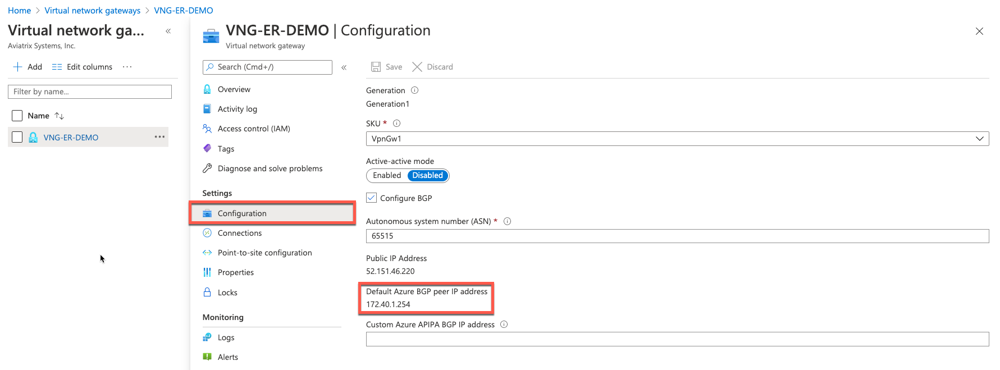

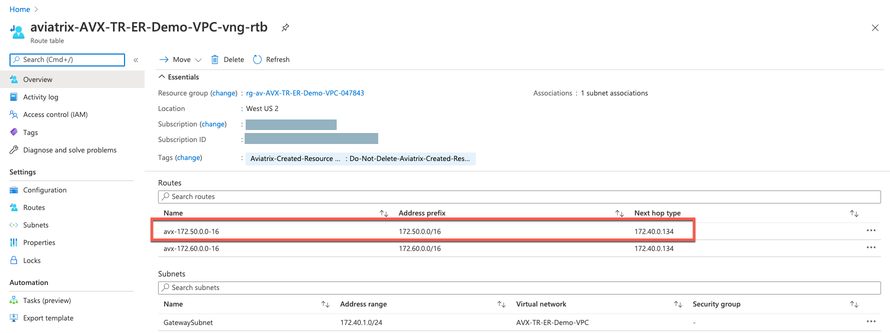

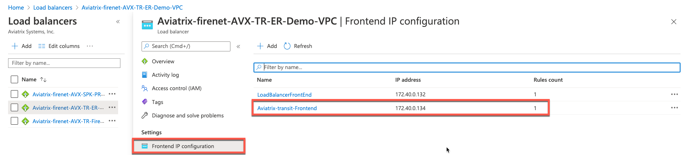

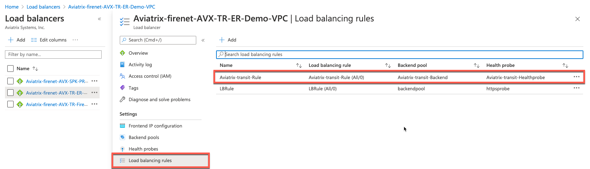

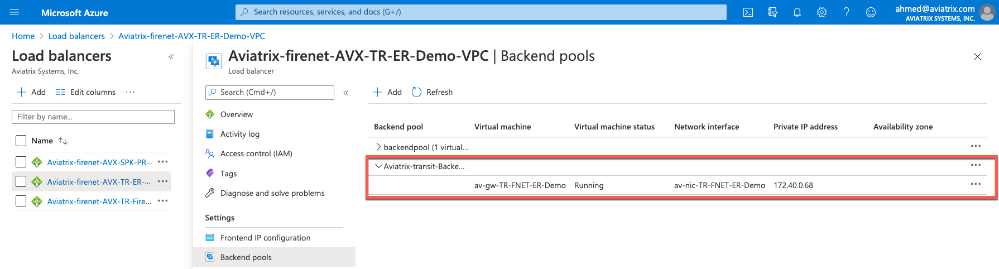

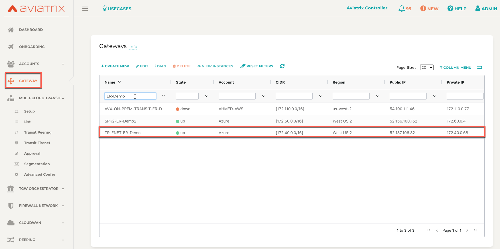

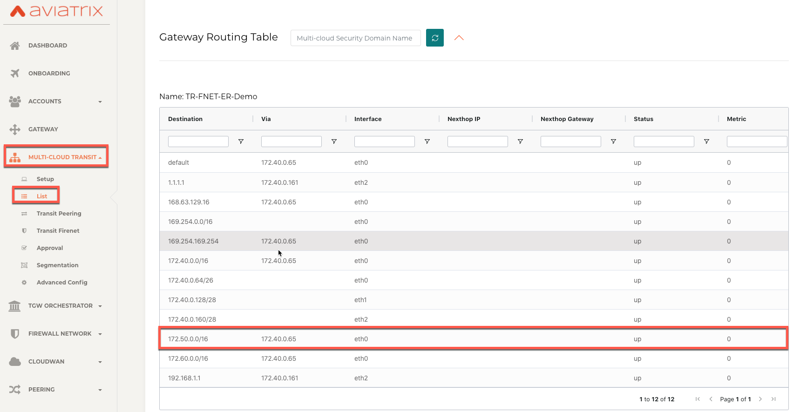

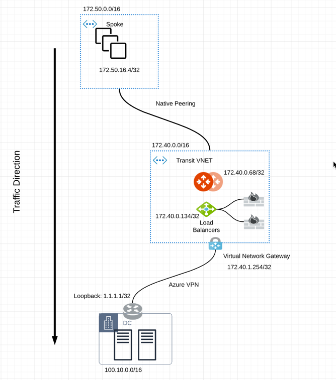

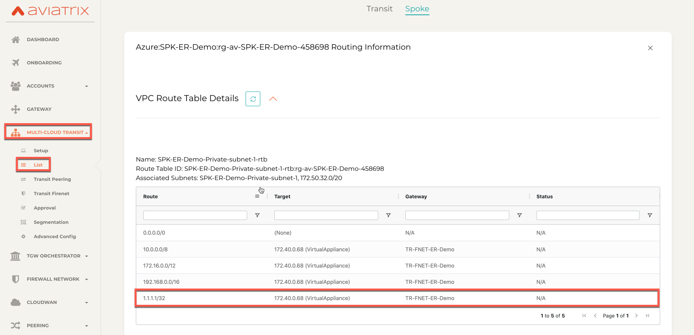

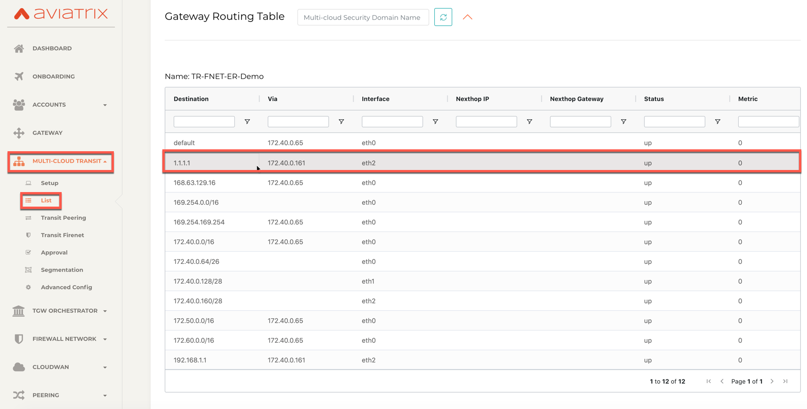

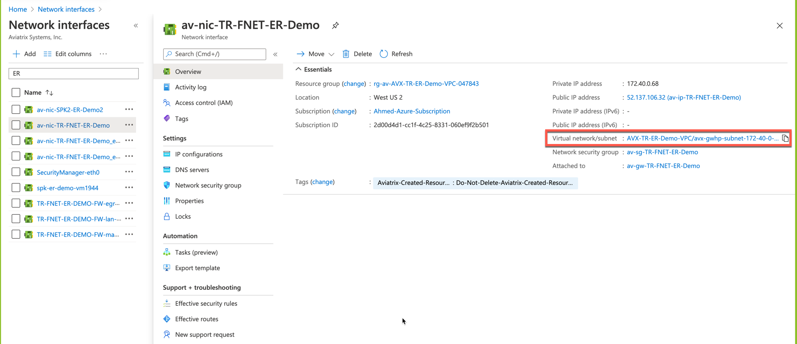

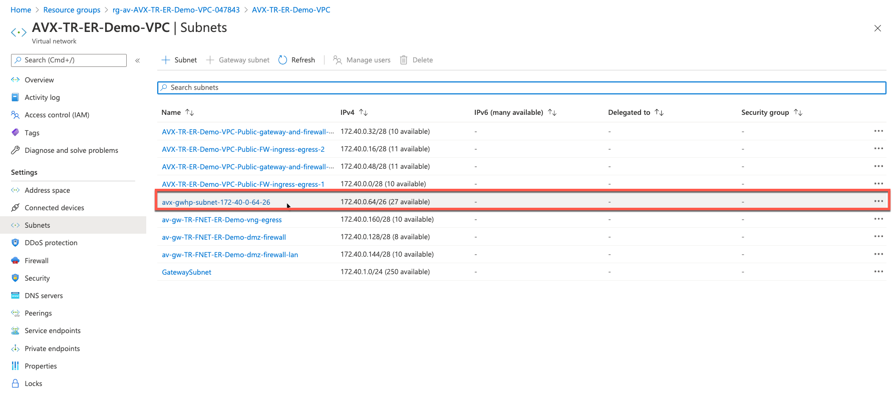

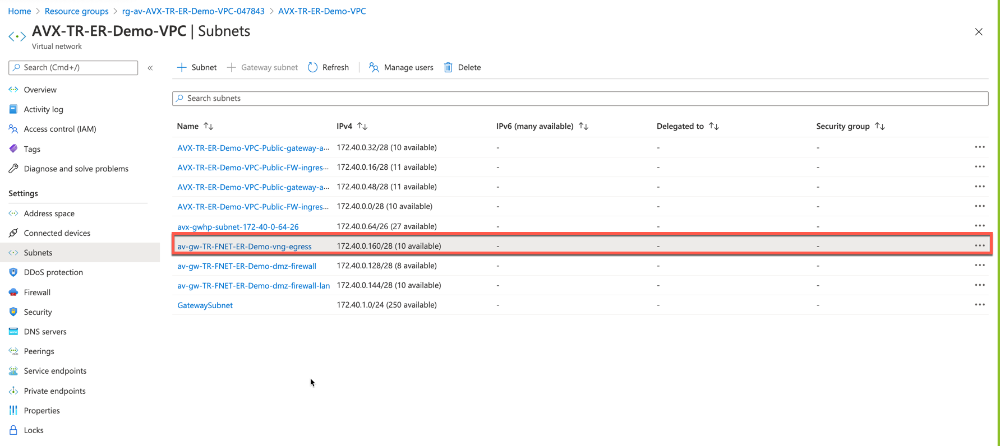

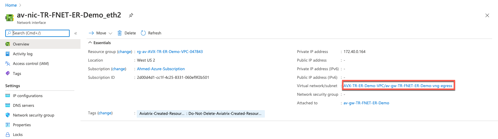

.. disqus::

