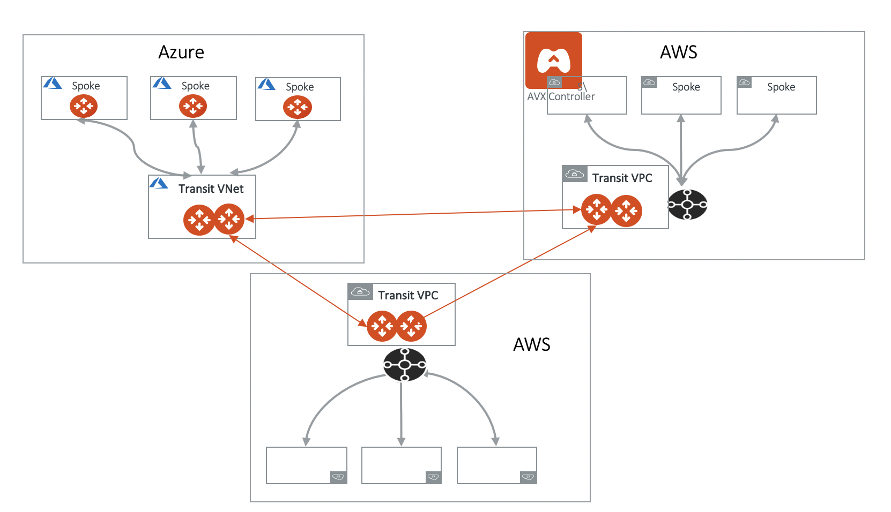
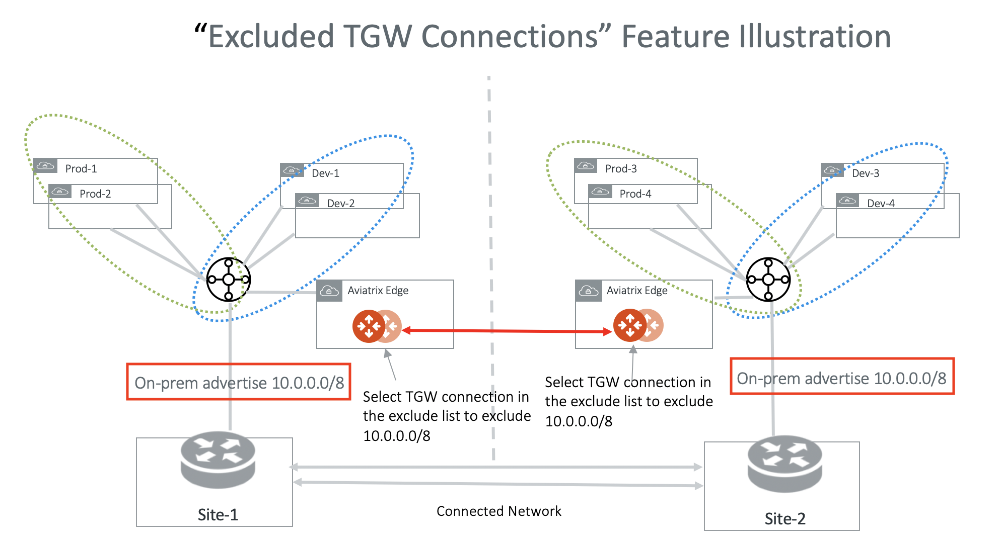
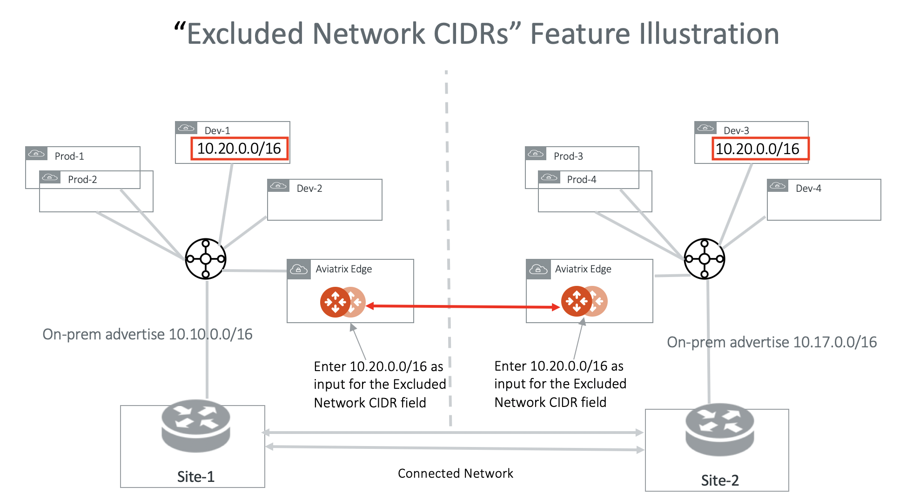

.. meta::
  :description: Transit Gateway Peering
  :keywords: Transit Gateway Peering, AWS Transit Gateway, AWS TGW, TGW orchestrator, Aviatrix Transit network

=========================================================
Aviatrix Transit Gateway Encrypted Peering
=========================================================

Transit Gateway Peering connects two or more Aviatrix Transit Gateways in a partial or full-mesh manner, as shown in the diagram below. The Aviatrix Transit Gateways may be deployed in AWS or Azure, where each Transit GW connects
a group of Spoke VPC/VNets. As a result of Transit Gateway Peering, two groups of Spoke VPC/VNets can communicate
with each other via the Transit Gateways. 

|multi-region|

The instructions are as follows. 

1. Launch Two Aviatrix Transit Gateways. If you have not done so, follow the instructions `here <https://docs.aviatrix.com/HowTos/transitvpc_workflow.html#launch-a-transit-gateway>`_ to launch an Aviatrix Transit GW. Repeat to launch more Transit GWs. 

Starting from Release 4.3, InsaneMode is supported on Transit Gateway Peering. Enable Transit Gateway Peering InsaneMode by launching the gateway with InsaneMode. 

.. tip::

  The Aviatrix Transit GWs are typically launched during the workflow of the TGW Orchestrator and Transit Network. If the transit cluster does not need to connect to on-prem, skip `the step 3 <https://docs.aviatrix.com/HowTos/transitvpc_workflow.html#connect-the-transit-gw-to-aws-vgw>`_ that connects to VGW/CloudN/External Device. 

2. Establish Transit GW Peering by navigating to Transit Network > Transit Peering > Add New. Select one of each Transit Gateway and click **OK**. 

There are a few optional and advanced options as described below. 

Excluded Network CIDRs
^^^^^^^^^^^^^^^^^^^^^^^^^^

Excluded Network CIDRs is an optional field. When the field is empty, a Transit Gateway propagates all learned routes from 
both Spoke VPC/VNets and on-prem. 

The use case for this field is if there are conflicting or identical CIDRs on both sides of the Transit Gateways, 
the peering action will be 
rejected. Using the filter option prevents the overlapped CIDRs from being propagated to the other Transit Gateway. 

Input a list of CIDRS separated by comma. 

You can edit this field after the Transit Peering took place. Go to Transit Network > Transit Peering, highlight the peering connection.
Click the 3 dots skewer and click **Edit** to modify the Excluded Network CIDR list.

The diagram below illustrates how Excluded Network CIDRs can be used in a two region deployment. In this case, 10.20.0.0/16 appears on 
both sides as VPC/VNet CIDR. To allow Transit Peering to proceed, configure on both Transit Gateways Excluded Network CIDRs with 10.20.0.0/16. 

|excluded_network_cidrs|

Excluded TGW Connections
^^^^^^^^^^^^^^^^^^^^^^^^^^^^

This feature applies to TGW hybrid connections. This is because TGW does not preserve BGP information in its learned routes. 

When you use AWS Transit Gateway (TGW) to connect to on-prem via DXGW or VPN, there are situations where on-prem advertise the same network 
CIDRs to TGW in two different regions. When you connect the two regions by the Aviatrix Transit Gateway Peering, the network CIDR overlapping
problem will occur. 

This feature allows you to not to advertise certain TGW hybrid attachment (DXGW and VPN) to the remote Aviatrix Transit Gateway and therefore
the remote TGW. 

In the dropdown menu, highlight the TGW hybrid connections (The input box is empty if there is no such connection.), multi-select the connections. The selected connections are excluded to advertise to the remote site. 

You can edit this field after the Transit Peering took place. Go to Transit Network > Transit Peering, highlight the peering connection. 
Click the 3 dots skewer and click **Edit** to modify the Excluded Connection list. 

The diagram below illustrate the use case for this feature. In the diagram, both on-prem connects to TGW and advertise 10.0.0.0/8.
Transit Gateway Peering will fail because there are conflict routes. You solve the problem by configuring on both Transit Gateways to 
exclude 10.0.0.0/8. With this configuration, Site-1 still accesses Prod-1/Prod-2 and Dev-1/Dev-2 via the local regional TGW 
and Site-2 accesses Prod-3/Prod-4 and Dev-3/Dev-4 via its local regional TGW. 

|excluded_tgw_connections|

Peering over Private Network
^^^^^^^^^^^^^^^^^^^^^^^^^^^^^^

This advanced option only appears and applies to when the two Multi-Cloud Transit Gateways is each launched in Insane Mode 
and each is in a different cloud type. For example, one Multi-Cloud Transit Gateway in AWS and the other in Azure. 

Peering over Private Network function is an optional field. When this checkbox is checked, users are able to build Aviatrix Transit Gateway peering over multi-cloud where there is private network connectivity.

One of the use cases is two Aviatrix Transit Gateways deployed in two different public clouds where each has its private connectivity such as AWS Direct Connect and Azure ExpressRoute connecting to on-prem or a co-location. By building a Transit Gateway private peering, Aviatrix Transit Gateway forwards traffic over the private links to the other Aviatrix Transit Gateway and beyond.

For example configuration workflow, check out this doc `Aviatrix Transit Gateway Peering over Private Network Workflow <https://docs.aviatrix.com/HowTos/transit_gateway_peering_with_private_network_workflow.html>`_.

Peering over Public Network or Internet
^^^^^^^^^^^^^^^^^^^^^^^^^^^^^^^^^^^^^^^^

Use the Insane Mode High Performance Encryption (HPE) option to create peered transit connections between Cloud Service Providers (CSPs) over the public internet. The transit gateways must be in Insane Mode to use this option. Currently, only intercloud connections between AWS and Azure are supported.
By default, the gateways create 4 HPE tunnels. The supported range is 2 to 20 HPE tunnels for each transit gateway.

Peering over Public Network
^^^^^^^^^^^^^^^^^^^^^^^^^^^

Aviatrix Transit Gateway Peering over the public network expands transit gateway peering across Cloud service providers over the internet by using Aviatrix Insane Mode High Performance Encryption (HPE) tunneling. Aviatrix Insane Mode HPE enables high throughput performance and high performance encrypted peered connections between the intercloud transit gateways. 

For more information about Insane Mode HPE tunneling, refer to `Insane Mode Encryption FAQ  <https://docs.aviatrix.com/HowTos/insane_mode.html>`_.

To establish peered transit gateways over the internet, refer to `Multi-cloud Transit Gateway Peering over Public Network Workflow <https://docs.aviatrix.com/HowTos/transit_gateway_peering_over_internet_workflow.html>`_. 	

Single-Tunnel mode
^^^^^^^^^^^^^^^^^^^^^

Single-Tunnel mode applies to Transit Gateway peering over private network when 
two multi-cloud Transit Gateways are launched in Insane Mode. For example, one multi-cloud Transit Gateway is in AWS and the other in Azure.

When Single-Tunnel mode is selected, instead of building up to 50 IPSec tunnels (as in Insane Mode) between the 
two multi-cloud Transit Gateways, 
only a single tunnel connection is established.

One use case is where the underlying private network is a low speed 
(up to 4Gbps) link across the two cloud types. By using the Single-Tunnel mode, you do not pay the Insane Mode 
license charges.

When the multi-cloud Transit Gateways enable HA on both cloud types, the aggregate 
throughput via Single-Tunnel mode can reach 4Gbps. 

Default Route Propagation Behavior
--------------------------------------------------

If centralized egress is enabled by local TGW FireNet or Transit FireNet, the default route 0.0.0.0/0 is **not**
propagated to the remote Aviatrix Transit Gateway via Transit Peering. 

On the other hand, if on-prem advertise the default route to the Aviatrix Transit Gateway, this default route is 
propagated to the remote Aviatrix Transit Gateway via Transit Peering. 

Spoke-to-Spoke Peering Monitoring
-------------------------------------

The Peering page is only used only to create and delete peered spoke-to-spoke connections in ActiveMesh mode. To view the status of the connection, go to the Multi-Cloud Transit > List > Spoke page.

.. disqus::
