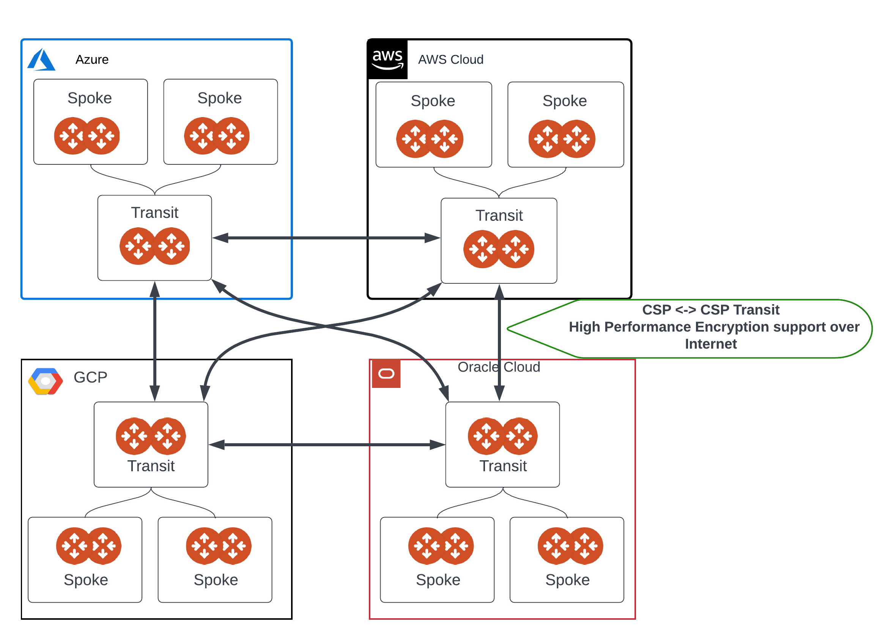
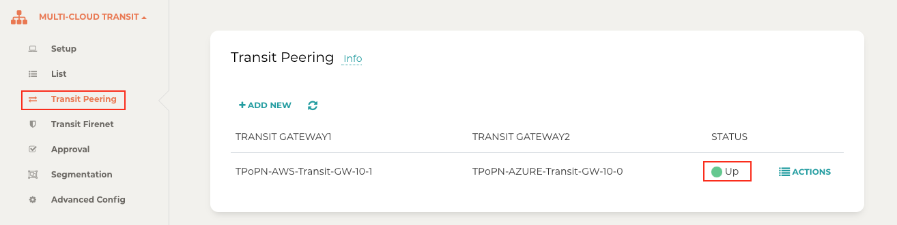

.. meta::
  :description: Transit Gateway Peering with Private Network Workflow
  :keywords: Transit Gateway Peering, Aviatrix Transit network, Private Network, Transit Gateway Peering with Private Network, Azure ExpressRoute, AWS Direct Connect

==================================================================
Multi-cloud Transit Gateway Peering over Public Network Workflow
==================================================================

Aviatrix Transit Gateway peering over public network expands Aviatrix Transit Gateway peering across multi-cloud where the connection between cloud service providers is over the internet. The Aviatrix Controller builds multipe tunnels between the peered transit gateways using Insane Mode High-Performance Encryption (HPE), enabling high performance data throughput and data security.

For more information about multi-cloud transit gateway encrypted peering, see the following documents:
  
- `Aviatrix Transit Gateway Encrypted Peering <https://docs.aviatrix.com/HowTos/transit_gateway_peering.html>`_
  
- `Transit Network Design Patterns <https://docs.aviatrix.com/HowTos/transitvpc_designs.html>`_

- `Multi-cloud Transit Network Workflow Instructions (AWS/Azure/GCP/OCI) <https://docs.aviatrix.com/HowTos/transitvpc_workflow.html>`_
	
Topology
========

|transit_gateway_peering_over_internet_topology|

Prerequisite
============

1. Upgrade Aviatrix Controller to version 6.7. Refer to `Upgrading the Aviatrix Cloud Network Platform <https://docs.aviatrix.com/HowTos/inline_upgrade.html>`_.
2. Create and launch the Aviatrix Transit Gateways with HA and Insane Mode enabled in the clouds where you want to establish peered transit connection and attach the Spoke Gateways to the Transit Gateways. Refer to `Multi-cloud Transit Network Workflow Instructions (AWS/Azure/GCP/OCI) <https://docs.aviatrix.com/HowTos/transitvpc_workflow.html>`_.

.. note::
   - Aviatrix Transit Gateway peering over public network solution requires high-performance encryption. Aviatrix Transit Gateways must have Insane Mode Encryption enabled when the Transit Gateway is created for peered connection over the internet.
   - This solution requires ActiveMesh 2.0. To migrate to AcitveMesh 2.0, refer to `How to migrate to ActiveMesh 2.0 <https://docs.aviatrix.com/HowTos/activemesh_faq.html#how-to-migrate-to-activemesh-2-0>`_ .

Establishing Transit Gateway Peering over Public Internet
---------------------------------------------------------

To establish transit gateway peering across cloud service providers over the internet:

1. In the Aviatrix Controller, go to **MULTI-CLOUD TRANSIT** > **Transit Peering**.
	
2. In Transit Peering, click **+ADD NEW**.
	
3. In Add a New Peering:
     a. For **Transit Gateway 1**, select a transit gateway in one cloud service provider.
     b. For **Transit Gateway 2**, select a transit gateway in another cloud service provider.
     c. Under Advanced options, check **Insane mode Encryption over internet**.

        .. note::
           If this option is not checked, then a single tunnel is created.
     d. For **Number of Public Tunnels per Transit Gateway**, enter the number of tunnels to create.
        By default, the gateways create four HPE tunnels. The supported range is 2 to 20 HPE tunnels for each transit gateway.
     e. Click **OK**.
	
4. Confirm the transit peering status is Up. This may take a few minutes.

   |transit_gateway_peering_status|

.. disqus::

