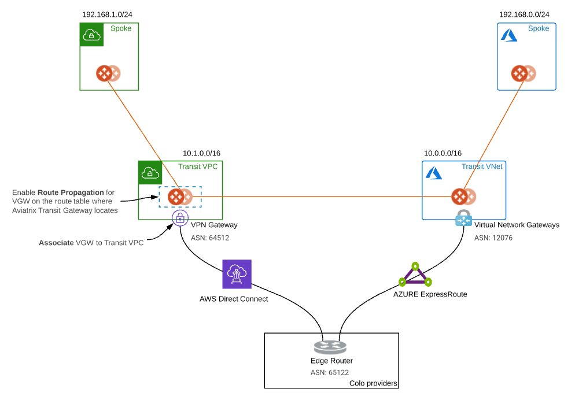
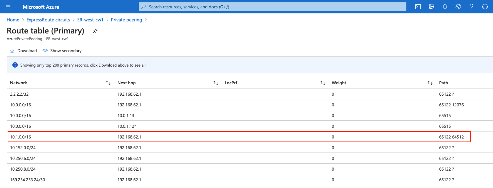
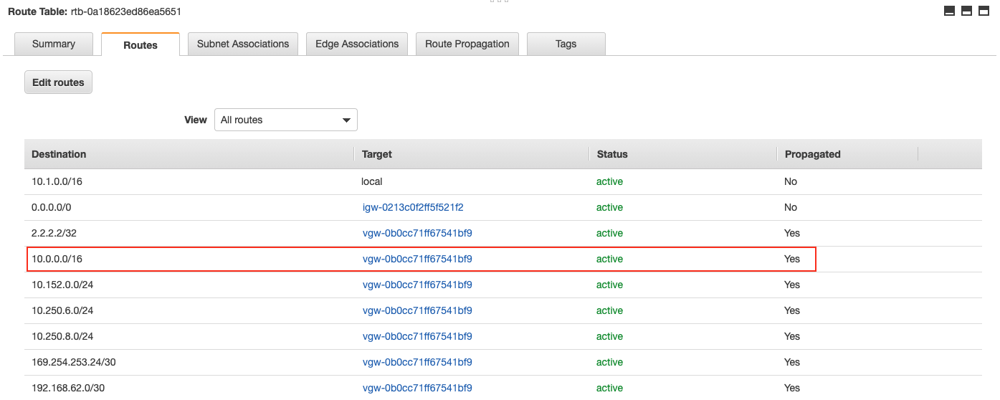
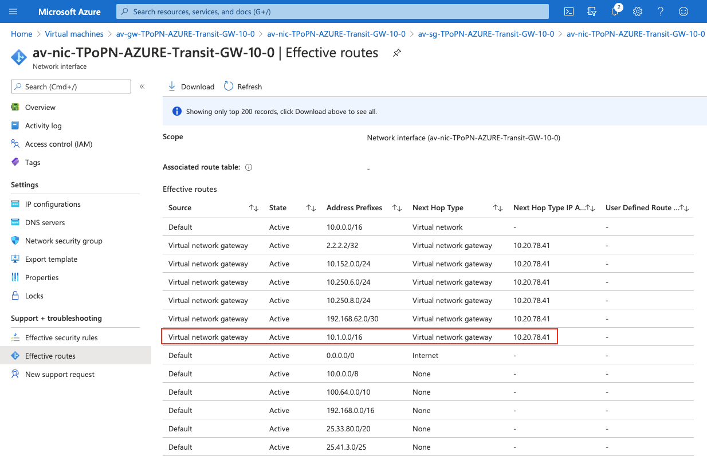
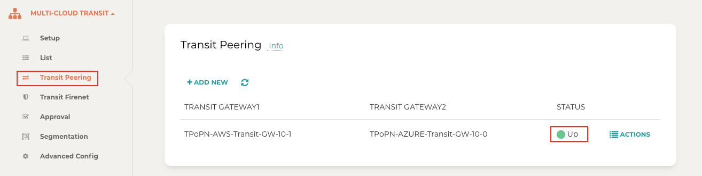

.. meta::
  :description: Transit Gateway Peering with Private Network Workflow
  :keywords: Transit Gateway Peering, Aviatrix Transit network, Private Network, Transit Gateway Peering with Private Network, Azure ExpressRoute, AWS Direct Connect

==============================================================
Aviatrix Transit Gateway Peering with Private Network Workflow
==============================================================

Introduction
============

Aviatrix Transit Gateway Peering over Private Network feature not only expands Transit Gateway peering over multi-clouds where there is a private network connectivity to on-prem or a co-location instead of Internet in a simple approach but also supports High-Performance Encryption. By building a Transit Gateway private peering, Aviatrix Transit Gateway forwards traffic over the private links to the other Aviatrix Transit Gateway and beyond.

In addition, this solution applies to AWS Direct Connect, Azure ExpressRoute, and Google Cloud Interconnect. 

This document describes a step-by-step instruction how to build Aviatrix Transit Gateway Peering with Private Network over AWS Direct Connect and Azure ExpressRoute for R6.2 and later as an example. In this note, you learn how to:

	#. Workflow on building underlay connectivity for private network with AWS Direct Connect
  
	#. Workflow on building underlay connectivity for private network with Azure ExpressRoute
	
	#. Workflow on Aviatrix Transit Gateway Peering with private network 

For more information about Multi-Cloud Transit Network, please check out the below documents:

  `Multi Cloud Global Transit FAQ <https://docs.aviatrix.com/HowTos/transitvpc_faq.html#multi-cloud-global-transit-faq>`_
  
  `Global Transit Network Workflow Instructions (AWS/Azure/GCP/OCI) <https://docs.aviatrix.com/HowTos/transitvpc_workflow.html>`_
  
  `Aviatrix Transit Gateway Encrypted Peering <https://docs.aviatrix.com/HowTos/transit_gateway_peering.html>`_
  
  `Transit Network Design Patterns <https://docs.aviatrix.com/HowTos/transitvpc_designs.html>`_

.. important::

	- Aviatrix Transit Gateway Peering with Private Network solution supports only High-Performance Encryption (Insane) mode which means Aviatrix Transit needs to enable Insane Mode Encryption function.
	
	- This solution supports only `ActiveMesh 2.0 <https://docs.aviatrix.com/HowTos/activemesh_faq.html#what-is-activemesh-2-0>`_, please check this doc `How to migrate to ActiveMesh 2.0 <https://docs.aviatrix.com/HowTos/activemesh_faq.html#how-to-migrate-to-activemesh-2-0>`_ for migration detail.
	
	- This solution does NOT build underlay connectivity. It is users' responsibility to deploy private network first. Workflow on building underlay connectivity for private network with AWS Direct Connect/Azure ExpressRoute here is just an example. Please adjust the topology depending on your requirements.
	
Topology
====================

|transit_gateway_peering_with_private_network_diagram|

The key ideas for this solution are:
-------------------------------------

  - The edge (WAN) router runs a BGP session to AWS VGW via AWS Direct Connect where the edge router advertises the Azure Transit VNET CIDR and the AWS VGW advertises the AWS Transit VPC CIDR.
  
  - The edge (WAN) router runs a BGP session to Azure VNG via Azure ExpressRoute where the edge router advertises the AWS Transit VPC CIDR and the Azure VNG advertises the AZURE Transit VNET CIDR.
  
  - The edge (WAN) router redistributes AWS Transit VPC CIDR and AZURE Transit VNET CIDR.
	
  - Once the reachability between two cloud transits over private network is there, user is able to deploy Aviatrix Multi Cloud Global Transit Gateway Encrypted Peering over Private Network
  
.. important::

  - Reachability between two transit networks' private CIDR is the responsibility of customer.

Prerequisite
====================

First of all, `upgrade <https://docs.aviatrix.com/HowTos/inline_upgrade.html>`_ Aviatrix Controller to at least version 6.2
  
In this example, we are going to deploy the below VPCs in AWS and Azure

	- AWS Aviatrix Transit VPC (i.e. 10.1.0.0/16)

	- AWS Aviatrix Spoke VPC (i.e. 192.168.1.0/24)
  
	- Azure Aviatrix Transit VNET (i.e. 10.0.0.0/16)

	- Azure Aviatrix Spoke VNET (i.e. 192.168.0.0/24)

Workflow on building underlay connectivity for private network with AWS Direct Connect
======================================================================================

Building AWS Direct Connect is customer's responsibility. For more information about AWS Direct Connect, please check out the below documents:

  - Refer to `Connect Your Data Center to AWS <https://aws.amazon.com/getting-started/projects/connect-data-center-to-aws/>`_
  
Please adjust the topology depending on your requirements. 

Step 1.1. Build AWS Direct Connect
-----------------------------------

  - Refer to `Equinix ECX Fabric AWS Direct Connect <https://docs.equinix.com/en-us/Content/Interconnection/ECXF/connections/ECXF-aws-direct-connect.htm>`_ if users select Equinix solution. This is just an example here.

Step 1.2. Associate AWS VGW to AWS Transit VPC
-----------------------------------------------

	- Login AWS VPC Portal
	
	- Click the hyperlink "Virtual Private Gateways" under sidebar "VIRTUAL PRIVATE NETWORK (VPN)"
	
	- Select the Virtual Private Gateway that you have the private virtual interface to AWS Direct Connect
	
	- Click the button "Actions"
	
	- Click the hyperlink "Attach to VPC"
	
	- Select the AWS Transit VPC and click the button "Yes, Attach"

Workflow on building underlay connectivity for private network with Azure ExpressRoute 
=======================================================================================

Building Azure ExpressRoute is customer's responsibility. For more information about Azure ExpressRoute, please check out the below documents:

  - Refer to `Azure ExpressRoute <https://azure.microsoft.com/en-us/services/expressroute/>`_
  
  - Refer to `ExpressRoute documentation <https://docs.microsoft.com/en-us/azure/expressroute/>`_ for more info
  
  - Refer to `Equinix ECX Fabric Microsoft Azure ExpressRoute <https://docs.equinix.com/en-us/Content/Interconnection/ECXF/connections/ECXF-ms-azure.htm>`_ if users select Equinix solution. This is just an example here.

Please adjust the topology depending on your requirements. 

Step 2.1. Create an ExpressRoute circuit
----------------------------------------

	- Refer to `Tutorial: Create and modify an ExpressRoute circuit <https://docs.microsoft.com/en-us/azure/expressroute/expressroute-howto-circuit-portal-resource-manager>`_

Step 2.2. Create Azure private peering for an ExpressRoute circuit
-------------------------------------------------------------------

	- Refer to `private peering section in Create and modify peering for an ExpressRoute circuit <https://docs.microsoft.com/en-us/azure/expressroute/expressroute-howto-routing-portal-resource-manager>`_
 
Step 2.3. Create a virtual network gateway for an ExpressRoute circuit
----------------------------------------------------------------------

	- Refer to `Configure a virtual network gateway for ExpressRoute using the Azure portal <https://docs.microsoft.com/en-us/azure/expressroute/expressroute-howto-add-gateway-portal-resource-manager>`_
	
Step 2.4. Connect a virtual network to an ExpressRoute circuit
--------------------------------------------------------------

	- Refer to `Connect a virtual network to an ExpressRoute circuit using the portal <https://docs.microsoft.com/en-us/azure/expressroute/expressroute-howto-linkvnet-portal-resource-manager>`_
 
Step 2.5. Check Express Route Circuits - List Routes Table on Azure portal
---------------------------------------------------------------------------
	
	- Login Azure Portal
	
	- Search for "ExpressRoute circuits" on the search bar
	
	- Select the "ExpressRoute circuits" that you created
	
	- Select the Azure private peering row
	
	- Click on the hyperlink "Get route table"
	
	- Check whether AWS Transit VPC's CIDR with the ASN Path of edge router and AWS VGW
	
		|express_route_circuits_list_routes|
	
Workflow on Aviatrix Transit Gateway Peering with private network 
===================================================================

Refer to `Global Transit Network Workflow Instructions <https://docs.aviatrix.com/HowTos/transitvpc_workflow.html>`_ and `Aviatrix Transit Gateway Encrypted Peering <https://docs.aviatrix.com/HowTos/transit_gateway_peering.html>`_ for the below steps. Please adjust the topology depending on your requirements.

Step 3.1. Deploy VPCs for Transit FireNet
------------------------------------------

	- Create AWS Transit VPC and Azure Transit VNET by utilizing Aviatrtix feature `Create a VPC <https://docs.aviatrix.com/HowTos/create_vpc.html>`_ with Aviatrix FireNet VPC option enabled

	- Create AWS Spoke VPC and Azure Spoke VNET by utilizing Aviatrtix feature `Create a VPC <https://docs.aviatrix.com/HowTos/create_vpc.html>`_ as the previous step or manually deploying it in each cloud portal. Moreover, feel free to use your existing cloud network.

Step 3.2. Deploy Aviatrix Multi-Cloud Transit Gateway and HA in AWS
-------------------------------------------------------------------

	- Follow this step `Deploy the Transit Aviatrix Gateway <https://docs.aviatrix.com/HowTos/transit_firenet_workflow_aws.html#step-2-deploy-the-transit-aviatrix-gateway>`_ to launch Aviatrix Transit gateway and enable HA with insane mode enabled in AWS Transit VPC
	
	- Instance size of at least c5.xlarge will be required for `Insane Mode Encryptions <https://docs.aviatrix.com/HowTos/gateway.html#insane-mode-encryption>`_ for higher throughput. Recommended minimum size for Transit in AWS is c5n.4xlarge. Please refer to this `doc <https://docs.aviatrix.com/HowTos/insane_mode_perf.html>`_ for performance detail.
	
Step 3.3. Enable Route Propagation on the subnet route table where Aviatrix Transit Gateway locates on AWS portal
------------------------------------------------------------------------------------------------------------------

	- Login AWS VPC portal
	
	- Locate the subnet route table where Aviatrix Transit Gateway locates
	
	- Select the tab "Route Propagation"
	
	- Click the button "Edit route propagation"

	- Locate the AWS VGW that is associated with this Transit VPC and check the checkbox "Propagate"
	
	- Click the button "Save"
	
	- Check whether the Propagate status is Yes
	
		|aws_route_propagation_status_yes|
	
Step 3.4. Check route propagation info on AWS portal
----------------------------------------------------
	
	- Login AWS VPC portal
	
	- Locate the subnet route table where Aviatrix Transit Gateway locates
	
	- Select the tab "Routes"
	
	- Check whether there is a route entry "Azure Transit VNET's CIDR pointing to AWS VGW"
	
		|aws_route_propagation_routing_entry|
	
Step 3.5. Deploy Aviatrix Multi-Cloud Transit Gateway and HA in Azure
---------------------------------------------------------------------

	- Follow this step `Deploy the Transit Aviatrix Gateway <https://docs.aviatrix.com/HowTos/transit_firenet_workflow_aws.html#step-2-deploy-the-transit-aviatrix-gateway>`_ to launch Aviatrix Transit gateway and enable HA with insane mode enabled in Azure Transit VNET

	- Instance size of at least Standard_D5_v2 will be required for `Insane Mode Encryptions <https://docs.aviatrix.com/HowTos/gateway.html#insane-mode-encryption>`_ for higher throughput. Please refer to this `doc <https://docs.aviatrix.com/HowTos/insane_mode_perf.html>`_ for performance detail.

	- Enable Transit FireNet Function (optional)

Step 3.6. Check Effective routes info on Azure portal
-------------------------------------------------------
	
	- Login Azure Portal
	
	- Search for "Network interfaces" on the search bar

	- Select Aviatrix Transit Gateway's interface
	
	- Navigate to the page "Effective routes" by clicking the link "Effective routes" under the section "Support + troubleshooting"
	
	- Check whether there is a route entry "AWS Transit VPC's CIDR pointing to Next Hop Type Virtual network gateway"
	
		|azure_effective_routes_routing_entry|

Step 3.7. Establish Transit Gateway Peering with Private Network
----------------------------------------------------------------

	- Navigate back to Aviatrix Controller
	
	- Go to MULTI-CLOUD TRANSIT -> Transit Peering
	
	- Click the button "+ADD NEW"
	
	- Enable the checkbox "Peering with Private Network"
	
	- Select "AWS Transit Gateway" as Transit Gateway1
	
	- Select "Azure Transit Gateway" as Transit Gateway2
	
	- Click the button "OK"
	
	- Wait for a couple of minutes
	
	- Confirm the transit peering status is Up
	
		|transit_gateway_peering_status|

Step 3.8. Deploy Spoke Gateway and HA
--------------------------------------

	- Follow this step `Deploy Spoke Gateways <https://docs.aviatrix.com/HowTos/transit_firenet_workflow_aws.html#step-3-deploy-spoke-gateways>`_ to launch Aviatrix Spoke gateway and enable HA with insane mode enabled in AWS Spoke VPC
	
	- Instance size of at least c5.xlarge will be required for `Insane Mode Encryptions <https://docs.aviatrix.com/HowTos/gateway.html#insane-mode-encryption>`_ for higher throughput. Please refer to this `doc <https://docs.aviatrix.com/HowTos/insane_mode_perf.html>`_ for performance detail.
	
	- Follow this step `Deploy Spoke Gateways <https://docs.aviatrix.com/HowTos/transit_firenet_workflow_azure.html#step-3-deploy-spoke-gateways>`_ to launch Aviatrix Spoke gateway and enable HA with insane mode enabled in Azure Spoke VNET
	
	- Instance size of at least Standard_D5_v2 will be required for `Insane Mode Encryptions <https://docs.aviatrix.com/HowTos/gateway.html#insane-mode-encryption>`_ for higher throughput. Please refer to this `doc <https://docs.aviatrix.com/HowTos/insane_mode_perf.html>`_ for performance detail.

Step 3.9. Attach Spoke Gateways to Transit Network
--------------------------------------------------

	- Follow this step `Attach Spoke Gateways to Transit Network <https://docs.aviatrix.com/HowTos/transit_firenet_workflow_aws.html#step-4-attach-spoke-gateways-to-transit-network>`_ to attach Aviatrix Spoke Gateways to Aviatrix Transit Gateways in AWS
	
	- Follow this step `Attach Spoke Gateways to Transit Network <https://docs.aviatrix.com/HowTos/transit_firenet_workflow_azure.html#step-4-attach-spoke-gateways-to-transit-network>`_ to attach Aviatrix Spoke Gateways to Aviatrix Transit Gateways in Azure

Ready to go!
============

Now you are able to send traffic over Aviatrix Transit Gateway Peering with Private Network.

	 

.. |aws_route_propagation_status_yes| image:: transit_gateway_peering_with_private_network_workflow_media/aws_route_propagation_status_yes.png
   :scale: 50%
	 

	 

.. disqus::

