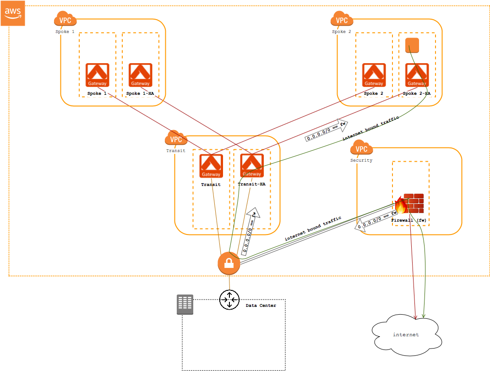
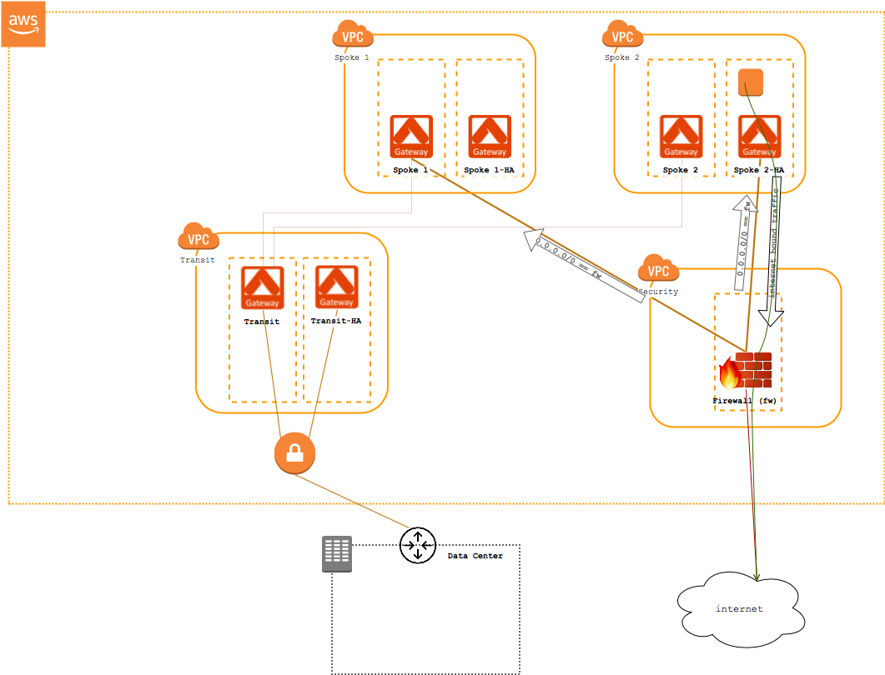

==============================================
Route Traffic to an Egress Security Appliance
==============================================

Overview
--------

Using a central security appliance for egress is one approach for managing outbound internet traffic filtering.

There are two methods to consider when building this architecture:

#. `Use existing Transit Network <#security-arch-method-1>`__ to route internet-bound traffic from the spoke(s) through the transit VPC to a security appliance
#. `Directly connect <#security-arch-method-2>`__ each VPC to the security appliance

.. note::

   The security appliance can be provisioned in any VPC.  In this article, we are assuming it is provisioned in a VPC called **Security**.

.. tip::
   Aviatrix recommends inline egress traffic filtering.  Read more about that `here <https://www.aviatrix.com/solutions/egress-security.php>`__.  This method filters traffic right at the source and as a result avoids any unnecessary egress charges.  In addition, this allows you to filter traffic based on the VPC requirements.

In this article, we will walk through the steps to set up either method.

.. _security_arch_method_1:

Method 1: Route traffic through Transit VPC
-------------------------------------------

In this design approach, internet-bound traffic from instances in the spoke(s) will return through the transit VPC to the security appliance.

|transit_security_architecture_method_1|

This method has the advantage of using existing tunnels to create a less complex and cleaner architecture.  However, it comes with a few downsides:

    #. The primary disadvantage is the additional burden put on the transit gateways to carry all internet-bound traffic in addition to the spoke-data center traffic.  This can be amplified if you are doing filtering of traffic since the traffic has to go through the transit and into a firewall before it is dropped.
    #. The second disadvantage to be aware of is the additional egress charges.  You will be paying for traffic leaving the spoke VPC when it might be filtered.

Deployment Guide
################
 
#. Using the AVX Controller, build out a `transit network <transitvpc_workflow.html>`__ with at least one spoke
#. Create a **Security** VPC and provision and configure your security appliance
#. From the AWS console in the region where your transit **Virtual Private Gateway** resides:
   
   #. Create a **Customer Gateway** for the security appliance
   #. Create a new **VPN Connection** attached to the transit Virtual Private Gateway and using the Customer Gateway and appropriate routing options.
   #. Save the connection and **Download Configuration** for your appliance

#. Finish configuring the IPsec tunnel using the security appliance console

   .. tip::
      Be sure to advertise 0.0.0.0/0 from your security appliance to the VGW.  This route will be propagated to the spoke(s) automatically

Once the tunnel is UP, you should see the 0.0.0.0/0 route in the private subnet route tables in the spoke(s).

.. _security_arch_method_2:

Method 2: Route traffic directly to security appliance
------------------------------------------------------

In this design approach, internet-bound traffic from instances in the spoke(s) or even non-spoke VPCs is routed directly from the VPC to the security appliance.

This alleviates some of the egress charges.  However, with this design you are still egressing out of the VPC to the Security VPC and then to the internet.

The primary disadvantage of this approach is the additional tunnels required to route the traffic from the VPC to security VPC.

|transit_security_architecture_method_2|

.. note::

   This architecture works even if there is no transit VPC.

Deployment Guide
################

#. Create a **Security** VPC and provision and configure your security appliance
#. Using the AVX Controller, create a `Site2Cloud Connection <site2cloud.html>`__ that connects to your security appliance.  Be sure to advertise the remote CIDR of 0.0.0.0/0

Once the tunnel is UP, you should see the 0.0.0.0/0 route in the private subnet route tables in the spoke(s).  Traffic will route to the AVX gateway and then across the tunnel to the security appliance.
   

