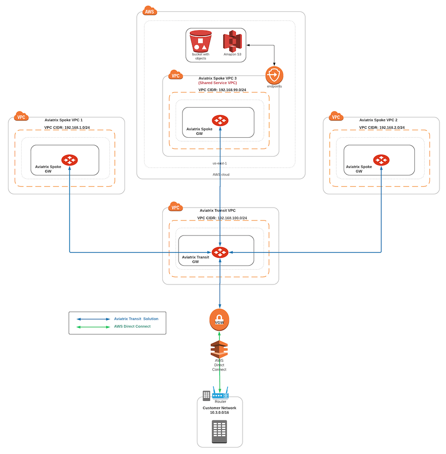
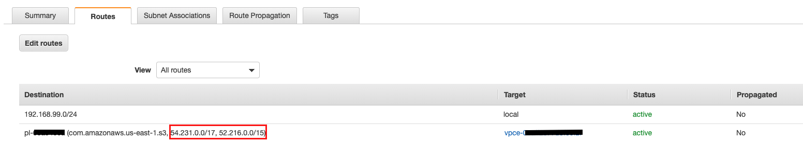
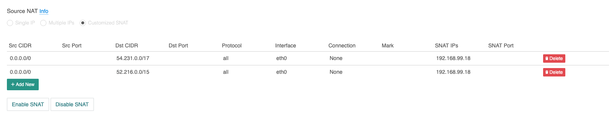
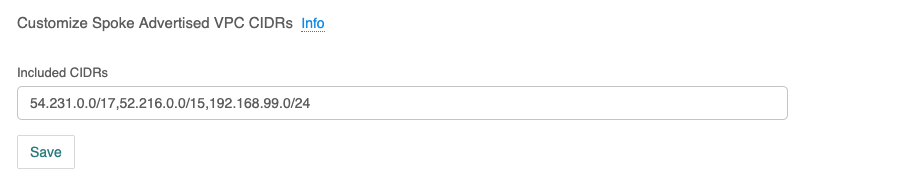
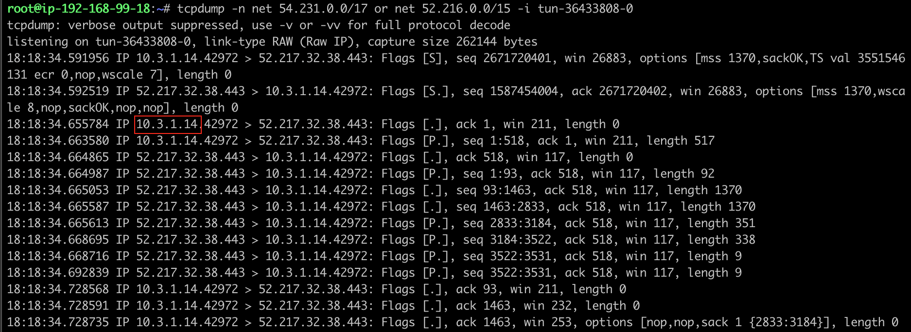
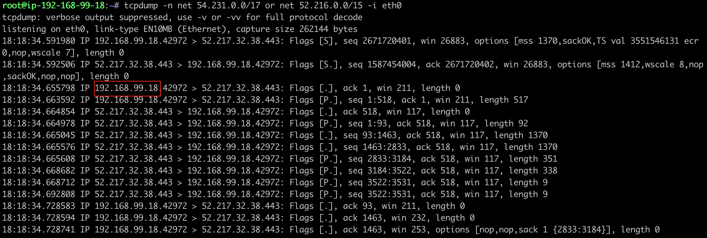
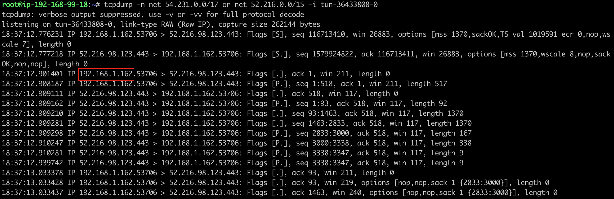
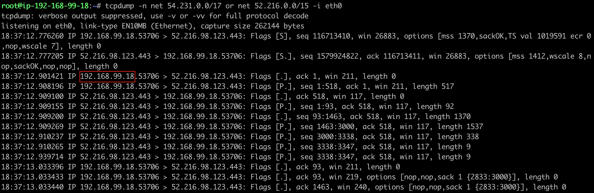

.. meta::
   :description: Aviatrix Global Transit Network with AWS S3 end point
   :keywords: Transit VPC, Transit hub, AWS Global Transit Network, Encrypted Peering, Transitive Peering, AWS VPC Peering, VPN, AWS S3 service

=========================================================================================
Aviatrix Global Transit Network with AWS S3 end point
=========================================================================================

This technical note provides a step-by-step configuration on the Aviatrix controller that will address the following requirements:

1. Deploy Aviatrix Global Transit Network

  - https://docs.aviatrix.com/HowTos/transitvpc_workflow.html

2. Deploy AWS Endpoint for Amazon S3 in a Shared Service VPC

  - https://docs.aws.amazon.com/vpc/latest/userguide/vpc-endpoints-s3.html

3. On-Prem privately connects to AWS S3 service/AWS S3 Bucket via Shared Service Spoke VPC end point in a specific region

4. Spoke VPCs privately connect to AWS S3 service/AWS S3 Bucket via Shared Service Spoke VPC end point in a specific region

Topology:

  1. Aviatrix Global Transit Network for AWS

    - Spoke VPCs * 3 
    
    - Transit VPC * 1
    
    - AWS VGW

  ::

    Example: 
    
    Spoke VPC 1: 192.168.1.0/24
    Spoke VPC 2: 192.168.2.0/24
    Shared Service Spoke VPC: 192.168.99.0/24 [region us-east-1]
    Transit VPC: 192.168.100.0/24

  2. On-Prem CIDR 
  
  ::

    Example: 
    
    On-Prem: 10.3.0.0/16
  
  3. End point for Amazon S3/Bucket service in region us-east-1

|S3_ENDPOINT_TRANSIT_SOLUTION|

Scenario:

  1. Traffic from On-Prem to AWS S3 service/AWS S3 Bucket via Shared Service Spoke VPC end point in region us-east-1
    
  - Traffic which is sent from On-Prem to AWS S3 service/AWS S3 Bucket goes through Aviatrix Transit Gateway and Aviatrix Spoke Gateway along with IPSec VPN tunnel and AWS end point service. In addition, regarding to AWS requirement, traffic to AWS VPC S3 end point needs to be source NATed on Aviatrix Spoke Gateway in the Shared Service VPC.
    

  2. Traffic from Spoke VPCs to AWS S3 service/AWS S3 Bucket via Shared Service Spoke VPC end point in region us-east-1
  
  - Traffic which is sent from Spoke VPCs in cloud to AWS S3 service/AWS S3 Bucket goes through Aviatrix Transit Gateway and Aviatrix Spoke Gateway along with IPSec VPN tunnel and AWS end point service. In addition, regarding to AWS requirement, traffic to AWS VPC S3 end point needs to be source NAT on Aviatrix Spoke Gateway in the Shared Service VPC.
    
Notes:

  1. AWS S3 service/S3 bucket has different public CIDR range regarding to region. Here is the link for AWS service CIDR: https://ip-ranges.amazonaws.com/ip-ranges.json Additionally, those S3 service CIDR can be found on end point routing entry on AWS routing table.
  
  |AWS_S3_ENDPOINT|
  
  2. Since AWS S3 end point changes 'the source IPv4 addresses from instances in your affected subnets as received by Amazon S3 change from public IPv4 addresses to the private IPv4 addresses from your VPC', we need to perform source NAT function on Aviatrix Spoke Gateway in the Shared Service VPC for the traffic from On-Prem or other Spoke VPCs to reach AWS S3 service/S3 buckets via AWS end point properly. https://docs.aws.amazon.com/vpc/latest/userguide/vpc-endpoints-s3.html
  
  3. Users from on-prem or other Spoke VPCs can access only S3 buckets which are in the same region as the Shared Service Spoke VPC locates. In other words, AWS S3 Service/S3 buckets and the Shared Service Spoke VPC need to be deployed in the same region.
  
  4. Users are able to customize VPC endpoint policy to restricting access to a specific bucket.

Follow the steps below to set up for the scenario.

Step 1. Prerequisite
-------------------------

1.1. Upgrade the Aviatrix Controller to at least version UserConnect-4.7.591

  - https://docs.aviatrix.com/HowTos/inline_upgrade.html

1.2. Prepare a region where both S3 buckets and Shared Service VPC locate (for example: us-east-1). Notes: this solution only can access the S3 Service/S3 Bucket in the same region where the Shared Service Spoke VPC locate.

Step 2. Build Aviatrix Global Transit Network FOR AWS
-------------------------

  - deploy the topology by following the online document https://docs.aviatrix.com/HowTos/transitvpc_workflow.html

Step 3. Deploy AWS S3 end point in Shared Service VPC
-------------------------

  - https://docs.aws.amazon.com/vpc/latest/userguide/vpc-endpoints-s3.html
  
  - ensure the AWS subnet/routing table where Aviatrix Shared Service Spoke gateway locates is selected when AWS S3 end point is created

Step 4. Perform Customize Spoke Advertised VPC CIDRs feature on the Aviatrix Spoke gateway in the Shared Service VPC
-------------------------

  - https://docs.aviatrix.com/HowTos/gateway.html#customize-advertised-spoke-vpc-cidrs

This action will advertise the customized routes to On-Prem via BGP session and other Aviatrix Spoke Gateways if the function Connected Transit is enabled. 

  ::

    Example: 
    
    AWS S3 service CIDR in region us-east-1: 54.231.0.0/17 and 52.216.0.0/15

To configure:

  4.1. Go to the Gateway page, click on the Aviatrix Spoke Gateway first in Shared Service VPC. Click Edit.

  4.2. Continue on to the Edit page, scroll to Customize Spoke Advertised VPC CIDRs.
  
  4.3. Enter the value of the On-Prem routable CIDR
  
    - for example: 54.231.0.0/17,52.216.0.0/15,192.168.99.0/24
    
    - notes: 192.168.99.0/24 in this example is the Shared Service VPC CIDR
  
  4.4. Click the button "Save"
  
  |SHARED_SERVICE_SPOKE_CUSTOMIZE_SPOKE_ADVERTISED_VPC_CIDRS|

Step 5. Configure Aviatrix Customized SNAT function on Aviatrix Spoke Gateway in Shared Service VPC
-------------------------

  - https://docs.aviatrix.com/HowTos/gateway.html#customized-snat

This action changes the packet’s source IP address from On-Prem or other Spoke VPCs in the Cloud to the private IP of Aviatrix Spoke Gateway in Shared Service VPC.

  ::

    Example: 
    
    Spoke Gateway: traffic to the IP range of AWS S3 Service in region us-east-1 (for example: 54.231.0.0/17 and 52.216.0.0/15) translates to IP 192.168.99.18

To configure:

  5.1. Go to the Gateway page, click on the Aviatrix Spoke Gateway first in Shared Service VPC. Click Edit.

  5.2. Continue on to the Edit page, scroll to SNAT. Select Customized SNAT.

  5.3. Select Customized SNAT

  5.4. Click Add New

  5.5. Enter fields for Src CIDR, protocol, Interface (select Interface eth0) and SNAT IP as below example.
    
  5.6. Click Save
  
  5.7. Repeat the above steps for more entries.

  5.8. Click Enable SNAT to commit.
  
    |SNAT_SHARED_SERVICE_SPOKE_PRIMARY|

  5.9. Go to Gateway page, click on the Aviatrix Spoke HA Gateway. Click Edit.
  
  5.10. Repeat the above steps to configure Customized SNAT for Aviatrix Spoke HA Gateway with its own private IP.

Step 6. Perform Connected Transit feature to build a full mesh network where Spoke VPCs communicate with each other via Transit GW
-------------------------

  - https://docs.aviatrix.com/HowTos/site2cloud.html#connected-transit
  
To configure:

  6.1 Go to the Transit Network -> Advanced Config -> Edit Transit
  
  6.2 Click the toggle button on "Connected Transit"

Step 7. Verify S3 traffic flow
-------------------------

  7.1. Traffic from On-Prem -> Transit -> Shared Service Spoke -> AWS S3 service/S3 bucket
  
  - Issue AWS S3 CLI from On-Prem
   
      |ONPREM_AWS_S3_CLI|
      
  - Execute packet capture on the tunnel interface of Aviatrix Shared Service Spoke
      
      |ONPREM_SHARED_SPOKE_TUN|
      
  - Execute packet capture on the eth0 interface of Aviatrix Shared Service Spoke and check whether On-Prem IP has been sourced NATed to the private IP of the eth0 interface of Aviatrix Shared Service Spoke
      
      |ONPREM_SHARED_SPOKE_ETH0|
    
  7.2. Traffic from Spoke -> Transit -> Shared Service Spoke -> AWS S3 service/S3 bucket
  
  - Issue AWS S3 CLI from Spoke VPC
  
      |SPOKE_AWS_S3_CLI|
      
  - Execute packet capture on the tunnel interface of Aviatrix Shared Service Spoke
      
      |SPOKE_SHARED_SPOKE_TUN|
      
  - Execute packet capture on the eth0 interface of Aviatrix Shared Service Spoke and check whether Spoke VPC's IP has been sourced NATed to the private IP of the eth0 interface of Aviatrix Shared Service Spoke
      
      |SPOKE_SHARED_SPOKE_ETH0|

   

   

.. disqus::
