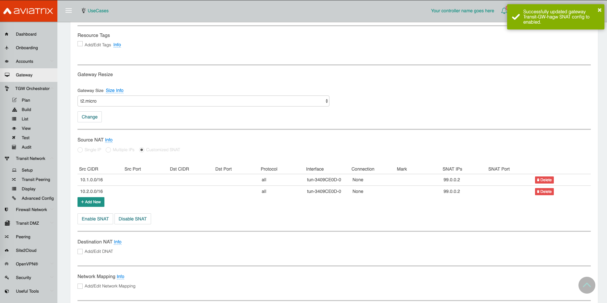

.. meta::

=========================================================================================
Aviatrix NEXT GEN TRANSIT with customized SNAT and DNAT features
=========================================================================================

This technical note provides a step-by-step configuration on the Aviatrix controller that will address the following requirements:

1. Spoke VPCs in Cloud need to communicate with On-Prem

  - https://docs.aviatrix.com/HowTos/tgw_faq.html

  - https://docs.aviatrix.com/HowTos/tgw_plan.html

  - https://docs.aviatrix.com/HowTos/tgw_build.html

2. On-Prem is not able to route RFC 1918 traffic to Cloud

  - Perform Customized SNAT feature for the traffic from Cloud to On-Prem

  - Perform DNAT feature for the traffic from On-Prem to Cloud 

Topology:

  1. Aviatrix NEXT GEN TRANSIT FOR AWS

    - Spoke VPCs * 2 (for example: 10.1.0.0/16, 10.2.0.0/16)

    - Transit VPC * 1 (for example: 192.168.100.0/24)

    - AWS VGW

  2. On-Prem routable CIDR (for example: 99.0.0.0/8)

|SNAT_DNAT_TRANSIT_SOLUTION|

Scenario:

  1. Traffic from Cloud to On-Prem

    - When a packet sent from Spoke VPCs in Cloud enters the Aviatrix Transit Gateway, the packet’s source address needs to be changed to an IP that On-Prem is routable. (Source address translation)

  2. Traffic from On-Prem to Cloud

    - When a packet sent from On-Prem enters the Aviatrix Transit Gateway, the packet’s destination address needs to be changed from an IP within the On-Prem routable CIDR to an IP belonging to a service in Spoke VPCs in Cloud. (Destination address translation)

Follow the steps below to set up for the scenario.

Step 1. Prerequisite
-------------------------

1.1. Upgrade the Aviatrix Controller to at least version UserConnect-4.7.386

  - https://docs.aviatrix.com/HowTos/inline_upgrade.html

1.2. Prepare an IP mapping table for SNAT and DNAT configuration.

  SNAT configuration

    - Prepare two On-Prem routable IPs (one for the Aviatrix Transit Gateway; one for the Aviatrix Transit HA Gateway if needed)

    ::

      Example: 
      Transit Primary Gateway: 99.0.0.1/32
      Transit HA Gateway: 99.0.0.2/32

  DNAT configuration

    - Prepare a list of IP mapping tables for the On-Prem routable CIDR to a service in Spoke VPCs corresponding to your topology

    - A service might be an IP belonging to Load Balancer or EIP

    ::

      Example:
      99.1.0.98 <--> 10.1.0.98
      99.2.0.243 <--> 10.2.0.243

Step 2. Build Aviatrix NEXT GEN TRANSIT FOR AWS
-------------------------

  - follow steps 1, 2, 3, 4, 4.1, 5, and 6 in the online document https://docs.aviatrix.com/HowTos/tgw_plan.html

Step 3. Perform a Manual BGP Advertised Network List feature on the tunnel between Aviatrix Transit GW and AWS VGW
-------------------------

  - https://docs.aviatrix.com/HowTos/site2cloud.html#manual-bgp-advertised-network-list

This action will advertise the On-Prem routable CIDR to On-Prem via BGP session.

  ::

    Example: 
    On-Prem routable CIDR: 99.0.0.0/8

To configure:

  3.1. Go to the Site2Cloud page and click on the tunnel between Aviatrix Transit Gateway and AWS VGW
  
  3.2. Scroll down to the Manual BGP Advertised Network List
  
  3.3. Enter the value of the On-Prem routable CIDR
  
    - for example: 99.0.0.0/8
  
  3.4. Click the button "Change BGP Manual Spoke Advertisement"

Step 4. Configure Aviatrix Customized SNAT function on both Transit Primary Gateway and Transit HA Gateway 
-------------------------

  - https://docs.aviatrix.com/HowTos/gateway.html#customized-snat

This action changes the packet’s source IP address from Spoke VPCs in the Cloud to an IP which belongs to an On-Prem routable CIDR.

  ::

    Example: 
    Transit Primary Gateway: traffic from spoke VPCs 10.1.0.0/16 and 10.2.0.0/16 translates to IP 99.0.0.1
    Transit HA Gateway: traffic from spoke VPCs 10.1.0.0/16 and 10.2.0.0/16 translates to IP 99.0.0.2

To configure:

  4.1. Go to the Gateway page, click on the Transit Primary Gateway first. Click Edit.

  4.2. Continue on to the Edit page, scroll to SNAT. Select Customized SNAT.

  4.3. Select Customized SNAT

  4.4. Click Add New

  4.5. Enter fields for Src CIDR, protocol, Interface (select the one with VGW) and SNAT IPs as below example.
  
  4.6. Click Save
  
  4.7. Repeat the above steps for more entries.

  4.8. Click Enable SNAT to commit.
  
    |SNAT_TRANSIT_PRIMARY|

  4.9. Go to Gateway page, click on the Transit HA Gateway. Click Edit.

  4.10. Repeat the above steps to configure Customized SNAT for Transit HA Gateway as shown in the example below.
  
    |SNAT_TRANSIT_HA|

Step 5. Configure Aviatrix Customized DNAT function on the Transit Primary Gateway
-------------------------

  - https://docs.aviatrix.com/HowTos/gateway.html#destination-nat

This action instructs the gateway to translate the destination address from an IP within the On-Prem routable CIDR to an IP belong to a service in Spoke VPCs in Cloud.

  ::

    Example:
    99.1.0.98/32 <--> 10.1.0.98
    99.2.0.243/32 <--> 10.2.0.243

To configure:

  5.1. Go to the Gateway page and click on the Transit Primary Gateway. Click Edit.

  5.2. Scroll down to “Destination NAT”, click Add/Edit DNAT

  5.3. Click Add/Edit DNAT

  5.4. Click Add New

  5.5. Enter fields for Destination CIDR, protocol, Interface (select the one with VGW) and DNAT IPs as below example.
 
    |DNAT_TRANSIT_PRIMARY|

  5.6. Click Save

  5.7. Repeat steps 5.4, 5.5, and 5.6 for multiple entries.

  5.8. Click Update to commit.

Step 6. Attach spoke VPCs to an AWS Transit Gateway (TGW)
-------------------------

  - https://docs.aviatrix.com/HowTos/tgw_build.html

Step 7. Verify traffic flow
-------------------------

  7.1. SNAT
  
    - Traffic from Spoke VPC 10.1.0.0/16 to On-Prem
    
      |SNAT_10_1|
    
    - Traffic from Spoke VPC 10.2.0.0/16 to On-Prem
    
      |SNAT_10_2|

  7.2. DNAT
  
    - Traffic from On-Prem to Spoke VPC 10.1.0.0/16
    
      |DNAT_99_1|
    
    - Traffic from On-Prem to Spoke VPC 10.2.0.0/16
    
      |DNAT_99_2|

  7.3. SNAT (failover to Transit HA gateway)
  
    - Traffic from Spoke VPC 10.1.0.0/16 to On-Prem
    
      |SNAT_FAILOVER_10_1|
    
    - Traffic from Spoke VPC 10.2.0.0/16 to On-Prem

      |SNAT_FAILOVER_10_2|

  7.4. DNAT (failover to Transit HA gateway)

    - Traffic from On-Prem to Spoke VPC 10.1.0.0/16
    
      |DNAT_FAILOVER_99_1|
    
    - Traffic from On-Prem to Spoke VPC 10.2.0.0/16
    
      |DNAT_FAILOVER_99_2|

.. |SNAT_10_2| image:: transit_snat_dnat_media/SNAT_10_2.png
   :scale: 30%

.. |DNAT_FAILOVER_99_1| image:: transit_snat_dnat_media/DNAT_FAILOVER_99_1.png
   :scale: 30%

.. disqus::
