.. meta::
   :description: Aviatrix Active Mesh with customized SNAT and DNAT on spoke gateway
   :keywords: Transit VPC, Transit hub, AWS Global Transit Network, Encrypted Peering, Transitive Peering, VPN, SNAT, DNAT

=========================================================================================
Aviatrix Active Mesh with customized SNAT and DNAT on spoke gateway
=========================================================================================

The Problem 
------------------

Organizations usually plan out cloud network address ranges for building non-overlapping connectivity to on-prem, 
but there are times where a cloud network CIDR conflicts with an on-prem network address range. Moreover, there might be a 
constraint that neither source NAT nor destination NAT can be performed in the on-prem network but still requires 
connectivity to on-prem. Therefore, how to fulfill source NAT and destination NAT in the cloud becomes a key solution.

Aviatrix Solution
------------------

This technical note illustrates an example solution of performing source NAT and destination NAT feature on Aviatrix spoke 
gateway to a specific use case where a customer needs a connectivity between certain on-prem hosts and certain cloud 
instances, but the on-prem network range overlaps with the cloud network CIDR as shown in the diagram below. 
Additionally, traffic can be initiated from either side.

Topology - Aviatrix Global Transit HA Network with Active Mesh:

|TRANSIT_ACTIVEMESH_SPOKE_OVERLAP_CIDR_TOPOLOGY|

::

    In this example, the on-prem network address range is 10.3.0.0/16 and all other spoke VPCs connect to on-prem via 
    Aviatrix Global Transit HA Network with Active Mesh, however there is one spoke VPC with an identical CIDR of 10.3.0.0/16.

 
.. Note:: 

   This tech note supports:
   
      1. specific on-prem hosts and cloud instances which means no identical IP on each side including IPs of Aviatrix Spoke primary/HA gateway
   
      2. bi-direction traffic
   
      3. both on-prem and cloud network allow only RFC 1918 CIDR

..

Furthermore, this technical note provides a step-by-step configuration on the Aviatrix controller that will address the following requirements:

   1. Deploy `Aviatrix Global Transit HA Network with Active Mesh <https://docs.aviatrix.com/HowTos/transitvpc_workflow.html>`__

   2. Deploy virtual CIDR within RFC 1918 range to solve the overlapping CIDR between on-prem network and cloud network

       - `Customize Advertised Spoke VPC CIDRs <https://docs.aviatrix.com/HowTos/gateway.html#customize-advertised-spoke-vpc-cidrs>`__

       - `Destination NAT with Mark and Exclude Route Table	<https://docs.aviatrix.com/HowTos/gateway.html#destination-nat>`__
       
       - `Customized SNAT with Mark and Exclude Route Table <https://docs.aviatrix.com/HowTos/gateway.html#customized-snat>`__

Scenario:

    1. Traffic which is initiated from on-prem to cloud spoke network sends to a virtual IP of cloud instance. In addition, cloud instance views a virtual IP of on-prem host.
        
    2. Traffic which is initiated from cloud spoke network to on-prem sends to a virtual IP of on-prem host. In addition, on-prem views a virtual IP of cloud instance.
    
    3. All virtual IPs are belonging to RFC 1918 range.
        
Follow the steps below to set up for the scenario.

Step 1. Prerequisite
-------------------------

1.1. `Upgrade <https://docs.aviatrix.com/HowTos/inline_upgrade.html>`__ the Aviatrix Controller to at least version UserConnect-5.4
  
1.2. Prepare a Real/Virtual CIDR mapping table for on-prem network and cloud network

    One of the key steps to solve overlapping network issue is to route a non-overlapping CIDR. Therefore, please prepare 
    a virtual routable CIDR for your on-prem and spoke network. In this example, we practice a Virtual CIDR 
    within RFC 1918 range.

    ::

        Real/Virtual CIDR mapping table example: 

        ==============  ==============  ================
                        Real CIDR       Virtual CIDR
        ==============  ==============  ================
        Spoke VPC       10.3.0.0/16     10.203.0.0/16
        On-Prem VPC     10.3.0.0/16     10.103.0.0/16
        ==============  ==============  ================
        
1.3. Find out the Real IPs of certain on-prem hosts and certain cloud instances to build a Real/Virtual IPs mapping table
    
    Since this solution is to tackle a specific use case where a customer needs a connectivity between certain on-prem hosts 
    and certain cloud instances in overlapping CIDR, please find out those IPs and plan a Real/Virtual IPs mapping table for
    routing advertisement and NAT configuration. 
    
    ::

        Real/Virtual IPs mapping table example:

        ================    ==============  ================
                            Real IP         Virtual IP
        ================    ==============  ================
        Cloud instance      10.3.0.86/32    10.203.0.86/32
        On-Prem host        10.3.0.85/32    10.103.0.85/32
        ================    ==============  ================
  
Step 2. Build Aviatrix Global Transit HA Network with Active Mesh
-------------------------
    
Deploy the topology by following the steps 1, 2, 3, 4, and 5 in `document <https://docs.aviatrix.com/HowTos/transitvpc_workflow.html>`__ first

   - make sure `Active Mesh Mode <https://docs.aviatrix.com/HowTos/gateway.html?#activemesh-mode>`__ is enabled on both Aviatrix Transit Gateway and Spoke Gateway

   - make sure HA is deployed for both Aviatrix Transit Gateway and Spoke Gateway

   - make sure on-prem router advertises only the Real IP with /32 of on-prem host not the whole Real CIDR or Virtual IP/CIDR
    
   ::

      Example: on-prem router advertises 10.3.0.85/32 which is the Real IP of On-prem host

Step 3. Perform Customize Spoke Advertised VPC CIDRs feature on Aviatrix Spoke gateway
-------------------------
     
This action is to advertise the Virtual CIDR of cloud spoke network to on-prem via BGP session so that on-prem
is able to route the Virtual IP of Cloud instance. Please refer to this `doc <https://docs.aviatrix.com/HowTos/gateway.html#customize-advertised-spoke-vpc-cidrs>`__ 

To configure:

   3.1. Go to the Gateway page, click on the Aviatrix Spoke Gateway first. Click Edit.

   3.2. Continue on to the Edit page, scroll to Customize Spoke Advertised VPC CIDRs.

   3.3. Enter the Virtual CIDR of cloud spoke VPC that on-prem is able to route
   
      - make sure advertise the Virtual CIDR of cloud spoke VPC not the Virtual IP of specific cloud instance

   3.4. Click the button "Save"

   |TRANSIT_ACTIVEMESH_SPOKE_CUSTOMIZED_SPOKE_ADVERTISE_VPC_CIDR|
   
   ::

     Example: Aviatrix Spoke gateway advertises 10.203.0.0/16 which is the Virtual CIDR of cloud spoke VPC

Step 4. Attach Aviatrix Spoke to Aviatrix Transit Network
-------------------------

Follow the `step 6 Join a Spoke GW to Transit GW Group <https://docs.aviatrix.com/HowTos/transitvpc_workflow.html#join-a-spoke-gw-to-transit-gw-group>`__ 
in Global Transit Network Workflow.

Step 5. Configure Aviatrix DNAT function on Aviatrix Spoke Gateway for the traffic which is initiated from on-prem to cloud spoke network
-------------------------

This action instructs the spoke gateway to translate a destination address from a Virtual IP of cloud instance to a Real IP of cloud instance in cloud spoke VPC. Please refer to `Aviatrix DNAT function doc <https://docs.aviatrix.com/HowTos/gateway.html#destination-nat>`__.

To configure:

  5.1. Go to the Gateway page and click on the Spoke Primary Gateway. Click Edit.

  5.2. Scroll down to “Destination NAT”

  5.3. Click Add/Edit DNAT

  5.4. Click Add New

  5.5. Enter fields for Src CIDR, Dst CIDR, Protocol, Connection, Mark, DNAT IPs and Exclude Route Table as below example.
 
   ===================     =======================
   **Field**               **Value**
   ===================     =======================
   Source CIDR             Real IP of on-prem host (i.e. 10.3.0.85/32)
   Source Port             Leave it blank
   Destination CIDR        Virtual IP of cloud instance (i.e. 10.203.0.86/32)
   Destination Port        Leave it blank
   Protocol                all
   Interface               eth0         
   Connection              Select the connection to Transit Gateway
   Mark                    A rule field to mark this traffic session (i.e. use 103085 to track source 10.3.0.85/32)
   DNAT IPs                Real IP of cloud instance (i.e. 10.3.0.86)  
   DNAT Port               Leave it blank
   Exclude Route Table     [IMPORTANT] Collect all your cloud routing table ids and fill them here
   ===================     =======================
 
   |DNAT_SPOKE_ONPREM_TO_CLOUD|

  5.6. Click Save

  5.7. Repeat steps 5.4, 5.5, and 5.6 for multiple entries.

  5.8. Click Update to commit.

Step 6. Configure Aviatrix Customized SNAT function on Aviatrix Spoke Gateway and Spoke HA Gateway for the traffic which is initiated from on-prem to cloud spoke network
-------------------------

This action changes the packet’s source IP address from a Real IP of on-prem host to a Virtual IP representing on-prem host. Please refer to `Aviatrix Customized SNAT function doc <https://docs.aviatrix.com/HowTos/gateway.html#customized-snat>`__

To configure:

  6.1. Go to the Gateway page, click on the Spoke Primary Gateway first. Click Edit.

  6.2. Continue on to the Edit page, scroll to SNAT. Select Customized SNAT.

  6.3. Select Customized SNAT

  6.4. Click Add New

  6.5. Enter fields for Protocol, Interface, Mark, SNAT IPs, and Exclude Route Table as below example.
  
   ===================  ==================================
   **Field**            **Value**
   ===================  ==================================
   Source CIDR          Leave it blank
   Source Port          Leave it blank
   Destination CIDR     Leave it blank
   Destination Port     Leave it blank
   Protocol	            all
   Interface            eth0
   Connection           Select None
   Mark                 Fill the number that we configure in the previous DNAT step 5 (i.e. 103085)
   SNAT IPs             Virtual IP of on-prem host (i.e. 10.103.0.85)
   SNAT Port            Leave it blank
   Exclude Route Table  [IMPORTANT] Collect all your cloud routing table ids and fill them here
   ===================  ==================================
  
  6.6. Click Save
  
  6.7. Repeat the above steps for more entries.

  6.8. Click Enable SNAT to commit.
  
    |SNAT_SPOKE_PRIMARY_ONPREM_TO_CLOUD|

  6.9. Go to Gateway page, click on the Spoke HA Gateway. Click Edit.

  6.10. Repeat the above steps to configure Customized SNAT for Spoke HA Gateway as shown in the example below.
  
    |SNAT_SPOKE_HA_ONPREM_TO_CLOUD|

Step 7. Configure Aviatrix DNAT function on Aviatrix Spoke Gateway for the traffic which is initiated from cloud spoke network to on-prem
-------------------------

This action instructs the spoke gateway to translate a destination address from a Virtual IP of on-prem host to a Real IP of on-prem host. Please refer to `Aviatrix DNAT function doc <https://docs.aviatrix.com/HowTos/gateway.html#destination-nat>`__.

To configure:

  7.1. Go to the Gateway page and click on the Spoke Primary Gateway. Click Edit.

  7.2. Scroll down to “Destination NAT”

  7.3. Click Add/Edit DNAT

  7.4. Click Add New

  7.5. Enter fields for Src CIDR, Dst CIDR, Protocol, Interface, Mark, DNAT IPs and Exclude Route Table as below example.
 
   ===================     =======================
   **Field**               **Value**
   ===================     =======================
   Source CIDR             Real IP of cloud instance (i.e. 10.3.0.86/32)
   Source Port             Leave it blank
   Destination CIDR        Virtual IP of on-prem host (i.e. 10.103.0.85/32)
   Destination Port        Leave it blank
   Protocol                all
   Interface               eth0         
   Connection              Select None
   Mark                    A rule field to mark this traffic session (i.e. use 103086 to track source 10.3.0.86/32)
   DNAT IPs                Real IP of on-prem host (i.e. 10.3.0.85/32)  
   DNAT Port               Leave it blank
   Exclude Route Table     [IMPORTANT] Collect all your cloud routing table ids and fill them here
   ===================     =======================
 
   |DNAT_SPOKE_CLOUD_TO_ONPREM|

  7.6. Click Save

  7.7. Repeat steps 7.4, 7.5, and 7.6 for multiple entries.

  7.8. Click Update to commit.

Step 8. Configure Aviatrix Customized SNAT function on Aviatrix Spoke Gateway and Spoke HA Gateway for the traffic which is initiated from cloud spoke network to on-prem
-------------------------

This action changes the packet’s source IP address from a Real IP of cloud instance to a Virtual IP representing cloud instance. Please refer to `Aviatrix Customized SNAT function doc <https://docs.aviatrix.com/HowTos/gateway.html#customized-snat>`__

To configure:

  8.1. Go to the Gateway page, click on the Spoke Primary Gateway first. Click Edit.

  8.2. Continue on to the Edit page, scroll to SNAT. Select Customized SNAT.

  8.3. Select Customized SNAT

  8.4. Click Add New

  8.5. Enter fields for Protocol, Interface, Connection, Mark, SNAT IPs, and Exclude Route Table as below example.
  
   ===================  ==================================
   **Field**            **Value**
   ===================  ==================================
   Source CIDR          Leave it blank
   Source Port          Leave it blank
   Destination CIDR     Leave it blank
   Destination Port     Leave it blank
   Protocol	            all
   Interface            eth0
   Connection           Select the connection to Transit Gateway
   Mark                 Fill the number that we configure in the previous DNAT step 7 (i.e. 103086)
   SNAT IPs             Virtual IP of cloud instance (i.e. 10.203.0.86)
   SNAT Port            Leave it blank
   Exclude Route Table  [IMPORTANT] Collect all your cloud routing table ids and fill them here
   ===================  ==================================
  
  8.6. Click Save
  
  8.7. Repeat the above steps for more entries.

  8.8. Click Enable SNAT to commit.
  
    |SNAT_SPOKE_PRIMARY_CLOUD_TO_ONPREM|

  8.9. Go to Gateway page, click on the Spoke HA Gateway. Click Edit.

  8.10. Repeat the above steps to configure Customized SNAT for Spoke HA Gateway as shown in the example below.
  
    |SNAT_SPOKE_HA_CLOUD_TO_ONPREM|

Step 9. Verify traffic flow
-------------------------

9.1. Traffic from on-prem to cloud spoke network

  - Issue ICMP traffic from on-prem host to a Virtual IP of cloud instance
   
      |ONPREM_HOST_TO_CLOUD_INSTANCE|
      
  - Execute packet capture on the cloud instance
      
      |CLOUD_INSTANCE_PACKET_CAPTURE|

9.2. Traffic from cloud spoke network to on-prem 

  - Issue ICMP traffic from cloud instance to a Virtual IP of on-prem
   
      |CLOUD_INSTANCE_TO_ONPREM_HOST|
      
  - Execute packet capture on the on-prem host
      
      |ONPREM_HOST_PACKET_CAPTURE|
      
FAQ
------------------

Q1:  Why we need to “mark” the NAT sessions?

Ans: Basically, "mark" function in NAT is a unique number that is associated with specific packets. In this tech note, we leverage on it for the purpose of tracking session identified by the Source CIDR of DNAT and then utilizing it for the SNAT IPs of customized SNAT. It is an advanced option for users to configure NAT rule. Alternatively, users still can configure DNAT and customized SNAT rule without mark.
 
Q2: Why we need to fill all VPC route table IDs for “Exclude Route Table”?

Ans: As Aviatrix Global Transit HA Network design has a mechanism to handle cloud routing table updates, filling all VPC route table IDs for “Exclude Route Table” in NAT feature prevents extra routes to be injected in cloud routing table.

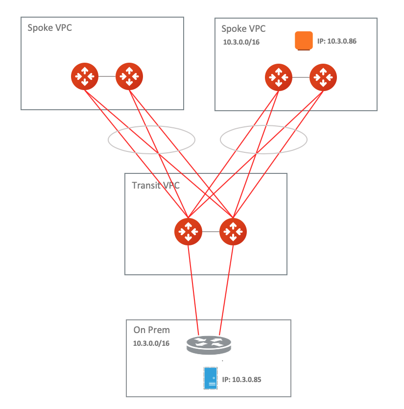
   
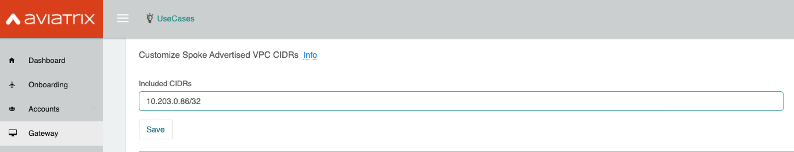

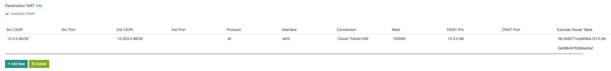
   

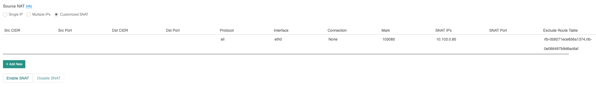
   
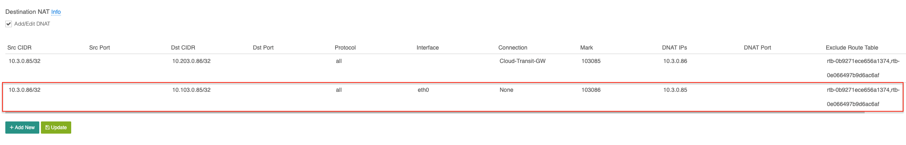
   
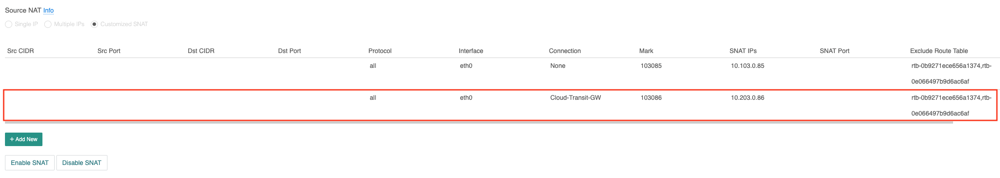

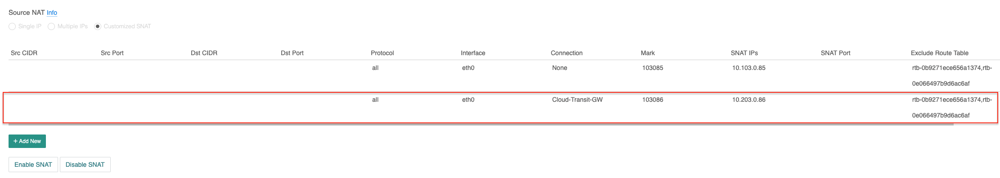
   
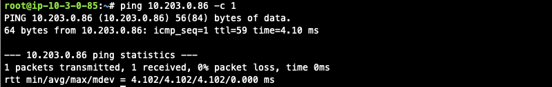
   
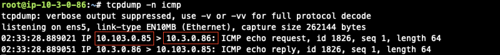
   
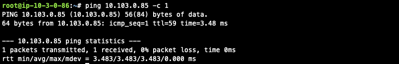
   
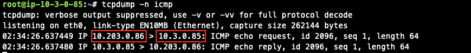
   
.. disqus::
