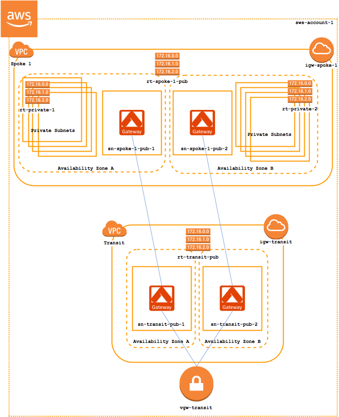

==========================================
Prerequisites for a Transit Network in AWS
==========================================

Setting up a transit network in AWS is simple with `Aviatrix's Transit Network Workflow <http://docs.aviatrix.com/HowTos/transitvpc_workflow.html>`_.  Before getting started with this workflow, make sure you have the following:

#. **Transit VPC**

   | This is a VPC where your spokes will connect to transit to your on-premise environment.  When setting up a new transit network architecture, this VPC is typically a new VPC.

#. **Detached Virtual Private Gateway (VGW)**

   | This VGW is detached from any VPC and will remain detached.  It is (or will be) connected to your on-premise environment via a Direct Connect or VPN connection.

#. **Spoke VPC(s)**

   | These VPCs will make up the spoke(s) of the transit network.

|image1|

Transit VPC
###########

The following AWS components should be created when setting up the transit VPC:

* An internet gateway (IGW) [**igw-transit**] for the VPC.
* A route table [**rt-transit-pub**] with a 0.0.0.0/0 route pointing to **igw-transit**.
* One subnet with **rt-transit-pub** attached.
* (Optional - HA) One subnet with **rt-transit-pub** attached in a different AZ.

.. tip::

  Use `Useful Tools -> Create a VPC <https://docs.aviatrix.com/HowTos/create_vpc.html>`_ to create a transit VPC. Make sure the option "Aviatrix Transit VPC" is selected. 

Virtual Private Gateway (VGW)
##############################

Create a new VGW that will terminate your Direct Connect VIF or VPN connection to on-prem.  Leave this VGW **detached** (it will be attached as part of the Transit Network Workflow).

Spoke VPC(s)
############

The following AWS components should be created for each spoke VPC:

* An internet gateway (IGW) [**igw-spoke-1**] for the VPC.
* A route table [**rt-spoke-1-pub**] with a 0.0.0.0/0 route pointing to **igw-spoke-1**.
* One subnet with **rt-spoke-1-pub** attached.
* (Optional - HA) One subnet with **rt-spoke-1-pub** attached in a different AZ.
* Any number of private subnets in any AZ in the VPC.

Additional Information
######################

* `VPC with a public subnet <https://docs.aws.amazon.com/vpc/latest/userguide/VPC_Scenario1.html>`__ (AWS Documentation)

