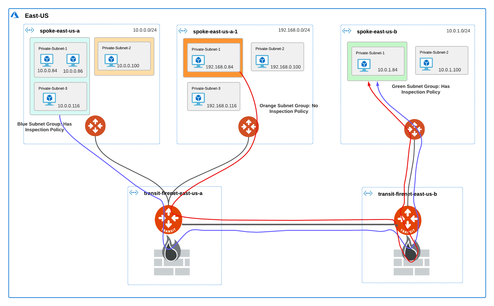
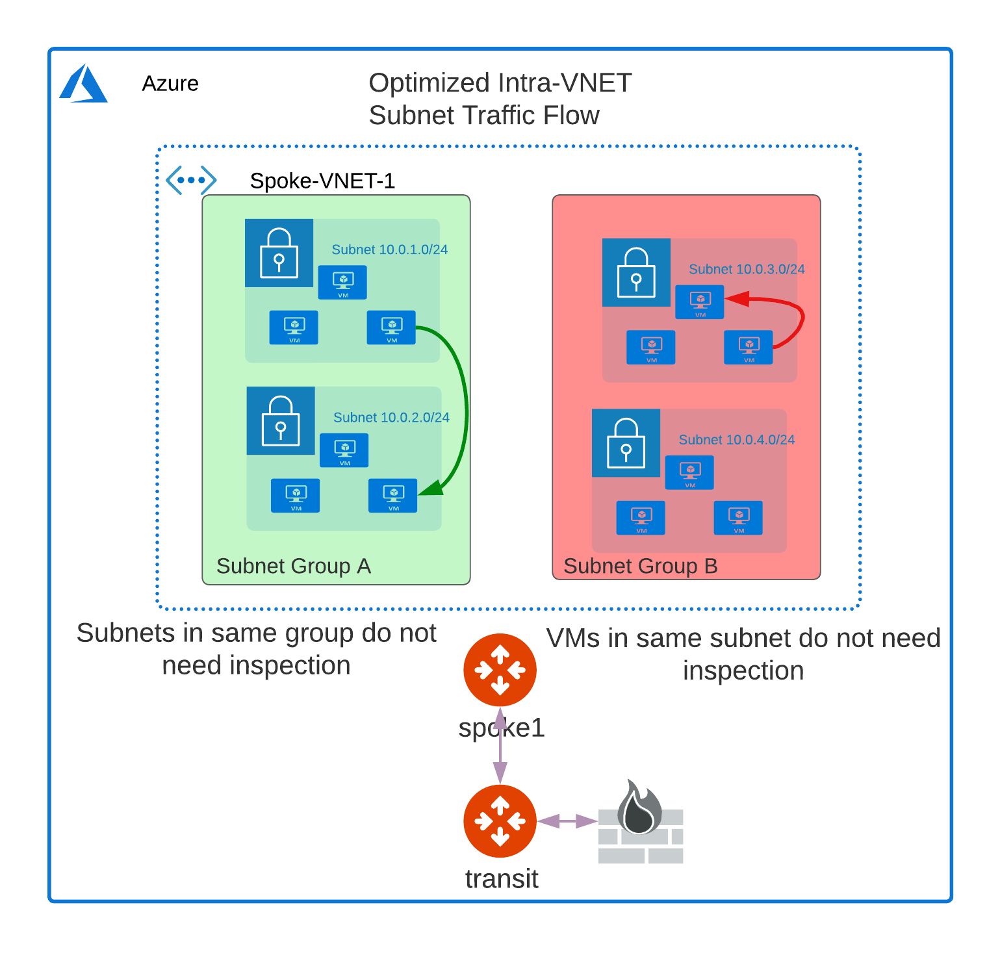
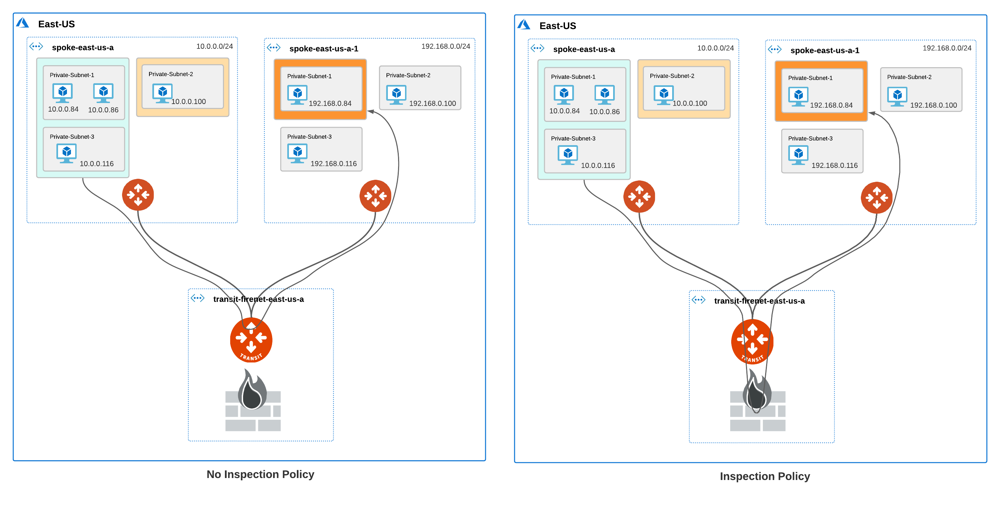
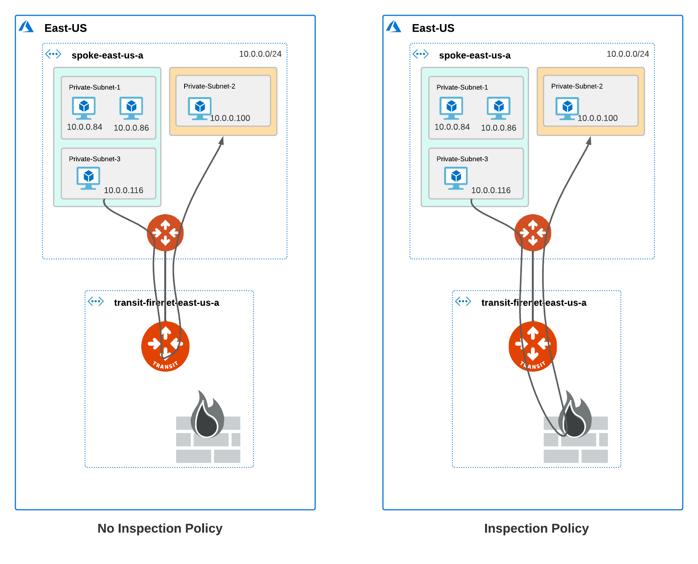
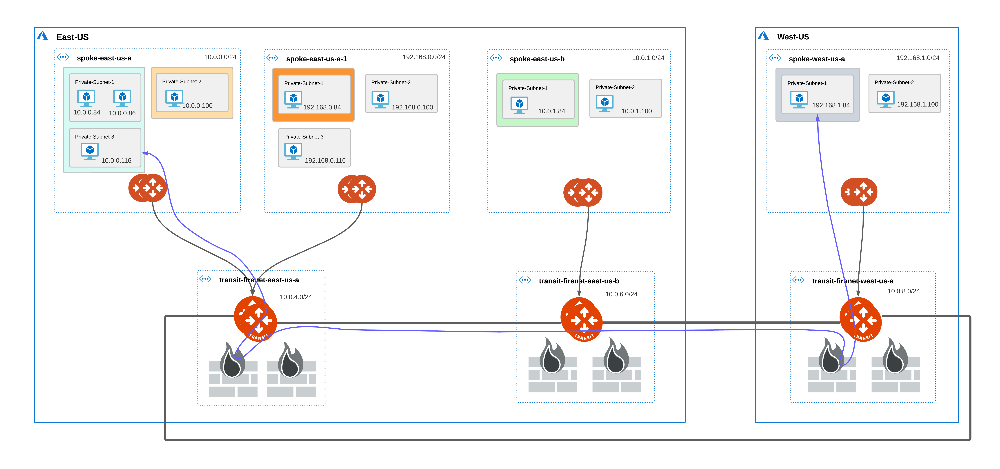
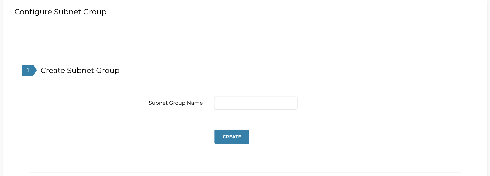
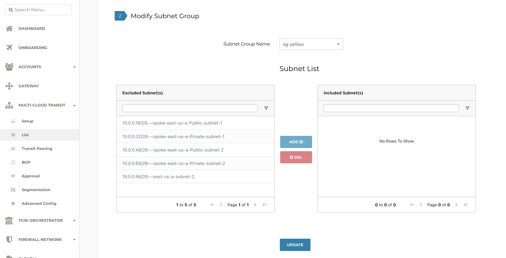
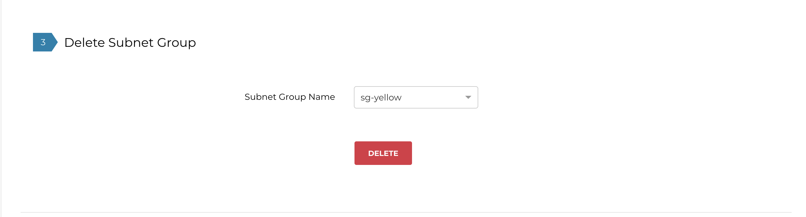
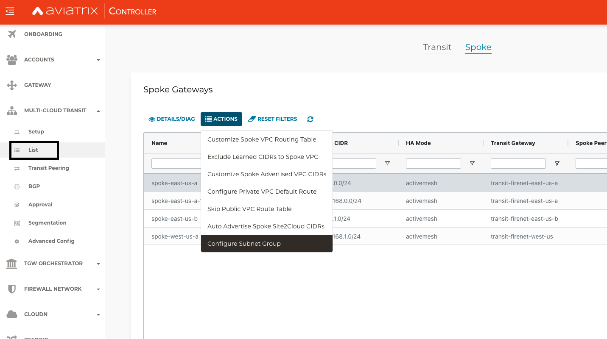
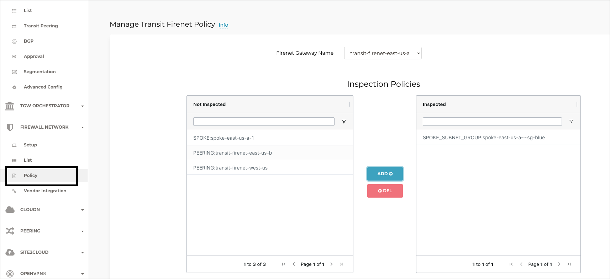

.. meta::
  :description: Firewall Network Workflow
  :keywords: Azure Transit Gateway, Azure, TGW orchestrator, Aviatrix Transit network, Transit DMZ, Egress, Firewall, Firewall Network, FireNet

=======================================================================================================
Using Subnet Inspection in Azure to Redirect Subnet-Level Traffic to Aviatrix Transit FireNet and NGFW
=======================================================================================================

Aviatrix’s subnet inspection feature allows you to redirect subnet-level traffic to the Aviatrix Transit FireNet Gateway for inspection by a next-generation firewall (NGFW) appliance such as Checkpoint, Palo Alto Firewall, or Fortinet. Previously, traffic inspection policy could only be applied at the VNet level, which meant that traffic from all subnets in a VNet would be inspected by the NGFW. With this feature, you can assign subnets to a subnet group and specify an inspection policy for the subnet group. Traffic between subnets in different subnet groups with an inspection policy is redirected to the NGFW for inspection.

.. note::
   * Currently, the subnet inspection feature is only available in Azure.
   * The subnet inspection feature is in Public Preview. For more information about Public Preview, refer to `Aviatrix Controller and Gateway Release Notes <http://docs.aviatrix.com/HowTos/Controller_and_Software_Release_Notes.html#preview-features>`_.

Supported Features
==================

The following features are supported when subnet groups are enabled.

#. Intra-VNet and Inter-VNet traffic inspection
#. ActiveMesh 2.0
#. High Performance Encryption (HPE)
#. Transit FireNet High Availability (HA) mode
#. Supported NGFWs: Palo Alto Networks, Checkpoint, Fortinet
#. Terraform

Unsupported Features
====================

The following features are not supported when subnet groups are enabled.

#. Egress FireNet Inspection (Dual Transit FireNet)
#. Azure Secondary CIDR not supported

Disabled Features
=================

The following features are not supported and are disabled when subnet groups are enabled.

#. Customized SNAT on Spoke gateway
#. Customized Spoke advertised CIDRs
#. Customized Spoke VPC Route Table
#. Filter Learned Routes to Spoke VPC
#. Auto-advertised Spoke Site2Cloud CIDRs
#. BGP on Spoke

What is a Subnet Group?
=======================

A subnet group defines a logical grouping of subnets in a VNet. A subnet group is local to a VNet and does not span across multiple VNets. Traffic between subnets in the same subnet group flows through the Azure native virtual network and is not inspected by the Aviatrix Transit FireNet NGFW. If you want to inspect traffic between subnets in the same VNet, the subnets must be in different subnet groups.

Traffic Traversal in Subnet Groups
==================================

When you create subnet groups in a VNet, traffic from the subnet groups is redirected to the Aviatrix Transit FireNet Gateway for inspection. To further redirect traffic to the NGFW for inspection, you must set inspection policy for the subnet groups. Traffic for subnets that are part of a subnet group but do not have an inspection policy traverse the Aviatrix Transit FireNet gateway but are not redirected to or inspected by the NGFW. 

Intra-Vnet Subnet Inspection for Subnets in the same Subnet Group
-----------------------------------------------------------------

Traffic between VMs in the same subnet or subnet group is not inspected. If you want to inspect traffic between VMs in different subnets in the same VNet, the subnets must be in different subnet groups. For more information, refer to `Connectivity Scenarios Between VMs in Subnets <http://docs.aviatrix.com/HowTos/transit_subnet_inspection_azure.html#configuring-scenarios-between-vms-in-subnets>`_.

|intraVNET_vm_segmentation|

.. note::
   The diagrams in the scenarios below show single gateways for brevity. High Availability (HA) configuration is supported for Spoke and Transit FireNet gateways.

Intra-VNet Subnet Inspection
----------------------------

|intraVNET|

Inter-VNet Subnet Inspection Over a Shared Transit FireNet
----------------------------------------------------------

|interVNET_shared_FireNet|

Single Region Inter-VNet Subnet Inspection Over Transit Peering
---------------------------------------------------------------

In this scenario, the blue and green subnet groups have an inspection policy, the orange subnet group does not. The traffic between the blue and green subnet groups traverses the NGFW on either side. Since the orange subnet group does not have an inspection policy, the traffic between the orange and green subnet groups is not inspected by the firewall connected to the Transit FireNet to which the orange subnet group’s Spoke is attached. However, since the green subnet group has an inspection policy, the traffic between the orange and green subnet group traverses the firewall connected to the peer Transit FireNet.

|interVNET_transit_peering|

Multi-Region Inter-VNet Subnet Inspection Over Transit Peering
--------------------------------------------------------------

The traffic traversal is similar to the Inter-VNet Subnet Inspection Over Transit Peering scenario.

|multiregionVNET|

Connectivity Scenarios Between VMs in Subnets
---------------------------------------------

The following tables list different scenarios for connectivity between VMs in subnets that you need to consider when using subnet groups. 

Intra-VNet Subnet Inspection
----------------------------

+-----------------------+-------------------------+----------------+------------------------------------------------+
| VM in Subnet A        | VM in Subnet B          | Connectivity   | Comment                                        |
|                       |                         | Between VMs    |                                                |
+=======================+=========================+================+================================================+
|Not in a subnet group  | Not in a subnet group   | Yes            |                                                |
+-----------------------+-------------------------+----------------+------------------------------------------------+
|Not in a subnet group  | In a subnet group       | No             | Subnet A must to be in a subnet group for      |
|			|			  |	     	   | connectivity. Configure a default subnet group.|
|                       |                         |                | See `Important Recommendations <http://doc     |
|                       |                         |                | s.aviatrix.com/HowTos/transit_subnet_inspe     |
|                       |                         |                | ction_azure.html#important-recommendations>`_. |
+-----------------------+-------------------------+----------------+------------------------------------------------+
|In a subnet group      | In a subnet group       | Yes            | Subnets can either be in the same or           |
|                       |                         |                | different subnet groups.                       |
+-----------------------+-------------------------+----------------+------------------------------------------------+

Inter-VNet Subnet Inspection
----------------------------

+-----------------------+-------------------------+----------------+------------------------------------------------+
| Subnet A in VNet A    | Subnet B in VNet B      | Connectivity   | Comment                                        |
|			|			  | Between VMs    |						    |
+=======================+=========================+================+================================================+
|Not in a subnet group  | Not in a subnet group   | Yes            | Only if VNet B has no subnet groups            |
|                       |                         |                | configured.                                    |
|                       |                         |                | See `Important Recommendations <http://doc     |
|                       |                         |                | s.aviatrix.com/HowTos/transit_subnet_inspe     |
|                       |                         |                | ction_azure.html#important-recommendations>`_. | 
+-----------------------+-------------------------+----------------+------------------------------------------------+
|In a subnet group      | Not in a subnet group   | No             | Only if VNet B has no subnet groups            |
|                       |                         |                | configured. Configure a default subnet group.  |
|                       |                         |                | See `Important Recommendations <http://doc     |
|                       |                         |                | s.aviatrix.com/HowTos/transit_subnet_inspe     |
|                       |                         |                | ction_azure.html#important-recommendations>`_. |
+-----------------------+-------------------------+----------------+------------------------------------------------+
|In a subnet group      | In a subnet group       | Yes            | Subnets can either be in the same or           |
|                       |                         |                | different subnet groups.                       |
+-----------------------+-------------------------+----------------+------------------------------------------------+

Inter-VNet Subnet Inspection Over Transit Peering
-------------------------------------------------

The connection behavior is the same as the Inter-VNet Subnet Inspection.

+-----------------------+-------------------------+----------------+------------------------------------------------+
| Subnet A in VNet A    | Subnet B in VNet B      | Connectivity   | Comment                                        |
|			|			  | Between VMs    |						    |
+=======================+=========================+================+================================================+
|Not in a subnet group  | Not in a subnet group   | Yes            | Only if VNet B has no subnet groups            |
|                       |                         |                | configured.                                    |
|                       |                         |                | See `Important Recommendations <http://doc     |
|                       |                         |                | s.aviatrix.com/HowTos/transit_subnet_inspe     |
|                       |                         |                | ction_azure.html#important-recommendations>`_. | 
+-----------------------+-------------------------+----------------+------------------------------------------------+
|In a subnet group      | Not in a subnet group   | No             | Only if VNet B has no subnet groups            |
|                       |                         |                | configured. Configure a default subnet group.  |
|                       |                         |                | See `Important Recommendations <http://doc     |
|                       |                         |                | s.aviatrix.com/HowTos/transit_subnet_inspe     |
|                       |                         |                | ction_azure.html#important-recommendations>`_. |
+-----------------------+-------------------------+----------------+------------------------------------------------+
|In a subnet group      | In a subnet group       | Yes            | Subnets can either be in the same or           |
|                       |                         |                | different subnet groups.                       |
+-----------------------+-------------------------+----------------+------------------------------------------------+

Important Recommendations
-------------------------

#. **There is a downtime of 10 – 20 seconds when you add or remove subnets from a subnet group. If this downtime is not acceptable, be sure to add or remove subnet groups during a maintenance window.**  

#. For connectivity between VMs in different subnets, the subnets must be in different subnet groups. For subnets that do not need an inspection policy, create a subnet group named default, and add the subnets to the default subnet group. All other subnets that require traffic inspection and have an inspection policy set, add the subnets to custom subnet groups. 

#. Only learned and Aviatrix-created routes are carried over from the subnet routing tables to the subnet group routing tables created by Aviatrix. Once a subnet is added to a group, you can manually recreate custom routes in the subnet group route table through the Azure console.

Subnet Group Management Workflow
=================================

To redirect subnet-level traffic to the Aviatrix Transit FireNet for inspection by an NGFW, perform the following steps.

#. `Configure Subnet Groups <http://docs.aviatrix.com/HowTos/transit_subnet_inspection_azure.html#configuring-subnet-group>`_.
#. `Configure Subnet Group Inspection Policy <http://docs.aviatrix.com/HowTos/transit_subnet_inspection_azure.html#configuring-subnet-group-inspection-policy>`_.

Configuring Subnet Group
-------------------------

To configure subnet groups, follow these steps.

1. In the Aviatrix Controller, go to: MULTI-CLOUD TRANSIT > List > Spoke > (select a Spoke) > ACTIONS > Configure Subnet Group.

   |configure_subnet_group|

   A new page opens where you can create, modify, or delete Subnet Groups.

2. Select **Create Subnet Group**.

   |create_subnet_group|

3. Enter a name for the subnet group.

4. Click **CREATE**.

5. Continue to **Modify Subnet Group**.

   |modify_subnet_group|

6. Select the subnet group you created from the Subnet Group Name pull-down menu. 

7. Use the Subnet List table to add or delete the subnet group from the **Excluded Subnets** to the **Included Subnets** lists. Aviatrix Controller automatically retrieves the subnets from the Azure VNet and includes it in the list of excluded subnets. The excluded subnets include both Aviatrix-managed and user-created subnets that you created directly through the Azure console which are out-of-band from Aviatrix.

   To add an excluded subnet to the included subnet group, select one or more subnets from the **Excluded Subnets** list and click **ADD**. 

8. Click **UPDATE**. 

9. To delete a subnet from either list and move it to the other list, select one or more subnets and click **DEL**.

10. To delete a subnet group, select the subnet group from the Subnet Group Name pull-down menu and click **DELETE**.

    |delete_subnet_group|

Configuring Subnet Group Inspection Policy
------------------------------------------

When you enable the subnet groups for a VNet, the subnet groups are available in the FireNet Policy page.

Select a subnet group from the **Not Inspected list** and click **ADD** to move it to the **Inspected list**. 

|configure_inspection_policy|

In the figure above, the Transit FireNet Gateway will redirect traffic from SPOKE_SUBNET_GROUP:spoke-east-us-a~~sg-blue to the NGFW. In the NGFW, you configure the firewall policies to either drop, log, or allow the traffic flow from the subnets in the group.

.. disqus::
