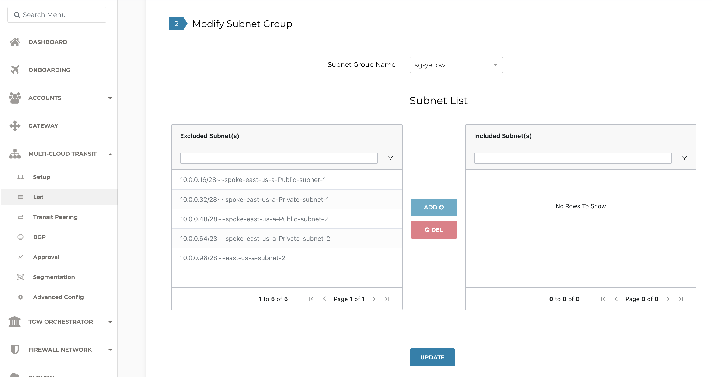
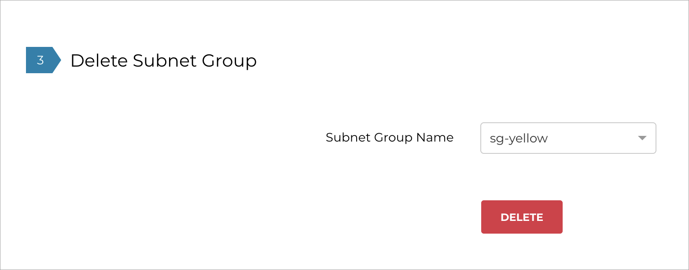

.. meta::
  :description: Firewall Network Workflow
  :keywords: Azure Transit Gateway, Azure, TGW orchestrator, Aviatrix Transit network, Transit DMZ, Egress, Firewall, Firewall Network, FireNet

=======================================================================================================
Using Subnet Inspection in Azure to Redirect Subnet-Level Traffic to Aviatrix Transit FireNet and NGFW
=======================================================================================================

Aviatrix’s subnet inspection feature lets you use Aviatrix Controller to redirect subnet-level traffic to Aviatrix Transit FireNet for further inspection by a next-generation firewall (NGFW) appliance such as Checkpoint, Palo Alto Firewall, or Fortinet. Previously, traffic inspection policy could only be applied at the VNET level, which meant that traffic from all subnets in a VNET would be inspected by the NGFW. With this feature, you can now assign subnets to a “subnet group” and specify an inspection policy on the subnet group. Traffic from all subnets in the subnet group is redirected to the NGFW for inspection.

.. note::
   * Currently, subnet inspection is only available in Azure.
   * Aviatrix does not recommend this feature if you require very low latency between any two VMs placed in a subnet group. For example, VMs that are in a proximity placement group. 
   * VMs within any subnet group will automatically communicate through the closest Aviatrix Transit Gateway. 
   * VMs within a subnet group with an inspection policy will automatically communicate through the closest Aviatrix Transit FireNet and the associated firewall. 
   * Aviatrix recommends testing this feature before deploying it to your production workloads. 

What is a Subnet Group?
=======================

A subnet group defines a logical grouping of subnets in a VNET. It is local to a VNET and does not span across multiple VNETs. A subnet group name does not have to be unique across VNETs. All traffic in and out of all subnets in a subnet group is inspected by the NGFW if and only if the subnet group has an inspection policy.

Supported Features
==================

#. Intra-VNET and Inter-VNET traffic inspection
#. ActiveMesh 2.0
#. High Performance Encryption (HPE)
#. Transit FireNet High Availability (HA) mode
#. Supported NGFWs: Palo Alto Networks, Checkpoint, Fortinet
#. Terraform

Unsupported Features
====================

The following features are not supported when subnet groups are enabled. If any of these features are enabled, you see a pop-up error when configuring subnet groups. You must disable these features before subnet groups can be configured. 

#. Egress FireNet Inspection (Dual Transit FireNet)
#. Azure Secondary CIDR not supported
#. The following advanced features will be disabled:
    a. Customized SNAT on Spoke gateway
    b. Customized Spoke advertised CIDRs
    c. Customized Spoke VPC Route Table
    d. Filter Learned Routes to Spoke VPC
    e. Auto-advertised Spoke Site2Cloud CIDRs
    f. BGP on Spoke

Subnet Groups Management Workflow
=================================

Configuring Subnet Groups
-------------------------

To configure subnet groups, follow these steps:

1. In the Aviatrix Controller, go to: MULTI-CLOUD TRANSIT > List > Spoke > (select a Spoke) > ACTIONS > Configure Subnet Group.

|configure_subnet_group|

   A new page opens where you can create, modify, or delete Subnet Groups.

2. Select **Create Subnet Group**.

|create_subnet_group|

3. Enter a name for the subnet group. The figure above shows a new subnet group called **sg-blue**.

4. Click **CREATE**.

5. Continue to **Modify Subnet Group**.

   In this example, **sg-blue** is added to the list of subnet groups available from the Subnet Group Name pull-down menu. 

|modify_subnet_group|

   You use the Subnet List table to add or delete the subnet group to and from the **Excluded Subnets** and **Included Subnets** lists. Aviatrix Controller automatically retrieves the subnet from the Azure VNET and includes it in the list of excluded subnets. The excluded subnets include both Aviatrix-managed and user-created subnets that you created directly through the Azure console which are out-of-band from Aviatrix. 

.. note::
   Creating a subnet group in a Spoke VNET enables this feature in the VNET. However, to redirect traffic from the subnet to the NGFW for inspection, you must explicitly add the subnets to a subnet group as well as enable the inspection policy on the subnet group. This means traffic for subnets that are merely part of a subnet group but do not have an inspection policy traverse the Aviatrix Transit FireNet gateway but are not redirected to or inspected by the NGFW.

6. Select the subnet group you created from the Subnet Group Name pull-down menu. 

7. To add an excluded subnet to the included subnet group, select one or more subnets from the Excluded Subnets list and click **ADD**.

8. To reconfigure the routing tables in Azure so that the traffic from the two included subnets is redirected to the Aviatrix Transit Gateway connected to the local Spoke gateway for the VNET, click **UPDATE**. 

9. To delete a subnet from either list and move it to the other list, select one or more subnets and click **DELETE**.

10. To delete a subnet group, select the subnet group from the Subnet Group Name pull-down menu and click **DELETE**.

|delete_subnet_group|

Important Recommendations
-------------------------

#. **There is a downtime of 10 – 20 seconds when you add or remove subnets from a subnet group. If this downtime is not acceptable, be sure to add or remove subnet groups during a maintenance window.**  

#. Configure a “Default” Subnet Group in the VNET and add all subnets that do not need an inspection policy to the “Default” group. All other subnets that require traffic inspection can be added to custom subnet groups that have an inspection policy set.

#. Only learned and Aviatrix-created routes are carried over from the subnet routing tables to the subnet group routing tables created by Aviatrix. Once a subnet is added to a group, you can manually recreate custom routes in the subnet group route table through the Azure console.

Configuring an Inspection Policy
--------------------------------

The workflow for configuring an inspection policy is similar to configuring a FireNet inspection policy. When you enable the subnet groups for a VNET, the groups are available in the FireNet inspection policy page instead of the VNET. 

|configure_inspection_policy|

You can select a subnet group and click **ADD** to move it from the Not Inspected list to the Inspected list. In the above figure, the Transit FireNet Gateway will redirect traffic from SPOKE_SUBNET_GROUP:spoke-east-us-a~~sg-blue to the NGFW. In the NGFW you can configure the firewall policies to either drop, log, or allow the traffic flow from the subnets in the group.

Traffic Traversal in Subnet Groups
----------------------------------

Once you enable subnet groups in a VNET, the subnet group traffic is redirected to the transit gateway for inspection. The traffic is further redirected to the NGFW only if an inspection policy is set for the subnet group. 

.. note::
   The diagrams in the following scenarios show single gateways for brevity. High Availability (HA) configuration is supported for spoke and transit FireNet gateways.

In the following four scenarios, the blue and green subnet groups have an inspection policy, while the orange subnet group does not. The blue -> green subnet group traffic traverses the NGFW on either side. Since the orange subnet group does not have an inspection policy, the orange -> green subnet group traffic is not inspected by the firewall connected to the transit FireNet to which the orange subnet group’s spoke is attached. However, since the green subnet group has an inspection policy, the orange -> green subnet group traffic traverses the firewall connected to the peer transit FireNet. 

Intra-VNET Subnet Inspection
----------------------------

|intraVNET|

Inter-VNET Subnet Inspection Over a Shared Transit FireNet
----------------------------------------------------------

|interVNET_shared_FireNet|

Single Region Inter-VNET Subnet Inspection Over Transit Peering
---------------------------------------------------------------

|interVNET_transit_peering|

Multi-Region Inter-VNET Subnet Inspection Over Transit Peering
--------------------------------------------------------------

The traffic traversal is similar to the Inter-VNET Subnet Inspection Over Transit Peering scenario.

|multiregionVNET|

Connectivity Scenarios
----------------------

The following tables cover different connectivity scenarios that you need to consider when using subnet groups. 

Intra-VNET Subnet Inspection
----------------------------

+-----------------------+-------------------------+----------------+------------------------------------------------+
|Subnet A in VNET A     | Subnet B in VNET A      | Connectivity   | Comment                                        |
+=======================+=========================+================+================================================+
|Not in subnet group    | Not in subnet group     | Yes            |                                                |
+-----------------------+-------------------------+----------------+------------------------------------------------+
|Not in subnet group    | In subnet group         | No             | Subnet A needs to be in a subnet group.        |
|                       |                         |                | See `Important Recommendations <http://doc     |
|                       |                         |                | s.aviatrix.com/HowTos/transit_subnet_inspe     |
|                       |                         |                | ction_azure.html#important-recommendations>`_. |
+-----------------------+-------------------------+----------------+------------------------------------------------+
|In subnet group        | In subnet group         | Yes            | Subnets can either be in the same or           |
|                       |                         |                | different subnet groups.                       |
+-----------------------+-------------------------+----------------+------------------------------------------------+

Inter-VNET Subnet Inspection
----------------------------

+-----------------------+-------------------------+----------------+------------------------------------------------+
|Subnet A in VNET A     | Subnet B in VNET A      | Connectivity   | Comment                                        |
+=======================+=========================+================+================================================+
|Not in subnet group    | Not in subnet group     | Yes            | Only if VNET B has no subnet groups            |
|                       |                         |                | configured. See `Important Recommendations     |
|                       |                         |                | <https://docs.aviatrix.com/HowTos/transit_     |
|                       |                         |                | subnet_inspection_azure.html#important-recommen|
|                       |                         |                | dations>`__.                                   | 
+-----------------------+-------------------------+----------------+------------------------------------------------+
|In subnet group        | Not in subnet group     | No             | Only if VNET B has no subnet groups            |
|                       |                         |                | configured. See `Important Recommendations     |
|                       |                         |                | <https://docs.aviatrix.com/HowTos/transit_     |
|                       |                         |                | subnet_inspection_azure.html#important-recommen|
|                       |                         |                | dations>`__.                                   |
+-----------------------+-------------------------+----------------+------------------------------------------------+
|In subnet group        | In subnet group         | Yes            | Subnets can either be in the same or           |
|                       |                         |                | different subnet groups.                       |
+-----------------------+-------------------------+----------------+------------------------------------------------+

Inter-VNET Subnet Inspection Over Transit Peering
-------------------------------------------------

The connection behavior is same as the Inter-VNET Subnet Inspection.

+-----------------------+-------------------------+----------------+------------------------------------------------+
|Subnet A in VNET A     | Subnet B in VNET A      | Connectivity   | Comment                                        |
+=======================+=========================+================+================================================+
|Not in subnet group    | Not in subnet group     | Yes            | Only if VNET B has no subnet groups            |
|                       |                         |                | configured. See `Important Recommendations     |
|                       |                         |                | <https://docs.aviatrix.com/HowTos/transit_     |
|                       |                         |                | subnet_inspection_azure.html#important-recommen|
|                       |                         |                | dations>`__.                                   | 
+-----------------------+-------------------------+----------------+------------------------------------------------+
|In subnet group        | Not in subnet group     | No             | Only if VNET B has no subnet groups            |
|                       |                         |                | configured. See `Important Recommendations     |
|                       |                         |                | <https://docs.aviatrix.com/HowTos/transit_     |
|                       |                         |                | subnet_inspection_azure.html#important-recommen|
|                       |                         |                | dations>`__.                                   |
+-----------------------+-------------------------+----------------+------------------------------------------------+
|In subnet group        | In subnet group         | Yes            | Subnets can either be in the same or           |
|                       |                         |                | different subnet groups.                       |
+-----------------------+-------------------------+----------------+------------------------------------------------+

.. |interVNET_transit_peering| image:: transit_firenet_workflow_media/transit_subnet_inspection_azure_media/interVNET_transit_peering.png
   :scale: 40%

.. |interVNET_shared_FireNet| image:: transit_firenet_workflow_media/transit_subnet_inspection_azure_media/interVNET_shared_FireNet.png
   :scale: 40%

.. |intraVNET| image:: transit_firenet_workflow_media/transit_subnet_inspection_azure_media/intraVNET.png
   :scale: 40%

.. |create_subnet_group| image:: transit_firenet_workflow_media/transit_subnet_inspection_azure_media/create_subnet_group.png
   :scale: 40%

.. |configure_inspection_policy| image:: transit_firenet_workflow_media/transit_subnet_inspection_azure_media/configure_inspection_policy.png
   :scale: 40%

.. disqus::
