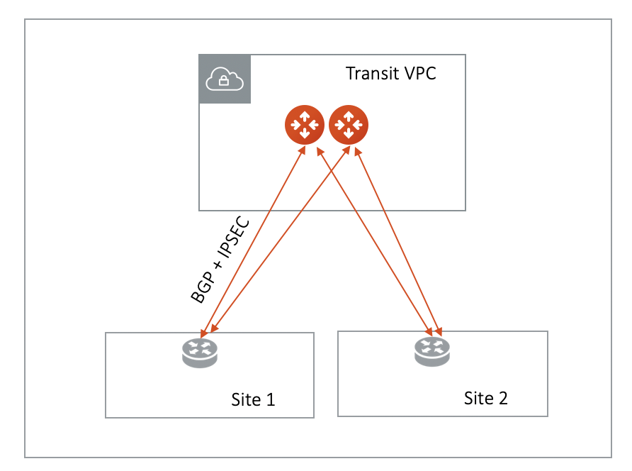

.. meta::
  :description: Global Transit Network to External Device
  :keywords: Transit VPC, Transit hub, AWS Global Transit Network, Encrypted Peering, Transitive Peering, AWS VPC Peering, VPN

=========================================================
Aviatrix Transit Gateway to External Devices 
=========================================================

Starting from Release 4.1, there are three options to connect to Transit GW with BGP:

 - AWS VGW
 - External (or 3rd Party) Router/Firewall
 - Aviatrix hardware appliance CloudN

This document provides instructions on how to connect Aviatrix Transit GW to external router/firewall devices.

What are the use cases for connecting to external router?
-----------------------------------------------------------

 - **Overcome AWS VGW 100 route limit** Typically Aviatrix Transit GW connects to VGW over IPSEC and runs a BGP session with VGW. VGW then connects to on-prem devices. By connecting directly to external device, VGW is bypassed. 

 - **Azure Transit Network** This feature allows Aviatrix Transit GW to connect to on-prem over Azure Express Route or Internet. 

How does it work? 
------------------

Aviatrix Transit GW runs a BGP session to external router to dynamically exchange routes. It also establishes an IPSEC tunnel to the router for packet forwarding. 

The mechanism works for AWS Direct Connect, Azure Express Route or Internet. 

Over Private Network
~~~~~~~~~~~~~~~~~~~~~~~

When the underlying infrastructure is AWS Direct Connect, the diagram is shown as below. 

|transitgw_dx|

Make sure:

  - The VGW is attached to the Transit VPC.  
  - The external device advertises its IP address to VGW.
  - The external device advertises the on-prem network CIDR list to Aviatrix Transit GW.

Over the Internet
~~~~~~~~~~~~~~~~~~~~~

When connecting over the Internet, as shown below, follow the instructions in the next section.

|transitgw_internet|

How to configure?
--------------------

The configuration is the `Step 3 in the Transit Network workflow <https://docs.aviatrix.com/HowTos/transitvpc_workflow.html>`_, when you select the option "External Device". We assume you have already completed Step 1 and Step 2. Follow the instructions below.

1. Fill the parameters
~~~~~~~~~~~~~~~~~~~~~~~~~

Fill the parameters and click OK.

=====================      ==========
**Setting**                **Value**
=====================      ==========
VPC ID/VNet Name           The Transit VPC ID where Transit GW was launched.
Connection Name            A unique name to identify the connection to external device. 
BGP Local AS Number        The BGP AS number the Transit GW will use to exchange routes with external device.
BGP Remote AS Number       The BGP AS number the external device will use to  exchange routes Aviatrix Transit GW.
Primary Cloud Gateway      The Transit GW you created in `Step 1 <https://docs.aviatrix.com/HowTos/transitvpc_workflow.html#launch-a-transit-gateway>`_. 
Remote Gateway Type        Select one device type. Select Generic if the external device is not in the drop down. 
Algorithm                  Optional parameters. Leave it unselected if you don't know.
Enable HA                  Select HA if there are two external devices. 
Over DirectConnect         Select this option if your underlying infrastructure is private network, such as AWS Direct Connect and Azure Express Rout. When this option is selected, BGP and IPSEC run over private IP addresses.e
External Device IP         IP address of the external device
Pre-shared Key             Optional parameter. Leave it blank to let the pre-shared key to be auto generated. 
=====================      ==========

2. Download the configuration
~~~~~~~~~~~~~~~~~~~~~~~~~~~~~~

After the configuration is done, a connection is created. Download the configuration file. 

At the left navigation bar, go to Site2Cloud, click on the connection you created with "Connection Name", click Download Configuration. 

3. Configure the external device
~~~~~~~~~~~~~~~~~~~~~~~~~~~~~~~~~~

Use the information provided in the configuration file to configure the on-prem device with IPSEC tunnel and BGP. . 

.. |transitgw_dx| image:: transitgw_external_media/transitgw_dx.png
   :scale: 30%

.. disqus::
