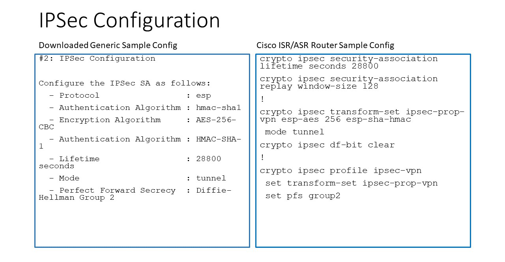
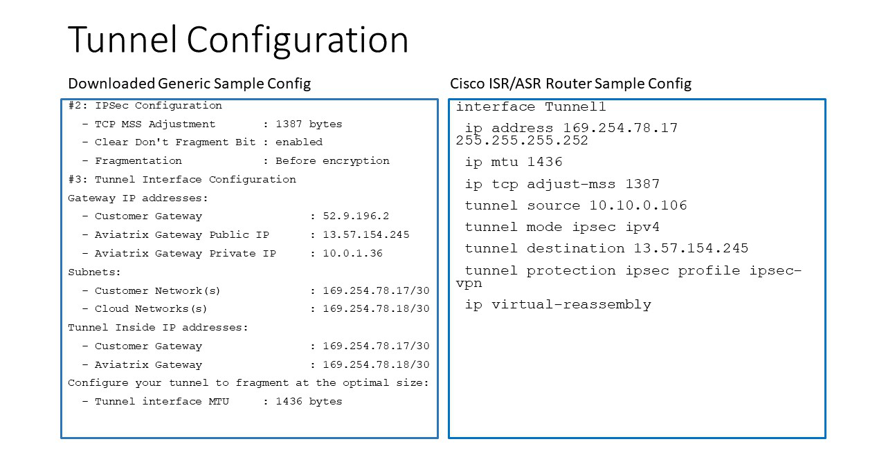
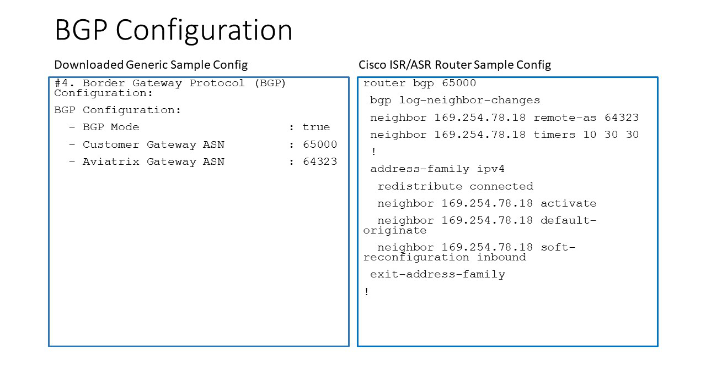

.. meta::
  :description: Global Transit Network to External Device
  :keywords: Transit VPC, Transit hub, AWS Global Transit Network, Encrypted Peering, Transitive Peering, AWS VPC Peering, VPN

=========================================================
Aviatrix Transit Gateway to External Devices 
=========================================================

Starting from Release 4.1, there are three options to connect to a Transit GW with BGP:

 - AWS VGW
 - Aviatrix hardware appliance CloudN
 - External (or 3rd Party) Router/Firewall

This document provides instructions on how to connect the Aviatrix Transit GW to external router/firewall devices.

What are the use cases for connecting to an external router?
---------------------------------------------------------------

 - **Overcoming the AWS VGW 100 route limit** Typically, an Aviatrix Transit GW connects to VGW over IPSEC and runs a BGP session with VGW. VGW then connects to on-prem devices. By connecting directly to an external device, the VGW is bypassed. 
 
 - **Overcome AWS VGW performance reset** VGW adjusts instance size based on network bandwidth consumption, leading to unexpected outage. 

 - **Azure Transit Network** This feature allows an Aviatrix Transit GW to connect to on-prem over Azure Express Route or Internet. 

 - **All Other Cloud Providers** Use this feature to connect to network of cloud providers such as Alibaba Cloud, Tencent Cloud, Vmware Cloud, IBM Cloud and others. 

How does it work? 
------------------

The Aviatrix Transit GW runs a BGP session to an external router to dynamically exchange routes. It also establishes an IPSEC tunnel to the router for packet forwarding. 

The mechanism works for AWS Direct Connect, Azure Express Route or Internet. 

Over Private Network
~~~~~~~~~~~~~~~~~~~~~~~

When the underlying infrastructure is AWS Direct Connect, the diagram is shown as below. 

|transitgw_dx|

Make sure:

  - The VGW is attached to the Transit VPC.  
  - The external device advertises its IP address to VGW.
  - The external device advertises the on-prem network CIDR list to Aviatrix Transit GW.

Over the Internet
~~~~~~~~~~~~~~~~~~~~~

When connecting over the Internet, as shown below, follow the instructions in the next section.

|transitgw_internet|

How to configure?
--------------------

The configuration is the `Step 3 in the Transit Network workflow <https://docs.aviatrix.com/HowTos/transitvpc_workflow.html>`_, when you select the option "External Device". We assume you have already completed `Step 1 <https://docs.aviatrix.com/HowTos/transitvpc_workflow.html#launch-a-transit-gateway>`_ and `Step 2 <https://docs.aviatrix.com/HowTos/transitvpc_workflow.html#optionally-enable-ha-for-the-transit-gateway>`_. Follow the instructions below.

1. Fill the parameters
~~~~~~~~~~~~~~~~~~~~~~~~~

Fill the parameters and click OK. For ActiveMesh design notes, check out `ActiveMesh Design Notes <https://docs.aviatrix.com/HowTos/activemesh_design_notes.html#configuration-notes>`_.

============================   ==========
**Setting**                    **Value**
============================   ==========
External Device                Select this option to build a IPSEC connection to a remote site. 
BGP                            Select BGP if the Transit GW runs dynamic routing with remote site.
Static Remote Route-Based      Select this option the remote site supports route-based VPN with static configuration.
Static Remote Policy-Based     Select this option the remote site supports policy-based VPN with static configuration. The caveat in this mode is the remote site must always initiate the traffic.
Transit VPC Name               The Transit VPC ID where Transit GW was launched.
Connection Name                A unique name to identify the connection to external device. 
Aviatrix Transit GW BGP ASN    The BGP AS number the Transit GW will use to exchange routes with external device.
Primary Cloud Gateway          The Transit GW you created in `Step 1 <https://docs.aviatrix.com/HowTos/transitvpc_workflow.html#launch-a-transit-gateway>`_. If Transit DMZ is deployed, select the `Companion gateway <https://docs.aviatrix.com/HowTos/transit_dmz_faq.html#how-does-transit-dmz-actually-work>`_.
Algorithms                     Optional parameters. Leave it unselected if you don't know.
IKEv2                          Select the option to connect to the remote site using IKEv2 protocol.
Enable Remote Gateway HA       Select HA if there are two external devices. 
Over Private Network           Select this option if your underlying infrastructure is private network, such as AWS Direct Connect and Azure Express Rout. See "How does it work" section for more details. When this option is selected, BGP and IPSEC run over private IP addresses.
BGP Remote AS Number           When BGP is selected, the BGP AS number the external device will use to  exchange routes Aviatrix Transit GW.
Remote Gateway IP              IP address of the remote device. If "Over DirectConnect" is selected, enter the private IP address of the external device. 
Pre-shared Key                 Optional parameter. Leave it blank to let the pre-shared key to be auto generated. 
Local Tunnel IP                Optional parameter. This field is for the tunnel inside IP address of the Transit gateway. Leave it blank.  
Remote Tunnel IP               Optional parameter. This field is for the tunnel inside IP address of the External device. Leave it blank. 
Over DirectConnect (Backup)    Select this option if HA is enabled.
BGP Remote ASN (Backup)        When BGP is selected, the remote ASN for backup should be the same as the primary remote ASN. 
Remote Gateway IP (Backup)     IP address of the remote device. If "Over DirectConnect" is selected, enter the private IP address of the external device.
Pre-shared Key (Backup)        Optional parameter. Leave it blank to let the pre-shared key to be auto generated. 
Local Tunnel IP (Backup)       Optional parameter. This field is for the tunnel inside IP address of the Transit gateway. Leave it blank.  
Remote Tunnel IP (Backup)      Optional parameter. This field is for the tunnel inside IP address of the External device. Leave it blank. 
Enable Edge Segmentation       Check this option to allow this connection to communicate with a Security Domain via `Connection Policy. <https://docs.aviatrix.com/HowTos/tgw_faq.html#what-is-a-connection-policy>`_ For more information, read `Edge Segmentation <https://docs.aviatrix.com/HowTos/tgw_faq.html#what-is-edge-segmentation>`_

============================   ==========

2. Download the configuration
~~~~~~~~~~~~~~~~~~~~~~~~~~~~~~

After the configuration is done, a connection is created. Download the configuration file. 

At the left navigation bar, go to Site2Cloud, click on the connection you created with "Connection Name" and click Download Configuration as shown below. Make sure you select Generic as Vendor type. 

|download_config_external|

3. Configure the external device
~~~~~~~~~~~~~~~~~~~~~~~~~~~~~~~~~~

Steps to

1. `Configure Cisco Router <http://docs.aviatrix.com/HowTos/Transit_ExternalDevice_CiscoRouter.html>`_

2. `Configure Cisco ASA <http://docs.aviatrix.com/HowTos/Transit_ExternalDevice_CiscoASA.html>`_

3. `Configure PaloAlto <http://docs.aviatrix.com/HowTos/Transit_ExternalDevice_PaloAlto.html>`_

4. `Configure FortiGate <http://docs.aviatrix.com/HowTos/Transit_ExternalDevice_FortiGate.html>`_

5. `Configure JuniperSRX <http://docs.aviatrix.com/HowTos/Transit_ExternalDevice_JuniperSRX.html>`_

6. `Configure pfSense <http://docs.aviatrix.com/HowTos/Transit_ExternalDevice_pfSense.html>`_

Use the information provided in the configuration file to configure the on-prem device with IPSEC tunnel and BGP.  

4. Disconnect the external device
~~~~~~~~~~~~~~~~~~~~~~~~~~~~~~~~~~~

To disconnect, go to Transit Network -> Setup, at `Step 8 <https://docs.aviatrix.com/HowTos/transitvpc_workflow.html#remove-transit-gw-to-vgw-connection>`_, select the Transit GW in the drop down menu, click Disconnect.

Appendix 1: Transit Connection to Cisco ISR/ASR over Internet
~~~~~~~~~~~~~~~~~~~~~~~~~~~~~~~~~~~~~~~~~~~~~~~~~~~~~~~~~~~~~

The following is the topology used for the sample configuration below:

|External-Device-Internet|

Since over Internet,  an Aviatrix Transit GW and Cisco ISR/ASR use each other's public IP to create an IPSec tunnel and establish a BGP
connection.

The following diagrams display mappings between a sample configuration from Step 2 above and its corresponding
Cisco ISR/ASR router configuration:

|transitgw_phase1|

|transitgw_phase2|

|transitgw_tunnel|

|transitgw_bgp|

Appendix 2: Transit Connection to Cisco ISR/ASR over Direct Connect
~~~~~~~~~~~~~~~~~~~~~~~~~~~~~~~~~~~~~~~~~~~~~~~~~~~~~~~~~~~~~~~~~~~

The following is the topology used for the sample configuration below:

|External-Device-DX|

Since over Direct Connect, the Aviatrix Transit GW and Cisco ISR/ASR use each other's private IP to create an IPSec tunnel and
establish BGP connection.

.. note::
   The ASN number of the Aviatrix Transit GW entered at **BGP Local AS Number** of Step 1 above should be the same as VGW's
   ASN number (7224 in this example). Without it, the Transit VPC CIDR advertised from VGW to on-prem ASR/ISR will be
   advertised by ASR/ISR back to the Aviatrix Transit GW. With the same ASN number, Aviatrix Transit GW will drop the
   route to Transit VPC CIDR.

The following diagrams display mappings between a sample configuration from Step 2 above and its corresponding
Cisco ISR/ASR router configuration:

|transitgw_phase1_dx|

|transitgw_phase2_dx|

|transitgw_tunnel_dx|

|transitgw_bgp_dx|

.. |transitgw_dx| image:: transitgw_external_media/transitgw_dx.png
   :scale: 30%

.. |transitgw_internet| image:: transitgw_external_media/transitgw_internet.png
   :scale: 30%

.. |transitgw_phase1| image:: transitgw_external_media/transitgw_phrase1.png
   :scale: 70%

.. disqus::
