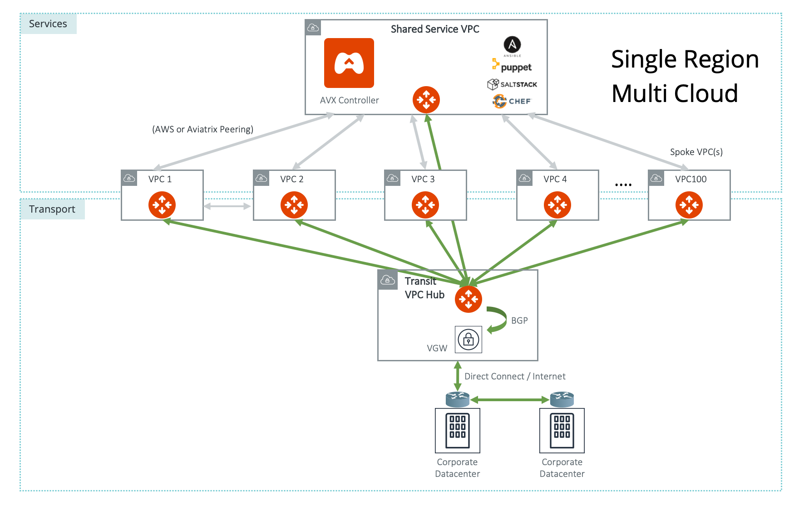

=====================================
Multi-Cloud Transit Network Design Patterns
=====================================

The `Multi-Cloud Transit Network  <http://docs.aviatrix.com/HowTos/transitvpc_workflow.html>`_ provides a workflow
to create a Transit VPC/VNet GW with a set of Spoke VPC/VNet GWs.

From one Aviatrix Controller, you can set up a Multi-Cloud Transit Network in a single region or across multiple regions.

Single Region Transit VPC/VNet Design
---------------------------------------------------------
 
The use case for this design is if you have one connection from an on-prem network to the cloud (Direct Connect/ExpressRoute/InterConnect/FastConnect) or
Internet to a VPC/VNet.

Aviatrix's Multi-Cloud Transit Network solution provides default network segmentation, a Spoke VPC/VNet has no connectivity to another
Spoke VPC/VNet via the Transit GW. For example, you do not need to spin up a Dev Transit Group and a Production Transit
Transit Group as none of the Spoke VPC/VNets in either group can communicate with each other.
As such, you do not need to spin up multiple Transit Groups for network isolation
purpose. See the diagram below.

For connectivity between Shared Service VPC/VNet and Spoke VPC/VNets, and between Spoke VPC/VNets, choose `AWS Peering <http://docs.aviatrix.com/HowTos/peering.html#aws-peering>`_ for AWS or `Aviatrix Encrypted Peering <http://docs.aviatrix.com/HowTos/peering.html#encrypted-peering>`_ from the Controller to set up.

Notice Transit GW is only used for traffic between on-prem and cloud (Spoke VPC/VNets). Cloud-to-cloud traffic, such as
Shared Service VPC/VNet to Spoke VPC/VNets does not go through the Transit GW. Decouple the different traffic streams
reduces the performance bottleneck and removes the single failure point.

.. Tip::

  A Spoke network can be deployed in a different region and different cloud (AWS and Azure).

|image0|

Multi-Regions Transit VPC Design
------------------------------------------

If you have data centers in multiple regions and its corresponding CSP regions, you build network redundancy to
reach cloud by leveraging VPN Gateway (VGW/VPN Connect) termination.

In the diagram below, which uses AWS as an example, there are two Transit Groups, one in each region. The VPN Gateway or VGW has an on-premise to the cloud (Direct Connect/ExpressRoute/InterConnect/FastConnect) or to
one datacenter, the same VGW is also used as a backup connectivity over Internet from the second datacenter. In case a data center loses connectivity to the VGW, the backup link can take over and route through the alternate route.

Note one Aviatrix Controller manages both Transit Groups. If you need connectivity between any two Spoke VPC/VNets in
each region, you can build an AWS Peering or `Aviatrix Encrypted Peering <http://docs.aviatrix.com/HowTos/peering.html#encrypted-peering>`_ from the Controller.

|image1|

Connected Transit Design
-----------------------------------

If you like to build a Transit Network where all Spoke VPC/VNets are connected via Transit GW, you can accomplish that by enabling the Connected Transit property for the Transit GW. When Connected Transit is enabled, you do not need to build additional tunnels between shared service VPC/VNet to other VPC/VNets. See the diagram below:

|image2|

10Gbps Transit VPC/VNet Design
---------------------------

If you have applications that need 10Gbps bandwidth, you can place these applications in a VPC/VNet
that terminates on the VPN Gateway/VGW with the 10Gbps VIF DX. Place the Aviatrix Transit GW in a separate VPC/VNet and
connect it to the VPN Gateway/VGW through the normal `Multi-Cloud Transit Network <http://docs.aviatrix.com/HowTos/transitvpc_workflow.html>`_

|image3|

Alternatively, you can place the high bandwidth application in a separate VPC/VNet that terminates directly on a VIF or network interface, as shown below.

|image4|

Distributed Egress Control with Aviatrix 
-------------------------------------------------

If you are using a NAT Gateway as your egress control for Internet access, consider using Aviatrix FQDN to improve egress control.

Aviatrix provides `L7 FQDN <http://docs.aviatrix.com/HowTos/FQDN_Whitelists_Ref_Design.html>`_ to whitelists and blacklists public sites that applications in a Spoke VPC/VNet need to make API calls.
The function is embedded in the Aviatrix Gateway. It is transparent to user instances and requires neither agents nor certs.

|image5|

Centralized Third-Party Firewall Integration
-----------------------------------------------------

If you need a full-fledged firewall device, centralized third party firewall appliances 
can be deployed via `Aviatrix Transit FireNet <https://docs.aviatrix.com/HowTos/transit_firenet_faq.html>`_

|transit_firenet|

Centralized Egress Control with Aviatrix 
-------------------------------------------

|transit_firenet_aviatrix_egress|

SD-WAN Integration
--------------------

The Aviatrix Multi-Cloud Transit Network integrates with SD-WAN cloud instances with BGP over LAN where both BGP routes and data packets
are exchanged between Aviatrix Transit Gateways and SD-WAN gateways deployed in the same Transit VPC/VNet, as shown in the diagram
below. . 

|sd_wan_integ|

.. |image1| image:: transitvpc_designs_media/multi_region2.png
   :width: 10.0in
   :height: 4.0in

.. |image4| image:: transitvpc_designs_media/10Gbpspattern2.png
   :width: 10.0in
   :height: 4.0in

.. |image5| image:: transitvpc_designs_media/egress-control2.png
   :width: 10.0in
   :height: 4.0in

.. |image6| image:: transitvpc_designs_media/Firewallintegration.png
   :width: 10.0in
   :height: 4.0in

.. |image8| image:: transitvpc_designs_media/SDWANtransit.png
   :width: 10.0in
   :height: 4.0in

.. |transit_azure_native_spoke| image:: transitvpc_designs_media/transit_azure_native_spoke.png
   :scale: 30%

.. |multi_cloud_transit_native| image:: transitvpc_designs_media/multi_cloud_transit_native.png
   :scale: 30%

.. |sd_wan_integ| image:: transitvpc_designs_media/sd_wan_integ.png
   :scale: 30%

.. |transit_firenet| image:: transit_firenet_media/transit_firenet.png
   :scale: 30%

.. |transit_firenet_aviatrix_egress| image:: transit_firenet_media/transit_firenet_aviatrix_egress.png
   :scale: 30%

.. disqus::
