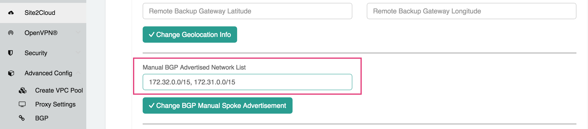

.. meta::
   :description: onboarding Frequently Asked Questions
   :keywords: Aviatrix Getting Started, Aviatrix, AWS

============================
Transit Network FAQ
============================

Why should I choose Transit architecture?
-------------------------------------------

Transit architecture is about building connectivity between cloud and on-prem in the most agile manner possible. In the Transit architecture, there is one connection (not including the backup) between on-prem and a Transit VPC. Everything else (the Spoke VPCs to on-prem traffic) is routed through the Transit VPC.  

The alternative to Transit architecture (often referred to as "flat" architecture) is to build one connection, either IPSEC over Internet or Direct Connect, each time you spin up a new VPC or VNet in the cloud. This requires changes at the on-prem edge, which requires a change control process that takes from days to weeks. 

How does the Aviatrix Transit Network solution differ from Cisco's CSR-based solution?
----------------------------------------------------------------------------------------
They differ in the following areas:

 - **Network Segmentation** - In the CSR-based solution, all Spoke VPCs have connectivity to each other through the Transit GW, even though these Spoke VPCs belong to different AWS accounts or business teams. In contrast, the Spoke VPCs have no connectivity to each other, by default. Connectivity is built by design.

 - **Connectivity Efficiency** - In the Aviatrix solution, traffic between any two Spoke VPCs are routed directly, as opposed to going through the Transit GW as required by the CSR-based solution. Decoupling the different traffic streams reduces performance bottlenecks and removes single failure points. 

 - **Half Egress Charge** - In the Aviatrix solution, VPC to VPC traffic does not go through the Transit GW, resucing the AWS network egress charge by half.  

 - **No unwanted route propagation** - Since Spoke VPCs run BGP in CSR solution, if a Spoke VPC also connects to a partner network via VGW, the partner network routes could propagated to your own on-prem network.

 - **Central Control** - With the Aviatrix solution, the Aviatrix Controller is the single pane of glass for all networking in the cloud.

 - **Simplicity** - In Aviatrix's solution, BGP is only deployed between Transit GW and VGW. No Spoke VPCs run the BGP protocol. Simplicity leads to stability. Workflow-based, step-by-step instructions help you build out a Transit VPC solution in minutes. 

 - **Monitoring** - The Aviatrix solution integrates with Splunk, Sumo, remote syslog, ELK and DataDog to forward events from gateways to your favorite central logging service. 

 - **Scalable** - AWS has various limits in its infrastructure, such as a route entry limit of 100. This limits how many on-prem CIDRs and VPC CIDRs can be carried on a Transit GW. The Aviatrix solution overcomes that limitation. 

For a fun read, here is a `blog on the differences <https://www.aviatrix.com/blog/aviatrix-global-transit-solution-differ-csr-solution/>`_

How does Aviatrix Transit Network work?
----------------------------------------

In the transit VPC, the Aviatrix gateway establishes two BGP sessions (for redundancy) to AWS VGW. Routes from on-prem network is propagated to the Aviatrix gateway which forward them to the Aviatrix Controller. The Controller detects route changes and program the Spoke VPCs for updated routes. 

In the direction from Spoke VPC to on-prem network, when a Spoke VPC is attached to the Transit Group, the Controller notifies the Aviatrix gateway in the transit VPC to advertise the new Spoke VPC CIDR to VGW.

Since all Spoke VPC routes are managed by the Aviatrix Controller, a Spoke VPC CIDR is not advertised to any other Spoke VPCs, therefore there is no connectivity between them through the transit VPC gateway. 

A Shared Service VPC is essentially one special Spoke VPC. The Shared Service VPC typically host common DevOps tools that needs connectivity to other Spoke VPCs. You can accomplish this connectivity by setting up either native AWS Peering or Aviatrix Encrypted Peering from the Aviatrix Controller. 

Where can I find Aviatrix Global Transit Network solution?
-----------------------------------------------------------

Aviatrix Controller is available in `AWS Marketplace. <https://aws.amazon.com/marketplace/search/results?x=0&y=0&searchTerms=aviatrix&page=1&ref_=nav_search_box>`_

How do I configure a Global Transit Network with Aviatrix solution?
--------------------------------------------------------------------

Follow the `Aviatrix Transit Network Workflow <http://docs.aviatrix.com/HowTos/transitvpc_workflow.html>`_. 

Should I deploy one Transit Group for Dev and one for Prod?
------------------------------------------------------------

If your reason for two Transit hubs is security and smaller blast radius, you need not to when using Aviatrix solution. By design, none of Spoke VPCs can talk to each other. Check out the `Single region design. <http://docs.aviatrix.com/HowTos/transitvpc_designs.html#single-region-transit-vpc-design>`_  

I have two regions and two Direct Connects, how do I build a multi region Transit solution?
-------------------------------------------------------------------------------------------------

For multi region, the redundancy is best built over VGW. Check out our `multi region design <http://docs.aviatrix.com/HowTos/transitvpc_designs.html#multi-regions-transit-vpc-design>`_

I have more than 100 VPCs, how do I overcome AWS route limits?
----------------------------------------------------------------

When you deploy Aviatrix Transit VPC solution, all Aviatrix gateways, Transit and Spoke, are deployed with `Designated Gateway Feature <http://docs.aviatrix.com/HowTos/gateway.html#designated-gateway>`_ enabled by default. This allows to manage as many Spoke VPCs as you need.

Can I launch multiple Transit GW groups from one Controller?
-------------------------------------------------------------

Yes, you can launch multiple Transit GW groups from one Aviatrix Controller. Go to the 
Transit Network workflow and start 
from `Step 1 <http://docs.aviatrix.com/HowTos/transitvpc_workflow.html#launch-a-transit-gateway>`_ to launch a new Transit GW group. 

I have a few high bandwidth applications, how do I deploy them in a Transit solution?
--------------------------------------------------------------------------------------

Currently the Transit solution has a maximum IPSEC throughput of around 1.5Gbps from the Transit GW. To support applications that require higher bandwidth, check out `this design pattern. <http://docs.aviatrix.com/HowTos/transitvpc_designs.html#gbps-trnasit-vpc-design>`_

How can I fit a egress firewall into this Transit VPC solution?
---------------------------------------------------------------

Egress firewall is deployed to provide protection for Internet access by 
instances in the private subnets. It should not be deployed in the Transit GW VPC. Instead, route Internet bound traffic directly to the firewall appliance from the Spoke VPCs, as shown in the `Egress Control Design. <http://docs.aviatrix.com/HowTos/transitvpc_designs.html#integrating-with-egress-firewall>`_ 

Can Aviatrix Transit VPC be deployed with Terraform template?
-------------------------------------------------------------

Yes, both APIs and Terraform are available for integration. 

For Terraform, check out `this link. <http://docs.aviatrix.com/Solutions/Setup_Transit_VPC_Solution_Terraform.html>`_

What are the automation methods for Transit Network?
-----------------------------------------------------

There are multiple resources to help you automate Transit Network setup. Noteif you are building a Transit Network following the workflow, you should use the APIs documented below.

 - `Transit Network section in API doc <http://docs.aviatrix.com/HowTos/Aviatrix_Controller_API.html>`_.

 - `Terraform example. <http://docs.aviatrix.com/HowTos/Setup_Transit_Network_Terraform.html>`_

 - `Python API example for Transit Network <https://github.com/AviatrixSystems/TransitNetworkAPI_python_example>`_

Does Aviatrix Transit Network support HA?
------------------------------------------

You can enable multi AZ HA during the workflow when launch a Transit VPC gateway or Spoke VPC gateway. 

Why is AWS t2 series instance types not recommended for production deployment on Transit GW?
---------------------------------------------------------------------------------------------

When a t2 series Transit GW communicate with VGW over IPSEC, there is a 3% packet drop for packet size less than 150 bytes by Transit GW due to an issue with AWS Xen hypervisor and the kernel version GW is using. This will be fixed in the future release. 

Note this packet drop issue does not affect Spoke gateways. 

How do I resize Transit GW instance?
------------------------------------

Go to Gateway page at the navigation bar, select the Transit GW, click Edit, scroll up to see the options and find Gateway Resize. Select the desired size and click Change. 

Resizing Transit GW requires the gateway instance to be stopped and start again in a different size. There will be network time for traffic between cloud and on-prem. There should be no downtime for traffic between VPCs as cloud to cloud traffic does 
not go through the Transit GW.  

During resizing, traffic will be switched to backup Transit GW if HA is enabled, this will also switch Spoke to Transit traffic if Spoke VPC has HA enabled. Resizing Transit GW will cause network downtime. 

How do I know which Transit GW that a Spoke GW is sending traffic to?
----------------------------------------------------------------------

You can tell which Transit GW carries the network traffic from a specific Spoke VPC by going to Advanced Config -> BGP. Select the Transit GW and click Detail. If the list of the Advertised Network includes the Spoke VPC CIDR, this Transit GW routes traffic from the Spoke to on-prem; if it does not, check out the backup Transit GW. 

How can I route VPC egress Internet bound traffic to on-prem to go through the corporate firewall?
---------------------------------------------------------------------------------------------------

If you advertise 0.0.0.0/0 to VGW, Spoke VPCs will have that route points to Transit GW and route egress Internet traffic to VGW and back to on-prem. Make sure you do not have NAT enabled on the Spoke GW or AWS NAT service enabled in the VPC.

How do I know if the tunnel between VGW and Transit GW is up?
---------------------------------------------------------------

Go to Site2Cloud, the tunnel status is displayed for each connection. 

How do I find out what routes being propagated from on-prem?
------------------------------------------------------------

On-prem routes are propagated to VGW which in turn propagated to the Transit GW. There are two ways to see what learned routes are by Transit GW: 

1. Go to Site2Cloud, select the connection you specified at Step 3 during Transit Network Workflow. Scroll down, you will see the Learned Network. Search for a learned routes by typing a specific CIDR. 
#. Go to Peering -> Transitive Peering. Click the box next to Destination CIDR column for a specific Spoke VPC GW. The Learned Routes will be shown and is searchable. 
#. Go to Advanced Config -> BGP -> select a Transit GW, click Detail

How do I find out BGP information on Transit GW?
-------------------------------------------------

Go to Advanced Config -> BGP -> Diagnostics, click the box for Predefined Show List. A list of BGP commands will be displayed. If you turn on debug command, make sure to turn it off when debug is finished to ensure the Transit GW is not flooded with debug
messaged. Excessive debug messages reduces throughput.

How do I delete a Spoke GW?
-----------------------------

Go to Gateway page, select the gateway you wish to delete and click Delete. 

An instance in a Spoke VPC cannot communicate with on-prem network, how do I troubleshoot?
-------------------------------------------------------------------------------------------

There are many reasons why an instance in a Spoke VPC cannot communicate with on-prem host or VM. 
The following troubleshooting steps may be helpful. 

1. Make sure the `connection between VGW and Transit GW <http://docs.aviatrix.com/HowTos/transitvpc_faq.html#how-do-i-know-if-the-tunnel-between-vgw-and-transit-gw-is-up>`_ is up. 

#. Make sure the CIDR of the on-prem problem subnet (where VM or host is not reachable from a Spoke VPC instance) is propagated to Spoke VPC, that is, make sure Spoke VPC where the problem instance is deployed has `connectivity <http://docs.aviatrix.com/HowTos/transitvpc_faq.html#how-do-i-find-out-what-routes-being-propagated-from-on-prem>`_ to the problem subnet in on-prem network. 

#. Run traceroute by using an Aviatrix gateway as a test EC2. Launch t2.micro instance Aviatrix Gateway from the `Gateway <http://docs.aviatrix.com/HowTos/gateway.html#gateway>`_ at the navigation bar (this gateway is going to be used as a test EC2 instance). Once this gateway is launched, you can run a `traceroute <http://docs.aviatrix.com/HowTos/troubleshooting.html#network-traceroute>`_ from this gateway (test EC2 instance) to the on-prem problem VM. (When the test is done, remember to delete the gateway to conserve consumption.) 

#. Do a traceroute from on-prem problem VM or host to the Aviatrix gateway test EC2 launched from the above steps. 

#. You can do a packet capture by going to Troubleshoot -> Diagnostics -> PACKET CAPTURE. Select the right tunnel interface and run packet capture.  

#. If the above tests pass, you should check security group settings on the instance and the destination VM. 

How do I build encryption over Direct Connect?
------------------------------------------------

AWS provides native solution to add VPN capability between VGW and on-prem over Direct Connect. This improves security as data in motion is encrypted. Follow `the instructions here <https://aws.amazon.com/premiumsupport/knowledge-center/create-vpn-direct-connect/>`_ for this capability. 

We build encryption between Aviatrix Transit GW and VGW and between Transit GW and Spoke GW to provide an end to end encryption protection. 

How do I build redundancy between VGW and on-prem?
--------------------------------------------------

AWS provides a few native options for redundancy between VGW and on-prem. You can build redundant active/active VPN connections, redundant active/active DX connections and DX with backup VPN connections.

`Read this doc <https://aws.amazon.com/answers/networking/aws-multiple-data-center-ha-network-connectivity/>`_ for implementation details. 

How do I deploy user VPN use case on Transit Network solution?
--------------------------------------------------------------

We recommend you to deploy `user VPN <http://docs.aviatrix.com/HowTos/uservpn.html>`_ in a 
shared service VPC. If this shared servicec VPC has connectivity to all other VPCs, a user can reach any instances in these VPCs as long as his/her profile policy allows. 

Does Transit Network support Azure VNet?
------------------------------------------

Starting from Release 3.3, you can launch a Spoke gateway in Azure VNet. Best practice is to 
setup the Azure VNet the same way you usually do with AWS VPC: two types of subnets, public subnets and private subnets with respective routing tables, where Spoke gateway is launched in public subnet. 

.. tip::

 Note in Azure there is no explicit concept for public subnet. The idea here is to setup separate subnets and respective routing tables for Aviatrix gateway and user VMs. For convenience, we use the term "public subnet" to describe the subnet where Aviatrix Spoke gateway is launched. 

Such separation of subnets and routing tables provides you with the flexibility if you plan 
to use Spoke gateway also for FQDN functions. 

Why do I receive BGP overlapping address alert email?
-------------------------------------------------------

When Aviatrix Controller detects on-prem propagated routes overlaps or is a superset of Spoke VPC 
CIDR ranges, it sends an email to admin, alerting a potential mis-configuration. Such email is 
sent once when a route change event occurs, for example, when BGP routes are flapping. 

The feature is enabled by default. If you wish not to receive the alert email, you can disable it. 

Go to Advanced Config -> BGP -> Overlapping Alert Email. Click to disable. 

How to summarize Spoke VPC CIDR ranges?
-----------------------------------------

If you have a large number of Spoke gateways attached to a Transit GW that 
you are concerned about exceeding the route limit a VGW can carry (100), 
you can summarize the Spoke VPC CIDRs. 

Go to Site2Cloud, click on the connection that identifies the Transit GW and VGW. (This connection is automatically created when you complete `Step 3 at the Transit Network workflow <https://docs.aviatrix.com/HowTos/transitvpc_workflow.html#connect-the-transit-gw-to-aws-vgw>`_. The Connection Name you entered should be displayed as a Site2Cloud connection at this page.)

After you click on the connection, scroll down to "Manual BGP Advertised Network List", as shown below. Enter the summarized CIDR ranges and click Change BGP Manual Spoke Advertisement. You can enter a list of CIDRs separated by comma. 

|bgp_summarize|

To disable this feature, simply remove the list to make the entry empty and then click Change BGP Manual Spoke Advertisement. 

.. disqus::
