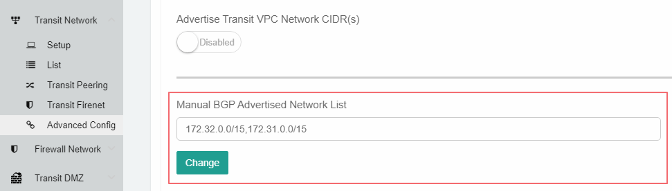
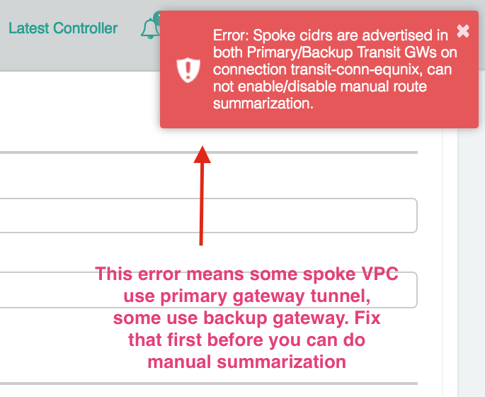
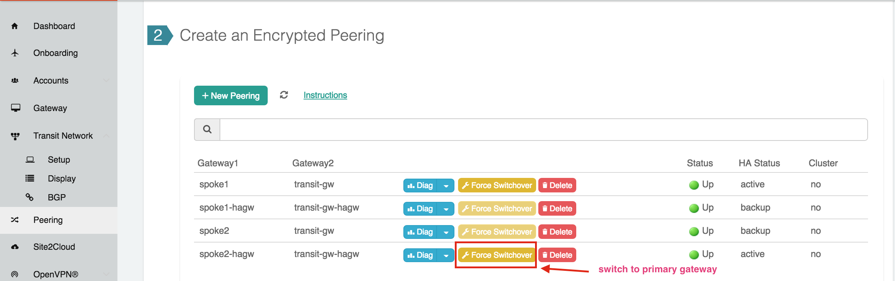
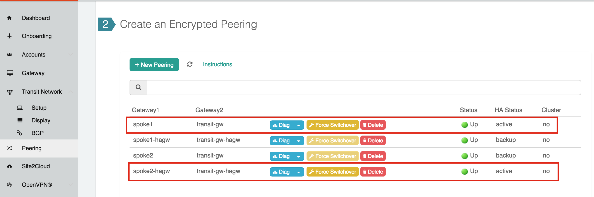

.. meta::
   :description: onboarding Frequently Asked Questions
   :keywords: Aviatrix Getting Started, Aviatrix, AWS

===============================
Multi-Cloud Global Transit FAQ
===============================

Why should I choose Transit Architecture?
----------------------------------------------------------

Transit architecture is about building connectivity between the cloud and on-prem in the most agile manner possible. In the Transit architecture, there is one connection (not including the backup) between on-prem and a Transit VPC/VNet. Everything else (the Spoke VPC/VNets to on-prem traffic) is routed through the Transit VPC/VNet.

The alternative to Transit architecture (often referred to as "flat" architecture) is to build one connection, either IPsec over the Internet or Direct Connect, each time you spin up a new VPC or VNet in the cloud. This requires changes at the on-prem edge, which requires a change control process that takes days to weeks.

How do I configure a global Transit Network with the Aviatrix Solution?
-------------------------------------------------------------------------------------------

If you plan to deploy an AWS Transit Gateway (TGW) based transit network, follow the `Aviatrix Transit Gateway Orchestrator Workflow <https://docs.aviatrix.com/HowTos/tgw_plan.html>`_.

If you plan to deploy in Azure or deploy Aviatrix gateways in the Spoke VPC/VNets, follow the instructions `here. <https://docs.aviatrix.com/HowTos/transitvpc_workflow.html>`_ 

Should the Aviatrix Transit Network all be deployed in ActiveMesh mode?
------------------------------------------------------------------------------------------

Yes. All Aviatrix Transit Network should be deployed in ActiveMesh mode. To learn more, check out `ActiveMesh FAQ <https://docs.aviatrix.com/HowTos/activemesh_faq.html>`_. 

Should I deploy one Transit Group for Dev and one for Prod?
--------------------------------------------------------------------------

If your reason for two Transit hubs is security and a smaller blast radius, you need not worry about these when using the Aviatrix solution. Simply create two Security Domains in your deployment. 

I have two regions and two Direct Connects. How do I build a Multi-Region Transit solution?
------------------------------------------------------------------------------------------------------------------

Starting from release 4.1, `inter region transit network <https://docs.aviatrix.com/HowTos/tgw_design_patterns.html#connecting-transit-gateways-in-multi-regions-multi-cloud>`_ can be connected directly. Follow the instructions `here <https://docs.aviatrix.com/HowTos/transit_gateway_peering.html#transit-gateway-peering>`_. 

I have more than 100 VPCs. How do I overcome AWS Route Limits (100)?
--------------------------------------------------------------------

When `AWS VGW carries more than 100 routes <https://aws.amazon.com/premiumsupport/knowledge-center/troubleshoot-bgp-vpn/>`_, its BGP session will crash unexpectedly, resulting in your network outage.

Azure network has similar limitations, the following techniques work for both cloud providers.

These are the options Aviatrix solution provides:

1. Summarizing Spoke VPC/VNet Routes
~~~~~~~~~~~~~~~~~~~~~~~~~~~~~~~~~~

Enable `Spoke VPC route summarization <https://docs.aviatrix.com/HowTos/transitvpc_faq.html#how-to-summarize-spoke-vpc-cidr-ranges>`_ so that Transit GW advertise as few routes to VGW as possible. As long as you can limit the number of total routes on the VGW to less than 100, the Transit Network can support as many Spoke VPC/VNets as you need.

Aviatrix Controller sends out alert/warning messages when it determines that the total routes carried by the VGW exceeds 80. This is to alert you to start reducing routes carried by the VGW to avoid potential network outage. This alert message is sent each time there is a route VGW advertised from VGW to Transit GW.

2. Bypassing VGW
~~~~~~~~~~~~~~~~

To permanently solve the route limit problem and not have to worry about summarizing routes at all and ever, use `External Device Option <https://docs.aviatrix.com/HowTos/transitgw_external.html>`_ to connect to on-prem directly over Direct Connect or the Internet. 

I have a few high bandwidth applications. How do I deploy them in a Transit solution?
-------------------------------------------------------------------------------------------------------------

Aviatrix's `Insane Mode solution <https://docs.aviatrix.com/HowTos/insane_mode.html>`_ provides 10Gbps Transit network throughput. 

How can I fit an Egress Firewall into the Aviatrix Transit solution?
-----------------------------------------------------------------------------------

There are two types of requirements.

Egress Control Policies
~~~~~~~~~~~~~~~~~~~~~~~~

If your compliance requires egress policies and you have currently implemented AWS NAT gateways, consider using `Aviatrix Egress Control <https://docs.aviatrix.com/HowTos/FQDN_Whitelists_Ref_Design.html>`_. Aviatrix Egress Control is the most efficient way to provide a FQDN filter for all TCP/UDP protocols.  

What are the automation methods for a Transit Network?
-------------------------------------------------------------------------

There are multiple resources to help you automate Transit Network setup. Note that if you are building a Transit Network following the workflow, you should `use Terraform <https://www.terraform.io/docs/providers/aviatrix>`_.

Does the Aviatrix Transit Network support HA?
-------------------------------------------------------------

Yes. Aviatrix Transit Gateways operates in `ActiveMesh mode <https://docs.aviatrix.com/HowTos/activemesh_faq.html>`_. 

Why are AWS t2 series instance types not recommended for Production deployment on a Transit GW?
------------------------------------------------------------------------------------------------------------------------------

When a t2 series Transit GW communicate with VGW over IPsec, there is a 3% packet drop for packet size less than 150 bytes by Transit GW due to an issue with AWS Xen hypervisor and the kernel version GW is using. This will be fixed in a future release.

Note that this packet drop issue does not affect Spoke Gateways.

How do I Resize a Transit GW instance?
------------------------------------------------------

Go to the Gateway page on the left sidebar > Transit GW and click **Edit**. Scroll up to Gateway Resize. Select the desired size and click **Change**.

Resizing a Transit GW requires the gateway instance to be stopped and started again in a different size. There will be network time for traffic between cloud and on-prem. There should be no downtime for traffic between VPC/VNets as cloud-to-cloud traffic does
not go through the Transit GW.

During resizing, traffic will be switched to the backup Transit GW if HA is enabled, this will also switch Spoke to Transit traffic if Spoke VPC/VNet has HA enabled. Resizing a Transit GW will cause network downtime.

How do I know which Transit GW a Spoke GW is sending traffic to?
--------------------------------------------------------------------------------------------

You can tell which Transit GW carries the network traffic from a specific Spoke VPC/VNet by selecting MULTI-CLOUD TRANSIT > BGP on the left sidebar. Select the Transit GW and click **Detail**. If the list of the Advertised Networks includes the Spoke VPC/VNet CIDR, this Transit GW routes traffic from the Spoke to on-prem; if it does not, check out the backup Transit GW.

How can I route VPC/VNet Egress Internet-bound traffic to on-prem to go through the corporate firewall?
-----------------------------------------------------------------------------------------------------------------------------

If you advertise 0.0.0.0/0 to VGW, Spoke VPCs will have that route point to the Transit GW and route egress Internet traffic to VGW and back to on-prem. Make sure you do not have NAT enabled on the Spoke GW or AWS NAT service enabled in the VPC/VNet.

How do I know if the tunnel between the VGW and the Transit GW is up?
-----------------------------------------------------------------------------------------

Go to Site2Cloud on the left sidebar. The tunnel status is displayed for each connection.

How do I find out what routes being propagated from on-prem?
----------------------------------------------------------------------------------

On-prem routes are propagated to the VGW which in turn propagates to the Transit GW. There are two ways to see what learned routes are by the Transit GW:

1. Go to Site2Cloud, select the connection you specified at Step 3 during the Transit Network Workflow. Scroll down, you will see the Learned Network. Search for a learned route by typing a specific CIDR.
#. Go to Peering > Transitive Peering. Click the box next to Destination CIDR column for a specific Spoke VPC/VNet GW. The Learned Routes are displayed and searchable.
#. Go to MULTI-CLOUD TRANSIT > BGP > select a Transit GW, and click **Detail**.

How do I find out BGP information on a Transit GW?
------------------------------------------------------------------

Go to MULTI-CLOUD TRANSIT  > BGP > Diagnostics, mark the checkbox for Predefined Show List. A list of BGP commands will be displayed. If you turn on debug command, make sure to turn it off when debug is finished to ensure the Transit GW is not flooded with debug messages. Excessive debug messages reduce throughput.

How do I delete a Spoke GW?
----------------------------------------

Go to the Gateway page, select the gateway you wish to delete, and click **Delete**.

An instance in a Spoke VPC/VNet cannot communicate with On-Prem Network. How do I troubleshoot?
---------------------------------------------------------------------------------------------------------------------------------

There are many reasons why an instance in a Spoke VPC/VNet cannot communicate with an on-prem host or VM.
The following troubleshooting steps may be helpful.

1. Make sure the `connection between VGW and Transit GW <http://docs.aviatrix.com/HowTos/transitvpc_faq.html#how-do-i-know-if-the-tunnel-between-vgw-and-transit-gw-is-up>`_ is up.

#. Make sure the CIDR of the on-prem problem subnet (where VM or host is not reachable from a Spoke VPC/VNet instance) is propagated to Spoke VPC/VNet, that is, make sure Spoke VPC/VNet where the problem instance is deployed has `connectivity <http://docs.aviatrix.com/HowTos/transitvpc_faq.html#how-do-i-find-out-what-routes-being-propagated-from-on-prem>`_ to the problem subnet in on-prem network.

#. Run traceroute by using an Aviatrix gateway as a test EC2. Launch a t2.micro instance Aviatrix Gateway from the `Gateway <http://docs.aviatrix.com/HowTos/gateway.html#gateway>`_ at the navigation bar (this gateway is going to be used as a test EC2 instance). Once this gateway is launched, you can run a `traceroute <http://docs.aviatrix.com/HowTos/troubleshooting.html#network-traceroute>`_ from this gateway (test EC2 instance) to the on-prem problem VM. (When the test is done, remember to delete the gateway to conserve consumption.)

#. Do a traceroute from the on-prem problem VM or host to the Aviatrix Gateway test EC2 launched from the above steps.

#. You can do a packet capture by going to Troubleshoot > Diagnostics > PACKET CAPTURE. Select the right tunnel interface and run packet capture.

#. If the above tests pass, you should check security group settings on the instance and the destination VM.

How do I build encryption over Direct Connect?
---------------------------------------------------------------

AWS provides native solutions to add VPN capability between VGW and on-prem over Direct Connect. This improves security as data in motion is encrypted. Follow `the instructions here <https://aws.amazon.com/premiumsupport/knowledge-center/create-vpn-direct-connect/>`_ for this capability.

We build an encryption between Aviatrix Transit GW and a VGW and between a Transit GW and a Spoke GW to provide an end-to-end encryption protection.

How do I build redundancy between VGW and on-prem?
----------------------------------------------------------------------------

AWS provides a few native options for redundancy between VGW and on-prem. You can build redundant active/active VPN connections, redundant active/active DX connections and DX with backup VPN connections.

`Read this doc <https://aws.amazon.com/answers/networking/aws-multiple-data-center-ha-network-connectivity/>`_ for implementation details.

How do I deploy a user VPN Use Case on Transit Network solution?
-----------------------------------------------------------------------------------

We recommend you to deploy `user VPN <http://docs.aviatrix.com/HowTos/uservpn.html>`_ in a
shared service VPC/VNet. If this shared service VPC/VNet has connectivity to all other VPC/VNets, a user can reach any instances in these VPC/VNets as long as his/her profile policy allows.

Does Transit Network support Azure VNet?
------------------------------------------------------

Starting from Release 3.3, you can launch a Spoke Gateway in Azure VNet. A best practice is to
set up the Azure VNet the same way you usually do with AWS VPC: two types of subnets, public subnets and private subnets with respective routing tables, where the Spoke Gateway is launched in public subnet.

.. tip::

 Note that in Azure there is no explicit concept of public subnet. The idea here is to set up separate subnets and respective routing tables for the Aviatrix Gateway and user VMs. For convenience, we use the term "public subnet" to describe the subnet where Aviatrix Spoke gateway is launched.

Such separation of subnets and routing tables provides you with the flexibility if you plan
to use Spoke gateway also for FQDN functions.

Why do I receive BGP Overlapping Address Alert emails?
-----------------------------------------------------------------------

When Aviatrix Controller detects that on-prem propagated routes overlap or are a superset of Spoke VPC/VNet
CIDR ranges, it sends an email to an admin, alerting a potential misconfiguration. Such email is
sent once when a route change event occurs, for example, when BGP routes are flapping.

The feature is enabled by default. If you wish not to receive the alert email, you can disable it.

Go to MULTI-CLOUD TRANSIT  > BGP > Configuration and find the BGP Overlapping Alert Email setting. Click on the toggle switch to change the status to **Disabled**.

How do I summarize Spoke VPC/VNet CIDR ranges?
-----------------------------------------------------------------

If you have a large number of Spoke gateways attached to a Transit GW that
you are concerned about exceeding the route limit a VGW can carry (100),
you can summarize the Spoke VPC/VNet CIDRs.

Before you configure summarization, make sure your Transit network meets the `prerequisite <https://docs.aviatrix.com/HowTos/transitvpc_faq.html#what-is-the-prerequisite-to-summarize-spoke-vpc-cidrs>`_.

Go to Multi-Cloud Transit > Advanced Config > Edit Transit, select the Transit GW. (This Transit GW is created when you complete `Step 1 at the Transit Network workflow <https://docs.aviatrix.com/HowTos/transitvpc_workflow.html#launch-a-transit-gateway>`_.)

After you select Transit GW, scroll down to "Manual BGP Advertised Network List", as shown below. Enter the summarized CIDR ranges and click **Change BGP Manual Spoke Advertisement**. You can enter a list of CIDRs separated by commas.

|bgp_summarize|

To disable this feature, simply remove the list to make the entry empty and then click **Change BGP Manual Spoke Advertisement**.

How to move a Spoke Gateway to a different AZ?
-------------------------------------------------------------

Follow the steps below:

 1. `Detach the Spoke Gateway <https://docs.aviatrix.com/HowTos/transitvpc_workflow.html#remove-a-spoke-gw-from-a-transit-gw-group>`_ from the Transit Network group.
 #. Delete the Spoke Gateway.
 #. Launch a new Spoke Gateway in the desired AZ following the Transit Network solution workflow.
 #. `Attach <https://docs.aviatrix.com/HowTos/transitvpc_workflow.html#join-a-spoke-gw-to-transit-gw-group>`_ the Spoke Gateway.

What is the prerequisite to summarize Spoke VPC/VNet CIDRs?
---------------------------------------------------------------------------------

If you see the error below when configuring `Spoke VPC/VNet CIDR manual summarization <https://docs.aviatrix.com/HowTos/transitvpc_faq.html#how-to-summarize-spoke-vpc-cidr-ranges>`_, your
Transit network is not ready for summarization.

|bgp_summarize_error|

The prerequisite for manual advertising is that all traffic from Spoke to Transit must be either on primary gateway path or backup gateway path.

Before fixing the error, click the Peering page on the left sidebar. In the example shown below,
spoke1 primary gateway is in Active state, however spoke2-hagw is in Active state.

|spoke_to_transit_inconsistent|

This inconsistency can be fixed by force switching spoke2 VPC/VNet to use the primary gateway, as shown below.

|force_switchover_spoke2|

Before you can summarize Spoke VPC/VNet CIDRs, you must make sure Spoke gateways all use either the primary gateway or all use the backup gateway if backup is enabled. 

How do I build Spoke-to-Spoke connectivity via Transit?
---------------------------------------------------------------------

Starting from release 3.5, Transit network supports `Connected mode. https://docs.aviatrix.com/HowTos/transitvpc_designs.html#connected-transit-design_` where Spoke to Spoke connectivity is built automatically.

How do a Spoke Gateway and VPC/VNet Private DNS work together?
----------------------------------------------------------------------------------------

All Aviatrix Gateways use a well-known public DNS server for their hostname resolutions. This is necessary as the gateway must
access services such as AWS SQS to retrieve messages from the Controller and the accessibility cannot depend on underline connectivity.
This is true even when a VPC has private DNS configured via its DHCP options, that is, while all EC2 instances use the private DNS
to resolve hostnames, Aviatrix gateways use a well known public DNS for its own hostname resolution needs.

On the other hand, Aviatrix also provides a feature `"Use VPC/VNet DNS Server" <https://docs.aviatrix.com/HowTos/gateway.html#use-vpc-vnet-dns-server>`_ which allows you to force the Aviatrix gateways to use a private DNS server. This is useful in certain use cases, for example, the organizations' Splunk server is hosted on prem with a private IP address. Another use case is when Aviatrix Egress FQDN is enabled for non-HTTP/HTTPS ports, the Aviatrix gateway must use the VPC/VNet's DHCP option in order to accurately obtain the IP address
of a given hostname.

There is a caveat when the "Use VPC/VNet DNS Server" is applied to a Spoke gateway where the custom DNS server is on-prem or is only reachable through the IPsec tunnels.

If the Spoke Gateway has HA enabled, it will have an issue when the "Use VPC/VNet DNS Server" feature is applied to the primary Spoke Gateway. After the initial
configuration, the system should work as intended. However, if a primary Spoke Gateway fail over to backup gateway, and
the system attempts to fail back again, it will have a problem.

The reason is that
the Aviatrix primary gateway, after the first failover, has lost connectivity to the private DNS since the tunnel is down. However,
the primary gateway must first obtain messages from the AWS SQS sent by the Controller to execute and reestablish the tunnel.
Therefore, the Spoke Gateway will be stuck and the tunnel will remain down. The situation can be resolved by disabling the "Use VPC/VNet DNS Server" on the Spoke Gateway.

As a rule of thumb, in a Transit Network, if you would like to have the Aviatrix Gateways use a private DNS server, this DNS server must be
reachable regardless of the network tunnel status.

How does the Aviatrix Transit Network Solution Differ from Cisco's CSR-Based Solution?
-----------------------------------------------------------------------------------------------------------
They differ in the following areas:

 - **Central Control** - With the Aviatrix solution, the Aviatrix Controller is the single pane of glass for all networking in the cloud.

 - **AWS Transit Gateway Integration** If you have AWS deployment, Aviatrix Transit integrates with an AWS TGW seamlessly for high bandwidth Spoke VPC connection. Customers who do not require end to end encryption can now use the TGW native service to connect the Spoke VPCs.

 - **Network Segmentation** In the CSR-based solution, all Spoke VPCs have connectivity to each other through the Transit GW, even though these Spoke VPCs belong to different AWS accounts or business teams. In contrast, in the Aviatrix solution the Spoke VPC/VNets have no connectivity to each other, by default. Connectivity is built by design. With the TGW integration, you can customize the `Security Domains <https://docs.aviatrix.com/HowTos/tgw_faq.html#what-is-a-security-domain>`_ to meet your segmentation requirements.

 - **Connectivity Efficiency** In the Aviatrix solution, traffic between any two Spoke VPC/VNets can be routed via TGW or directly, as opposed to going through the instance based Transit GW as required by the CSR-based solution. Decoupling the different traffic streams reduces performance bottlenecks and removes single failure points.

 - **No unwanted route propagation** Since Spoke VPC/VNets run BGP in CSR solution, if a Spoke VPC/VNet also connects to a partner network via VGW, the partner network routes could be propagated to your own on-prem network.

 - **Simplicity** In Aviatrix's solution, BGP is only deployed between Transit GW and VGW. No Spoke VPCs run BGP. Simplicity leads to stability. Workflow-based, step-by-step instructions help you build out a Transit VPC/VNet solution in minutes.

 - **Monitoring** The Aviatrix solution integrates with Splunk, Sumo, remote syslog, ELK and DataDog to forward events from gateways to your favorite central logging service.

 - **Scalable** AWS has various limits in its infrastructure, such as a route entry limit of 100. This limits how many on-prem CIDRs and VPC CIDRs can be carried on a Transit GW. The Aviatrix solution overcomes that limitation.

For a fun read, here is a `blog on the differences <https://www.aviatrix.com/blog/aviatrix-global-transit-solution-differ-csr-solution/>`_

If I already have a Transit to External Device connection using IKEv1, could I create another one using IKEv2? 
----------------------------------------------------------------------------------------------------------------------------------------

Starting from 6.3 release, Aviatrix supports the feature `Transit to External Device Using IKEv2 <https://docs.aviatrix.com/HowTos/UCC_Release_Notes.html#multi-cloud-transit-network>`_. The prerequisite for IKEv2 is that you need to create the first Transit to External Device connection with IKEv2 enabled. If your current Transit gateway already has a connection using IKEv1 either is created by attaching spoke gateway or is built in MULTI-CLOUD TRANSIT step 3, you need to delete it first before creating the Transit to External Device connection with IKEv2. 

How do I troubleshoot a Transit to External Device connection with IKEv2 issue?
-------------------------------------------------------------------------------------------------

Refer to `Troubleshooting IPsec VPN connection with IKEv2 <https://docs.aviatrix.com/HowTos/troubleshooting_ipsec_vpn_connection_with_ikev2.html>`_

   

   

.. disqus::
