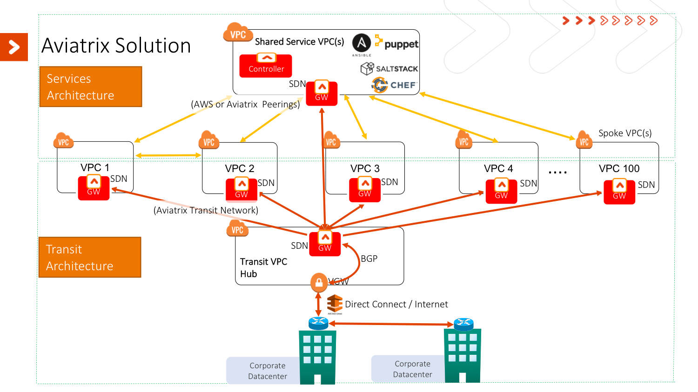
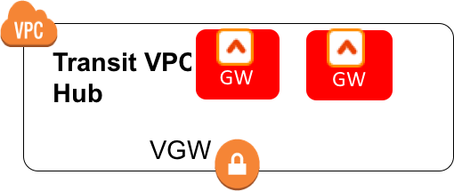
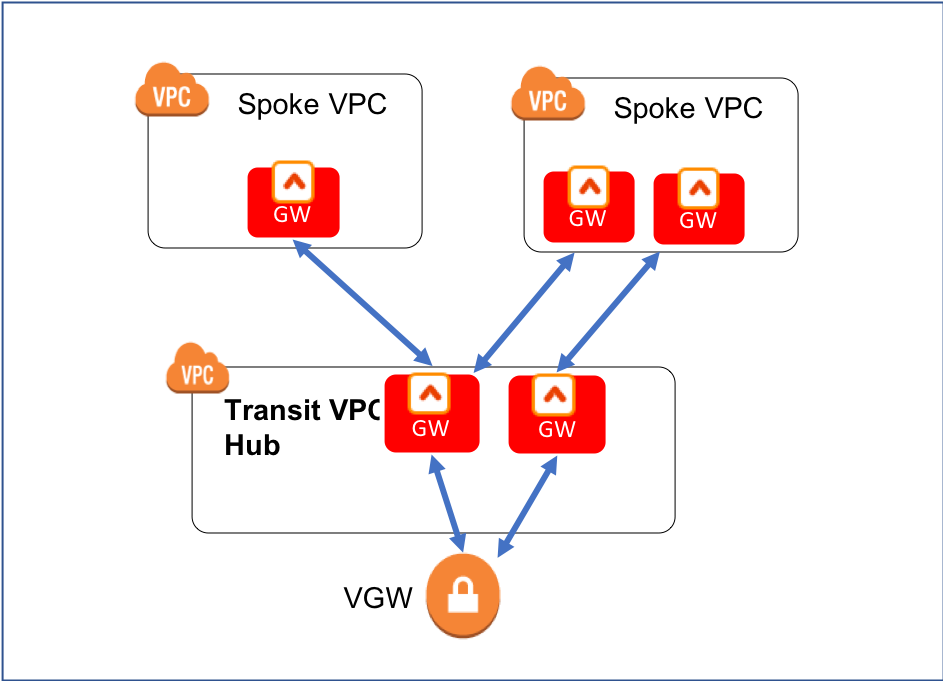

.. meta::
  :description: Global Transit Network
  :keywords: Transit VPC, Transit hub, AWS Global Transit Network, Encrypted Peering, Transitive Peering, AWS VPC Peering, VPN

=========================================================
AWS Global Transit Network Workflow Instructions
=========================================================

.. important::

 If you intend to build the next gen transit network with AWS Transit Gateway Orchestrator, your starting point is `this link. <https://docs.aviatrix.com/HowTos/tgw_plan.html>`_ You need this document for the hybrid connections during `Plan phase. <https://docs.aviatrix.com/HowTos/tgw_plan.html#optional-enable-aviatrix-transit-gw-for-hybrid-connection>`_

This workflow provides you with a step by step instructions to build a Global Transit Network. 

For design guide, check out `Transit Network Design Patterns. <http://docs.aviatrix.com/HowTos/transitvpc_designs.html>`_ 

For more information, check out `Transit Network FAQ. <http://docs.aviatrix.com/HowTos/transitvpc_faq.html>`_

For other Aviatrix functions, such as `VPN access for users <http://docs.aviatrix.com/HowTos/uservpn.html>`_ and `VPN access for sites <http://docs.aviatrix.com/HowTos/site2cloud_faq.html>`_, check out `Aviatrix Overview <http://docs.aviatrix.com/StartUpGuides/aviatrix_overview.html>`_

This Global Transit Network consists of a Transit gateway and a set of Spoke gateways for communications 
between Spoke VPC EC2 instances and on-prem network. 

.. note::
   For description purpose, gateway and GW are used interchangeably.
   Other than gateway deletion, resources created by this work flow should be deleted within the work flow. 

The Global Transit Network diagram is described as below. 

|image0|

Planning and Prerequisites
---------------------------

 1. If you have not launched Aviatrix Controller, start with `Aviatrix startup guide <http://docs.aviatrix.com/StartUpGuides/aviatrix-cloud-controller-startup-guide.html>`_
 #. Identify a VPC, call it Transit VPC, in a region where you want to launch the Transit GW (`additional details <./transit_spoke_aws_requirements.html>`__) We recommend you to use the information `here <https://docs.aviatrix.com/HowTos/create_vpc.html>`_ to create a Transit VPC. 
 #. Create a VGW or reuse an existing VGW. The VGW should not be attached to the Transit VPC if you plan to launch Transit GW in the same VPC. This VGW can be attached to a different VPC if this VPC CIDR is different from the Transit VPC where Transit GW is launched or in a different region and account. (see `10Gbps Transit Network use case <http://docs.aviatrix.com/HowTos/transitvpc_designs.html#gbps-transit-vpc-design>`_). This VGW should be connected to on-prem either over Direct Connect or over Internet.  
 #. If this is your first time using Aviatrix, make sure you go through the Aviatrix Controller on-boarding process to create Aviatrix account that corresponds to an IAM role. For instructions on how to launch an Aviatrix Controller, check out `this link. <http://docs.aviatrix.com/StartUpGuides/aviatrix-cloud-controller-startup-guide.html>`_

.. tip::

  Use Aviatrix `"Create a VPC" <https://docs.aviatrix.com/HowTos/create_vpc.html>`_ tool with option "Aviatrix Transit VPC" to create a transit VPC that has all infrastructure fully populated. 

Login to the Aviatrix Controller
^^^^^^^^^^^^^^^^^^^^^^^^^^^^^^^^^
Open a browser and navigate to https://<Controller Public IP address>/.  Once authenticated, click on `Transit Network` in the left navigation bar.

Follow the steps below to set up Transit Network.

1. Launch a Transit Gateway
-------------------------------------------

The Transit GW is the hub gateway, it serves to move traffic between a Spoke VPC and on-prem network.
The Transit GW must be launched on public subnet where its associated route table has a route 0.0.0.0/0 that points to AWS IGW. 

|image1|

==========================================      ==========
**Setting**                                     **Value**
==========================================      ==========
Cloud Type                                      Currently Transit GW can only be launched in AWS
Gateway Name                                    A unique name to identify the Transit GW
Account Name                                    An `Aviatrix account <http://docs.aviatrix.com/HowTos/aviatrix_account.html#account>`_ that corresponds to an IAM role or account in AWS
Region                                          One of the AWS regions
VPC ID                                          The Transit VPC-id
Public Subnet                                   The public subnet on which Transit GW instance is deployed
Gateway Size                                    Transit GW `instance size <http://docs.aviatrix.com/HowTos/gateway.html#select-gateway-size>`_
Specify a Reachable DNS Servier IP Address      Leave it unselected
Add/Edit Tags                                   `Additional AWS Tags <http://docs.aviatrix.com/HowTos/gateway.html#add-edit-tags>`_ for the Transit GW instance
==========================================      ==========

.. Warning:: When selecting Transit GW instance size, choose a t2 series for Proof of Concept (POC) or prototyping only. Transit GW of t2 series instance type has a random packet drop of 3% for packet size less than 150 bytes when interoperating with VGW. This packet drop does not apply to Spoke GW.  

You can change the Transit GW size later by follow `this instructions. <http://docs.aviatrix.com/HowTos/transitvpc_faq.html#how-do-i-resize-transit-gw-instance>`_

2. (Optionally) Enable HA for the Transit Gateway
--------------------------------------------------

When HA is enabled, a second Transit GW will be launched. Note both Transit GWs will be forwarding traffic in an event of tunnel failure between a Spoke VPC and Transit VPC, and between the Transit GW and VGW. For best practice, the HA GW should be launched on a different public subnet in a different AZ. 

|image2|

To disable Transit GW HA, go to Gateway page and delete the Transit GW with -hagw in the name extension. Note if the Transit GW is connected to VGW, you cannot disable Transit GW HA and if there are still Spoke GWs, you cannot disable
Transit GW HA either. 

3. Connect the Transit GW to AWS VGW 
-------------------------------------

Although the title says to connect to AWS VGW, Starting from Release 4.1, there are three options to connect to Transit GW with BGP to on-prem network. Choose one option that meets your network requirements.  

 - AWS VGW (This is the default setting.)
 - Aviatrix hardware appliance CloudN
 - External Device (over Direct Connect or over Internet)

as shown below. 

|transit_to_onprem|

3.1 External Device
^^^^^^^^^^^^^^^^^^^^^

"External Device" option allows you to build BGP and IPSEC tunnel directly to on-prem or 
in the cloud device. It bypasses AWS VGW or Azure VPN gateway for exchanging routes with on-prem, thus overcomes the route limit by these native services. For more information, read more `here. <https://docs.aviatrix.com/HowTos/transitgw_external.html>`_ 

Follow the instruction in `this link <https://docs.aviatrix.com/HowTos/transitgw_external.html#how-to-configure>`_  to complete this Step. 

3.2 Aviatrix Appliance CloudN
^^^^^^^^^^^^^^^^^^^^^^^^^^^^^^^

"Aviatrix Hardware Appliance CloudN" allows you to build BGP and IPSEC tunnel directly to on-prem Aviatrix hardware
appliance. It achieves 10Gbps IPSEC performance and bypasses AWS VGW or Azure VPN gateway for exchanging routes with on-prem, thus overcomes both the 
performance limit and route limit by these native services. Follow the instruction in this link to complete Step 3. 

3.3 AWS VGW
^^^^^^^^^^^^^^

The instruction below is for Transit GW to connect to AWS VGW. 

Before executing this step, a VGW must have already been created. 

Select the VGW ID in the drop down menu, Customer gateway will be automatically created as the result of this step. 

This step automatically builds a site2cloud IPSEC tunnel with VGW and establishes a BGP session with VGW to
exchange routes between on-prem and the cloud.

.. important::

 You are responsible for building the connection between VGW and on-prem. The connection is either over Internet, over Direct Connect or both. 

 We support two patterns of connections: Detached VGW and Attached VGW. Attached VGW is only allowed if VGW and Transit GWs are in different VPCs. 

|image3|

=====================      ==========
**Setting**                **Value**
=====================      ==========
VPC ID                     The Transit VPC ID where Transit GW was launched
Connection Name            A unique name to identify the connection to VGW 
BGP Local AS Number        The BGP AS number the Transit GW will use to exchange routes with VGW
Primary Cloud Gateway      The Transit GW you created in Step 1
AWS VGW Account Name       The Aviatrix account that VGW is created with. This account could be the same as the account used by Transit GW, or it could be by a different account
VGW Region                 The AWS region where VGW is created
VGW ID                     VGW that is created in the VGW Region in the AWS VGW Account
=====================      ==========

Note Aviatrix Transit GW can connect to a VGW that belongs to a different AWS account in a different region. 

It takes a few minutes for the VPN connection to come up and routes from VGW 
to be propagated. When the IPSEC tunnel with VGW is up, the Controller admin should receive an email notification.

If you login to AWS Console and select service VPC in the region where VGW is, you should see Customer Gateway and VPN Connections have been created. Do not delete or modify them from AWS Console. These resources are deleted 
when you Disconnect VGW at step 8. 

You can check if routes are properly propagated by going to Advanced Config at 
navigation bar, select BGP. Select the Transit GW, click details. 
The Learned Routes should be the list of the routes propagated from VGW. 
Scroll down to see the total number of learned routes. 

4. Launch a Spoke Gateway
-------------------------

|image4|

==========================================      ==========
**Setting**                                     **Value**
==========================================      ==========
Cloud Type                                      Spoke GW can be launched in AWS and Azure
Gateway Name                                    A unique name to identify the Spoke GW
Account Name                                    An `Aviatrix account <http://docs.aviatrix.com/HowTos/aviatrix_account.html#account>`_ that corresponds to an IAM role or account in AWS
Region                                          One of the AWS regions
VPC ID                                          The Spoke VPC-id
Public Subnet                                   The public subnet where the Spoke GW instance is deployed
Gateway Size                                    Spoke GW `instance size <http://docs.aviatrix.com/HowTos/gateway.html#select-gateway-size>`_
Specify a Reachable DNS Servier IP Address      Leave it unselected
Enable NAT                                      Select the option if the Spoke GW will also be the NAT gateway for the Spoke VPC
Add/Edit Tags                                   `Additional AWS Tags <http://docs.aviatrix.com/HowTos/gateway.html#add-edit-tags>`_ for the Transit GW instance
==========================================      ==========

You can enable NAT function on Spoke GW if egress to Internet is intended to 
go through the Spoke GW. Once NAT is enabled, you can further configure `FQDN whitelists for egress filter. <http://docs.aviatrix.com/HowTos/FQDN_Whitelists_Ref_Design.html>`_

5. (Optionally) Enable HA for the Spoke Gateway
------------------------------------------------

6. Join a Spoke GW to Transit GW Group
---------------------------------------

This step attaches a Spoke VPC to the Transit GW Group by building a Aviatrix encrypted peering and transitive peering between the Spoke GW and the Transit GW. The Controller also instructs the Transit GW to start advertise the Spoke VPC CIDR to VGW via the established BGP session.

|image5|

To attach more Spoke VPCs to this Transit GW Group, repeat Step 4 to Step 6. 

7. Remove a Spoke GW from a Transit GW Group
--------------------------------------------

This step detaches one Aviatrix Spoke VPC from a Transit GW Group. 
The Controller also instructs the Transit GW to stop advertising the Spoke VPC CIDR 
to VGW. 

Note the Spoke GW is not deleted and you can go to step 6 to attach the Transit GW group again. 

To delete a Spoke GW, go to Gateway on the main navigation tab, select the gateway and click Delete. 

8. Add More Spoke VPCs
---------------------------------------

Repeat step 4 to 6 to add more Spoke VPCs to the Transit GW group.

|image6|

9. View the Network Topology
-------------------------------------

You can view the network topology by going to the Dashboard. Click on the Map View to switch to Logical View. 
In the Logical View, each gateway is represented by a dot. You can rearrange the initial drawing by moving the dot, 
zoom in or zoom out, move the graph around. After you are done moving, click the Save icon. 

10. Remove Transit GW to VGW Connection
----------------------------------------

You can remove Transit GW connection to VGW via this step.  

You can go to Step 3 to build the connection again. 

11. Troubleshoot BGP
---------------------

Under `Advanced Config` on the main navigation bar, click BGP. The Transit GW will have BGP Mode as Enabled. 
Click the Transit GW and click Details to see Advertised Networks and Learned Networks. 
Learned Networks are network CIDR blocks that BGP learned from VGW. Advertised Networks are Spoke VPC CIDRs. 

You can also click Diagnostics. Select one of the show commands or type in yourself if you know the commands to 
see more BGP details. 

To troubleshooting connectivity between a Spoke VPC instance and a on-prem host, follow `these steps. <http://docs.aviatrix.com/HowTos/transitvpc_faq.html#an-instance-in-a-spoke-vpc-cannot-communicate-with-on-prem-network-how-do-i-troubleshoot>`_

12. Disable Transit GW HA
--------------------------

Go to Gateway page, locate the Transit GW with "-hagw" in the gateway name extension, highlight the 
gateway and click Delete. 

Note Transit GW and its back up companion are in active/active state, that is, both gateways could 
be forwarding traffic. To disable Transit GW HA, it is best practice to make sure there is no traffic 
going through the backup Transit GW. 

13. Transit Network APIs
-------------------------

There are multiple resources to help you automate Transit Network setup. Noteif you are building a Transit Network following the workflow, you should use the APIs documented below. 

 - `Transit Network section in API doc <https://s3-us-west-2.amazonaws.com/avx-apidoc/index.htm#api-doc-transit-network>`_. 

 - `Terraform example. <http://docs.aviatrix.com/HowTos/Setup_Transit_Network_Terraform.html>`_

 - `Python API example for Transit Network <https://github.com/AviatrixSystems/TransitNetworkAPI_python_example>`_

How to get started on AWS?
---------------------------------------

Aviatrix Controller AMIs can be found on AWS Marketplace. 

Try out our `Aviatrix Secure Networking Platform PAYG - Metered  <https://aws.amazon.com/marketplace/pp/B079T2HGWG?qid=1526426957554&sr=0-3&ref_=srh_res_product_title>`_ with two free tunnels. Follow the `Startup Guide <http://docs.aviatrix.com/StartUpGuides/aviatrix-cloud-controller-startup-guide.html>`_ to launch the Controller instance and get started. 
 
Extras
-----------

The above workflow abstracts and combines multiple existing Aviatrix features, such `Encrypted Peering <http://docs.aviatrix.com/HowTos/peering.html>`_, `Transitive Peering <http://docs.aviatrix.com/HowTos/TransPeering.html>`_ and `Site2Cloud <http://docs.aviatrix.com/HowTos/site2cloud.html>`_ to bring you a wizard like experience so that you do not go to multiple pages on the Controller console when building the Transit network.

After you have built the Transit GW and Spokes, you can view the connection between Transit GW and VGW on the Site2Cloud page. You can also see the Spoke to Transit GW connections on the Peering page. 

.. Important::

  Stay on the Transit Network page for any Spoke gateway and Transit GW actions, such as attach a Spoke, detach a Spoke, Connect to VGW and Disconnect to VGW. Do not go to any other pages for these actions. For deleting a Spoke gateway or Transit gateway, go to the Gateway page, select the gateway and delete. 

  

.. |image3| image:: transitvpc_workflow_media/connectVGW.png
   :scale: 50%

.. |image4| image:: transitvpc_workflow_media/launchSpokeGW.png
   :scale: 50%

.. |image5| image:: transitvpc_workflow_media/AttachSpokeGW.png
   :scale: 50%

.. |transit_to_onprem| image:: transitvpc_workflow_media/transit_to_onprem.png
   :scale: 30%

.. disqus::
