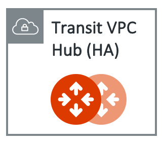
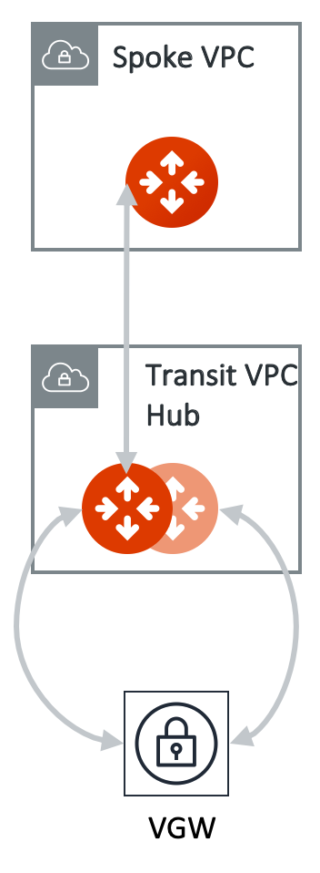
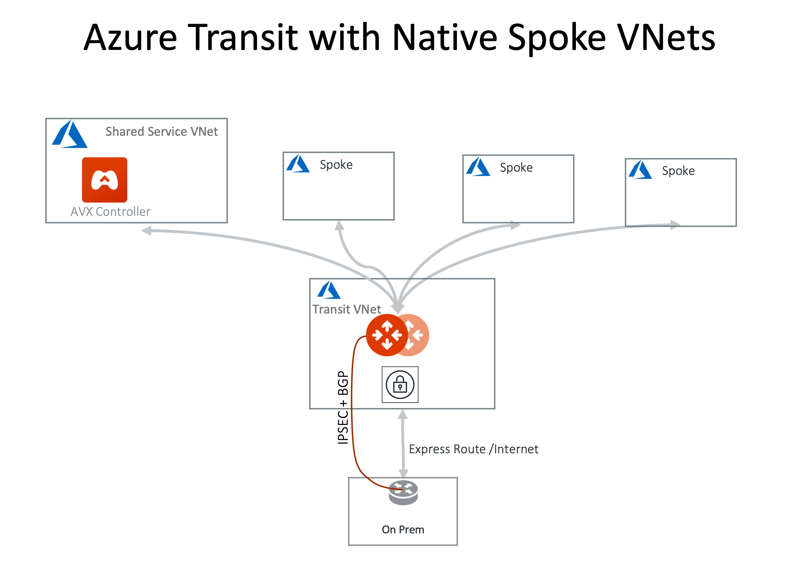

.. meta::
  :description: Global Transit Network
  :keywords: Transit VPC, Transit hub, AWS Global Transit Network, Encrypted Peering, Transitive Peering, AWS VPC Peering, VPN

======================================================================
Multi-cloud Transit Network Workflow Instructions (AWS/Azure/GCP/OCI)
======================================================================

.. important::

 If you intend to deploy a transit network using AWS Transit Gateway (TGW), your starting point is `this link <https://docs.aviatrix.com/HowTos/tgw_plan.html>`_. For building encrypted Transit in AWS/Azure/GCP/OCI or Transit network with Azure Native Peering, this document is your starting point.

This workflow provides you with step-by-step instructions to build a Multi-cloud Transit Network. 
This Multi-cloud Transit Network consists of a Transit gateway and a set of Spoke gateways for communications between Spoke VPC or VNet instances and your on-prem network. 

While the instructions below reference AWS, these functionalities apply to any public cloud in which Aviatrix Transit Network is supported. 

For a design guide, check out `Multi-cloud Transit Network Design Patterns. <http://docs.aviatrix.com/HowTos/transitvpc_designs.html>`_ 

For more information, check out `Multi-cloud Transit Network FAQ. <http://docs.aviatrix.com/HowTos/transitvpc_faq.html>`_

For other Aviatrix functions, such as `VPN access for users <http://docs.aviatrix.com/HowTos/uservpn.html>`_ and `VPN access for sites <http://docs.aviatrix.com/HowTos/site2cloud_faq.html>`_, check out `Aviatrix Overview <http://docs.aviatrix.com/StartUpGuides/aviatrix_overview.html>`_

.. note::
   For description purposes, gateway and GW are used interchangeably.
   Other than gateway deletion, resources created by this workflow should be deleted within the work flow. 

The Transit Network diagram is described as below. 

|Test|

Planning and Prerequisites
---------------------------

 #. If you have not launched an Aviatrix Controller, start with `Aviatrix startup guide <http://docs.aviatrix.com/StartUpGuides/aviatrix-cloud-controller-startup-guide.html>`_
 #. Identify a VPC, call it Transit VPC, in a region where you want to launch the Transit GW (`additional details <./transit_spoke_aws_requirements.html>`__) We recommend you to use the information `here <https://docs.aviatrix.com/HowTos/create_vpc.html>`_ to create a Transit VPC. 
 #. Create a VGW or reuse an existing VGW. The VGW should not be attached to the Transit VPC if you plan to launch Transit GW in the same VPC. This VGW can be attached to a different VPC if this VPC CIDR is different from the Transit VPC where the Transit GW is launched or in a different region and account. (see `10Gbps Transit Network use case <http://docs.aviatrix.com/HowTos/transitvpc_designs.html#gbps-transit-vpc-design>`_). This VGW should be connected to on-prem either over Direct Connect or over the Internet.  
 #. If this is your first time using Aviatrix, make sure you go through the Aviatrix Controller on-boarding process to create an Aviatrix account that corresponds to an IAM role. For instructions on how to launch an Aviatrix Controller, check out `this link. <http://docs.aviatrix.com/StartUpGuides/aviatrix-cloud-controller-startup-guide.html>`_

.. tip::

  Use the Aviatrix `"Create a VPC" <https://docs.aviatrix.com/HowTos/create_vpc.html>`_ tool with the option "Aviatrix Transit VPC" to create a transit VPC that has all infrastructure fully populated. 

Log into the Aviatrix Controller
-------------------------------------------

Open a browser and navigate to https://<Controller Public IP address>/.  Once authenticated, select **Transit Network** in the left navigation bar.

The Multi-cloud Transit Network Workflow page opens. Use this page and the four tabs in the top right (Transit, Spoke, Attach/Detach, and External Connection) to set up a Multi-cloud Transit Network.

Transit
-------------------------------------------

On the Multi-cloud Transit Network Workflow page, select the **Transit** tab in the top right to launch a Transit Gateway.

1. Launch an Aviatrix Transit Gateway
^^^^^^^^^^^^^^^^^^^^^^^^^^^^^^^^^

On the Multi-cloud Transit Network Workflow page, select the **Transit** tab in the top right to launch a Transit Gateway.

The Transit GW is the hub gateway, it serves to move traffic between a Spoke VPC and an on-prem network.
The Transit GW must be launched on a public subnet where its associated route table has a route 0.0.0.0/0 that points to AWS IGW. 

|TVPC2|

==========================================      ==========
**Setting**                                     **Value**
==========================================      ==========
Cloud Type                                      Currently Transit GW can launched in AWS, Azure and GCP
Gateway Name                                    A unique name to identify the Transit GW
Access Account Name                                    An `Aviatrix account <http://docs.aviatrix.com/HowTos/aviatrix_account.html#account>`_ that corresponds to an IAM role or account in AWS
Region                                          One of the AWS regions
VPC ID                                          The Transit VPC/VNet/VCN ID 
Public Subnet                                   The public subnet on which Transit GW instance is deployed
Gateway Size                                    Transit GW `instance size <http://docs.aviatrix.com/HowTos/gateway.html#select-gateway-size>`_
Allocate New EIP                                Select this checkbox to have the Controller allocate a new EIP and associate it with the Transit gateway instance. If you do not select this option, the Controller looks for an allocated but unassociated EIP in the Transit GW account. 
Insane Mode Encryption                          If selected, Transit GW can peer and connect to Spoke with `Insane Mode Encryption <https://docs.aviatrix.com/HowTos/gateway.html#insane-mode-encryption>`_.
Add/Edit Tags                                   `Additional AWS Tags <http://docs.aviatrix.com/HowTos/gateway.html#add-edit-tags>`_ for the Transit GW instance
==========================================      ==========

.. Warning:: When selecting Transit GW instance size, choose a t2 series for Proof of Concept (POC) or prototyping only. Transit GW of t2 series instance type has a random packet drop of 3% for packet size less than 150 bytes when interoperating with VGW. This packet drop does not apply to Spoke GW.  

You can change the Transit GW size later by following `these instructions. <http://docs.aviatrix.com/HowTos/transitvpc_faq.html#how-do-i-resize-transit-gw-instance>`_

2. (Optional) Enable/Disable HA to an Aviatrix Transit Gateway
^^^^^^^^^^^^^^^^^^^^^^^^^^^^^^^^^

When HA is enabled, a second Transit GW will be launched. Note both Transit GWs will be forwarding traffic in an event of tunnel failure between a Spoke VPC and Transit VPC, and between the Transit GW and VGW. For best practice, the HA GW should be launched on a different public subnet in a different AZ. 

|HAVPC|

==========================================      ==========
**Setting**                                     **Value**
==========================================      ==========
Aviatrix Transit Gateway                                      Select the Transit GW for which you want to enable HA
HA Gateway Subnet                                    Select the subnet in which you want to enable HA. A best practice is to select a different public subnet from the original Transit GW in a different AZ.
Allocate New EIP                                    Select this checkbox to have the Controller allocate a new EIP and associate it with the HA gateway instance. If you do not select this option, the Controller looks for an allocated but unassociated EIP in the Transit GW account.
==========================================      ==========

To disable Transit GW HA, go to the Gateway page and delete the Transit GW with -hagw in the name extension. Note: If the Transit GW is connected to VGW, you cannot disable Transit GW HA and if there are still Spoke GWs, you cannot disable
Transit GW HA either. 

Spoke
-------------------------

To launch an Aviatrix Spoke Gateway, select the **Spoke** tab in the top right of the Multi-cloud Transit Network Workflow page of your Aviatrix Controller.

1. Launch an Aviatrix Spoke Gateway
^^^^^^^^^^^^^^^^^^^^^^^^^^^^^^^^^

.. Note::

 If you are building Azure transit solution and do not require traffic encryption between Spoke VNet and Transit VNet, go to section "1b. Attach Azure ARM Spoke through Native Peering" section below to attach Spoke VNet directly. 

|launchSpokeGW|

==========================================      ==========
**Setting**                                     **Value**
==========================================      ==========
Cloud Type                                      Spoke GW can be launched in AWS and Azure
Gateway Name                                    A unique name to identify the Spoke GW
Access Account Name                                    An `Aviatrix account <http://docs.aviatrix.com/HowTos/aviatrix_account.html#account>`_ that corresponds to an IAM role or account in AWS
Region                                          One of the AWS regions
VPC ID                                          The Spoke VPC-id
Public Subnet                                   The public subnet where the Spoke GW instance is deployed
Gateway Size                                    Spoke GW `instance size <http://docs.aviatrix.com/HowTos/gateway.html#select-gateway-size>`_
Enable SNAT                                     Select the option if the Spoke GW will also be the NAT gateway for the Spoke VPC
Enable BGP                                Select this option to enable BGP for this Spoke GW
Allocate New EIP                                If selected, the Controller allocates a new EIP and associate it with the gateway instance. If not selected, the Controller looks for an allocated but unassociated EIP in the Transit GW account.
Insane Mode Encryption                          If selected, Transit GW can peer and connect to Spoke with `Insane Mode Encryption <https://docs.aviatrix.com/HowTos/gateway.html#insane-mode-encryption>`_.
Add/Edit Tags                                   `Additional AWS Tags <http://docs.aviatrix.com/HowTos/gateway.html#add-edit-tags>`_ for the Transit GW instance
==========================================      ==========

You can enable NAT function on the Spoke GW if egress to the Internet is intended to 
go through the Spoke GW. Once NAT is enabled, you can further configure `FQDN whitelists for egress filter. <http://docs.aviatrix.com/HowTos/FQDN_Whitelists_Ref_Design.html>`_

2. (Optional) Enable/Disable HA to an Aviatrix Spoke Gateway
^^^^^^^^^^^^^^^^^^^^^^^^^^^^^^^^^

When HA is enabled, a second Spoke GW will be launched. Note both Spoke GWs will be forwarding traffic in an event of tunnel failure between a Spoke VPC and Transit VPC, and between the Transit GW and VGW. For best practice, the HA GW should be launched on a different public subnet in a different AZ. 

|HAVPC|

==========================================      ==========
**Setting**                                     **Value**
==========================================      ==========
Aviatrix Spoke Gateway                                      Select the Spoke GW for which you want to enable HA
HA Gateway Subnet                                    Select the subnet in which you want to enable HA. A best practice is to select a different public subnet from the original Spoke GW in a different AZ.
Allocate New EIP                                    Select this checkbox to have the Controller allocate a new EIP and associate it with the HA gateway instance. If you do not select this option, the Controller looks for an allocated but unassociated EIP in the Spoke GW account.
==========================================      ==========

To disable Spoke GW HA, go to the Gateway page and delete the Spoke GW with  -hagw in the name extension.

Attach/Detach
---------------------------------------

To attach or detach a Spoke Gateway to a Transit Network, select the **Attach/Detach** tab in the top right of the Multi-cloud Transit Network Workflow page in your Aviatrix Controller.

1a. Attach: Attach Spoke Gateway to Transit Network
^^^^^^^^^^^^^^^^^^^^^^^^^^^^^^^^^

This step attaches a Spoke VPC to the Transit GW Group by building an Aviatrix encrypted peering and transitive peering between the Spoke GW and the Transit GW. The Controller also instructs the Transit GW to start advertising the Spoke VPC CIDR to VGW via the established BGP session.

|AttachSpokeGW|

To attach a Spoke Gateway to a Transit Gateway:

#. Click on the Spoke Gateway/SourceGateway dropdown menu and select the Spoke Gateway to attach.
#. Click on the Transit Gateway/NextHop Gateway dropdown menu and select a Transit Gateway.
#. Click Attach.

To attach more Spoke VPCs to this Transit GW Group, click on the Spoke Gateway/Source Gateway dropdown menu and select a new Gateway to attach. 

1b. Attach Azure ARM Spoke through Native Peering
^^^^^^^^^^^^^^^^^^^^^^^^^^^^^^^^^^^^^^^^^^^^^^^^^^^^

Available in release 5.0 and later, you can build Azure transit solution without having to launch a gateway in a Spoke VNet. The use case is for building a Azure transit solution without the requirement to encrypt the traffic between the Transit VNet and the Spoke VNet. 

|azure_native_transit2|

.. Note::

  The Spoke VNet must be in the same subscription or a different subscription but in the same AD as the Transit VNet subscription. If the Spoke VNet is in the different subscription than that of the Transit VNet, follow the instruction `in this link  <https://docs.microsoft.com/en-us/azure/virtual-network/create-peering-different-subscriptions>`_, and complete Step 5 to 10 for each subscription to build trust relationship. 

  Do not perform peering function on the Azure portal.

==========================================      ==========
**Setting**                                     **Value**
==========================================      ==========
Cloud Type                                      Azure
Transit Gateway Name                            A unique name to identify the Transit GW
Spoke VNet Account Name                         An `Aviatrix account <http://docs.aviatrix.com/HowTos/aviatrix_account.html#account>`_ that corresponds to a subscription in Azure
Spoke VNet Region                                          Spoke VNet region
Spoke VNet Name: Resource Group                                 The Spoke VNet Name
==========================================      ==========

2a. Detach: Detach Aviatrix Spoke Gateway
^^^^^^^^^^^^^^^^^^^^^^^^^^^^^^^^^

This step detaches one Aviatrix Spoke VPC from a Transit GW Group. 
The Controller also instructs the Transit GW to stop advertising the Spoke VPC CIDR 
to VGW. 

#. Click on the Aviatrix Transit Gateway dropdown menu and select the Spoke Gateway.
#. Click on the Aviatrix Spoke Gateway dropdown menu and select the Spoke Gateway to detach.
#. Click Detach.

Note that the Spoke GW is not deleted and you can use the top section of this page in the Controller to attach the Transit GW group again. 

To delete a Spoke GW, go to Gateway on the main navigation tab, select the gateway and click Delete. 

2b. Detach Azure Native Spoke
^^^^^^^^^^^^^^^^^^^^^^^^^^^^^^^^^

This step detach an Azure Native Spoke from an Aviatrix Transit Gateway.

#. Click on the Aviatrix Transit Gateway Name dropdown menu and select the Transit Gateway.
#. Click on the Spoke VNet dropdown menu and select the name of the Spoke VNet to detach.
#. Click Detach.

Add More Spoke VPCs
^^^^^^^^^^^^^^^^^^^^^^^^^^^^^^^^^

Repeat steps 1a and 1b to add more Spoke VPCs to the Transit GW group.

|SpokeVPC|

External Device
-------------------------------------

To connect to or disconnect from an AWS VGW, External Device, or Azure VNG, select the **External Device** tab in the top right of the Multi-cloud Transit Network Workflow page in your Aviatrix Controller.

1. Connect: Connect to VGW/External Device/Azure VNG
^^^^^^^^^^^^^^^^^^^^^^^^^^^^^^^^^

.. tip::

 If you do not see the Transit GW you just created, refresh the browser.

This page displays the three options to connect to a Transit GW to an on-prem network. Choose one option that meets your network requirements.  

 - AWS VGW (This is the default setting)
 - External Device (over Direct Connect or over Internet)
 - Azure VNG 

as shown below. 

|transit_to_onprem-2|

==========================================      ================  ===============  ===============   ==================
**Transit Gateway Connect Type**                 **Performance**   **HA**           Route Limit       Deployment notes
==========================================      ================  ===============  ===============   ==================
AWS VGW                                         1.25Gbps          Active/Active    100                VGW should be detached. Use the `instruction here <https://aws.amazon.com/premiumsupport/knowledge-center/create-vpn-direct-connect/>`_ to build encryption between VGW and on-prem router. 
External Device                                 Up to 10Gbps      Active/Standby   Unlimited          VGW should be attached. Aviatrix Transit Gateway establishes BGP + IPSEC with on-prem router. 
Azure VNG                                       10Gbps            Active/Active    Unlimited          VNG should be attached. 
==========================================      ================  ===============  ===============   ==================

AWS VGW (VPN Gateway)
^^^^^^^^^^^^^^^^^^^^^^^^^^^

Aviatrix automates the process of discovering and connecting to AWS VGW. The instruction below is for connecting Aviatrix Transit GW to AWS VGW. 

Before executing this step, a VGW must have already been created on AWS console. 

Select the VGW ID in the drop down menu. 

As a result of this step, a Customer Gateway and a Site2Cloud Connection between the VGW to the Aviatrix Transit GW will be automatically created.  The site2cloud IPSEC tunnel establishes a BGP session to exchange routes between on-prem and the cloud.  You also can view them under Customer Gateways and Site-to-Site VPN Connections of the AWS console.

.. important::

  You are responsible for building the connection between VGW and on-prem. The connection is either over the Internet, over Direct Connect or both. 

  We support two patterns of connections: Detached VGW and Attached VGW. The VGW should not be attached to the Transit VPC.

  Currently, only one connection is supported on a specific transit gateway/vpc, regardless of which of the three options above is chosen.

|VGW|

==========================      ==========
**Setting**                     **Value**
==========================      ==========
VPC ID                          The Transit VPC ID where Transit GW was launched
Connection Name                 A unique name to identify the connection to VGW 
Aviatrix Gateway BCP ASN             The BGP AS number the Transit GW will use to exchange routes with VGW
Primary Aviatrix Gateway           The Transit GW you created in Step 1
AWS VGW Account Name            The Aviatrix account that VGW is created with. This account could be the same as the account used by Transit GW, or it could be by a different account
VGW Region                      The AWS region where VGW is created
VGW ID                          VGW that is created in the VGW Region in the AWS VGW Account
==========================      ==========

Note that the Aviatrix Transit GW can connect to a VGW that belongs to a different AWS account in a different region. 

It takes a few minutes for the VPN connection to come up and routes from VGW 
to be propagated. When the IPSEC tunnel with a VGW is up, the Controller admin should receive an email notification.

If you log in to AWS Console and select "service VPC" in the region where the VGW is, you should see Customer Gateway and VPN Connections have been created. Do not delete or modify them from AWS Console. These resources are deleted 
if you Disconnect the VGW. 

You can check if routes are properly propagated by going to Advanced Config at the 
navigation bar, and selecting BGP. Select the Transit GW, click details. 
The learned routes should be the list of the routes propagated from VGW. 
Scroll down to see the total number of learned routes. 

External Device
^^^^^^^^^^^^^^^^^^^^^^^^^^^
The "External Device" option allows you to build IPSEC tunnel, GRE tunnel or Ethernet LAN directly to on-prem or 
in the cloud device. It bypasses the AWS VGW or Azure VPN gateway for exchanging routes with on-prem, thus overcoming the route limit by these native services. 

To learn how to leverage External Device to connect to variety of devices, read more about `External Device FAQ. <https://docs.aviatrix.com/HowTos/transitgw_external.html>`_ 
Follow the instructions in `this link <https://docs.aviatrix.com/HowTos/transitgw_external.html#how-to-configure>`_  to complete this Step. 

Azure VNG
^^^^^^^^^^^^^^^^

With this option, data packets are forwarded natively to on-prem through Azure Virtual Network Gateway (VNG) either over 
Express Route or Internet, and in the meantime, Aviatrix Transit Gateways are inserted in the data path between VNG and Spoke VNet. This allows you to run advanced function such as firewall inspection for on-prem to Spoke and between the Spokes.  

See `Multi-cloud Transit Integration with Azure VNG <https://docs.aviatrix.com/HowTos/integrate_transit_gateway_with_expressroute.html>`_. 

Disconnect: Disconnect AWS VGW/External Device/Azure VNG
^^^^^^^^^^^^^^^^^^^^^^^^^^^^^^^^^

Use this section to disconnect AWS VGW/External Device/Azure VNG connections. 

To disconnect or detach one of these connections:

#. Click on the **Connection Name** dropdown menu and select the connection to disconnect.
#. Click Detach.

View the Network Topology
-------------------------------------

After setting up your Multi-cloud Transit Network Workflow, you can view the network topology by going to the Dashboard and reviewing the Map View.

Troubleshoot BGP
---------------------

Under `Advanced Config` on the main navigation bar, click BGP. The Transit GW will have BGP Mode as Enabled. 
Click the Transit GW and click Details to see Advertised Networks and Learned Networks. 
Learned Networks are network CIDR blocks that BGP learned from VGW. Advertised Networks are Spoke VPC CIDRs. 

You can also click Diagnostics. Select one of the show commands or type in yourself if you know the commands to 
see more BGP details. 

To troubleshooting connectivity between a Spoke VPC instance and a on-prem host, follow `these steps. <http://docs.aviatrix.com/HowTos/transitvpc_faq.html#an-instance-in-a-spoke-vpc-cannot-communicate-with-on-prem-network-how-do-i-troubleshoot>`_

Disable Transit GW HA
--------------------------

If you need to disable a Transit GW HA (for example, if you deployed it in the wrong subnet or AZ), use the Gateway page to do so. A best practice is to make sure there is no traffic going through the backup Transit GW before disabling it.

#. Go to the Gateway page and locate the Transit GW with "-hagw" in the gateway name extension.
#. Highlight the gateway and click Delete. 

Note that the Transit GW and its backup companion are in an active/active state, that is, both gateways could 
be forwarding traffic. As noted above, a best practice is to make sure there is no traffic going through the backup Transit GW before disabling it.

Transit Network APIs
-------------------------

There are multiple resources to help you automate Transit Network setup. Note that if you are building a Transit Network following the workflow, you should follow the `Terraform example <http://docs.aviatrix.com/HowTos/Setup_Transit_Network_Terraform.html>`_.
 
Extras
-----------

The above workflow abstracts and combines multiple existing Aviatrix features, such `Encrypted Peering <http://docs.aviatrix.com/HowTos/peering.html>`_, `Transitive Peering <http://docs.aviatrix.com/HowTos/TransPeering.html>`_ and `Site2Cloud <http://docs.aviatrix.com/HowTos/site2cloud.html>`_ to bring you a wizard like experience so that you do not go to multiple pages on the Controller console when building the Transit network.

After you have built the Transit GW and Spokes, you can view the connection between Transit GW and VGW on the Site2Cloud page. You can also see the Spoke to Transit GW connections on the Peering page. 

.. Important::

  Stay on the Transit Network page for any Spoke gateway and Transit GW actions such as attaching a Spoke, detaching a Spoke, connecting to VGW and disconnecting from a VGW. Do not go to any other pages for these actions. For deleting a Spoke gateway or Transit gateway, go to the Gateway page, select the gateway and delete. 

.. |Test| image:: transitvpc_workflow_media/SRMC.png
   :width: 5.55625in
   :height: 3.26548in

.. |TVPC2| image:: transitvpc_workflow_media/TVPC2.png
   :scale: 60%

.. |VGW| image:: transitvpc_workflow_media/connectVGW.png
   :scale: 50%

.. |launchSpokeGW| image:: transitvpc_workflow_media/launchSpokeGW.png
   :scale: 50%

.. |SpokeVPC| image:: transitvpc_workflow_media/SpokeVPC.png
   :scale: 50%

.. |transit_to_onprem| image:: transitvpc_workflow_media/transit_to_onprem.png
   :scale: 40%

.. |transit_to_onprem-2| image:: transitvpc_workflow_media/transit_to_onprem-2.png
   :scale: 40%

.. |transit_approval| image:: transitvpc_workflow_media/transit_approval.png
   :scale: 30%

.. disqus::
