.. meta::
  :description: Use AWS Transit Gateway to Access Multiple VPCs in One Region
  :keywords: AWS, Transit Gateway, Multiple VPCs, VPCs, OpenVPN, VPN

Use AWS Transit Gateway to Access Multiple VPCs in One Region
==============================================================

This reference guide will show how you can use an AWS Transit Gateway (TGW) to allow remote users to connect 
to multiple VPCs in the same region. Please see the overview image below for reference. In this walkthrough, 
it is assumed you have created VPCs in your environment. If not, you can create and deploy VPCs directly from the 
Aviatrix Controller under the **Useful Tools** menu. Follow this link to learn more: `Create a VPC <https://docs.aviatrix.com/HowTos/create_vpc.html>`_.

|vpn_with_tgw_one_region|

Creating a TGW
-----------------------

The first step is to create a TGW from the Aviatrix Controller. 

1. Log into to the Aviatrix Controller. 
2. Navigate to the TGW Orchestrator tab on the left side of the screen and click **Plan**.
3. Next, select your cloud type. In this case, it is AWS. Fill in the remaining information, name the TGW, and click **Create**.

|createTGW|

To learn more about Transit Gateway deployment follow this link:
 `AVX Transit for AWS FAQ <https://docs.aviatrix.com/HowTos/tgw_faq.html#next-gen-transit-for-aws-faq>`_

Creating a Security Domain
----------------------------------

In the same section, under Step 2 (titled "Segment your network") in the TGW Orchestrator is the "Create a Security Domain" step. 
Scroll down to see this step. For this design, create three security domains:

    1. Shared Service Domain
    2. Dev Domain
    3. Prod Domain 

* First, select the AWS Transit Gateway Name you created in the previous step from the dropdown menu.
* Next, name the first Security Domain Name "Shared Service Domain" and click **Create**. 
* Repeat this process for the other two domains.

|security_domain|

Building Connection Policies
--------------------------------------

You have now created Security Domains. The next step is to use these domains to define the connection policies.

    1. First, make sure you select the AWS Transit Gateway Name created above. 
    2. Next, for Security Domain Name, select **Shared Services Domain**. 
    3. Select the Dev domain from the Domain Connection Policy List under **Not Connected** and add it to the **Connected** list.
    4. Repeat this step for the Prod domain.

Now, you have allowed both the Dev and Prod Domains to connect to the Shared Service Domain.     

|security_domains|

.. note:: You can call these domains any name and use as many domains as needed. As seen in the image below Dev and Prod are simply called Domain 1 and Domain 2.

Attaching VPCs to TGW
-------------------------------

The next step is to attach your existing VPCs to the Transit Gateway (TGW) created above. 

To perform this, navigate in the Aviatrix Controller to the "Build" section under the TGW Orchestrator tab.
In section 1, "Attach VPC to TGW":

1. Select the region of the TGW and your account.
2. Choose your Shared Service VPC and TGW Name.
3. Select **Shared Service Domain** for the Security Domain Name.
4. Click **Attach**.

|VPC_to_TGW|

Launching a VPN Gateway
-----------------------------------

After attaching VPCs to the TGW, create a VPN Gateway so users can access the instances in the VPCs.

1. Navigate to the Gateway tab on the Aviatrix Controller and click **New Gateway**. 
2. The cloud type is AWS. Enter a Gateway name.
3. Next, pick the region deployed in above and select the Shared Service VPC. 
4. Mark the **Allocate New EIP** and **VPN Access** checkboxes.
5. Click **Create**.

A new VPN Gateway will be created in the Shared Service VPC.     

More detailed options for deploying an Aviatrix Gateway are available here: `Gateway Options <https://docs.aviatrix.com/HowTos/gateway.html>`_. 

|VPN_gateway|

Configuring VPN Gateway
------------------------------------

Now, in order to segment the Development and Production VPCs, enable Split Tunnel Mode on the VPN Gateway. 

1. In your Aviatrix Controller, select OpenVPN® > Edit Config. 
2. In "VPC ID/VNet Name" section, select the Shared Service VPC created earlier.
3. Confirm the proper LB/Gateway Name is selected.
4. In the "Modify Split Tunnel" section, add the IPv4 CIDR ranges for the Dev and Prod VPCs.

|split_tunnel_CIDR|

These ranges can be found by logging-into AWS and navigating to the VPC section. In your Aviatrix Controller, you can navigate to Useful Tools > VPC Tracker. There, you can view all the CIDR ranges for your VPCs. 
You will see your Prod and Dev VPCs there. 

|VPC_tracker|

Configuring Aviatrix VPN Client
------------------------------------------

The first step is to add a new VPN User.

1. Navigate to OpenVPN® > VPN Users.
2. Click **Add New** and fill out the information in the fields provided. For the VPC ID, use the Shared Service VPC ID. 

|add_VPN_user|

3. Next, download your OpenVPN® configuration file.

|download_config|

4. Download the latest Aviatrix VPN Client from the Docs page here: `Aviatrix VPN Client <https://docs.aviatrix.com/Downloads/samlclient.html>`_.
5. After installing the client, import your OpenVPN® configuration file to the Aviatrix VPN Client. Once the client is open, 
click **+** and choose your .ovpn file. 
6. After the configuration file is imported, click **Connect**. 

|avtx_VPN_client_setup|

You are now connected via the Aviatrix VPN Client. Test that everything has been correctly configured. 

1. First, find and save the Private IP address of the EC2 instance running in either Dev or Prod VPCs. These IPs can be found 
in the AWS Console page under the EC2 banner. 

|EC2_private_IP|

2. Now, open a terminal on your computer and see if you can ping the EC2 instance using its private IP address. If you are connected to the Aviatrix VPN Client, you should see a response. 
3. To check, disconnect from the Aviatrix VPN Client. You should not see a response.  

See below for an example of a proper ping response. 

|ping_test|

Last Steps
---------------

One last option for configuration is under Step 3 of this guide, "Connection Policies". 

* As a test, remove either the Dev or Prod Domain from the "Connected" list. 
* Remove Dev from the "Connected" list for the Shared Service Policy and run a Ping test. You should receive no response from the EC2 instance in the Development VPC. 

OpenVPN is a registered trademark of OpenVPN Inc.

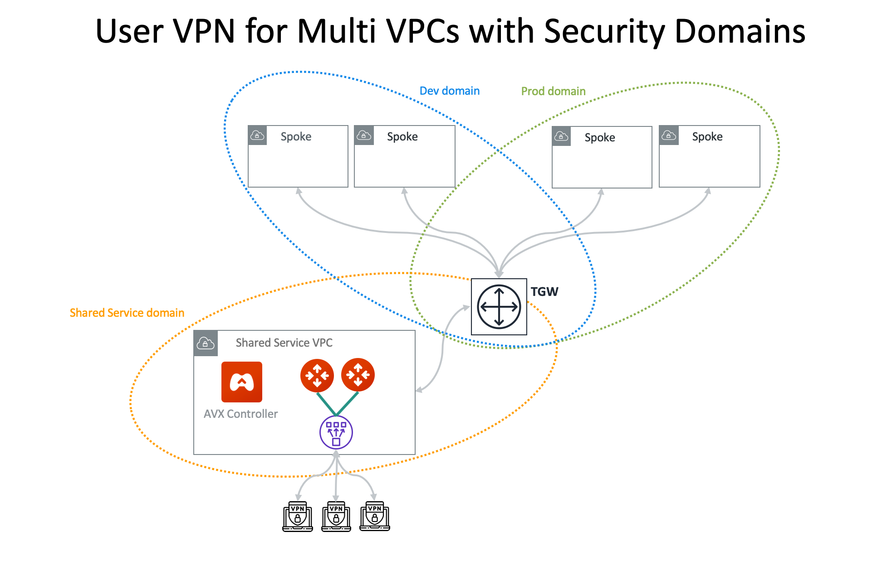
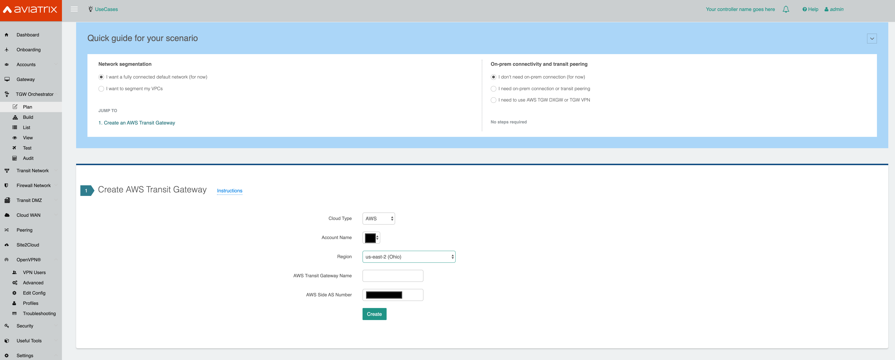
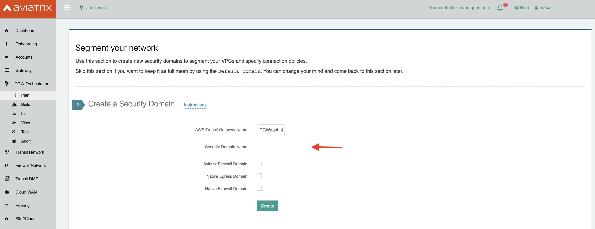
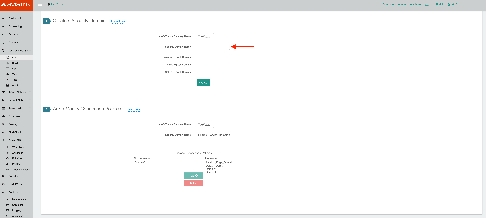
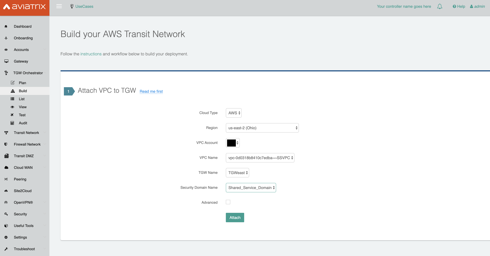
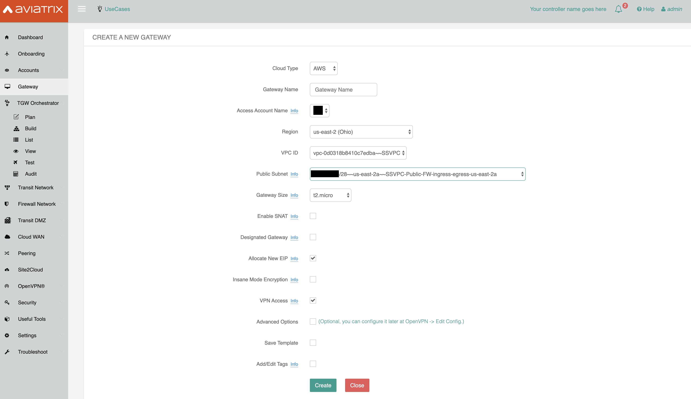
.. |split_tunnel_CIDR| image:: uservpn_TGW_media/split_tunnel_CIDR.png
   :width: 5.5in
   :height: 2.5in
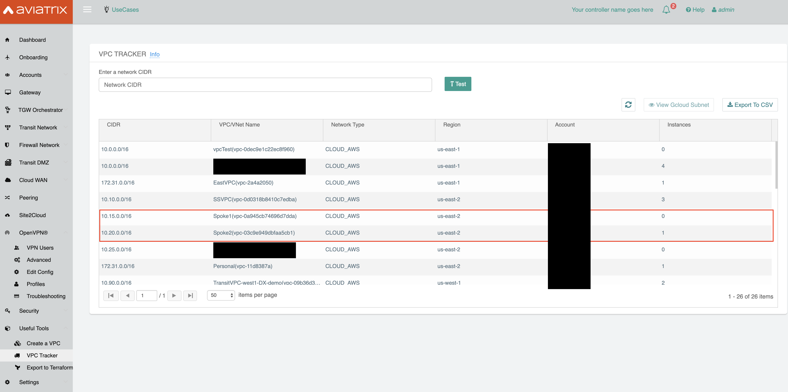
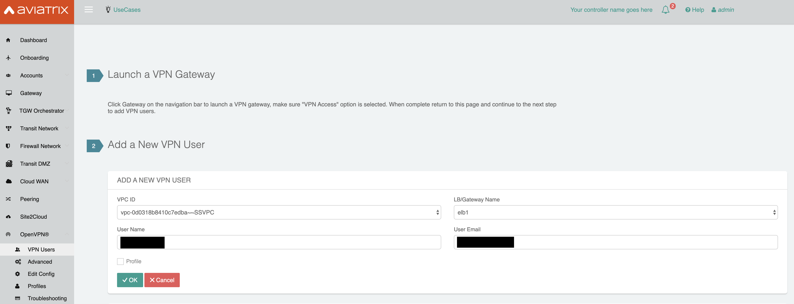
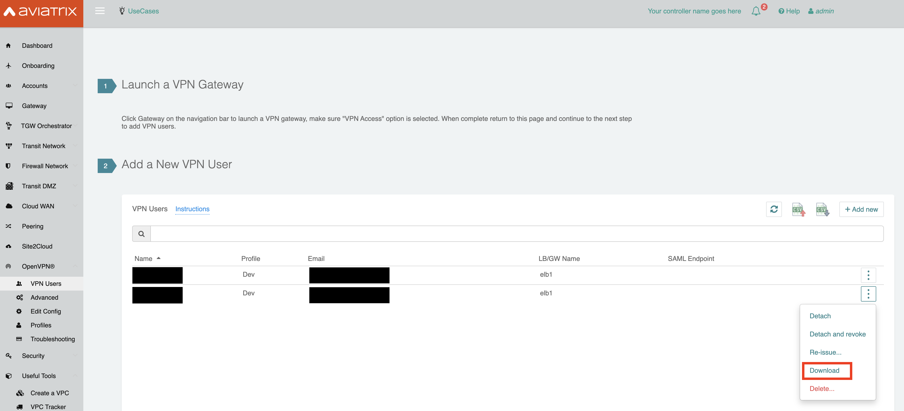
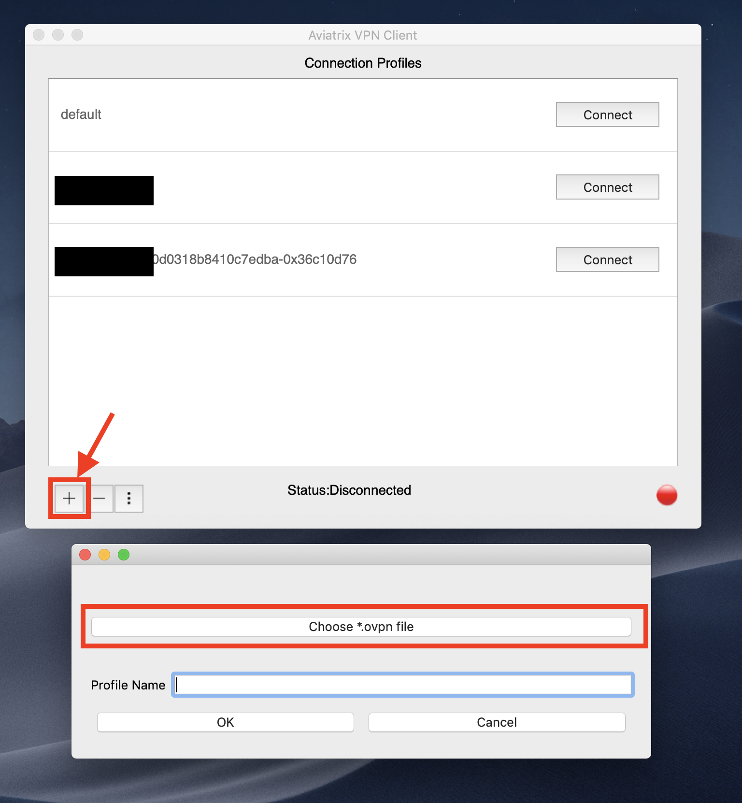
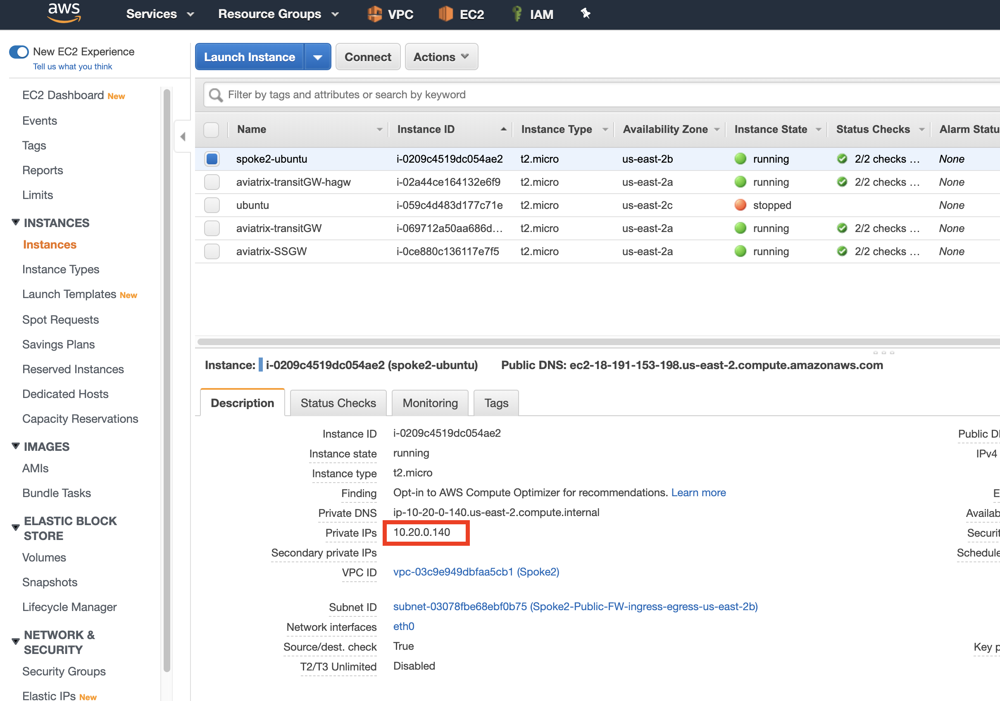
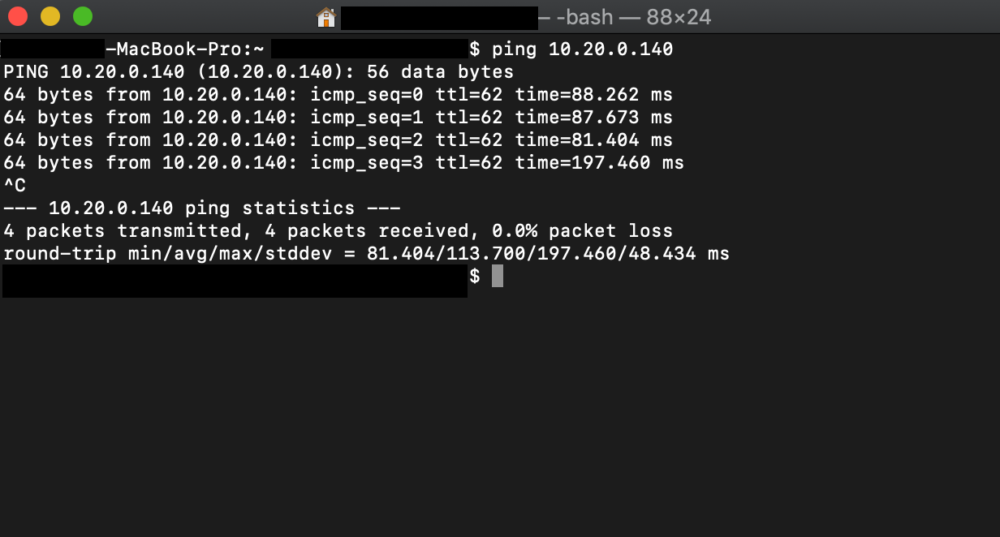

.. disqus::
