.. meta::
  :description: Cloud Networking Ref Design
  :keywords: cloud networking, aviatrix, Openvpn, SSL vpn, remote vpn, client vpn 

===================================
Configuring Aviatrix User SSL VPN
===================================

Aviatrix provides a cloud-native and feature-rich client `VPN <https://www.aviatrix.com/learning/glossary/vpn.php>`_ solution. The solution is based on OpenVPN® and is compatible with all OpenVPN® clients. In addition, Aviatrix provides its own `client that supports SAML authentication <UserSSL_VPN_Okta_SAML_Config.html>`_ directly from the client. 

|image0|

.. note::

   Only AWS is drawn in the diagram, but this feature applies equally to Azure and Google Cloud.

Additional Information
-------------------------------------
- `Aviatrix OpenVPN® features <./openvpn_features.html>`_ 
- `OpenVPN® FAQ <./openvpn_faq.html>`_
- `OpenVPN® design with multi VPC/VNets <./Cloud_Networking_Ref_Des.html>`_

Configuration Workflow
----------------------

.. important::

   This document assumes you have set up an Aviatrix Controller.  Please see `this guide <../StartUpGuides/aviatrix-cloud-controller-startup-guide.html>`__ for more details.

There are two steps to setting up User VPN connectivity:

#. `Create a VPN Gateway <#create-a-vpn-gateway>`__
#. `Add a user <#create-vpn-users>`__

You can also `watch a video <https://www.youtube.com/watch?v=bbZFa8kVUQI&t=1s>`_ to learn how to setup remote user VPN. The video is not up-to-date as the product graphics have changed, but the idea remains the same. 

Creating a VPN Gateway
^^^^^^^^^^^^^^^^^^^^

.. note::

   The description in the steps below provides critical fields to get you started. You can make changes to set up advanced features such as `MFA <https://docs.aviatrix.com/HowTos/gateway.html#mfa-authentication>`_ and profile based access later.  

1. Log in to the Aviatrix Controller.

      |AVTXSignIn|

2. Launch a gateway with VPN capability. 

* In the left sidebar, click **Gateway**.
* Click **+ New Gateway** at the top of the page.

      |imageSelectGateway|

      .. important::

         You need a subnet (a public subnet in AWS or GCP) in the VPC/VNet where the Gateway will be provisioned.  Be sure to provision a new one or identify the correct one prior to starting this step.

3. Select the **Cloud Type** and enter a **Gateway Name**.
4. Once the Account Name` is selected, select the appropriate **Region** and **VPC** or **VNet**.
5. After selecting the desired **VPC ID/VNet Name:Resource Group**, select the **Public Subnet** where the Gateway will be provisioned.
6. Select the **Gateway Size** (t2.micro is sufficient for most test use cases).

      |imageCreateGateway|

7. Select **VPN Access**. Leave the Advanced Options unselected.

      |imageSelectVPNAccess|

      .. note::

         Leave the Advanced Options unselected as you can configure them later.

      
8. At this stage, you can enable `NLB <http://docs.aviatrix.com/HowTos/gateway.html#enable-elb>`_  (NLB will be automatically created by Aviatrix.) You can specify the NLB's name or have it auto-generated by Aviatrix.
9. If you wish to create more of such VPN gateways (for example, behind NLBs for load balancing), click `Save Template`. 
10. Click **OK** to create the Gateway.

      .. note::

         Once you click **OK**, the Gateway will be provisioned and all the configuration will be applied.  This will take a minute or two.

VPN Users
^^^^^^^^^
Users can be added manually or authenticated with an existing LDAP server.

#. Log in to the Aviatrix Controller.
#. Select **OpenVPN®** on the left sidebar.
#. Select **VPN Users**.

   |imageOpenVPNUsers|

Creating VPN Users
###################

1. Click **+ Add New**.
      |vpnuser|
#. Select the **VPC ID** where this user should be attached.  The associated load balancer will appear in the **LB/Gateway Name**.
#. Enter the **User Name** and **User Email**. If DUO authentication is enabled, the User Name entered must match the user name of your DUO account. The User Email is optional.
#. Click **OK**.

   .. note::

      When a user is added to the database, an email with an .ovpn file or .onc (for Chromebooks) will be sent to the user with detailed instructions.

   |imageAddNewVPNUser|

Exporting VPN Users
###############################
1. Click the export icon. |imageExportVPNUsers|
2. Check the csv file aviatrix_vpn_users.csv in the Download folder.

   .. note::

      If there has been an aviatrix_vpn_users.csv in the Download folder already, the OS will rename the new file with aviatrix_vpn_users(1).csv automatically.

Importing VPN Users
###############################

1. Click the import icon |imageImportVPNUsers|
#. Select a csv file to import.

    .. note::

      If you are using a MacOS system, the Apple App "Numbers" can open and edit the csv file. It can export a new csv file from File > Export To > CSV.
      If you are using the Excel, you can export a new csv file from File > Save As.

#. Click **Open** to start the process.
#. Select the default  **VPC ID** and **LB/Gateway Name** in **Default VPN User Settings**.

    .. note::

      Any empty VPC ID field in a csv file will trigger a new popup window for selecting the default VPC ID.
      Any record in a csv file with an empty VPC ID will be filled with the values in Default VPN User Settings automatically.
      If all the VPC ID fields are filled in the the original csv file already, Default VPN User Settings will not appear.

    |imageImportVPNUsersDefaultVPCID|

#. Check the Import Results.

    |imageImportVPNUsersResults|

Downloading the VPN User Certificate
###############################

You can also download the VPN user certificate to your desktop, as shown 
below. Load this certificate configuration file to your OpenVPN® client on your desktop. You should
be able to connect then.

|New_User| 

Detach and revoke: will not only detach the user but revoke the user certificate as well.
attach: will re-attach detached users and also re-create the user certificate if the user certificate is revoked.

Conclusion
---------------------

You now have a working Aviatrix VPN Gateway.  Users can connect and gain access to their cloud resources.

Detailed audit logs are maintained and available in various logging platforms.

.. note::

   Audit reports are best viewed in the `Aviatrix Splunk Application <AviatrixLogging.html#splunk-app-for-aviatrix>`__.

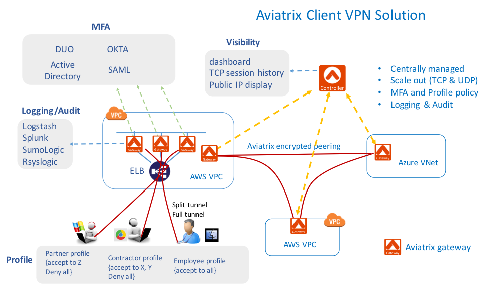

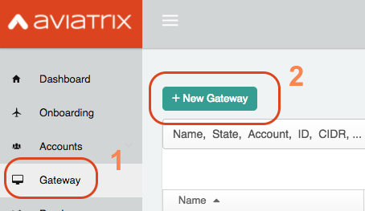

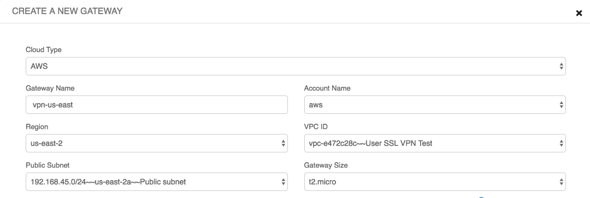

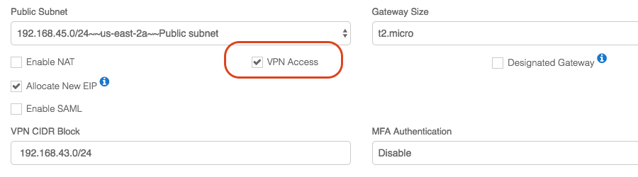

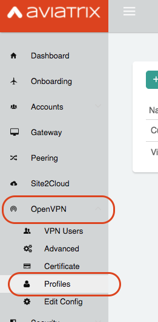

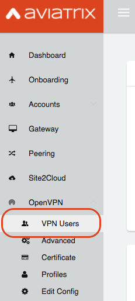

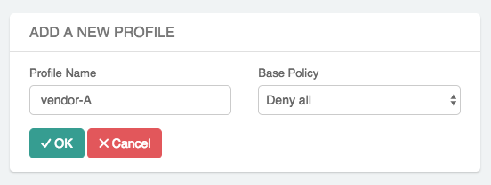

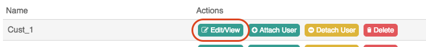

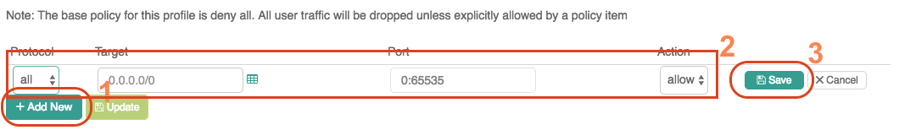

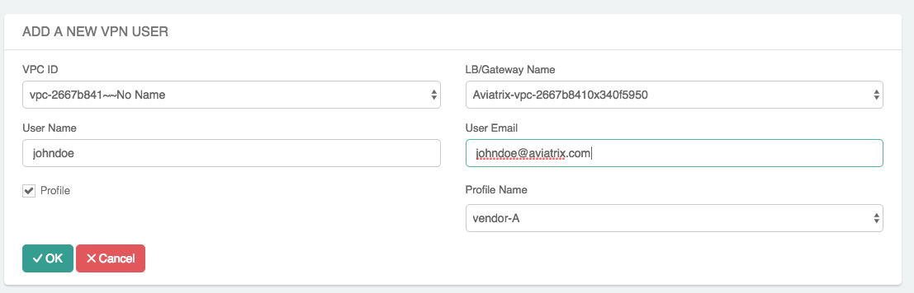

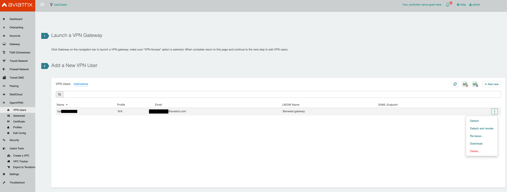

.. |imageImportVPNUsersDefaultVPCID| image:: uservpn_media/import_vpn_users_default_vpn_settings.png
   :scale: 30%

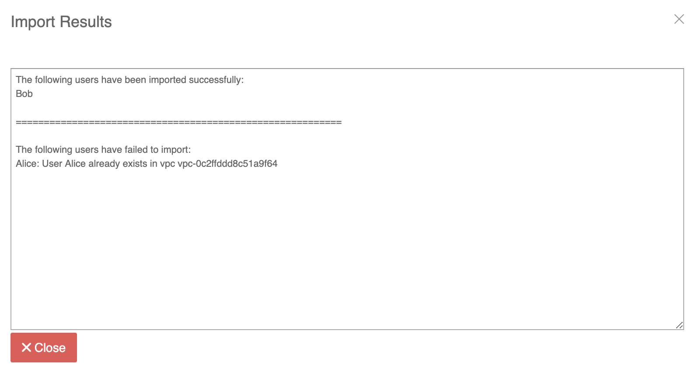

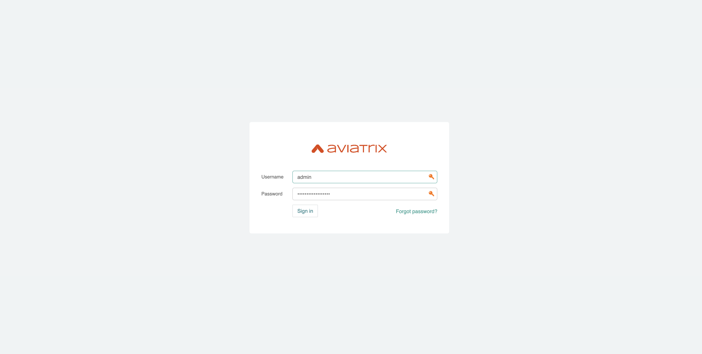

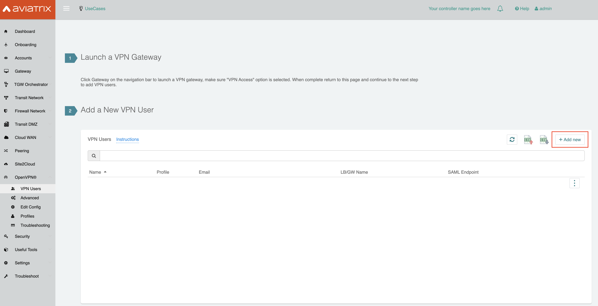

OpenVPN is a registered trademark of OpenVPN Inc.

.. disqus::
 