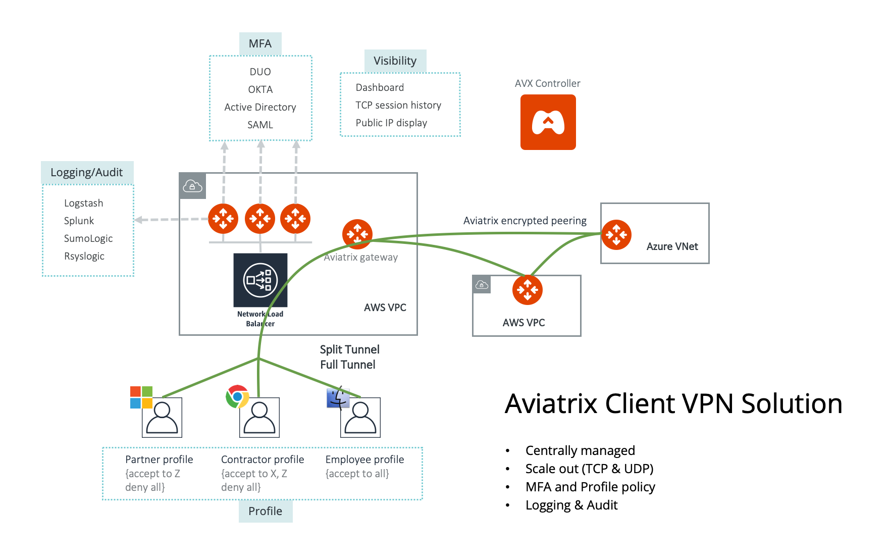

.. meta::
  :description: Cloud Networking Ref Design
  :keywords: cloud networking, aviatrix, Openvpn, SSL vpn, remote vpn, client vpn 

===================================
Configuring Aviatrix User SSL VPN
===================================

Aviatrix provides a cloud native and feature rich client VPN solution. The solution is based on OpenVPN® and is compatible with all OpenVPN® clients.  In addition, Aviatrix provides its own `client that supports SAML authentication <UserSSL_VPN_Okta_SAML_Config.html>`__ directly from the client. 

|image0|

.. note::

   Only AWS is drawn in the diagram, but this feature applies equally to Azure and Google Cloud.

Additional Information
----------------------
- `Aviatrix OpenVPN® features <./openvpn_features.html>`_ 
- `OpenVPN® FAQ <./openvpn_faq.html>`_
- `OpenVPN® design with multi VPCs <./Cloud_Networking_Ref_Des.html>`_

Configuration Workflow
----------------------

.. important::

   This document assumes you have set up an Aviatrix Controller.  Please see `this guide <../StartUpGuides/aviatrix-cloud-controller-startup-guide.html>`__ for more details.

There are 2 main steps to setting up User VPN connectivity:

#. `Create a VPN Gateway <#create-a-vpn-gateway>`__
#. `(Optional) Create User Profile(s) <#add-vpn-profiles>`__ and `add policies <#attach-policies-to-a-profile>`__ to those profiles
#. `Add a user and (optionally) associate users with profiles <#create-vpn-users>`__

You can also `watch a video <https://www.youtube.com/watch?v=bbZFa8kVUQI&t=1s>`_ to learn how to setup remote user VPN. 

Create a VPN Gateway
^^^^^^^^^^^^^^^^^^^^

.. note::

   The description in the steps below provides critical fields you need to select; it may not include all fields.

#. Login to the Aviatrix Controller
#. Launch a gateway with VPN capability

   #. In the left navigation bar, click `Gateway`

   #. Click on the `+ New Gateway` button at the top of the page.

      |imageSelectGateway|

      .. important::

         You will need a public subnet in the VPC where the Gateway will be provisioned.  Be sure to provision a new one or identify the correct one prior to starting this step.

   #. Select the `Cloud Type` and enter a `Gateway Name`.

   #. Once the `Account Name` is selected, select the appropriate `Region` and `VPC`.

   #. After selecting the desired `VPC ID`, select the `Public Subnet` where the Gateway will be provisioned.

   #. Select the `Gateway Size` (t2.micro is sufficient for most test use cases).

      |imageCreateGateway|

   #. Select `VPN Access`. More fields will appear.

      |imageSelectVPNAccess|

      .. note::

         If you just want a basic user VPN solution without multi-factor authentication, you can skip the rest of the VPN related fields.

   #. Use the default `VPN CIDR Block <http://docs.aviatrix.com/HowTos/gateway.html#vpn-cidr-block>`_ . The VPN CIDR Block is the virtual IP address pool that VPN user will be assigned. 

   #. If you use Duo or Okta for multi factor authentication, select one of them at Two-step Authentication, more fields will appear.

      .. note::
         For details on configuring Okta authentication, see `this link <HowTo_Setup_Okta_for_Aviatrix.html>`__.

      .. note::
         For details on configuring Duo authentication, see `this link <duo_auth.html>`__.

   #. If you select `Split Tunnel Mode <http://docs.aviatrix.com/HowTos/gateway.html#split-tunnel-mode>`_ , only the VPC CIDR traffic will go through the tunnel. If you specify "`Additional CIDRs <http://docs.aviatrix.com/HowTos/gateway.html#additional-cidrs>`_", then these and the VPC CIDR will go through the vpn tunnel. You can modify Split tunnel settings later when more VPCs are created. (Go to OpenVPN® -> Edit Config -> MODIFY SPLIT TUNNEL to make changes. Make sure you specify all the CIDRs, separated by comma.) You can leave Nameservers and Search Domains blank if you don't have one.  
      
      .. note::

         If you plan to support Chromebook, you must configure full tunnel mode as Chromebook only supports full tunnel. 

   #. By default, `ELB <http://docs.aviatrix.com/HowTos/gateway.html#enable-elb>`_  will be enabled, meaning you can create more vpn gateways that are load balanced by the ELB. (ELB will be automatically created by Aviatrix.)

      .. important::

         If you disable ELB, your vpn traffic runs on UDP port 1194. When ELB is enabled, your vpn traffic runs on TCP 443. TCP 443 makes it easier to go through corporate firewall.  

   #.  Click `LDAP <http://docs.aviatrix.com/HowTos/gateway.html#enable-ldap>`_ if VPN user should be authenticated by AD or LDAP server. After you fill up the LDAP fields, make sure you run `Test LDAP Configuration` to test your configuration is valid. 

   #. If you wish to create more of such VPN gateways (for example, behind ELBs for load balancing), click `Save Template`, which will save your LDAP and multi-factor authentication credentials. 

   #. Click `OK` to create the Gateway.

      .. note::

         Once you click `OK`, the Gateway will be provisioned and all the configuration will be applied.  This will take a minute or two.

(Optional) Add VPN Profiles
^^^^^^^^^^^^^^^^^^^^^^^^^^^^^^^^

A `VPN user profile <http://docs.aviatrix.com/HowTos/openvpn_faq.html#what-is-user-profile-based-security-policy>`_ is defined by a list of access policies with allow or deny rules.  When a VPN user is connected to a VPN gateway, the user's profile is pushed dynamically to the VPN gateway and the user can only access resources defined in the profile.  When a VPN user disconnects from the gateway, the policies are deleted.  

.. important::

   If a VPN user has no profile association, the user has full access to all resources.

#. Login to the Aviatrix Controller
#. Expand OpenVPN® on the left navigation bar
#. Select `Profiles`

   |imageOpenVPNProfiles|

Create a New Profile
####################
#. Click `+ New Profile`
#. Enter a `Profile Name`
#. Select the appropriate `Base Policy`
#. Click `OK`

   |imageAddNewProfile|

Attach Policies to a Profile
############################
Once you have created one or more profiles, you will need to attach policies to the profile(s).  There can be any number of policies that apply to each profile.

#. Click the `Edit/View` button next to the profile name

   |imageEditViewProfile|

#. In the table, click `+ Add New` to create a new policy.
#. Select the `Protocol`, `Target` CIDR block, `Port`, and `Action`
#. Click `Save`

   |imageAddProfilePolicy|

VPN Users
^^^^^^^^^
Users can be added manually or sync'd from an existing LDAP server.

#. Login to the Aviatrix Controller
#. Expand OpenVPN® on the left navigation bar
#. Select `VPN Users`

   |imageOpenVPNUsers|

Create VPN Users
################
If creating users, manually follow the steps below.

#. Click `+ Add New`
#. Select the `VPC ID` where this user should be attached.  The associated load balancer will appear in the `LB/Gateweay Name`
#. Enter the `User Name` and `User Email`
#. (Optional) If associating this user with an existing profile, check the checkmark next to `Profile` and select the appropriate `Profile Name`.
#. Click `OK`

   .. note::

      When a user is added to the database, an email with .ovpn file or .onc (for Chromebooks) will be sent to the user with detailed instructions.

   |imageAddNewVPNUser|

Conclusion
----------
You now have a working Aviatrix VPN Gateway.  Users can connect and gain access to their cloud resources.

Detailed audit logs are maintained and available in various logging platforms.

.. note::

   Audit reports are best viewed in `Aviatrix Splunk Application <AviatrixLogging.html#splunk-app-for-aviatrix>`__

.. |imageSelectGateway| image:: uservpn_media/select_gateway.png
   :scale: 50%

.. |imageCreateGateway| image:: uservpn_media/create_new_gateway.png
   :scale: 50%

.. |imageSelectVPNAccess| image:: uservpn_media/select_vpn_access.png
   :scale: 50%

.. |imageOpenVPNProfiles| image:: uservpn_media/openvpn_profiles.png
   :scale: 50%

.. |imageOpenVPNUsers| image:: uservpn_media/openvpn_users.png
   :scale: 50%

.. |imageAddNewProfile| image:: uservpn_media/add_new_profile.png
   :scale: 50%

.. |imageEditViewProfile| image:: uservpn_media/edit_view_profile.png
   :scale: 50%

.. |imageAddProfilePolicy| image:: uservpn_media/add_profile_policy.png
   :scale: 50%

.. |imageAddNewVPNUser| image:: uservpn_media/add_new_vpn_user.png
   :scale: 50%

OpenVPN is a registered trademark of OpenVPN Inc.

.. disqus::
