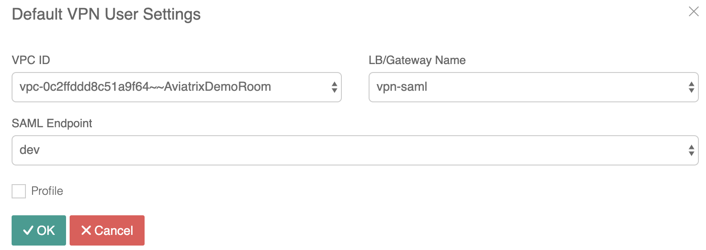

.. meta::
  :description: Cloud Networking Ref Design
  :keywords: cloud networking, aviatrix, Openvpn, SSL vpn, remote vpn, client vpn 

===================================
Configuring Aviatrix User SSL VPN
===================================

Aviatrix provides a cloud native and feature rich client `VPN <https://www.aviatrix.com/learning/glossary/vpn.php>`_ solution. The solution is based on OpenVPN® and is compatible with all OpenVPN® clients.  In addition, Aviatrix provides its own `client that supports SAML authentication <UserSSL_VPN_Okta_SAML_Config.html>`_ directly from the client. 

|image0|

.. note::

   Only AWS is drawn in the diagram, but this feature applies equally to Azure and Google Cloud.

Additional Information
----------------------
- `Aviatrix OpenVPN® features <./openvpn_features.html>`_ 
- `OpenVPN® FAQ <./openvpn_faq.html>`_
- `OpenVPN® design with multi VPCs <./Cloud_Networking_Ref_Des.html>`_

Configuration Workflow
----------------------

.. important::

   This document assumes you have set up an Aviatrix Controller.  Please see `this guide <../StartUpGuides/aviatrix-cloud-controller-startup-guide.html>`__ for more details.

There are 2 steps to setting up User VPN connectivity:

#. `Create a VPN Gateway <#create-a-vpn-gateway>`__
#. `Add a user <#create-vpn-users>`__

You can also `watch a video <https://www.youtube.com/watch?v=bbZFa8kVUQI&t=1s>`_ to learn how to setup remote user VPN. The video is not up to date as the product graphics have changed, but the idea remains the same. 

Create a VPN Gateway
^^^^^^^^^^^^^^^^^^^^

.. note::

   The description in the steps below provides critical fields to get you started. You can make changes to set up advanced features such as `MFA <https://docs.aviatrix.com/HowTos/gateway.html#mfa-authentication>`_ and profile based access later.  

#. Log in to the Aviatrix Controller
#. Launch a gateway with VPN capability

   #. In the left navigation bar, click `Gateway`

   #. Click on the `+ New Gateway` button at the top of the page.

      |imageSelectGateway|

      .. important::

         You will need a public subnet in the VPC where the Gateway will be provisioned.  Be sure to provision a new one or identify the correct one prior to starting this step.

   #. Select the `Cloud Type` and enter a `Gateway Name`.

   #. Once the `Account Name` is selected, select the appropriate `Region` and `VPC`.

   #. After selecting the desired `VPC ID`, select the `Public Subnet` where the Gateway will be provisioned.

   #. Select the `Gateway Size` (t2.micro is sufficient for most test use cases).

      |imageCreateGateway|

   #. Select `VPN Access`. Leave the Advanced Options unselected.

      |imageSelectVPNAccess|

      .. note::

         Leave the Advanced Options unselected as you can configure it later.

      
   #. At this stage, you can enable `NLB <http://docs.aviatrix.com/HowTos/gateway.html#enable-elb>`_  (NLB will be automatically created by Aviatrix.) You can specify the NLB's name or have it be auto-generated by Aviatrix.

   #. If you wish to create more of such VPN gateways (for example, behind NLBs for load balancing), click `Save Template`. 

   #. Click `OK` to create the Gateway.

      .. note::

         Once you click `OK`, the Gateway will be provisioned and all the configuration will be applied.  This will take a minute or two.

VPN Users
^^^^^^^^^
Users can be added manually or authenticated with an existing LDAP server.

#. Log in to the Aviatrix Controller
#. Expand OpenVPN® on the left navigation bar
#. Select `VPN Users`

   |imageOpenVPNUsers|

Create VPN Users
################

1. Click `+ Add New`
#. Select the `VPC ID` where this user should be attached.  The associated load balancer will appear in the `LB/Gateway Name`
#. Enter the `User Name` and `User Email`. If DUO authentication is enabled, the User Name entered must match the user name of your DUO account. The User Email is optional.
#. Click `OK`

   .. note::

      When a user is added to the database, an email with an .ovpn file or .onc (for Chromebooks) will be sent to the user with detailed instructions.

   |imageAddNewVPNUser|

Export VPN Users
###############################
1. Click the export icon. |imageExportVPNUsers|
2. Check the csv file aviatrix_vpn_users.csv in the Download path.

   .. note::

      If there has been a aviatrix_vpn_users.csv in the Download path already, the OS will rename it to aviatrix_vpn_users(1).csv automatically.

Import VPN Users
###############################

1. Click the import icon |imageImportVPNUsers|
#. Select a csv file to import.

    .. note::

      If you are using a MacOS system, the Apple `Number` can open and edit the csv file. It can export a new csv file from "File"->"Export To"->"CSV".
      If you are using the Excel, it can export a new csv file from "File"->"Save As".

#. Click the Open button to start the process.
#. Select the default  `VPC ID` and `LB/Gateway Name` from the `Default VPN User Settings` dialog.

    .. note::

      Any empty `VPC ID` field in a csv file will cause a new dialog to select the default `VPC ID`.
      If all of the `VPC ID` fields are filled in the the csv file, the `Default VPN User Settings` will not pop up.
      Any record in a csv file with an empty `VPC ID` will be filled with the default settings.

    |imageImportVPNUsersDefaultVPCID|

#. Check the Import Results

    |imageImportVPNUsersResults|

Download VPN User Certificate
###############################

You can also download the VPN user certificate to your desktop, as shown 
below. Load this certificate configuration file to your OpenVPN® client on your desktop. You should
be able to connect then.

|download_vpnfile| 

Conclusion
----------
You now have a working Aviatrix VPN Gateway.  Users can connect and gain access to their cloud resources.

Detailed audit logs are maintained and available in various logging platforms.

.. note::

   Audit reports are best viewed in the `Aviatrix Splunk Application <AviatrixLogging.html#splunk-app-for-aviatrix>`__

.. |image0| image:: uservpn_media/AviatrixCloudVPN.png
   :width: 5.55625in
   :height: 3.26548in

.. |imageSelectGateway| image:: uservpn_media/select_gateway.png
   :scale: 50%

.. |imageCreateGateway| image:: uservpn_media/create_new_gateway.png
   :scale: 50%

.. |imageSelectVPNAccess| image:: uservpn_media/select_vpn_access.png

.. |imageOpenVPNProfiles| image:: uservpn_media/openvpn_profiles.png
   :scale: 50%

.. |imageOpenVPNUsers| image:: uservpn_media/openvpn_users.png

.. |imageAddNewProfile| image:: uservpn_media/add_new_profile.png
   :scale: 50%

.. |imageEditViewProfile| image:: uservpn_media/edit_view_profile.png
   :scale: 50%

.. |imageAddProfilePolicy| image:: uservpn_media/add_profile_policy.png
   :scale: 50%

.. |imageAddNewVPNUser| image:: uservpn_media/add_new_vpn_user.png
   :scale: 50%

.. |download_vpnfile| image:: uservpn_media/download_vpnfile.png
   :scale: 30%

OpenVPN is a registered trademark of OpenVPN Inc.

.. disqus::
