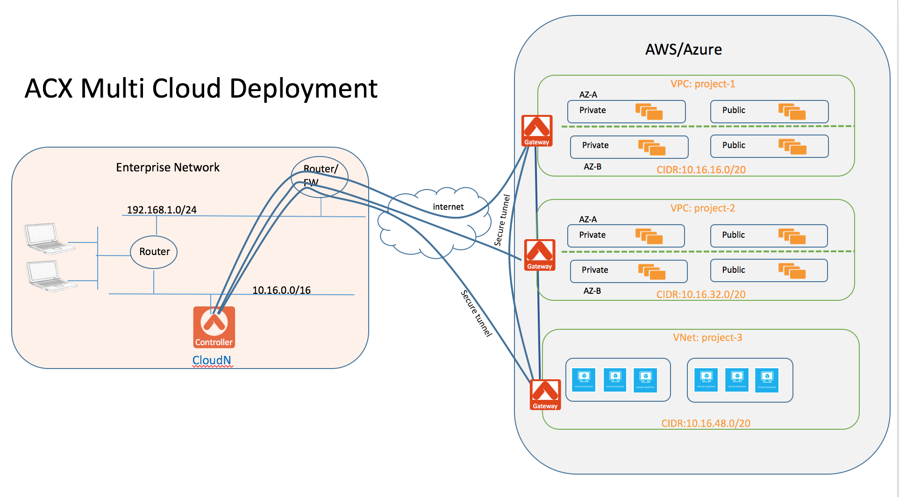



##########################################################
Extending Your vmware Workloads to Public Cloud
##########################################################

1  Overview
=================

Aviatrix Systems provides a next-generation cloud networking solution
built from the ground up for the public cloud. Aviatrix simplifies the
way you enable `site to cloud <https://www.aviatrix.com/learning/cloud-security-operations/site-to-cloud-vpn/>`_, user to cloud and cloud to cloud secure
connectivity and access. The solution requires no new hardware and
deploys in minutes.

Aviatrix CloudN is a virtual appliance deployed in datacenter.
Aviatrix Cloud Interconnect (ACX), also known as Datacenter Extension is a unique technology on CloudN. It manages your public cloud address space and allows rapid
scaling of AWS Virtual Private Cloud (VPC) by removing the pain point of
building secure connections to the VPCs.

|image1|

2  ACX Key Benefits
=============================================

    **Manage Cloud Address Space** No more spreadsheet to manage your cloud address space. 

    **Easy to Deploy** Deployed without touching existing network
    infrastructure.

    **Fast to Provision** Provision a VPC with secure tunnel to
    datacenter in minutes.

    **Simple to Use** 1-click operation to create and delete a VPC with
    secure tunnels.

    **Rapid Scaling** Creates multiple VPCs in any region with secure
    connectivity.

    **Full Mesh Connectivity** inter region VPCs can be securely peered
    in minutes.

    **IT Supported Self Service** Workflow allows multiple users to
    create VPCs.

    **Billing Visibility** Supports multiple AWS accounts for different
    departments, DevOps and projects

    **Remote Access Capability**. Built in VPN server allows remote
    workers to access VPC directly. Ideal for partners and remote
    workers.

3  How it Works
===============

3.1  Mix Layer 2 and Layer 3 Technologies
-----------------------------------------

CloudN uses mixed Layer 2 and Layer 3 technologies whereas the CloudN
virtual appliance behaves as a Layer 2 bridge and the Gateway (launched by
CloudN at VPC creation time) behaves as a Layer 3 router. The design of
CloudN as a Layer 2 bridge makes it possible to build an overlay IPSec
tunnel to AWS VPC without involving edge routers in the network. The
design of Gateways as a Layer 3 router makes it possible for the VPC to
fully utilize all AWS VPC underlying infrastructures and services
without requiring any software agent to reside in any of the instances.

Instances within the VPC communicate with each other directly and
transparently without involvement of a Gateway. From the user’s
perspective, what CloudN creates is a standard VPC.

CloudN views each VPC as the smallest autonomous environment. It allows
you to create security policies to deny any subnet or hosts on premise
to access any VPC. For example, you may want to block developers from
accessing the production VPC. By default, inter-VPC communication is
blocked. By using VPC/VNet peering capability, you can establish direct
secure tunnels among VPCs in the same region or across different regions.

Enterprise users can access instances seamlessly in all private and
public subnets over the secure tunnel using instance private addresses.
All instances on private subnets can reach back to enterprise.
Optionally packets from instances on private subnets can reach Internet
directly without being first sent back to the enterprise.

3.2  Dividing Subnets
---------------------

CloudN works by dividing the subnet where cloudN is deployed into sub
segments (or smaller subnets). The VPC CIDRs created by cloudN are one
of the sub segments. The mechanism is illustrated below. VPC in the
below diagram could be replaced with a VNet.

|image2|

Where a local subnet 10.16.0.0/16 has the default gateway 10.16.0.1, the
subnet is divided into 4 sub segments. The default gateway and CloudN IP
address fall into one segment. The rest of each segment is mapped to a
VPC CIDR, in this case, the VPC CIDRs are 10.16.32.0/19, 10.16.64.0/19
and 10.16.96.0/19. If this subnet 10.16.0.0/16 is reachable from other
networks in the enterprise, then the instances inside each VPC take
private IP address as if they are on the local subnet 10.16.0.0/16. For
users in the enterprise, it is as if they are communicating with hosts
on the local network.

4 Pre Configuration Checklist
=============================

4.1  AWS EC2 Account
--------------------

You need to have an AWS account to use most of the commands on CloudN.
Note that CloudN supports multiple cloud accounts with each one
associated with a different AWS IAM account, but there needs to be at
least one to start with.

4.2 Plan Cloud Address Space
----------------------------

CloudN manages your cloud address space. Carve out an unused consecutive network address space in your datacenter. The CIDR block of this address can be determined by how many VPCs you will need and how big the address space you can allocate. For example, a CIDR block with /16 address range can create as many as 254 VPCs.

Once you have created all the VPCs from the allocated address space, you can always allocate a new address space and launch a new CloudN virtual appliance.

4.3  Deploy the Aviatrix CloudN Virtual Appliance
-------------------------------------------------

Reference `the startup
guide <http://docs.aviatrix.com/en/latest/StartUpGuides/CloudN-Startup-Guide.html>`__
to deploy the virtual appliance.

Check and make sure you can access the Aviatrix Controller dashboard and
login with an admin account. The default URL for the Aviatrix
Controller is:

https://<Private IP address of Aviatrix Controller>

5 Configuration Steps
=====================

5.1    Onboarding and create a cloud account
--------------------------------------------
Upon logging in to the controller for the first time, follow the onboarding process to create a cloud account that corresponds to an AWS IAM account. Aviatrix CloudN uses the account's IAM credential to execute AWS APIs to create a VPC and necessary resources.

5.2    Create a VPC and build an encrypted tunnel
-------------------------------------------------
After going through onboarding steps, click ACX. Provide a name for the VPC you are about to create, select an AWS region, and click Launch. In a few minutes of time, a VPC, public subnet and private subnet in each AZ of the selected region, IGW and routing tables will be created; an Aviatrix Gateway will be launched and an encrypted tunnel will be created.

You then can launch instances in the VPC and access the instances by their private IP addresses.

Repeat the above steps for more VPC with encrypted tunnel creations.

.. |image0| image:: media/image1.png
   :width: 3.5in
   :height: 0.5in

.. |image2| image:: media/image3.png
   :width: 6.5in
   :height: 2.5in
.. |image3| image:: media/image4.png
   :width: 7in
   :height: 4in
   :scale: 150%

.. add in the disqus tag

.. disqus::
