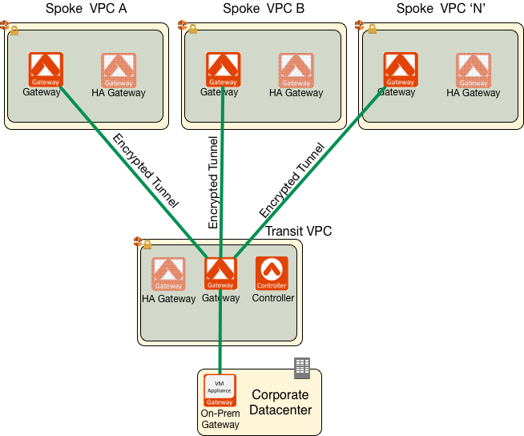
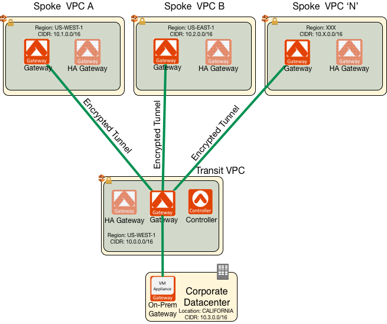
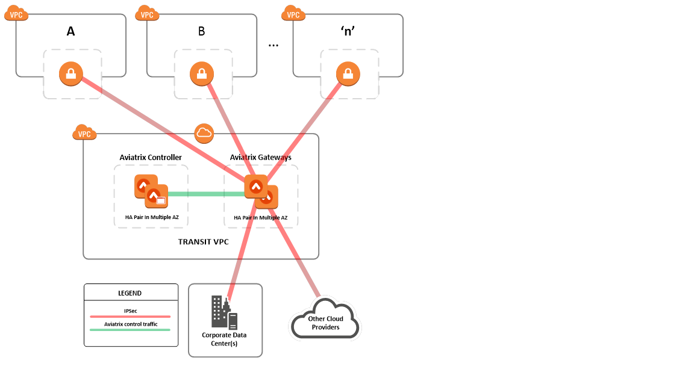



###################################################
AWS Global Transit Network
###################################################

AWS Reference Deployment Guide
==============================

This document is published by AWS Answers for `AWS Global Transit Network <https://aws.amazon.com/answers/networking/aws-global-transit-network/>`_ as Partner Offering.

Aviatrix is a next generation cloud networking solution built from the
ground up for the public cloud. For transit VPC design, Aviatrix provides one console for building, managing, monitoring and troubleshooting all aspects of your network connectivity. The console (controller) gives users the ability to implement Transit VPC design with a point-and-click (no CLI), `API <http://docs.aviatrix.com/HowTos/Aviatrix_Controller_API.html>`_ and `Terraform. <http://docs.aviatrix.com/HowTos/Setup_Transit_Network_Terraform.html>`_

The configuration guide can be found `at this link. <http://docs.aviatrix.com/HowTos/transitvpc_workflow.html>`_

Comparing Aviatrix Global Transit Network Solution with CSR1000v Solution
==============================================================================

The Aviatrix Solution has the following benefits compared to CSR1000v:

**Simplicity** No Cisco CCIE, BGP, VRF and IPSEC domain expertise is required. The Aviatrix central controller builds and manages your network with software defined routing and point and click solutions deploying in minutes.

**No Double Egress Charge** Aviatrix supports direct Spoke VPC to Spoke VPC connectivity without going through a transit VPC, which incurs twice the egress network charges.

**Isolation By Design** An AWS Transit VPC solution with CSR1000v automatically builds a full mesh network among all Spoke VPCs, which breaks enterprise security posture as different Spoke VPCs can be owned by different business units. With the Aviatrix solution no connectivity is established until you specify.

**Highly Available** Built-in gateway redundancy supports hot standby
and failover in seconds.

**Scalable**  There are no limits on the number of spoke VPCs can be connected to on-prem via hub VPC. Aviatrix Designated Gateway summarizes all routes. Gateways can scale-up, scale-down or scale-out with a few clicks.

**Visibility** A central dashboard monitors, displays and alerts link
status and link latency.

**Additional Benefits** Stateful firewall at the gateway to enforce
security policies. OpenVPN® based user access allows end to end cloud
network solution. For more details, check out docs.aviatrix.com.

OpenVPN is a registered trademark of OpenVPN Inc.

.. |image0| image:: media/image1.png
   :width: 3.5in
   :height: 0.5in

.. add in the disqus tag

.. disqus::
