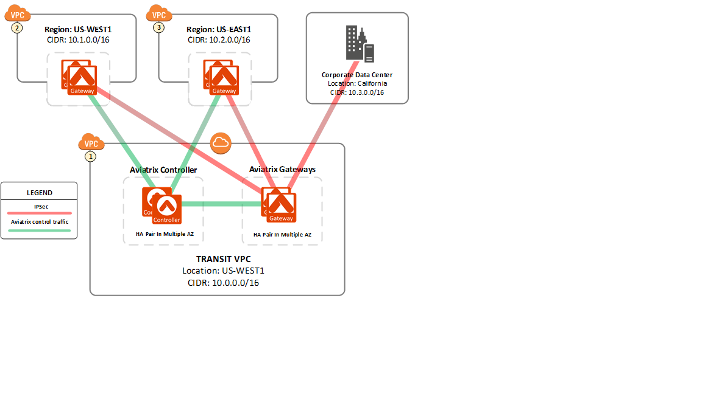



####################################################################
How to Build a Zero Trust Cloud Network Architecture with Aviatrix 
####################################################################

What is Zero Trust network architecture?
========================================

Zero Trust architecture came from the realization that perimeter security solutions such as edge firewalls are not
sufficient to prevent data breaches. Lateral movement inside a network to scan and obtain target data
has been the approach in the recent serious attacks. 
The idea of Zero Trust is to build walls inside the datacenter by network segmentation to 
prevent lateral movement and always authenticate and authorize users for all data access.  

How to build a Zero Trust cloud network 
======================================================

1. Classify data by network segmentation 
------------------------------------------

 - Separating production data from dev and test is the first step. Giving them separate cloud accounts is the best practice to ensure isolation. 

 - Different business groups should have separate cloud accounts. 

 - The more fine grained accounts, the more micro segmentation goal is achieved.

 - There should be zero connections among these networks by default. 

In public clouds such as AWS, using the above principles to build your cloud network results in isolated islands of VPCs. If one VPC is breached,
it is impossible to gain access to other VPCs, thus significantly reducing attack surface. 

`Aviatrix is a multi account platform <http://docs.aviatrix.com/StartUpGuides/aviatrix-cloud-controller-startup-guide.html>`_ that enables you to manage all cloud accounts from a single pane of glass. 

2. Policy driven connectivity with stateful firewall rules 
------------------------------------------------------------

 - The connectivity between VPCs and on-prem networks should be policy driven. A network solution such as the AWS Global Transit Network with CSR is a polar opposite to Zero Trust architecture point of view as all VPCs and on-prem are built into a full mesh network. In contrast,  
 
 - `AWS Global Transit Network with Aviatrix <http://docs.aviatrix.com/Solutions/aviatrix_aws_transitvpc.html>`_ meets Zero Trust architecture requirements where secure connection is established by organization policy. 

 - In addition to policy driven network connections, there must be firewall rules that govern data flow and reduce the connection scope. For example, you should consider placing application and database in separate VPCs and setting up a stateful firewall rule to only allow traffic initiated from application to access the database, not the other way around. `Aviatrix gateway stateful firewall <http://docs.aviatrix.com/HowTos/gateway.html>`_ enforces and logs all network events. 

 - Within a VPC, you can use AWS native security groups associated with instances to enforce policies for communications.

3. User access with authentication and authorization
------------------------------------------------------

- User access to cloud resources must be first authenticated. Certificate-only based authentication is a weak solution as a certificate can be stolen. Another insecure access method is Jump Host or Bastion stations. Multi factor authentication such as integrating with LDAP/DUO/OKTA and client SAML "Single Sign On" significantly improves authentication strengths. However, authentication alone is not sufficient, 

- A User's access cloud resources must be authorized. The finer grained control you apply, the less lateral movement a user can make even if access to the network is attained. With Zero Trust, you should only grant access to the required resources. 

- User access activities must be fully audited. Every user initiated TCP session in the cloud network must be logged for audit and inspection. 

The `Aviatrix Enterprise OpenVPN® Solution <http://docs.aviatrix.com/HowTos/openvpn_features.html>`_ is the strongest secure client solution in the marketplace built for the public cloud. 

4. Summary
------------

Zero Trust architecture is "Never trust, always verify", a critical component to enterprise cloud adoption success. Aviatrix provides a rich set of capabilities that enables you to build a Zero Trust network for the public cloud. 

OpenVPN is a registered trademark of OpenVPN Inc.

.. |image6| image:: media/image6.png
   :width: 7in
   :height: 4in
   :scale: 150%

.. add in the disqus tag

.. disqus::
