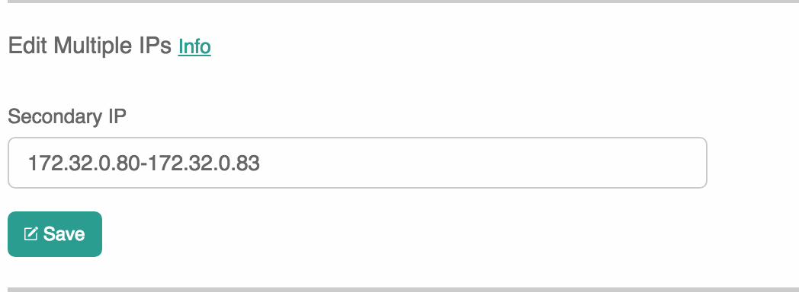
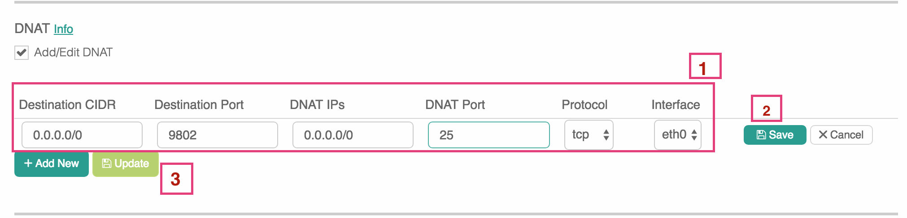

.. meta::
  :description: How to setup egress NAT to a pool of IP addresses
  :keywords: Egress Control, AWS NAT Gateway,  AWS Global Transit Network, Encrypted Peering, Transitive Peering, AWS VPC Peering, VPN

=================================================================
Egress NAT to a Pool of IP Addresses
=================================================================

This document describes the configuration steps for a specific scenario. The scenario is 
described as follows. 

 - When a packet enters the gateway, the packet's TCP destination port needs to be changed to a different port number. (Destination port translation.)
 - Based on the original destination port, the packet's source address needs to be changed to a specific source address. (Source address translation.)

Follow the steps below to setup for the scenario.

Step 1. Mark and Map Destination Port
-----------------------------------------

This action instructs the gateway to translate the destination port and also mark the associated TCP session.

Go to Gateway page, click on the gateway you wish to configure. Click Edit.

Scroll down to "Destination NAT", click Add/Edit DNAT

 1. Click Add/Edit DNAT
 #. Click Add New
 #. Enter fields for Destination port, protocol, Mark (a unique number for the purpose of tracking the TCP session identified by the Destination port) and DNAT port.
 #. Click Save
 #. Repeat step 1 for multiple entries. 
 #. Click Update to commit. 

|dnat-port-mapping|

Step 2. Add Multiple IP addresses
-------------------------------------

This action creates secondary IP addresses on the selected gateway instance. Note these IP addresses must be in one consecutive list. This secondary IP address should not include the primary IP address of the gateway. 

Go to Gateway page, click on the gateway you wish to configure. Click Edit. 

Scroll down to "Edit Multiple IPs", enter one or more secondary IP addresses to the gateway. You must enter them in a segment format. 

Example 1: 172.32.0.201-172.32.0.201 

Example 2: 192.168.8.10-192.168.8.16

|edit-secondary-ip|

Note the number of secondary IP addresses are `limited <https://docs.aws.amazon.com/AWSEC2/latest/UserGuide/using-eni.html#AvailableIpPerENI>`_ to the gateway instance size. 

For example, if the gateway instance size is t2.micro, it can support only one secondary IP address. 

Step 3. Configure SNAT
-----------------------

This action changes the packet's source IP address based on the "Mark" configured in Step 1. 

Continue on the Edit page, scroll to SNAT. Select `Customized SNAT`.

 1. Select Customized SNAT
 #. Click Add New
 #. Enter Mark configured in Step 1; enter one SNAT IP from Step 2
 #. Click Save
 #. Repeat the above steps for more entries.
 #. Click Enable SNAT to commit.

As shown below, 

|SNAT-customiz|

Step 4. Associate EIPs
-----------------------

Go to AWS Console, Services -> EC2 -> Elastic IPs -> Allocate new address. 

Select the new EIP, Actions -> Associate address -> Instance (for Resource type) -> select the gateway instance that has been allocated secondary IPs -> select one private IP. 

Repeat the above steps for all secondary IP addresses. 

Done.

Limitations
------------

HA is not supported for Customized SNAT and DNAT in release 3.4. They will be supported in the future release. 

.. |dnat-port-mapping| image:: egress_nat_pool_media/dnat-port-mapping.png
   :scale: 30%

.. |SNAT-customiz| image:: egress_nat_pool_media/SNAT-customiz.png
   :scale: 30%

.. disqus::
