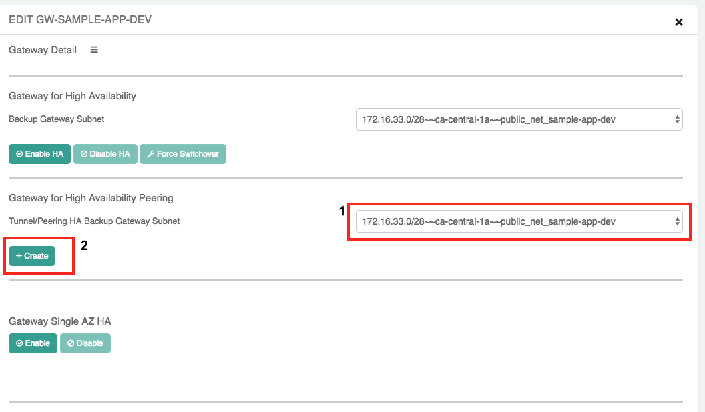
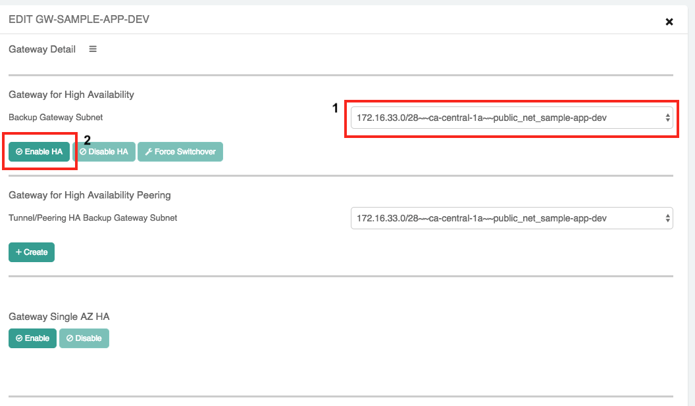
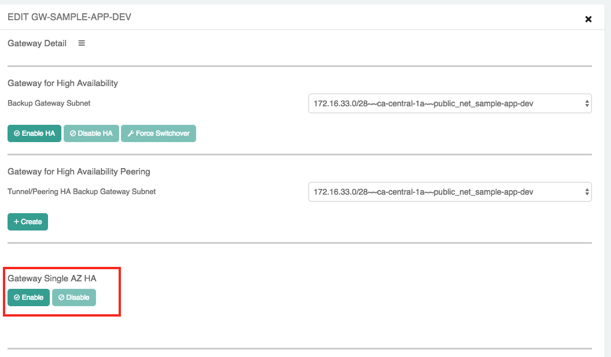
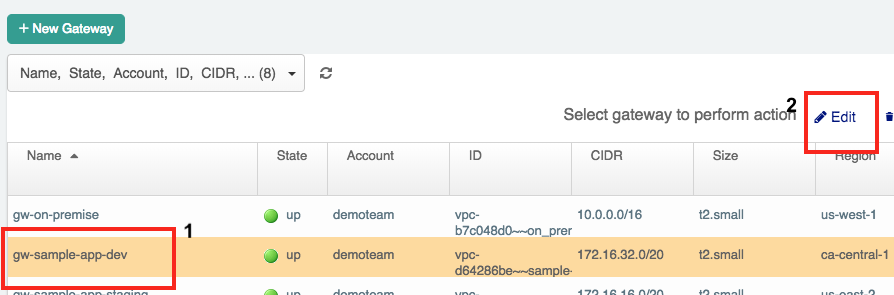
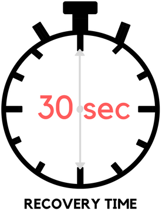
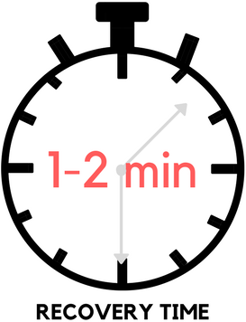
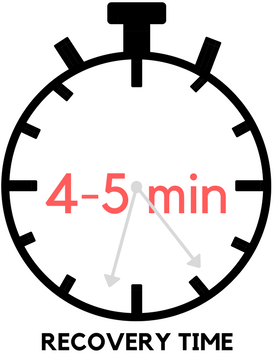
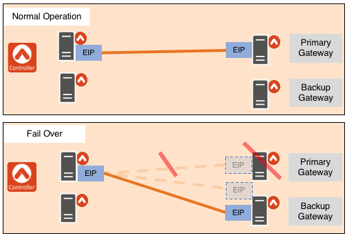
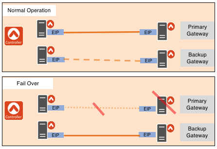

.. meta::
   :description: Aviatrix Gateway HA Options
   :keywords: HA, gateway, active-active, active-standby

===========================================================================
Gateway and Tunnel HA Options
===========================================================================

Overview
--------------------------------------

The Aviatrix Controller monitors your cloud networking deployment, detects problems, and handles failover resolution automatically.  There are 3 options to choose from when deploying Aviatrix in a highly available architecture:

+--------------------------------------------------+---------------------------+
| HA Option                                        | Recovery Time ``*``       |
+==================================================+===========================+
| `Backup Gateway and Tunnel(s) <#gwha-option3>`__ | ~30 seconds               |
+--------------------------------------------------+---------------------------+
| `Single AZ Gateway <#gwha-single-az>`__          | 4-5 minutes               |
+--------------------------------------------------+---------------------------+
| `Backup Gateway(deprecated) <#gwha-backup-gw>`__ | 1-2 minutes               |
+--------------------------------------------------+---------------------------+

``*`` Recovery times vary based on many factors including the number of tunnels established.

These options give you the flexibility to select the one that meets your requirements for recovery time.  For production environments, a quicker recovery time is typically very important. But, for development environments, a longer delay is acceptable. With Aviatrix HA, you can mix and match these options in your deployment to meet your needs.

As the recovery time decreases, there may be additional costs to consider. Single AZ has no additional costs. Backup Gateway will incur additional instance charges (for the additional gateway provisioned). Backup Gateway and Tunnel(s) will also incur additional costs.

How is a Gateway or Tunnel Determined to be Down?
-----------------------------------------------------------------------

See more details `here <../HowTos/gateway.html#gateway-keepalives>`__.

.. _gwha_option3:

HA Options
------------------

Backup Gateway and Tunnel(s)
############################

.. note::

   The recovery time for this option is approximately 30 seconds.

|imageGwBackupTunnel| |imageTimer30sec|

The backup gateway has its own EIP and active tunnel(s).  The backup gateway and tunnels are provisioned when HA is enabled for this gateway.

If a problem with the primary gateway or connected tunnel(s) is detected:

#. Update the routing table in the VPC/VNet so the target for routes is the backup gateway.
#. An email notification is sent to the administrator.

.. _gwha_single_az:

Single AZ Gateway
#################

.. note::

   The recovery time for this option is approximately 4-5 minutes.

|imageGwSingleAZ|  |imageTimer5min|

The gateway is actively monitored by the Controller.  If there is a problem with the gateway or tunnel(s):

#. The gateway is stopped and started again.
#. Any configured tunnels are established from the new gateway to their respective terminating gateway.
#. An email notification is sent to the administrator.

Please look `here <https://docs.aviatrix.com/HowTos/gateway.html#gateway-single-az-ha>`_ for more information.

.. _gwha_backup_gw:

Backup Gateway
##############

.. note::

   The recovery time for this option is approximately 1-2 minutes.
   This feature has been deprecated. Not recommended for new customers.

|imageGwBackup|         |imageTimer2min|

A backup gateway in a different Availability Zone is created when this option is enabled.  There are no tunnels terminating with the backup gateway and it does not have its own EIP.

If a problem with the primary gateway or connected tunnel(s) is detected:

#. The EIP is moved to the backup gateway from the active.
#. Tunnels currently connected to the primary gateway are rebuilt on the backup gateway.
#. An email notification is sent to the administrator.

Deployment Guide
-----------------------------

Deploying your desired HA model is simple.  Follow these steps to enable HA on your gateway:

#. Log in to the Controller.
#. Click on the Gateway navigation item.
#. Select the gateway in the table and click **Edit** in the upper right.

   |imageEditGW|

#. Follow the steps below for the desired HA option.

   * **Backup Gateway and Tunnel HA**

     #. Scroll to Gateway for High Availability Peering.
     #. Select the subnet where the backup gateway should be deployed.

        .. tip::

           Select an Availability Zone that is different from where your primary gateway is installed.

     #. Click **+Create** button.

     |imageEnableBackupGWAndTunnel|

   * **Single AZ HA**

     Click **Enable** below Gateway Single AZ HA.

     |imageEnableSingleAZ|

   * **Backup Gateway HA (deprecated)**

     #. Scroll to **Gateway for High Availability**.
     #. Select the subnet where the backup gateway should be deployed.

        .. tip::

           Select an Availability Zone that is different from where your primary gateway is installed.

     #. Click the **Enable HA** button.

     |imageEnableBackupGW|

.. |imageGwSingleAZ| image:: gateway_ha_media/singleaz_gateway.png

